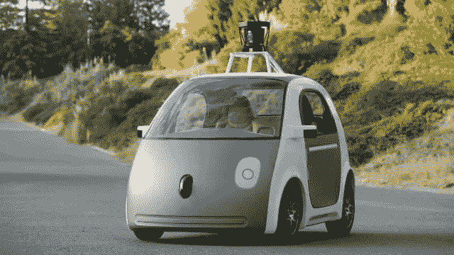
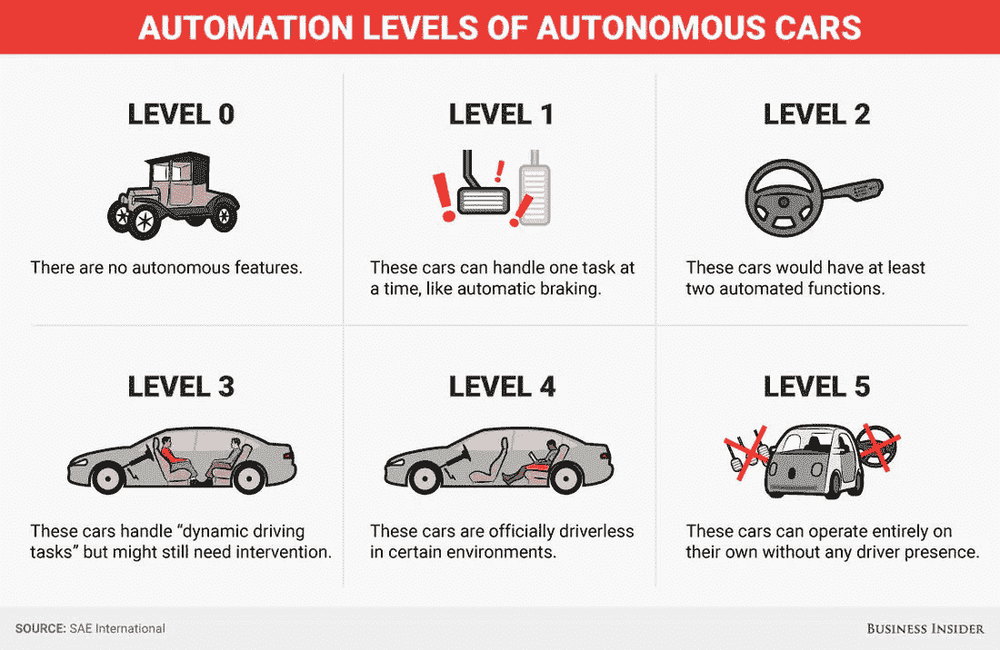
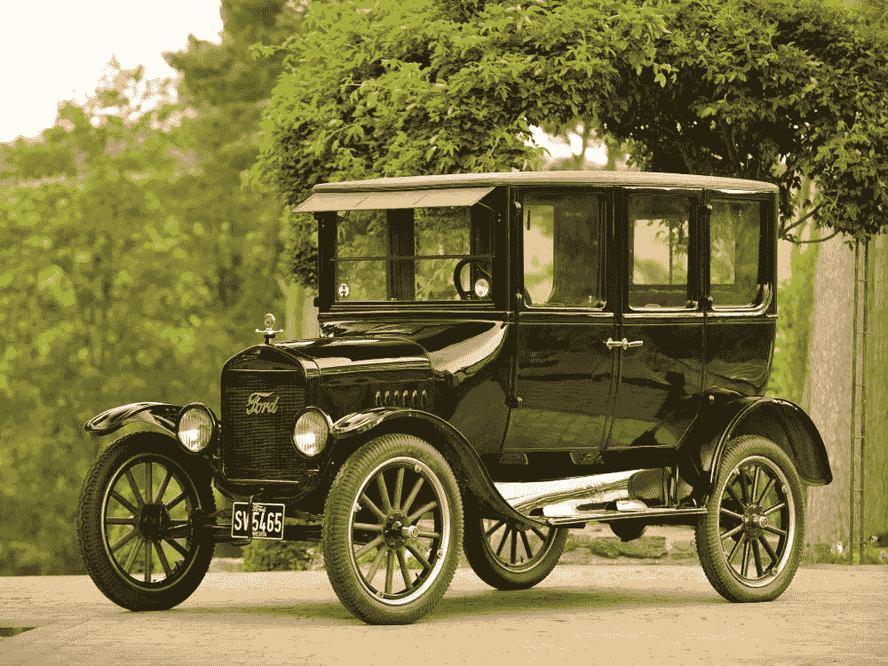
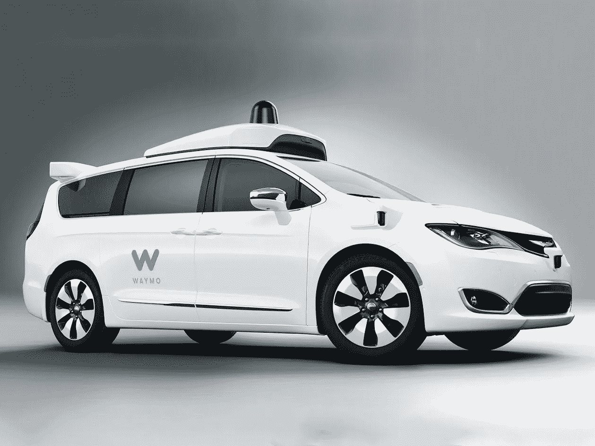
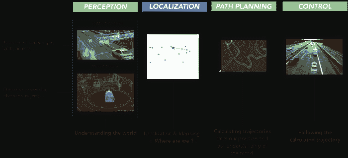
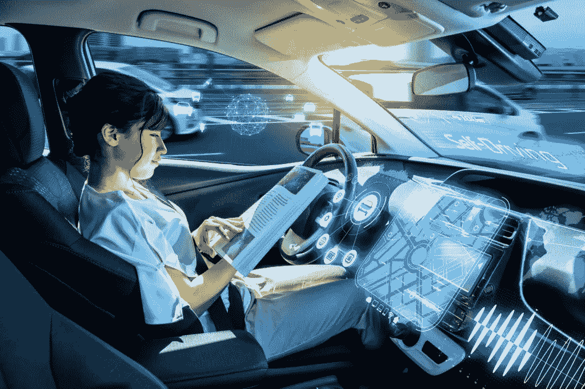

# 自动驾驶汽车:驾驶的未来

> 原文：<https://medium.com/analytics-vidhya/autonomous-vehicles-the-future-of-driving-804ab44a3244?source=collection_archive---------10----------------------->

谷歌的自动驾驶汽车是什么样子。他们真的无处不在！

你可能在任何地方都见过这些谷歌车辆；似乎每当你走在高速公路上，这些车辆中的一辆总是紧挨着你。在过去的几年里，汽车技术进步的速度之快令人惊讶，而疯狂的是，这些进步没有停止的迹象。

由于这些不同公司所做的有限营销，人们对自动驾驶汽车的进展以及他们下一步的计划感到非常困惑。在对这个话题做了更多的研究后，我发现我们在汽车自动化方面比我想象的要走得更远。

# 如何对自动化进行分类？

每个 SAE 自动化级别的简要描述(从无自动化到全自动化)。

为了了解目前的车辆以及它们的发展程度，我们需要一个标准来衡量无人驾驶环境中汽车的自主性。通常，SAE 自动化级别为此提供了一个很好的衡量标准，包括六个级别。

## 初级水平

福特 T 型车(20 世纪初最受欢迎的汽车)

第零级(无自动化)强制汽车做的每个动作都由人类驾驶员操作；这些类型的汽车出现在 19 世纪晚期，当时汽车首次向公众提出。

在 20 世纪的大部分时间里，这些汽车被证明是创新的巅峰，但乔治·拉希德(George Rashid)等好奇的发明家的技术进步(制造自动制动系统)导致了汽车的进一步自动化，并提升到第一级。这些汽车一次只能处理一项任务，这使得它们效率低下，但仍优于早期的汽车。

今天的许多汽车都有第二级自动化(部分自动化)，它们可以转向、制动和加速，但仍然需要驾驶员把手放在方向盘上。

## 更高的级别

一辆 Waymo 自动驾驶汽车(目前主要位于凤凰城)。

第二级和第三级之间的飞跃是巨大的，但它是由像特斯拉这样具有第三级功能的公司完成的。特别是主要用于高速公路的自动驾驶功能，可以使汽车自主行动，但如果出现故障，汽车需要司机的持续关注和立即干预。

现在，让我惊讶并促使我写这篇文章的是，我了解到有一家公司已经实现了 4 级自动化。从 Alphabet 衍生出来的公司 Waymo 已经测试无人驾驶汽车一年多了，汽车座位上没有安全驾驶员，已经行驶了超过 1000 万英里。令人难以置信的是，我们已经达到了这种自动化水平；然而，这些汽车只能在兼容的地方使用。为了优化安全性，这些特定的地理区域需要事先进行广泛的地图绘制，因此 Waymo 的汽车只在美国各地的少数几个城市。

尽管如此，这一发现让我希望我们可以在未来实现第五级自动化，即汽车可以在任何环境下自主行动，完全没有司机在场。为了理解这些自动驾驶汽车实际上如何像司机一样执行这些操作，有必要对其过程进行简要概述。

# 自动驾驶汽车是如何工作的？

自动化车辆确保道路安全和效率的五个步骤。

自动驾驶汽车使用各种传感器和不同的技术来了解他们的环境，做出预测，并协调路径。为了确保最佳的安全性和效率，这些车辆不断遵循五个主要过程:计算机视觉、传感器融合、定位、路径规划和控制。

## 了解环境

监控汽车周围环境的不同传感器/摄像机及其后续范围。

**计算机视觉**允许自动驾驶汽车中的计算机主要使用摄像头来了解环境。为了对汽车周围的物体进行分类，它使用卷积神经网络进行图像分类。为了理解这种分类，请查看我的[媒体文章](/swlh/classifying-images-with-cnns-bba272638572)，在那里我深入探讨了 CNN 及其基本组件。

计算机视觉给出了环境的粗略概观；然而，这些车辆还整合了来自其他传感器的数据，以进一步澄清它们对周围环境的理解，并在一个称为**传感器融合**的过程中绘制出向它们驶来的物体的速度。这些车辆中使用的一些常见传感器是雷达(利用多普勒效应发射无线电波来探测几米内的物体)和激光雷达(发射从激光器发出的光来产生环境云)。这两种传感器都非常有趣，有许多应用，所以如果你想让我写一篇关于它们的中型文章，请在下面评论！

有了所有这些新信息，计算机就能够使用一种叫做**定位**的技术，专注于确定它们相对于地图上其他元素的位置。传统的 GPS 无法实现这一点，因为它只能映射到大约 1-2 米处，这可能会导致不安全的情况。为车辆提供地图可能是另一个潜在的解决方案；然而，诸如重铺道路和在道路旁增加植物等问题需要不断更新这些地图。因此，车辆通常必须依靠这些厘米级精度的传感器来绘制其相对于环境的位置，因为这是最有效的解决方案。

## 从数据中采取行动

在找到它的位置后，它使用前两步的数据来预测它们将面临什么障碍，从而以有效和安全的方式**生成从 A 点到 B 点的轨迹**。这一步是研究最多的一步，因为这些科学家试图了解如何利用传入的数据来绘制路径；目前，机器学习优化算法似乎是一条可行之路。

最后，在绘制出汽车需要走的路径后，汽车使用控制器来改变车辆的机械结构，以适应绘制的轨迹。这一步通常被称为**控制**，它使用了一种叫做控制理论的概念，试图找出如何对一个物体施加力来控制它的运动。控制器运行一种算法来决定如何以正确的方式改变汽车的转向、油门和刹车。

# 自动驾驶汽车的下一步是什么？

自动化领域有大量的应用可以解决世界上现存的问题。无人驾驶飞行器可以用来监测气候变化，收集自然灾害的信息，并在具有挑战性的地形上执行搜索和救援任务。自主船可以与防撞系统和人工智能结合使用，以确保更安全的乘坐，并建立更优化的路径，以便船只消耗更少的能量。自动加油机可以用来减少人为错误，因为加油机通常是车祸的主要车辆。

在自动驾驶汽车领域，Waymo 开始将他们的平台扩展到其他城市，以便自动驾驶汽车开始在世界上变得更加主流。像通用汽车这样的公司计划建立一个大规模生产组装厂，以使建造完全自动驾驶汽车的过程自动化。像优步这样的拼车服务公司正计划将自动驾驶汽车与他们的模型集成在一起，以确保更高效的接送。

这个领域才刚刚开始探索，我对未来十年的发展方向很感兴趣。在下面评论你的想法吧！

# TL；速度三角形定位法(dead reckoning)

*   自动驾驶汽车从零级(无自动化)到五级(全自动化)有六个自动化级别。
*   今天许多汽车都有二级自动化；然而，像 Waymo 这样的公司目前正在选定的地理区域建造 4 级车辆。
*   自动驾驶汽车不断遵循由五个过程组成的程序:计算机视觉、传感器融合、定位、路径规划和控制。
*   自动化可以应用于其他交通工具，如船只、油轮和飞行器。它只是刚刚开始被探索，并且只会在以后继续发展。

# 额外资源

*   视频:[自动驾驶汽车有哪些不同级别？](https://www.youtube.com/watch?v=6592pKyQfyE&feature=emb_title)(了解更多关于 SAE 自动化水平的信息)
*   文章:[自动驾驶汽车如何看待？](https://towardsdatascience.com/how-do-self-driving-cars-see-13054aee2503)(从总体上了解更多关于计算机视觉的知识)
*   文章:[传感器融合](https://towardsdatascience.com/sensor-fusion-90135614fde6)(了解更多传感器融合)
*   视频:[Waymo 测试自动驾驶车辆的城市内部](https://www.youtube.com/watch?v=dpODZvJxXZo&feature=emb_title)(了解更多关于 way mo 的信息)

*嗨！我今年 16 岁，目前对机器学习和生物技术领域感兴趣。如果你有兴趣看到更多我的内容和我发布的内容，可以考虑订阅我的* [*简讯*](https://forms.gle/gdCammxd628UTQ9j9) *！查看我的简讯* [*这里*](https://preview.mailerlite.com/v5q7p2) *！还有，看看我的*[*LinkedIn*](https://www.linkedin.com/in/karthikmittal/)*和*[*Github*](https://github.com/karthikm15)*页面。如果你有兴趣谈论自动驾驶汽车或只是一般的技术，请使用我的* [*日历*](https://calendly.com/karthikmittal306) *注册聊天。*