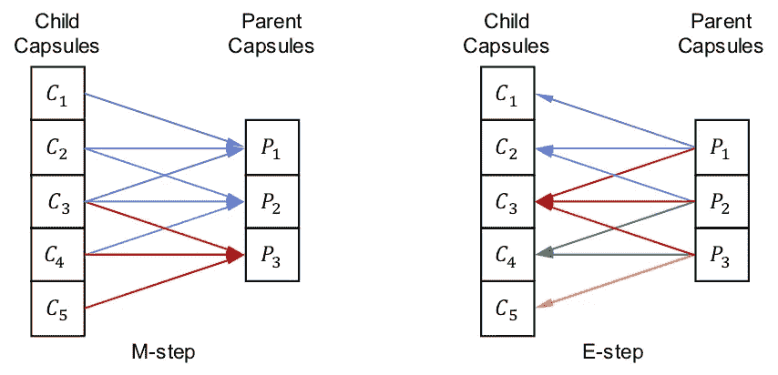
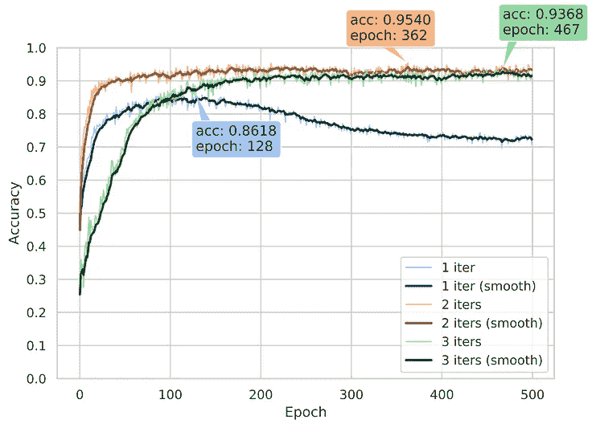

# 现在可用:Hinton 的“带 EM 路由的矩阵胶囊”的开源实现

> 原文：<https://medium.com/analytics-vidhya/available-now-open-source-implementation-of-hintons-matrix-capsules-with-em-routing-e5601825ee2a?source=collection_archive---------6----------------------->

[Geoffrey Hinton](https://en.wikipedia.org/wiki/Geoffrey_Hinton) 谈论“胶囊网络”已经很长时间了(当他说话时，我们会听)，所以当他的团队在 2017 年底发表了两篇关于这个主题的论文时，自然在机器学习社区引起了不小的轰动。

第一篇论文名为[“胶囊之间的动态路由”](https://papers.nips.cc/paper/6975-dynamic-routing-between-capsules.pdf)展示了一个胶囊网络架构，其特点是动态协议路由，在 MNIST 上达到了最先进的性能，并在识别重叠数字方面击败了 CNN。感激地🙏，这篇论文的[代码](https://github.com/IBM/matrix-capsules-with-em-routing)可以在 GitHub 上获得。第二篇论文名为[“带 EM 路由的矩阵胶囊”](https://openreview.net/pdf?id=HJWLfGWRb)解决了第一篇论文的一些缺陷，与最先进的技术相比，将 [smallNORB](https://cs.nyu.edu/~ylclab/data/norb-v1.0-small/) 的测试误差减少了 45%。不幸的是，这一次研究界没有这么幸运，没有可用的代码(Booo…👎).这给感兴趣的研究人员留下了令人沮丧的任务，他们试图自己实现这篇论文并重现基准。

在编写我们自己的实现时，我们注意到了我们遇到的其他开源实现中的几个常见错误。在本帖中，我们分享了一些经验，特别关注三个实施陷阱以及如何避免它们。虽然我们的实现相对于当前可用的实现有了相当大的改进，但它仍然略低于 Hinton *等人*所报告的性能。但是我们很乐意在 GitHub 上提供这个实现的完整源代码(掌声👏👏👏).

**小心🚧**:我们即将深入细节，所以如果你不熟悉辛顿的论文，那么我们建议你从[乔纳森·许的博客](https://jhui.github.io/2017/11/14/Matrix-Capsules-with-EM-routing-Capsule-Network/)开始，然后阅读[的论文](https://openreview.net/pdf?id=HJWLfGWRb)本身，再往下看👇。如果你是一个勤奋的人，渴望看到代码，那么请随意跳过下面的细节，前往 [GitHub repo](https://github.com/IBM/matrix-capsules-with-em-routing) 。

# 陷阱 1:独生子女有什么不好？

*又名:母胶囊只有一个子胶囊的问题*

EM 路由算法是聚类发现的一种形式，其迭代地调整子胶囊和父胶囊之间的分配概率。

当 EM 路由开始时，所有子封装在父封装之间平均共享。但是随着路由的进行，父母胶囊争夺孩子，直到他们有单独的监护权。

在 EM 路由开始时，每个子胶囊的输出在所有父胶囊之间平均共享。随着 EM 路由的进行，父胶囊对于特定子胶囊的亲和力增加，并且最终父胶囊可能具有子胶囊的“唯一监护权”。只要子胶囊具有兄弟，这就不会引起问题，但是“唯一的孩子”的情况会引起问题，即，如果父胶囊只从一个子胶囊接收输入。这种情况类似于一个集群只有一个数据点的情况。

由于 EM 路由符合每个父胶囊的高斯分布，我们需要计算每个父胶囊的平均值和方差。在*独生子女*场景中，父胶囊只有一个子女，因此方差为 0。这导致计算激活成本 *log(σ)，*时数值不稳定，在 *σ=0* 时未定义。此外，如果方差为 0，那么平均概率密度为无穷大∞，其他地方为零，这又会导致数值问题。

独生子女问题的普遍程度取决于孩子胶囊与父母胶囊的比例。如果该比率很高(例如 100:1 ),这意味着许多子胶囊供给较少的父胶囊，则该问题仅发生在较高的路由迭代中。然而，如果该比率较低并且接近 1:1，或者甚至更低(即，父胶囊多于子胶囊)，则*唯一子*问题开始在较低数量的路由迭代中出现。

一旦我们理解了这个问题，解决🥳.实际上是非常简单的我们只需通过添加 *ε=10⁻* ⁴对方差施加一个下限，就可以了。

# 陷阱 2:对父母公平

*又名:标准化分配给父胶囊的路由数据量*

当确定激活父胶囊的成本时，我们计算 *∑* ᵢ *R_ij，*，这是从所有子胶囊 *i* 分配给父胶囊 *j* 的数据总量。这然后通过*逻辑*功能实现，因此如果*成本*高，则父胶囊将不被激活，但是如果*成本*低，则父胶囊将被激活。

让我们思考下面这个问题:所有的母胶囊被激活的机会相等吗？🤔

一个很好的起点是尝试弄清楚是否所有的父胶囊期望接收相同数量的路由数据 *∑* ᵢ *R_ij。*为了进一步研究这个问题，我们将考虑[论文](https://openreview.net/pdf?id=HJWLfGWRb)中的“更小的”胶囊网络配置( *A=64，B=8，C=D=16* )。

下表显示了*小*胶囊网络中各层的总结。我们使用以下术语: *K* 是内核大小， *S* 是步距， *Ch* 是常规卷积中的通道数， *I* 是输入胶囊类型数， *O* 是输出胶囊类型数， *W & H* 是空间宽度和高度。

“较小”胶囊网络架构中的层。请注意 class_caps 图层中的父胶囊如何接收比 conv_caps1 和 conv_caps2 图层更多的路径数据。

为了了解特定层中的父胶囊可以期望多少路由数据 *∑* ᵢ *R_ij* ，我们计算层*、*的 *mean_data* ，这就是子胶囊的总数除以父胶囊的总数。(注:我们在这里假设所有的子胶囊都是活动的，这不太可能，但我们随它滚动，因为结论仍然有效。)

对于最后的 *class_caps* 层，子张量的空间维度被展平，因此子胶囊完全连接到类胶囊。

看了一下表格，我们看到 *class_caps* 层的 *mean_data* 为 *80.0* ，大致比两个 *conv_caps* 层大 *30×* 。因此， *class_caps* 层中的父胶囊比其他层接收更多的路由数据。

那么，这到底为什么是一个问题呢？

好吧，回头看看*成本*的等式，我们看到路由数据量 *∑* ᵢ *R_ij* 充当比例因子。如果路由数据太小，那么对于所有的父胶囊,*成本*将接近于零；但是如果路线数据太大，那么*成本*将变化很大，并且我们将在*逻辑*函数的饱和区域中操作(并且梯度将为
≈0😱).我们实际上想要的是将输入到*逻辑*功能的数据很好地分布在一个合理的范围内，比如说 *[-5，5]* 。但是现在我们被卡住了，如果我们在一个合理的范围内，对于 *class_caps* 层，那么少了 *30×* 路由数据的 *conv_caps* 层就会出现问题，反之亦然。

那我们怎么解决这个问题呢？

同样，一旦我们理解了这个问题，解决方法也很简单🎉。我们只是通过该层的 *mean_data* 来归一化路由数据 *∑* ᵢ *R_ij* 的数量，这实际上提高了训练的速度以及准确性。

# 陷阱 3:争夺孩子

*又名:不同位置的母胶囊争夺子胶囊*

让我们考虑 1D 卷积胶囊层的情况，其内核大小为 3，步幅为 1，并且子层和父层都只包含 1 种胶囊类型。很简单。

每个父胶囊接收来自 3 个子胶囊的投票，但是竞争每个子胶囊的父胶囊的数量根据空间位置而不同。

在 M 步骤中，内核在子胶囊上滑动，这样每个父母从 3 个子胶囊接收投票。在 e 步中，位于边缘的子胶囊每个仅接收来自 1 个父胶囊的反馈，而位于中心的子胶囊 *C₃* 接收来自 3 个父胶囊的反馈(最大值等于内核大小 *K* )。

当我们看这个简单的例子时，很明显子胶囊在不同的空间位置接收来自父胶囊的反馈，因此这些父胶囊必须竞争子胶囊的投票。竞争发生在 E 步骤的分配概率的更新中，其中我们对竞争特定子胶囊的所有父胶囊进行归一化。辛顿公司在[回答](https://openreview.net/ forum?id=HJWLfGWRb&noteId=BJgX7Iy04m)一个关于 OpenReview.net 的问题时进一步澄清了这一点。

但是当我们查看 GitHub 上的几个实现时，我们发现 E-step 中不正确的规范化是一个常见的错误。特别是，它们仅在母胶囊类型间标准化，而不在母胶囊位置间标准化。这样可以防止不同位置的父胶囊争夺子胶囊。正确的方法是对从特定子胶囊接收输入的所有父胶囊进行归一化，这将包括对父胶囊类型和父胶囊位置进行归一化。

唉😞，这一次的解决方案不是那么容易实现的，所以跟我在一起，我们慢慢来…

第一步是查看内核大小和步幅，以确定哪些子胶囊属于每个父胶囊的感受野。然后，我们相应地平铺这些子胶囊，以便我们可以乘以 *K* 转换矩阵来得到“投票”。这里的技巧是，我们需要跟踪这些子胶囊中的每一个来自哪里(我们稍后将需要这一点)，所以我们将子胶囊和父胶囊之间的映射存储在一个 2D 二进制矩阵中，称为*空间路由映射*。

然后，通过相应的分配概率 *R_ij* 对*投票*进行缩放，并在 M 步骤中用于计算每个父胶囊的平均值μ、标准偏差σ和激活度 *a* 。

我们的 M-step 实现，其中我们在*空间路由图中跟踪子胶囊和父胶囊之间的连接。*

转到 E 步。

我们查看对母胶囊有贡献的每个*投票*，并计算它与该母胶囊的平均值μ相差多少。这给了我们选票 *v_ij* 的概率密度 *p_ij* 。

现在是大赛的时候了…🏆我们需要重新组织事情，以便我们可以看到哪些父胶囊正在竞争每个子胶囊。为了做到这一点，我们需要记住每个概率 *p_ij* 来自哪里。啊啊，还好我们在*空间路线图中记录了这个确切的东西，*擦掉灰尘，是时候让它发挥作用了。我们使用*空间路由图*将特定子胶囊的所有概率排列在一列中。这创建了概率密度的稀疏表示，然后我们将其乘以父胶囊的激活 *a_j.* 剩下的就是对竞争子胶囊的所有父胶囊进行归一化，这只是除以列总数，我们就完成了！🎉

实际上我们已经完成了第一次迭代。但是我们只是更新分配概率 *R_ij* ，然后清洗并重复下一次，下一次，下一次迭代。

我们的 E-step 实现，其中我们使用*空间路由图来对齐一列中特定*子胶囊的竞争父胶囊。

# 结果

*又名:结果*

下图显示了在 EM 路由的 1-3 次迭代的每个训练时段之后，我们的实现的测试精度。我们用 2 次路由迭代达到了我们的最佳精度 **95.4%** ，用 3 次迭代我们得到了 93.7%。该表显示了我们的结果与 GitHub 上可用的其他开源实现的对比情况: [yl-1993](https://github.com/yl- 1993/ Matrix- Capsules- EM- PyTorch) 、 [www0wwwjs1](https://github.com/www0wwwjs1/ Matrix- Capsules- EM-Tensorflow) 、 [Officium](https://github.com/Officium/Capsules) (记录于 2019 年 5 月 28 日)。我们实现的准确率为 95.4%，比之前最好的开源实现的 91.8%提高了 3.8 个百分点，但仍略低于 Hinton & Co .的 97.8%。据我们所知，我们的实现是目前最好的开源实现。

# 承认

1.  Jonathan Hui 的博客，“[了解 EM 路由矩阵胶囊
    (基于 Hinton 的胶囊网络](https://jhui.github.io/2017/11/14/Matrix-Capsules-with-EM-routing-Capsule-Network/))”
2.  OpenReview 上的问题和答案，“带 EM 路由的[矩阵胶囊](https://openreview.net/forum?id=HJWLfGWRb)
3.  索非张在 GitHub 上的实现，"[Matrix-Capsules-EM-tensor flow](https://github.com/www0wwwjs1/Matrix-Capsules-EM-Tensorflow)"
4.  杨光在 GitHub 上的实现，“[封装 EM](https://github.com/gyang274/capsulesEM)

# 代码和论文的链接

点击[此处](https://github.com/IBM/matrix-capsules-with-em-routing)获取包含代码的 GitHub 回购协议，点击[此处](https://arxiv.org/pdf/1907.00652.pdf)获取 arXiv 文件。

我们欢迎投稿，所以如果你有关于如何进一步提高准确性的想法，请在 GitHub 上提交请求。

# 如何引用这部作品

如果你觉得这篇文章或代码对你的学术工作有用，请引用如下:

A.Gritzman，“Hinton *等人*在*2019 澳门 ij Cai’19 人类大脑与人工智能(HBAI)联合研讨会上提出的“避免矩阵胶囊与 EM 路由的实施陷阱”。*

如果你觉得这篇文章有帮助，请继续给我们一些掌声，这样这篇文章会排名更高，其他人会看到它👏👏👏。不要害羞，你可以随心所欲地点击拍手按钮(实际上我认为最多是 50 次拍手，但我们会在你到达那里时担心这个问题😜).