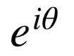
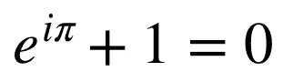
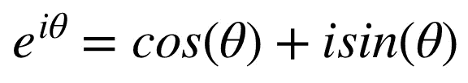
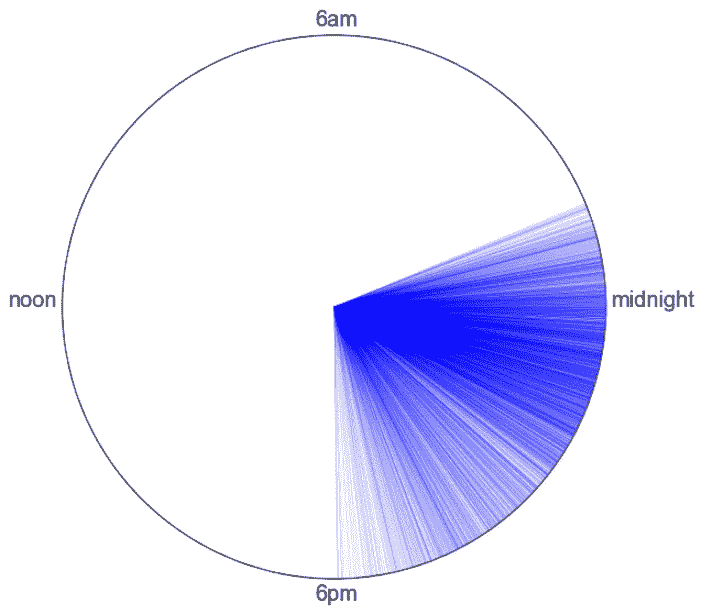
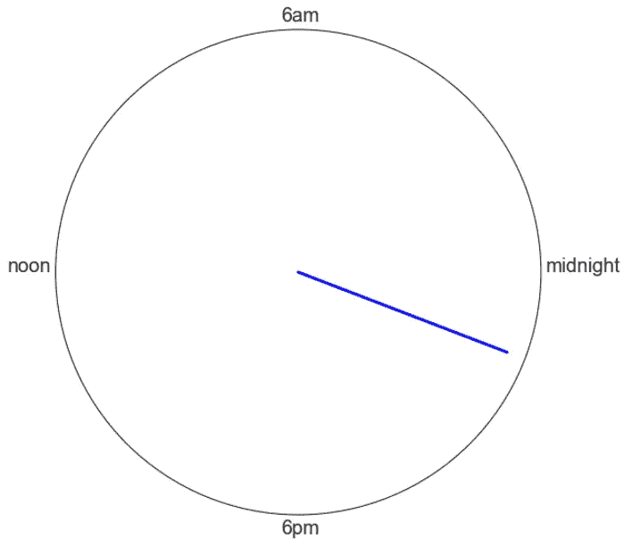

# 平均时间

> 原文：<https://medium.com/analytics-vidhya/averaging-time-1e03ff946839?source=collection_archive---------15----------------------->

你管理着一个繁忙的市中心酒吧。为了帮助安排人员，您想知道晚上什么时候最忙。您决定计算进行交易的平均时间。

你认为这很容易。你在晚上 10 点关掉了客厅的灯，因为你通常在 9 点到 11 点之间退休。这应该没什么不同。

从概念上来说，它不是，但是我们熟悉的平均方法将会误导我们！要知道为什么，再想想你客厅的灯，想象一下下面的就寝时间:周一、周二、周三:晚上 9 点。周四:晚上 10 点。周五、周六:凌晨 1 点。周日:晚上 8 点。

因此，让我们平均计算 3 天 21:00 小时、1 天 22:00 小时、2 天 1:00 小时和 1 天 20:00 小时。我们在 7 天内总共有 107 个小时，或者说平均刚过 15:00 小时，或者说下午 3 点。不管是好是坏，你都不会在下午 3 点睡觉！

我们的平均值被凌晨 1 点的就寝时间“搞糊涂了”——这些时间应该被视为非常接近你晚上 11 点的就寝时间，但计算结果却将其视为一个非常不同的时间点。

*那么，我们该如何纠正这种困惑呢？*

**我们应该用一些三角学来计算一个*圆形平均值*。为了做到这一点，我们将每个小时映射到 24 小时时钟的表面。让我们从时钟圆周上的远东点开始午夜(小时= 0)，在这里 3 点钟将位于正常时钟上(这个点通常代表三角学中一个周期的开始)。然后我们逆时针方向描绘，6am 映射到圆上的北方点；正午到遥远的西方；下午 6 点到最南端。**

**圆上的每个点都有相应的弧度度量**(数学上相当于度):午夜是 0 和 2π弧度(0 和 360 度)；6am 是π/2 弧度(90 度)；正午是π弧度(180 度)；而 6pm 是 3π/2 弧度(270 度)。现在，每个小时都可以用弧度来表示。

为了应用这些弧度测量值的平均值，我们首先以极坐标形式表示每个测量值，其中弧度由θ给出:

在θ= 0°时，我们得到 1(圆上的远东点)。感谢欧拉恒等式(下图)，在θ = π时，我们得到-1(圆上的快西点)。最后，在θ = π/2 时，我们得到 I(位于复平面上的远北极点圆)，在θ = 3π/2 时，我们得到-i(远南极点)。

因此，我们有一个从极坐标形式到复平面的映射，其中 x 轴是实数项，y 轴是虚数项。具体来说，欧拉公式将极坐标形式的每个点分解为复平面上的实分量和虚分量。

**现在，为了对这些点求平均值，我们可以利用三角原理，取所有实部(cos 项)的平均值和所有虚部(sin 项)的平均值。**

为了说明这一点，让我们回到最初的问题:*晚上什么时候你的酒吧最忙？*

你决定使用你的酒吧的交易数据，因为它丰富而精确。您收集了上个月所有顾客交易的时间戳——收集了 5000 次观察。为了帮助可视化活动的分布，您在上面描述的 24 小时时钟上绘制事务，其中每条蓝线表示一条事务记录:

看起来你的业务高峰是在晚上 10 点到午夜之间，一旦业务在最初几个小时后升温，在接近凌晨 1:30 最后一个电话之前安静下来。

如上所述，上面的每条线都带有弧度。使用上面的方法，我们将把弧度转换成具有实部和虚部的坐标。例如，您在晚上 10 点(22:00)的交易记录相当于 5.236 弧度。所以这个时间戳的实部是 *cos(5.236) = 0.500* 而你的虚部是 *sin(5.236) = -0.866*

这个逻辑适用于你的 5000 笔交易。**然后，对 5000 个实部和 5000 个虚部进行平均，得到一个代表平均时间戳的复数。**

你得到一个平均实数(读:x 轴)分量 **0.856** 和一个平均虚数(读:y 轴)分量 **-0.326** 。我们可以通过在原点和这些坐标之间画一条线，在我们的 24 小时制时钟上绘制出来。

所以，你的酒吧活动的平均时间看起来大约在晚上 9 点到午夜之间，或者大约晚上 10:30(22:30)。

*到底是什么？*

在给定的一对坐标(任何平面，实数或复数)内，每个 x 分量可以映射到两个唯一的弧度。例如，在上午 6 点和下午 6 点，x = 0。类似地，每个 y 分量可以映射到两个唯一的弧度。例如，在午夜和中午，y = 0。**然而,( x，y)配对只能映射到一个唯一的弧度。**

可以使用正切函数的反函数——*反正切*进行映射。一个角的正切值等于它的对边和邻边的长度之比(回想一下 SOHCAHTOA！).使用上面的时钟圆，我们得到:对于每个角度，θ， *tan(θ) = y / x* 。所以，求解θ: *θ = arctan( y / x )* 。

我们的 x 值为 0.856，y 值为-0.326，这样我们的弧度为-0.364。这指示我们从午夜原点顺时针追踪 0.364 弧度*，如果我们走远路，到达 **5.919 弧度**，或者逆时针*。**

我们的最后一步是“取消”我们为创建 24 小时制而执行的小时→弧度转换。Recall 00:00 被映射到 0 弧度；06:00 到π/2 弧度；12:00 到π弧度；和 18:00 到 3π/2 弧度。一般给出的映射为:弧度， *θ = 2π *(小时/ 24)* 。因此，5.919 弧度相当于 **22.6 小时，或大约晚上 10:36(22:36)**，这正是我们在时钟上观察到的！

但是等等，还有呢！再次查看第二个时钟，显示蓝色粗体线指向晚上 10:36。注意它没有完全到达圆形边缘。

**你平均时间的长度—*模数—* 表明了这些点的一致性。**你的平均交易数据的向量长度是 **0.92** 。相等时间戳的集合将给出单位圆上的平均分布，因此将具有 1 的向量长度。完美分布的时间戳(例如，凌晨 4 点、中午和晚上 8 点)的集合将给出原点的平均位置，因此向量长度为 0。**向量长度越长，一天内时间戳越集中！**

所以通过这个练习，你不仅可以测量顾客从你的酒吧购买的平均时间，还可以测量他们购买的时间分布。

感谢阅读！请随意在我的 Github 页面上用 Python 探索这个分析。