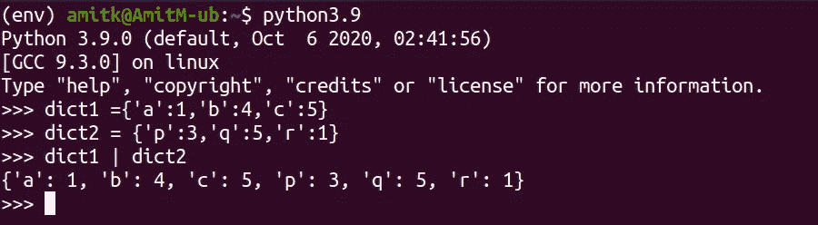
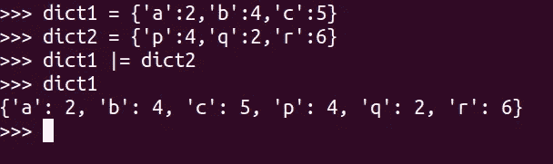
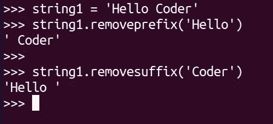
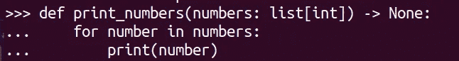
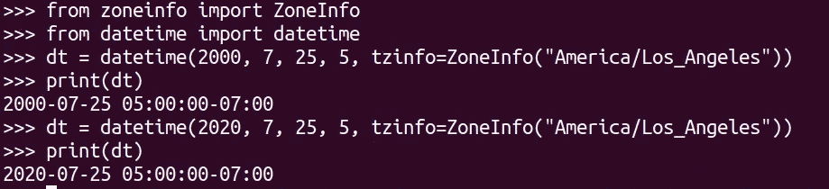

# 令人惊叹的 Python 3.9 特性

> 原文：<https://medium.com/analytics-vidhya/awesome-python-3-9-features-fb990f50609a?source=collection_archive---------18----------------------->

照片由[希特什·乔杜里](https://unsplash.com/@hiteshchoudhary?utm_source=medium&utm_medium=referral)在 [Unsplash](https://unsplash.com?utm_source=medium&utm_medium=referral) 拍摄

Python 3.9 出来了。这里有几个你应该知道的新特性。

*   **合并字典**

有一个新的操作符“|”可以用来合并两个字典。

向字典中添加联合运算符

了解更多信息👇

 [## PEP 584 -将联合运算符添加到字典中

### 这个 PEP 建议在内置的 dict 类中增加 merge (|)和 update (|=)操作符。当前合并两个…

www.python.org](https://www.python.org/dev/peps/pep-0584/) 

*   **更新字典**

另一个新的操作符 **"|="** 将让你更新字典。

更新词典

了解更多信息👇

 [## PEP 584 -将联合运算符添加到字典中

### 这个 PEP 建议在内置的 dict 类中增加 merge (|)和 update (|=)操作符。当前合并两个…

www.python.org](https://www.python.org/dev/peps/pep-0584/) 

*   **删除字符串的前缀和后缀**

从字符串中删除前缀和后缀

了解更多信息👇

 [## PEP 616 -删除前缀和后缀的字符串方法

### 这是一个向 Python 的各种字符串的 API 添加两个新方法 removeprefix()和 removesuffix()的提议…

www.python.org](https://www.python.org/dev/peps/pep-0616/) 

*   **内置泛型类型的类型提示**

现在，您可以在函数签名中使用 list 或 dict 内置集合类型作为泛型。

了解更多信息👇

 [## PEP 585 -标准集合中的类型提示泛型

### 由 PEPs 484、526、544、560 和 563 定义的静态类型是在现有 Python 之上增量构建的…

www.python.org](https://www.python.org/dev/peps/pep-0585/) 

*   **Python 现在使用新的解析器**

这个 PEP 建议用一个新的基于 PEG 的解析器替换 C Python 当前基于 LL(1)的解析器。这将大大降低与编译管道相关的一些领域的维护成本，例如语法、解析器和 AST 生成。

了解更多信息👇

 [## PEP 617——CPython 的新 PEG 解析器

### 这个 PEP 建议用一个新的基于 PEG 的解析器替换当前的基于 LL(1)的 CPython 解析器。这个新的解析器…

www.python.org](https://www.python.org/dev/peps/pep-0617/) 

*   **支持日期时间中的 IANA 时区**

IANA 时区被称为 tz 或时区信息。

如果我们传入一个无效的键，那么`**zoneinfo.ZoneInfoNotFoundError**` 将被抛出。

**结论**:还有很多其他的变化和改进。您可以在这里查看完整的发行说明:

 [## Python 3.9 的新特性- Python 3.9.0 文档

### 本文解释了 Python 3.9 相对于 3.8 的新特性。Python 3.9 于 2020 年 10 月 5 日发布…

docs.python.org](https://docs.python.org/3.9/whatsnew/3.9.html) 

**参考文献**:

[https://docs.python.org/3.9/whatsnew/3.9.html](https://docs.python.org/3.9/whatsnew/3.9.html)

感谢您的阅读:)