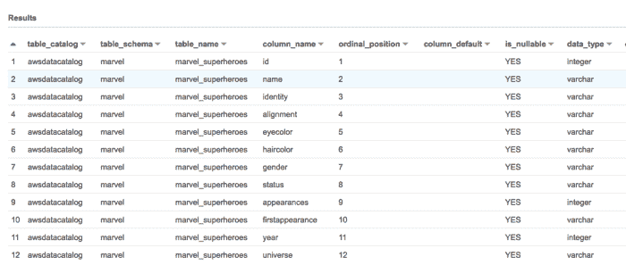

# AWS Athena — DML 查询

> 原文：<https://medium.com/analytics-vidhya/aws-athena-dml-queries-3d18ed0ab888?source=collection_archive---------9----------------------->

每天都可以学到新东西，今天我了解到 AWS Athena 支持插入查询。

```
SELECT *
FROM   information_schema.columns
WHERE  table_schema = 'marvel'
       AND table_name = 'marvel_superheroes'
```



让我们使用 CTAS 命令创建基于漫威超级英雄的表格

```
# To create non-partitioned table based on where clause
```