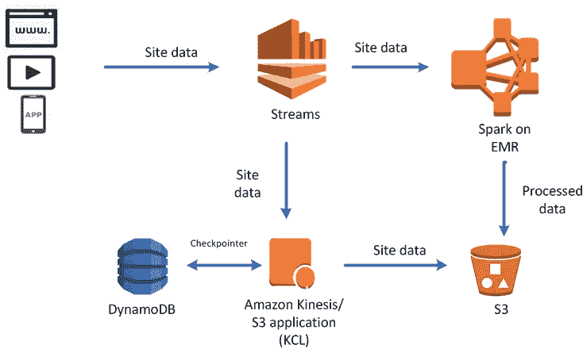

# AWS 数据分析— Kinesis

> 原文：<https://medium.com/analytics-vidhya/aws-data-analytics-kinesis-c968b123c1b8?source=collection_archive---------8----------------------->

# 如何在 AWS 上移动数据？

3 个不同的类别

**1)实时**

*   Kinesis 数据流
*   简单缺省服务
*   物联网

**2)近实时(反应行动)**

*   Kinesis 数据消防软管
*   数据库迁移服务

**3)** **批量—历史分析**

注意:这通常在你想移动大量数据时调用

*   雪球
*   数据管道

# AWS KINESIS 概述

*   卡夫卡的替代
*   如果您想要收集数据，如应用程序日志、指标、物联网数据或点击流，这非常有用。
*   它集成了许多字符串处理框架，如 Spark 或 NiFi

**Kinesis 流:**低延迟流

**Kinesis 分析:**使用 SQL 对数据流进行实时分析

**Kinesis Firehose:** 将流加载到 s3、Redshift、ES、Splunk

# 建筑运动学

循序渐进；

**来源:**点击流、物联网、指标和日志

来源转到**亚马逊 Kinesis Streams** 如果你想进行分析、计算指标或发出警报，你应该使用**亚马逊 Kinesis Analytics** 因此，如果你想存储或制作实时仪表板，你必须使用**亚马逊 Kinesis Firehose** 和什么 Kinesis Firehose？实际上，它可以将数据传送到 S3、ES、Redshift 或 Splunk。

# Kinesis 流概述

流被分成有序的碎片和分区。碎片的意思相当于分割。

例如:生产者-> 3 *碎片(碎片-1，碎片-2，碎片-3 )->消费者

消费者用碎片读取数据。Kinesis Streams 不会永远存储您的数据，它只是默认存储 24 小时，所以你基本上只存储 1 天。但是，如果您的数据非常重要，您最多可以存储 7 天。

*   运动具有再加工、重放数据的能力。
*   多个应用程序可以使用同一个流
*   这不是数据库！
*   一旦数据被插入 kinesis，它不能被删除或不变性，它只是附加流

# Kinesis 流碎片

*   一个流由许多不同的碎片或分区组成。
*   i̇mportent 案正在开票！这么多碎片，这么多美元，这么多账单。您会收到每个分片供应的账单。
*   可用批处理或每条消息 put。
*   碎片的数量可以随着时间的推移而演变，所以你可以在这些操作中 rashard 或合并。
*   记录是按分片排序的

生产者-> 3 *碎片(碎片-1，碎片-2，碎片-3 )->消费者。

这些碎片是我们的制作人做的？

Kinesis 流记录

*   我们的生产者记录由数据块构成。数据 blob 序列化为最大 1MB 的字节，表示任何内容。
*   记录键:帮助 kinesis 知道到达发送数据的碎片。就像用户 ID 一样。
*   序列号:它不是生产者发送的东西，而是摄入后由 kinesis 添加的东西。放入碎片中的每个记录的唯一标识符。

**极限！**

*   生产者只能在每个分片写 1 mb 或 1000 条消息。例如，如果你有 10 个碎片，你会得到每秒 10mb 或 10k 的消息。
*   如果超过了这个限制，就调用 ProvisionedThoughputException。

Kinesis 有两类消费者。

1.  消费者经典

*   每秒 2 兆字节。以在所有消费者之间读取每个碎片。
*   每个分片每秒 5 次 API 调用。

2.消费者增强型扇出

*   没有 API 调用
*   每秒 2 兆字节。读取每个碎片，每个增强的消费者

# Kinesis 生产者

第一个是 SDK(软件开发工具包)允许你写代码或使用 CLIA 直接发送数据到 Kinesis。第二个是 Kinesis 生产商(KP)第三个是 Kinesis 代理，这个代理基本上允许你得到一个日志文件。最后一部分是第三段。火花，水槽等。所有这些东西都会向 kinesis 发送数据。

**Kinesis 生产商 SDK**

*   用过的腐肉(一种)和腐肉(多种)
*   PutRecords 使用批处理您可以将记录作为一个 HTTP 请求的一部分发送，因此您将记录保存在 HTTP
*   如果超出限制，ProvisionedThoughputExceeded 就会超出。

管理:

*   AWS 物联网
*   云观察
*   Kinesis 数据分析

**AWS Kinesis 异常**

*   ProvisionedThoughputExceeded:超过任何碎片的 MB/s 或 TPS
*   分区中的错误键

异常的基本解决方案

*   后退重试
*   增加碎片

**Kinesis 制作人库**

同步和异步 API 但是在异步中 butter 性能，可以用 CloudWatch 进行监视。非常重要的机制是配料，因此配料分为两部分，第一部分是收集，第二部分是聚集。

在同一个 PutRecords API 中收集记录并写入多个碎片

在一条记录中存储多条记录的总延迟能力超过每秒 1000 条记录。极限最大极限为 1mb/秒。

重要的事情:例如，你有 3 部分数据 20KB- 30 KB- 200KB，所有这些数据分别在 3 毫秒，5 毫秒，6 毫秒，实际上所有这些数据小于 1mb，你可以使用 PutRecords API 调用一次。但是怎么做呢？RecordMaxBufferdTime 引入了一些延迟(默认为 100 毫秒)。基本上，你是说我愿意等待 100ms，所以这是在更高效的代价上增加了一点点迟到。

最后一部分是 Kinesis 代理，因此该代理监控日志文件并将它们发送到 kinesis 数据流，它构建在顶层 KPL (Kinesis Producer Library)上，从多个目录写入，代理处理文件旋转、检查点和失败后重试，并向 CloudWatch 发出指标进行监控

# Kinesis 消费者经典

蒸汽无处不在，例如 Lambda、Firehose、Spark、SDK、client 等。

经典的 kine sis——记录由消费者从碎片中进行投票。每个碎片总共有 2 MB。它是如何工作的？消费者与例如 shard-1 通话并说嘿伙计！GetRecords()和 shard-1 说 ok buddy 这是给你的“数据”。GetRecords 返回高达 10 mb 的数据，然后节流 5 秒。或者你可以得到多达 10，000 条记录。每秒最多 5 次 getrecords api 调用 200 毫秒。

重要提示:如果 5 个客户端使用同一个分片，意味着每个客户端每秒可以轮询一次。小于 400kb/s

**Kinesis 客户端库**

阅读来自 Kinesis 制作人的记录。

在一个组中与多个消费者共享多个碎片，这就是碎片发现。

关卡未来恢复进度！因此，如果应用程序停止运行并重新启动，它能够准确地记住最后一次使用的位置，以便继续运行。

那么，检查点和所有碎片发现是如何工作的呢？

基本上用的是一个测功机。DB 表来检查一段时间内的进度，并同步以查看谁将读取哪个碎片。因此 DynamoDB 将用于检查点，它在表中有一行用于每个碎片的消费。

**Kinesis 连接器库**

Kinesis 数据流输出用于将数据写入 S3、DynamoDb、Redshift 或 ES。这个连接器运行在 EC2 上，这是必须的！

**Kinesis 增强扇出**

正在研究 KCL 2.0 和 lambda。什么是 kinesis 增强扇出，所以每个消费者将获得每秒 2 mb 的碎片。它看起来和以前很相似，但不是完全一样的东西。生产者进入 Kinesis 数据流，消费者使用 SubscribeToShard()，所以我们只是开始，仅此而已。不再拉了。这意味着，如果我们总共有 20 个消费者，那么每个碎片的速度将达到 40mb/s。不再有 2mb 的限制！！原因是 kinesis 通过 http/2 将数据推送给消费者。减少 70 毫秒延迟。

**增强版与标准版消费者**

标准消费者使用低数量 1–2–3 bla bla，可承受 200 毫秒延迟，最大限度降低成本

增强型是针对相同流的多个消费者应用程序，低延迟 70 毫秒。每个数据流使用增强扇出的默认限制为 5 个用户。

**Kinesis 操作- >添加碎片**

也称为分片分割，可用于增加流容量(每个分片 1mb/s 数据),如果有 10 个分片，则每秒 10mb。

可以用来分割“热碎片”

那么当你分裂一个碎片时会发生什么呢？旧碎片已经关闭，将从数据中删除。

例如，我们有 3 个碎片和所有相同的空间。

|碎片 1|碎片 2|碎片 3|

让我们想象一下，shard-2 非常热，我们希望分割它以增加 shard-2 的这个关键空间的吞吐量。所以我们要做拆分操作，将要发生的是碎片 4，已经创建和碎片 5。

|碎片 1 **|碎片 4 |碎片 5|** 碎片 3|

因此，只要 shard-2 中的数据没有过期，它就可以使用，但过期后，它就会消失。

**Kinesis 操作- >合并碎片**

降低流容量并节省成本，可用于将两个流量较低的分片分组。

同样，旧碎片会根据数据到期时间关闭并删除。

|碎片 1 **|碎片 4 |碎片 5|** 碎片 3|

例如，我们合并了碎片-1 和碎片-4，因为没有得到这么多的流量，所以我们可以将它们合并在一起，节省一些成本。

| **碎片-6|** 碎片-5 **|** 碎片-3|

那么，比如说自动缩放。

*   自动缩放不是 kinesis 的固有特性
*   使用 **UpdateShardCount** 改变 kinesis 中碎片数量的 API 调用
*   我们可以用 AWS Lambda 实现自动缩放

注意事项:

*   重共享不能并行进行。你需要计划和能力以防万一。

**还有不要做那个单子！**

*   针对一个流，将您当前的碎片数量增加一倍以上
*   在一个流中扩展到 500 多个碎片
*   扩展到超过您帐户的碎片限制

这就是说，规模重建不能并行进行，基本上每个碎片的重建都需要几秒钟。

**Kinesis 安全**

*   使用 IAM 控制访问/授权
*   HTTP 端点中的加密
*   使用 KMS 的静态加密
*   VPC 可用于 VPC 境内的变身

# 自动气象站驱动数据消防软管

*   完全托管服务，无需管理
*   近乎实时！(60 秒延迟)好吧，但是为什么呢？当你看到批处理时，有一个 60 秒。如果您的批次未满，则延迟最小，因此我们无法保证数据会立即到达目的地。
*   将数据加载到 S3、ES、Splunk、Redshift
*   自动缩放
*   从 json 到 parquet 的数据转换(仅 s3)
*   数据转换 AWS Lambda csv -> json
*   压缩 GZIP，拉链，爽快
*   只有 GZIP 的数据被进一步载入红移
*   Spark 或 Kinesis 客户端库无法读取 Kinesis 数据 Firehose

SDK、Kinesis 代理、Kinesis 数据流、云观察、物联网将数据发送到 kinesis firehose，firehose 能够进行一些转换，然后我们可以使用 lambda 函数，我们将其存储在 s3、ES、splank、redshift 上

缓冲区大小是 32 mb，时间是 2 分钟，如果达到它的刷新。

**Kinesis 数据流与消防软管**

流

*   准备编写定制代码(生产者/消费者)
*   实时
*   必须管理缩放(合并/拆分)
*   数据存储 1–7 天

消防水龙带

*   完全托管发送到 s3、es、splkunk、红移
*   使用 lambda 的无服务器数据转换
*   接近实时
*   自动缩放
*   没有数据存储