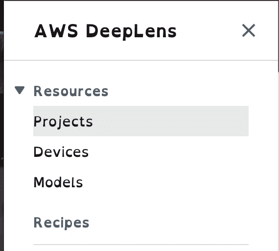
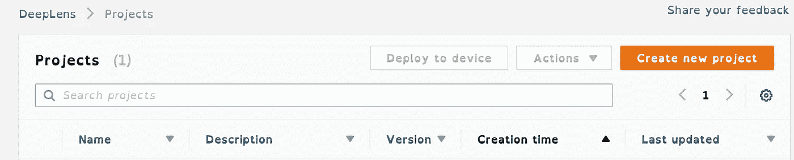
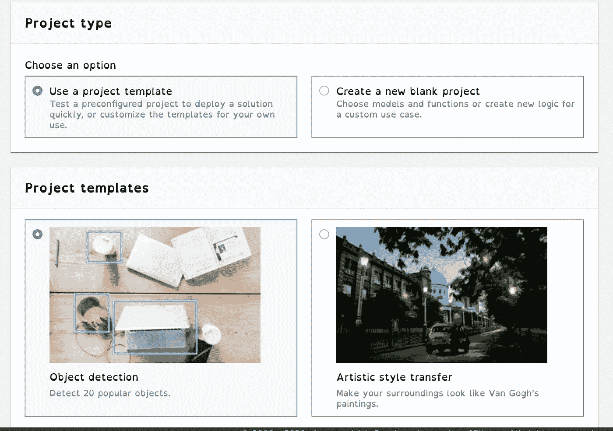
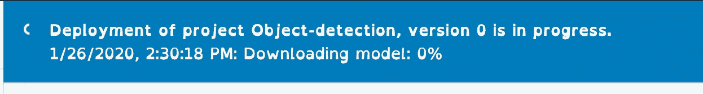
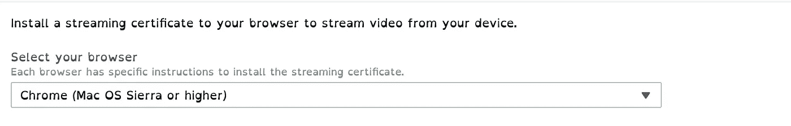
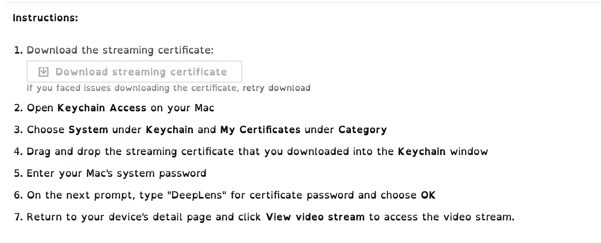
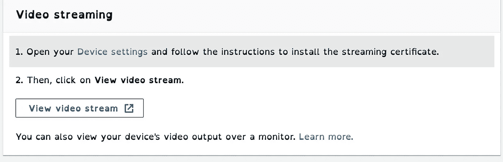
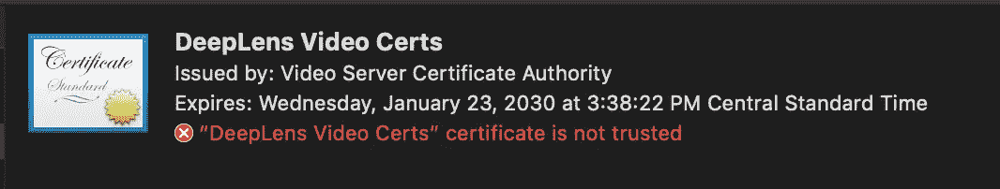
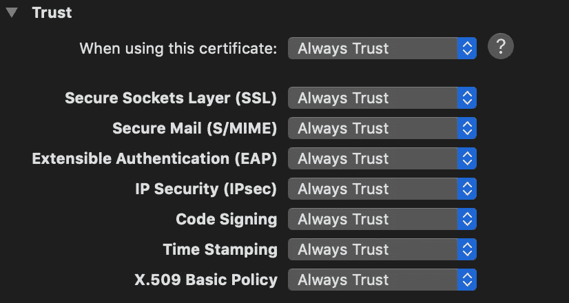
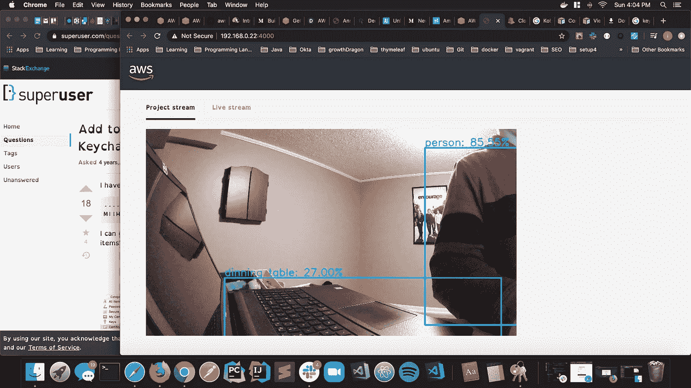

# AWS DeepLens 零件:2

> 原文：<https://medium.com/analytics-vidhya/aws-deeplens-part-2-67a9b4c63d0b?source=collection_archive---------19----------------------->

在上一篇文章中，我展示了如何注册你的 DeepLens 设备。在这篇文章中，我将向你展示如何加载一个项目到 DeepLens。

到目前为止，设置有点烦人，我不知道如何设置权限，这样我就可以通过浏览器观看视频。如果你有问题，也许这篇文章会帮助你。

首先导航到项目

项目

并点击“创建新项目”

新项目

接下来选择一个项目模板，我选择了对象检测

项目

点击下一步，这花了几分钟来建立，当它完成时，你应该看到这个。

接下来，你需要设置一个证书，第一步是选择你的浏览器。

并按照以下步骤下载证书

一旦证书上传，你就可以点击“查看视频流”，如果你像我一样在阅读之前点击“查看视频流”，只要按照上面的步骤，你就没事了。

出于某种原因，我无法打开视频流，并注意到 DeepLens 证书不再可信。

我不得不右键单击证书，然后单击总是信任，如果有人能详细说明为什么，请在下面留下评论。

我点击了“查看视频流”

我可以开始探测物体了，耶！！！！！！！！！！！！！

这在下一篇文章中非常酷，我将介绍 sagemaker 并创建一个笔记本。感谢您的阅读，如果您错过了上一篇文章，请在下面查看，如果您喜欢这篇文章，请为它鼓掌。

 [## AWS Deeplens 零件:1

### 我一直想调查机器学习的世界，我读过几篇文章，甚至看了谷歌 I/O…

medium.com](/@tommarler/aws-deeplens-part-1-5ef430dc8efb)