# AWS DeepRacer —深入了解奖励函数的设计并调整超参数

> 原文：<https://medium.com/analytics-vidhya/aws-deepracer-looking-under-the-hood-for-design-of-the-reward-function-and-adjusting-e9dd3805ebbf?source=collection_archive---------0----------------------->

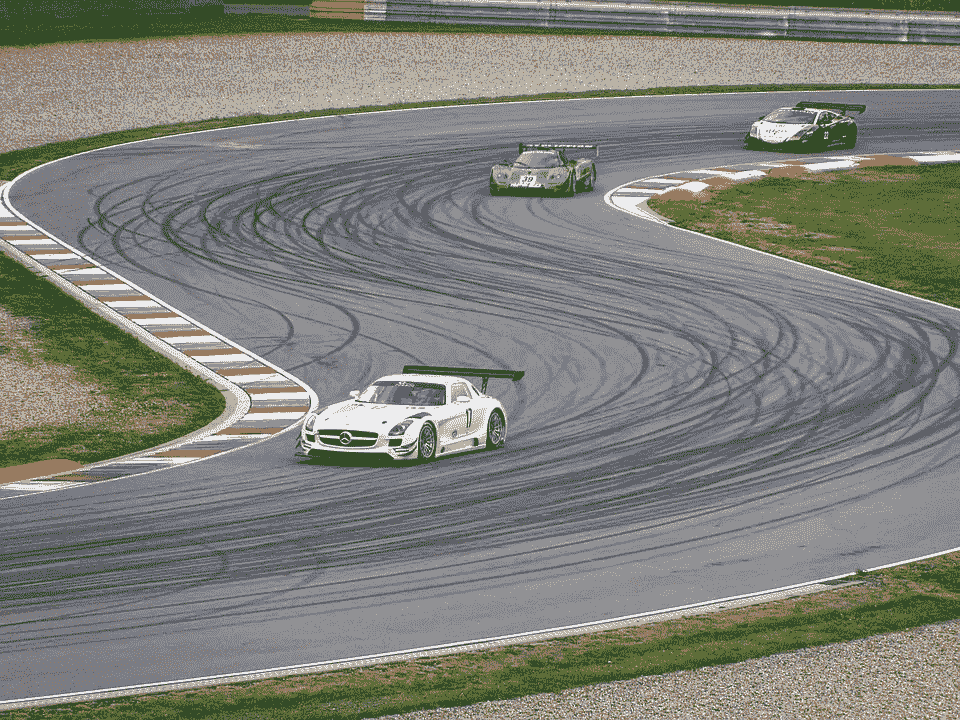

图片鸣谢[https://pix abay . com/photos/sports-automobiles-driving-vehicles-203007/](https://pixabay.com/photos/sports-automobiles-driving-vehicles-203007/)

你想亲手编写一个缩小版的自动驾驶汽车来参加比赛吗？→欢迎来到[***AWS Deep-racer***](https://aws.amazon.com/deepracer/)*一个非常创新的概念，向一辆对真实世界一无所知的自动驾驶汽车教授强化学习。*

*我参加了一个为期两天的关于 [AWS DeepRacer](https://aws.amazon.com/deepracer/) 的研讨会，在那里我得到了构建奖励功能的实践培训。该模型在单圈比赛中排名第三，在真实世界中，在真实模型赛道上驾驶真实的 AWS Deep-Racer 赛车，完成时间为 14.17 秒！！！(图在最后)*

```
***Pre-requisite** —  AWS account & some basic understanding of mathematics**Level** — Novice to intermediate**Tags** — #machinelearning, #deepracer, #league, #reinforcement*
```

*在这里，我想分享我在 **7 大类**中的学习，以便对 DeepRacer 模型和幕后的机器学习有一个整体的了解。*

```
****1\. Basics of reinforcement learning******2\. Input parameters at your disposal for building the reward function******3\. Action Space — Customizing your car and adjust the drive parameters******4\. Default reward function provided by AWS******5\. Customize the reward function******6\. The mathematics behind the reward function & Hyperparameters******7\. AWS SageMaker behind the scene that does the heavy lifting****
```

# *1.*强化学习的基础知识**

**

*图片鸣谢—[https://pix abay . com/photos/teapots-pots-cook-stove-flame-1858601/](https://pixabay.com/photos/teapots-pots-cook-stove-flame-1858601/)*

****“你会赤手空拳去触摸一把热水壶还是燃烧的火？不，显然不是！！但是你是怎么知道/学会的呢？****

*在你生命中的某个时刻，你一定被烧伤了，意识到火是热的，所以不要碰它，因为它会给你带来痛苦。你通过获得痛苦或快乐而得到强化，这种强化在记忆中根深蒂固，从而为你提供了一种学习。*

```
*Reinforcement learning -->If temperature == hot then go_back as it will hurtIf temperature == cool then go_forward as it will NOT hurt*
```

*这就是[强化学习](https://en.wikipedia.org/wiki/Reinforcement_learning)的症结所在。你奖励令人满意的行为，惩罚令人不快的行为。这也是 AWS DeepRacer 中奖励功能的基础。*

*在每一种状态下，机器都会采取一种行动，使其回报随着时间的推移而最大化。它随着时间的推移进行训练，以加强这种学习，从而建立一个模型。然后将该模型应用于现实世界，在现实世界中，强化学习用于确定下一步行动，以最大化奖励值。*

# *2.为构建 reward_function 输入参数*

**

*[https://pix abay . com/photos/直升机-驾驶舱-飞行员-仪表盘-983979/](https://pixabay.com/photos/helicopter-cockpit-pilot-dashboard-983979/)*

*AWS DeepRacer 汽车提供由各种传感器收集的当前状态的实时值。使用这些实时值，您可以对奖励功能进行编程，以启动为当前状态和未来状态提供最高奖励的行动选择过程。*

*AWS DeepRacer 传感器提供的一些输入参数包括:*

```
 **track_width =* ***params[‘track_width’]*** *distance_from_center =* ***params[‘distance_from_center’]*** *steering =* ***abs(params[‘steering_angle’])*** *direction_stearing=****params[‘steering_angle’]*** *speed =* ***params[‘speed’]*** *steps =* ***params[‘steps’]*** *progress =* ***params[‘progress’]*** *all_wheels_on_track = track_width =* ***params[‘track_width’]*** *distance_from_center =* ***params[‘distance_from_center’]*** *steering =* ***abs(params[‘steering_angle’])*** *direction_stearing=****params[‘steering_angle’]*** *speed =* ***params[‘speed’]*** *steps =* ***params[‘steps’]*** *progress =* ***params[‘progress’]*** *all_wheels_on_track =* ***params[‘all_wheels_on_track’]****
```

*输入参数的名称是不言自明的，表明它们为决策提供的值。*

*有些返回一个**数值**，有些返回一个**布尔值**。*

*例如，**params[' all _ wheels _ on _ track ']**返回一个布尔值—是或否，而 **params['speed']** 返回一个数值，即汽车的当前速度。*

*使用这些参数，您可以创建奖励函数；这反过来有助于赛车在赛道上做出决定，转弯，加速，保持在赛道上..以使奖励值最大化。*

# ***3。*行动空间—定制您的汽车并调整驱动参数****

**

*图片来源—[https://pix abay . com/photos/vintage-car-turquoise-interior-852239/](https://pixabay.com/photos/vintage-car-turquoise-interior-852239/)*

*您可以选择定制和更改一些关键参数的默认基线值。*

*这允许调整转向角度，速度限制和粒度，以建立一个定制的奖励功能。*

*行动空间包括以下内容:*

*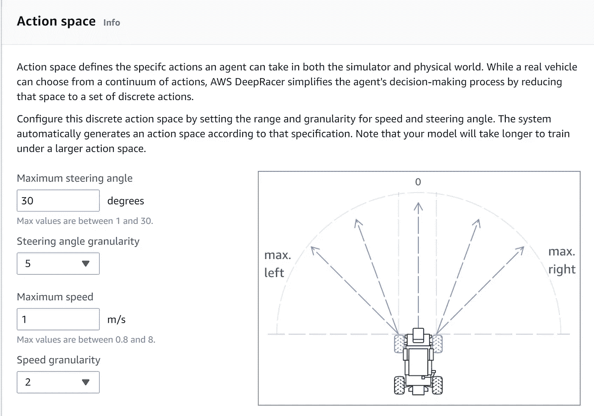*

*[https://console.aws.amazon.com/deepracer](https://console.aws.amazon.com/deepracer)*

```
***Maximum steering angle -** The value must be between 0 & 30 degrees**Steering granularity —**      Different angles by which the car can turn**Maximum Speed —**  This goes from 0.8 m/sec all the way up to 8.0 m/sec**Speed granularity -** Can take the values of 1, 2 & 3*
```

*这些参数共同定义汽车在动作空间中采取的动作。本质上你得到(**转向角度粒度 X 速度粒度)**的组合。*

*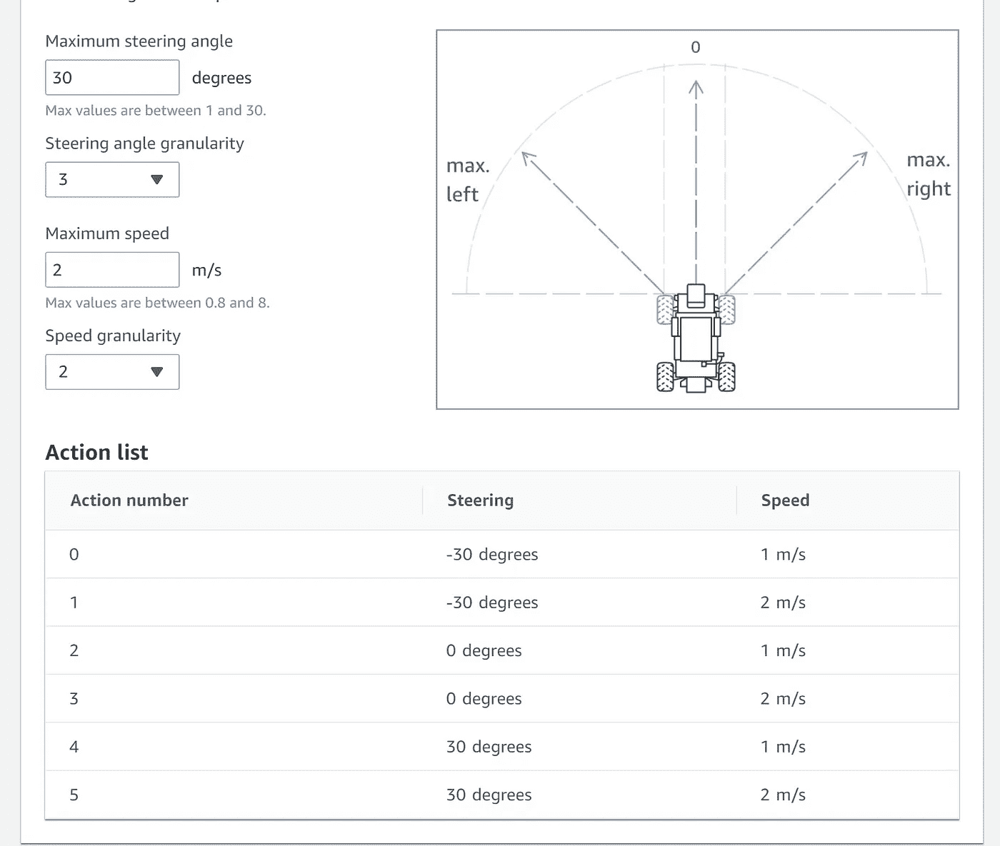*

*[https://console.aws.amazon.com/deepracer](https://console.aws.amazon.com/deepracer)*

```
*E.g. 1 — We have 3X2 combination of Steering angle & Speed granularity*
```

*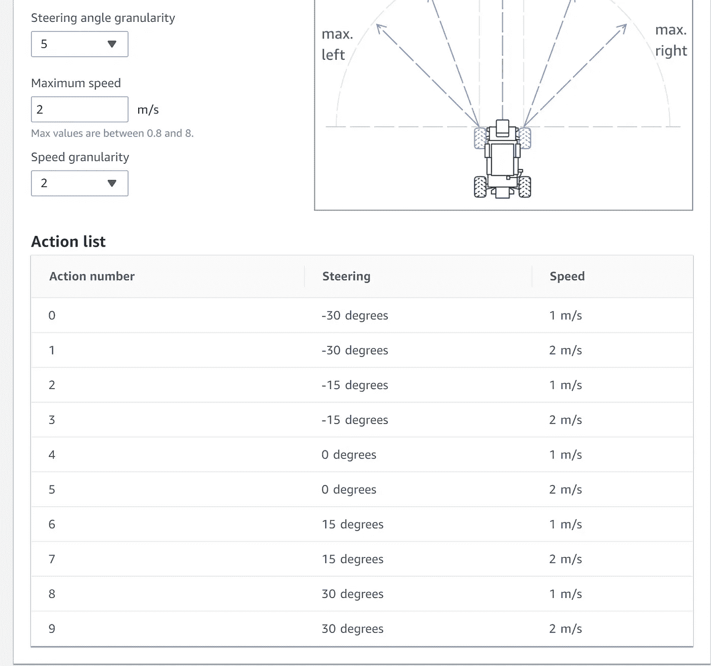*

*[https://console.aws.amazon.com/deepracer](https://console.aws.amazon.com/deepracer)*

```
*E.g. 2 — We have 5X2 combination of Steering angle & Speed granularityNote - There are 5 steering angle --> +- 30, +-15 and ZERO*
```

*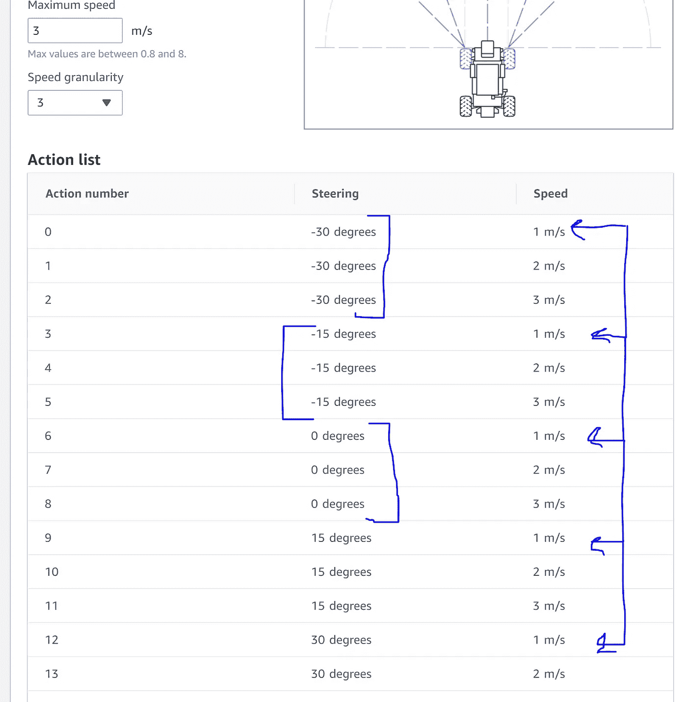*

*[https://console.aws.amazon.com/deepracer](https://console.aws.amazon.com/deepracer)*

```
*E.g. 3 — We increased the speed granularity to 3\. So now we have 5 X 3 combinations. Note — The speed 1 m/s is repeated for 5 different angle granularity.* 
```

# *4.AWS 提供的默认奖励功能*

**

*图片鸣谢—[https://pix abay . com/photos/street-road-horizon-endless-238458/](https://pixabay.com/photos/street-road-horizon-endless-238458/)*

*AWS 提供了一个默认的奖励函数，可以很容易地用来运行模型。重要的是要理解，可以使用输入参数的任意组合来构建奖励函数。*

*默认奖励功能→*

```
*def reward_function(params):
 ‘’’
 Example of rewarding the agent to follow center line
 ‘’’

 # Read input parameters
 **track_width** = params[‘track_width’]
 **distance_from_center** = params[‘distance_from_center’]

 # Calculate 3 markers that are at varying distances away from the center line
 marker_1 = 0.1 * track_width
 marker_2 = 0.25 * track_width
 marker_3 = 0.5 * track_width

 # Give higher reward if the car is closer to center line and vice versa
 if distance_from_center <= marker_1:
 **reward = 1.0**
 elif distance_from_center <= marker_2:
 **reward = 0.5**
 elif distance_from_center <= marker_3:
 **reward = 0.1**
 else:
 **reward = 1e-3 # likely crashed/ close to off track**

 return float(reward)* 
```

*(注意——网上有许多免费代码资源)*

*默认代码使用汽车提供的 2 个输入参数—*

1.  ***轨道宽度***
2.  ***距离中心***

*如果汽车没有偏离中心线太多，这个功能实质上是奖励汽车。如果赛车冲出赛道，该功能还会通过指数减少奖励值来惩罚赛车。*

*这个奖励函数加强了赛车保持在赛道上，因为它的目标是最大化奖励函数。因此，它试图采取行动，增加整体奖励值。*

# **5。自定义奖励功能**

**

*图片来源——pixabay.com*

*默认的[奖励功能](https://hal.archives-ouvertes.fr/hal-00331752v2/document)运行良好，给出 22+秒的圈速来完成标准圈速。*

*然而，目标是减少单圈时间。因此，让我们探索如何使用其他参数，并建立一个最佳的奖励函数，以进一步减少单圈时间。*

*下面是我的代码(片段),给出了 14.17 秒的圈速。奖励功能根据相对于赛道方向的接近角来训练赛车，并确保赛车在整个比赛过程中保持高速。*

**注意-模拟是在 50%节气门开度下进行的。在实际比赛中，你可以根据你的模型表现的稳定性选择加大油门。**

*当汽车没有偏离太多并且保持高速时，我们会奖励它。当奖励偏离太多或低于速度限制时，我们会惩罚或减少奖励。*

```
*import math
def reward_function(params):
    '''
     '''
# Read all input parameters
    track_width = params['track_width']
    distance_from_center = params['distance_from_center']
    steering = abs(params['steering_angle'])
    direction_stearing=params['steering_angle']
    speed = params['speed']
    steps = params['steps']
    progress = params['progress']
    all_wheels_on_track = params['all_wheels_on_track']
    ABS_STEERING_THRESHOLD = 15
    TOTAL_NUM_STEPS = 85
    waypoints = params['waypoints']
    closest_waypoints = params['closest_waypoints']
    heading = params['heading']
--------------------------------------------------------------------    #Set the reward reward_function
    reward = 1
 -------------------------------------------------------------------
#Reward if the car completes the track
   if progress == 100:
        reward = reward + 100
-------------------------------------------------------------------
#calculate the current & next waypoints
    prev_point = waypoints[closest_waypoints[0]]
    next_point = waypoints[closest_waypoints[1]]
--------------------------------------------------------------------    
#calculate the direction_steering in radius, arctan2(dy, dx), the result is (-pi, pi) in radians
    track_direction = math.atan2((next_point[1] - prev_point[1]), (next_point[0] - prev_point[0])) 

#convert to degrees
    track_direction = math.degrees(track_direction)
-------------------------------------------------------------------    
# Calculate the difference between the track direction and the heading direction of the car
    direction_diff = abs(track_direction - heading)

# Penalize the reward if the difference is too large
    DIRECTION_THRESHOLD = 12.0
    SPEED_THRESHOLD = 2.25 

    reward_calculator=1
--------------------------------------------------------------------    
    if direction_diff > DIRECTION_THRESHOLD:
        reward_calculator=1-(direction_diff/50)
        if reward_calculator<0 or reward_calculator>1:
            reward_calculator = 0
        reward *= reward_calculator
--------------------------------------------------------------------        
# Penalize if the car goes off track        
    if not all_wheels_on_track:
       reward = reward - 1.0
    elif speed < SPEED_THRESHOLD:
# Penalize if the car goes too slow
        reward = reward - 2.0
    else:
# High reward if the car stays on track and goes fast
        reward = reward + 2.0
--------------------------------------------------------------------    
    return float(reward)*
```

*(注意——网上有许多免费代码资源)*

*这里我们利用 ***路点*** 来确定汽车相对于轨道的当前位置。把 ***路点*** 想象成赛道上的里程碑坐标。*

*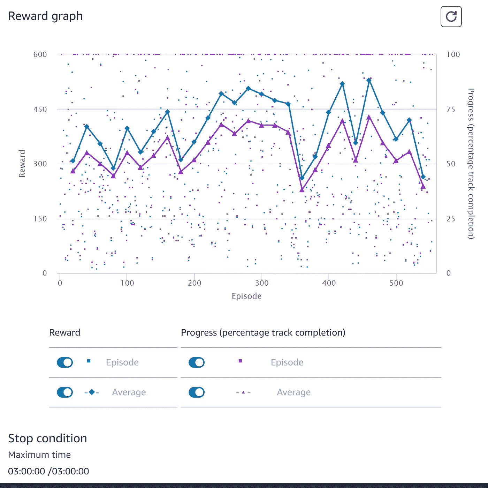*

*培训后奖励图*

```
*The reward graph as obtained post training. Note — By the look of it, there are too may variations/spikes in the reward graph. A good reward graph should have a steady increasing slope* 
```

*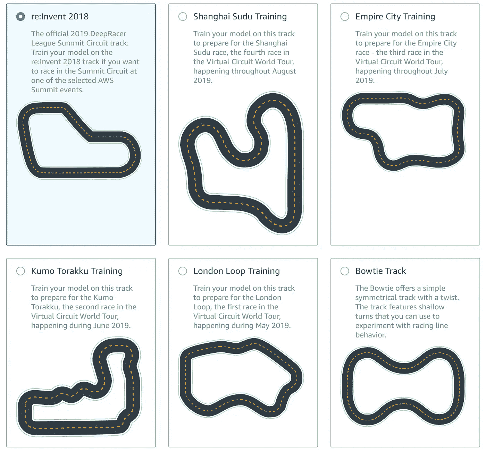*

*图片来源—[https://console.aws.amazon.com/deepracer/home?region = us-east-1 # create model](https://console.aws.amazon.com/deepracer/home?region=us-east-1#createModel)*

```
*There are multiple race tracks on which you can train the model. Note — Over-fitting may occur when you customize the reward function to perform on a particular track, resulting in sub-optimal performance on other tracks. It is important to keep your model generic so that it can perform on any track.*
```

*注意——通过可视化性能、分析日志来微调模型，有许多方法可以让您更上一层楼。AWS 生态系统提供的选项足以构建一个世界级的模型。*

# *6.奖励函数背后的数学&超参数*

*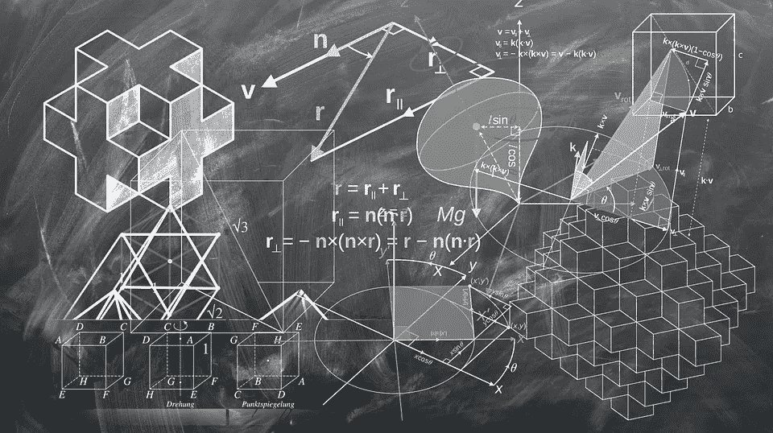*

*图片鸣谢—[https://pix abay . com/illustrations/geometry-mathematics-cube-1023846/](https://pixabay.com/illustrations/geometry-mathematics-cube-1023846/)*

*奖励功能和参数设置是 AWS-DeepRacer 的前置属性。有一个复杂的数学模型，它在汽车训练的场景后面，然后使用该训练建立一个模型，该模型反过来用于在现实世界中执行。*

*汽车训练有三个主要目标—*

1.  ***最大化奖励函数—** 在每一步，学习模型计算奖励值，其目标是需要采取增加奖励值的动作，并避免减少奖励值的动作。*
2.  ***行动的概率—** 没有奖励函数，所有行动的概率(例如—汽车以所有可能的速度在所有可能的角度向所有方向移动)都是相同的。这将导致汽车处于静止状态，因为所有的动作都有相同的概率。奖励功能有助于增加在特定时刻采取正确行动的可能性。*
3.  ***受物理定律束缚** —奖励函数再好，车还是受物理定律束缚。因此，高速急转弯将导致赛车脱离赛道，除非它被计入训练的奖励函数中。*

*以下是**超参数**列表，您可以根据对幕后数学模型的理解进行更改。建议在不改变和**超参数**的情况下进行初始迭代*，但是当您微调性能时，这些参数会发挥重要作用。**

*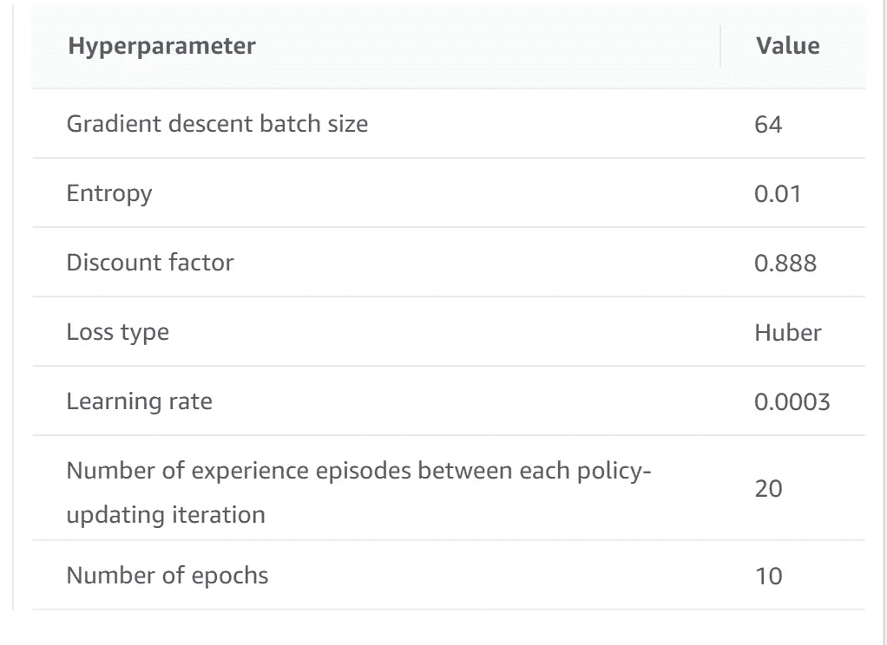*

*这是我在 https://console.aws.amazon.com/deepracer 的模型的真实快照*

*(这些参数中的每一个都是单独的主题，在这里，我从较高的层面总结了使用的目的)*

1.  ****梯度下降批量大小—*** 批量大小决定了考虑多少数据点或**样本大小**来更新训练模型。所以如果总样本空间是 1200，批量是 120，那么就有 1200/120 = 10 批。*
2.  ***熵** —这是数据中随机性或杂质的度量。由于 AWS DeepRacer 使用 AWS DeepLense，数据可以相当干净，没有随机性。这就是我们使用默认值 0.01 的原因，这意味着 100 个数据输入中有 1 个可能无法对正确的操作进行分类。*
3.  ***贴现因子** —贴现因子决定未来事件的权重，以便做出当前决策。未来的所有事件都会有所不同，但是，需要考虑的因素有多少是由贴现因子提供的。例如，您今天获得 100 美元，它将具有 100 美元的价值，获得 100 美元(明天-第 1 天)将具有 90 美元的价值，折扣系数为 0.9，获得 100 美元(后天-第 2 天)将具有 81 卢比的折扣系数，折扣系数为 0.9 ( 0.9 平方 X 100)。*

```
 *A df( hereby df denotes the discount factor)= 0 means, you do not look ahead; and take an action based on the current state. All future rewards has ZERO significance. A df of 1 means all the future state reward are taken with equal importance to take a current action. All future rewards has EQUAL significance.A df of 0.5 means that next state reward value is considered at 50% of the value. All future rewards DECREASES in significance.So the value of df is used to train the model on how much future action consequence needs to be taken into account at the current state. Note - A high discount factor makes the model look further into the future thereby slowing down the training, but it is forward looking, where as low discount factor trains the model quickly as it does not look far into the future, but it may become short-sighted* 
```

***4。损失类型—** 假设你的体重秤总是少了 1 公斤。所以每当你拿一个重量，你就增加 1 公斤。这是损失函数的工作。*补偿计算或模型*中可能出现的误差。我不建议改变它，除非你精通相同的数学概念，并相应地调整其他参数。*

***5。学习率—** 幕后，梯度下降函数进入画面寻找 ***极大值*** (奖励)。学习率是梯度下降的阶跃函数。学习率是您改变参数以检查您是否有奖励函数的 ***最大值*** 的速率。*

***6。历元数** —历元表示循环处理训练数据集以更新学习参数的次数。如果您有一个小的训练数据集要处理以获得稳定的结果，请增加历元的数量。较大的数据集具有较小的值以减少训练时间。*

```
*Lets work out with an exampleTotal sample size → 1000Batch size → 5Number of batches → 1000/5 = 200Epoch → 10Number of times the sample will be processed → 10 timesTotal number of batches that will be processed → 200 X 10 = 2000* 
```

# ****7。AWS SageMaker 幕后做重活****

**

*图片鸣谢—[https://pix abay . com/photos/men-trail-running-trail-ultra trail-1245982/](https://pixabay.com/photos/men-trail-running-trail-ultratrail-1245982/)*

*DeepRacer 的所有机器学习都是由 [AWS SageMaker 完成的。](https://aws.amazon.com/sagemaker/)*

*这将处理所有的训练数据，以便为 DeepRacer 汽车构建在现实世界中运行的模型。AWS SageMaker 负责模型的构建→培训→部署。*

*一旦构建了模型，就可以将其导出到边缘设备并进行部署。*

*因此，在我们的案例中，一旦模型构建完成，我们就可以下载模型&通过 USB 驱动器将模型部署到 DeepRacer 汽车上并运行。*

> *AWS SageMaker 通过提供基础设施和处理复杂机器学习模型所需的大量计算，打开了处理复杂机器学习模型的大门。*
> 
> ****通过应用强化学习和利用 AWS SageMaker 进行建模，您可以想到哪些用例来解决业务问题？****

*活动部分图片→*

*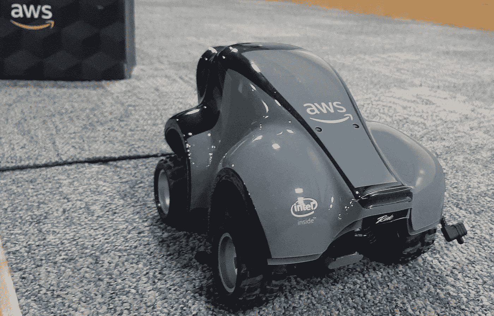*

*AWS 深赛车*

*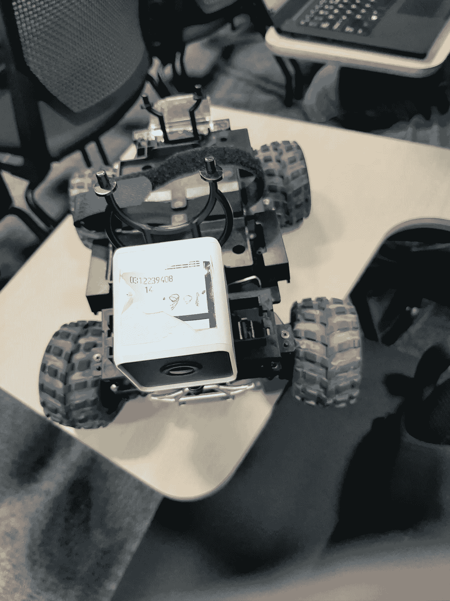*

*AWS DeepRacer 汽车，摄像头在前面*

*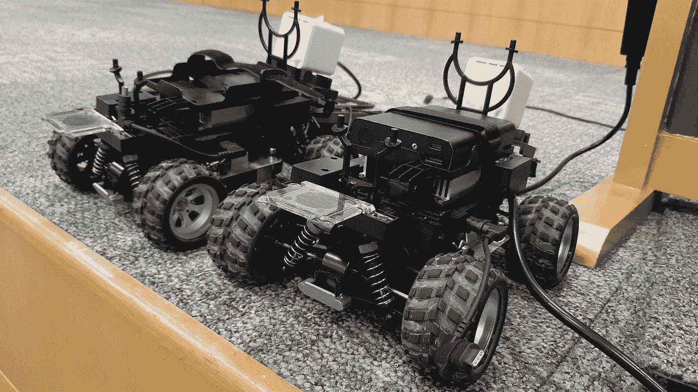*

*AWS DeepRacer 汽车引擎盖下*

*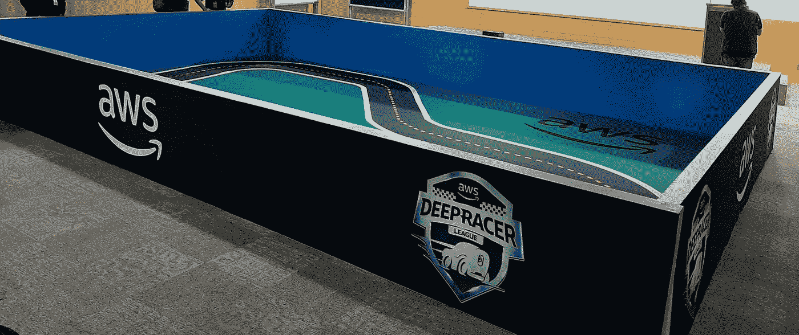*

*AWS DeepRacer 赛道*

*感谢阅读。随时欢迎反馈和问题！这篇博客是根据我对数据科学和分析的巨大世界的有限理解而写的。感谢 AWS 团队组织此次研讨会。*

```
*For further reading — Please visit AWS for DeepRacer, and look up 
Machine Learning or AI on Google.[https://docs.aws.amazon.com/deepracer/latest/developerguide/deepracer-console-train-evaluate-models.html#deepracer-reward-function-signature](https://docs.aws.amazon.com/deepracer/latest/developerguide/deepracer-console-train-evaluate-models.html#deepracer-reward-function-signature)[https://ai.google/](https://ai.google/)[https://mml-book.github.io/book/mml-book.pdf](https://mml-book.github.io/book/mml-book.pdf)*
```