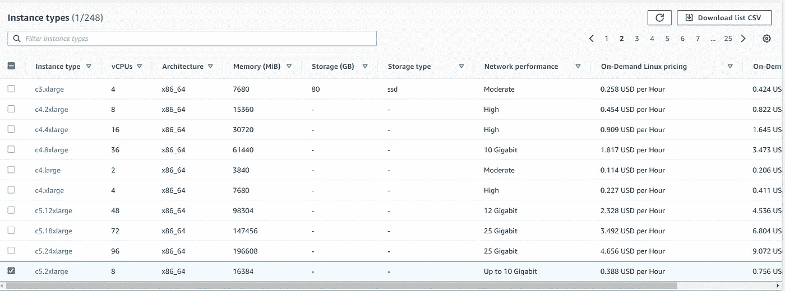

# AWS EC2 实例概述。

> 原文：<https://medium.com/analytics-vidhya/aws-ec2-instances-overview-80aa09b9f8cf?source=collection_archive---------17----------------------->

分类、特征、计费计划。

照片由 [Tistio](https://unsplash.com/@tistio?utm_source=medium&utm_medium=referral) 在 [Unsplash](https://unsplash.com?utm_source=medium&utm_medium=referral) 上拍摄

# 免责声明:

这是关于亚马逊网络服务(AWS)系列的第三篇文章，我将写这篇文章作为对[认证开发者考试助理](https://aws.amazon.com/certification/certified-developer-associate/)的准备。

## 什么是 EC2 实例？

EC2 代表**弹性计算机云**，EC2 实例显然是云的一个实例。在简单的情况下，EC2 实例是一个**虚拟机实例，**但它也可以是一个专用的或真实的服务器..

## EC2 主要特点。

如果您查看 EC2 实例类型页面，您可以看到网格:

EC2 类型，第一页

您可以在列中看到主要特征:

**实例类型** —格式<类型>中实例的类型。<尺寸>。类型通常是两个符号—字母和数字。我们稍后会谈到类型。

**vcpu**—多少台虚拟 CPU 机器。更多 vCPUs 更快的计算速度。

**架构** — CPU 架构，例如 **x86_64** 或 **ARM。**

**内存** —机器有多少内存。

**存储** —如果机器有自己的存储，则在此栏中以千兆字节表示。

**存储类型** —可以是 **ssd** 或 **hdd**

**网络性能** —网络带宽。有时候只是**中等**，有时候是千兆位的数字。

**针对 Linux 和 Windows 的按需定价** —如果您愿意按需付费，此实例按小时定价。除了“**点播”**还有另外一个方案，所以这些价格可以变化。

# EC2 实例的类型:

我们来谈谈实例类型中这些神奇的字母和数字是什么意思。我们可以看到所有类型都是以字母开头的，像**“c”**或者**“t”。**什么意思？

可在 [EC2 实例类型文档页面获得完整列表。](https://aws.amazon.com/ec2/instance-types/?nc1=h_ls)

首先，EC2 实例按类别划分:

## **通用**类别

在内存、CPU 和带宽之间具有平衡特征的实例。在通用类别中，AWS 有多种类型— **A1、T3、T3a、T2、M6g、M5、M5a、M5n、M4**

**A1** —基于 ARM 处理器架构的实例。

**T2，T3** — X86 **可突发**实例。可爆发意味着 CPU 性能可以在需要时爆发。它能超过基准性能多长时间取决于实例，也就是所谓的**信用** —特殊单位，它是在实例处理基准性能时收集的。

**T3a** —同上，但基于 **AMD** 处理器架构。以前使用英特尔至强架构的实例。

**M5 M4**—通用实例，非突发。M4 使用旧的英特尔至强处理器。

**M5n** —与 M5 相同，但带宽更高。

**M5a** — AMD 处理器推进这些实例。

M6g —基于 ARM 的新一代实例。注意，只有这种型号的名称中有**【6】**。通常，数字越大，平台越新。

## 计算优化类别

应用程序和任务实例中具有更强大和/或更多核心 CPU 的类别，这要求更高的性能。

类型— **C5、C5n、C4** 。

**C4，C5** —主要计算优化实例，C5 使用更新的硬件。

**C5n** —与 C5 相同，但带宽更高。

## 内存优化类别

这些实例旨在更好地处理大型数据集。

类型— **R5、R5a、R5n、R4、X1e、X1、高内存、z1d。**

**R4，R5** —与 C4 和 C5 相同，这是主要实例，但 R5 较新。

**R5a** —基于 AMD 处理器的实例。

**X1，X1e** —每 GiB RAM 的价格最低，但 CPU 比通常情况下稍慢。

**z1d**—CPU 和 RAM 都很高。

**高内存** —可能是最强大的实例，高达 24 TB 的 RAM 和 448 个内核！

## 加速计算。

面向数据科学和密码挖掘的实例。使用 GPU 进行计算。

类型— **P3，P2，Inf1，G3，G4，f1。**

**P3 P2**—板载 Nvidia GPUs 的通用实例。

**Inf1** —使用推理应用程序的实例。

**G3，G4** —机器学习优化实例

**F1** —这些实例使用 FPGAs 作为硬件加速器。

## 存储优化。

如果你需要使用外部存储你的数据，即大数据库。

类型— I3、I3en、D2、H1。

**I3** —使用 SSD 存储的通用实例

**I3en**——一样，但是 NVMe 硬盘更快。

**D2**—打算进行真正大而慢的存储并使用 HDD 磁盘。

**H1** —基本上与 D2 相同，但硬盘容量较小。

# 哪些尺寸？

每个 EC2 实例都有自己的大小，并写在名称中。例如 **t2.micro** ，其中“micro”代表它的大小。在 AWS 中，大小范围从“nano”到“metal”，其中 nano 是最小的实例，只有 512MiB，metal 是真正的服务器，通常非常强大。

# 如何创造，什么是 AMI？

实例的创建非常容易。最简单的方法是使用控制台中的向导。您也可以使用 CloudFormation 或 Elastic Beanstalk 创建一个实例。

从 **Amazon 机器映像(AMI)** 创建的所有虚拟实例。每个图像都有自己的 ID，您可以在自动化任务中使用该 ID。

此外，您可以使用预装软件创建自己的映像并使用它。

**请注意:不同地区的 AMI IDs 不同！**

因此，您不能对不同的区域使用相同的创建脚本，但是您可以创建一个 AMIs IDs 列表，并将区域作为参数发送。

# 定价计划。

当然，如果你问我，这些例子中哪一个最好，我会回答最强大的是最好的！但是钱来了！

那么，亚马逊有哪些定价方案呢？

## 自由层

这是现实，你可以免费拥有一个真实的 EC2 实例！嗯，没那么强大。现在只有 **t2.micro** 实例是免费的。这是 1 个 CPU 和 1 个内存 GiB 的机器。虽然不多，但对于基于 Node.js 和 Linux 的小型 WEB 服务器来说已经足够了。请注意，它不是永远免费的，但只有 1 年，每月有 750 小时的使用限制。

## 一经要求

您可以在任何时候创建实例，创建的持续时间和实例都是您想要的。几乎马上你就会拥有它。当然会花你钱。

## Spot 实例

最有趣的储蓄计划，以防你长期不需要实例，也不会保存重要数据。亚马逊有一个未使用的实例容量，你可以通过提供你自己的价格来购买它！该价格通常比需求价格低很多(直到 90%)。但是要小心！如果有人提出更高的价格，你就会被踢出去。

## 保留实例

你事先预订的实例。有一个标准和可转换立管。标准型不能改变它们的类型，敞篷型可以根据需要转换成另一种类型。

## 专用主机

这些是专门为你服务的物理服务器。不是最便宜的，但如果你有一些特殊的许可，或真正大的应用程序，它可以是这里最好的主张。

# 结论

以下是 EC2 实例、ami 和定价计划的简单分类。希望这些信息对您有所帮助。