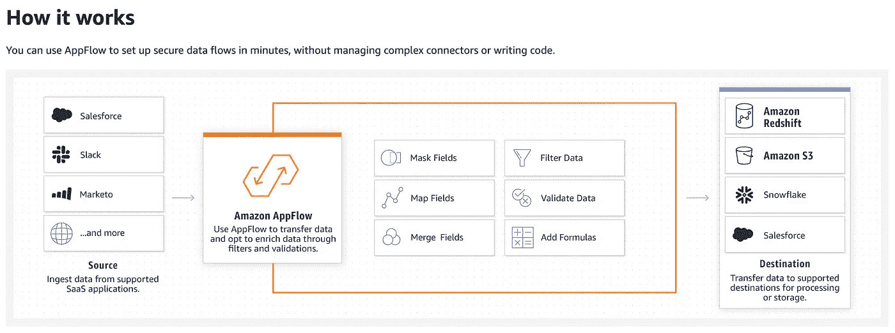

# AWS 刚刚发布了 AppFlow

> 原文：<https://medium.com/analytics-vidhya/aws-just-released-appflow-f10f258af2f0?source=collection_archive---------12----------------------->

AWS 应用程序流程

## AppFlow 可以轻松地将数据从非 AWS 服务中直接提取到您的数据仓库中

*本文由* [*科比特分析*](https://www.corbettanalytics.com/) *赞助。*

AWS 的 AppFlow 是亚马逊的第一款产品，可以自动将第三方数据直接拉入 AWS 服务，而不需要定制的 ETL 代码。在发布的时候，AppFlow 支持…