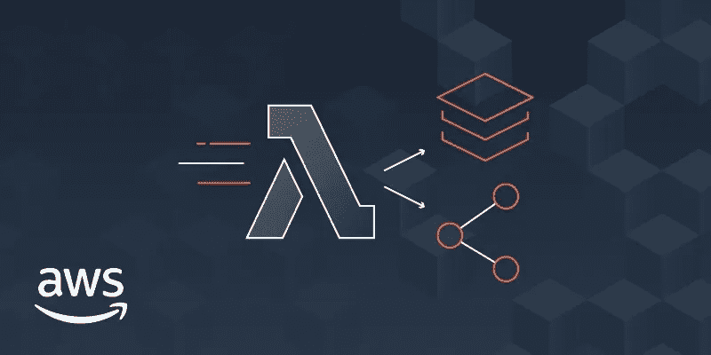
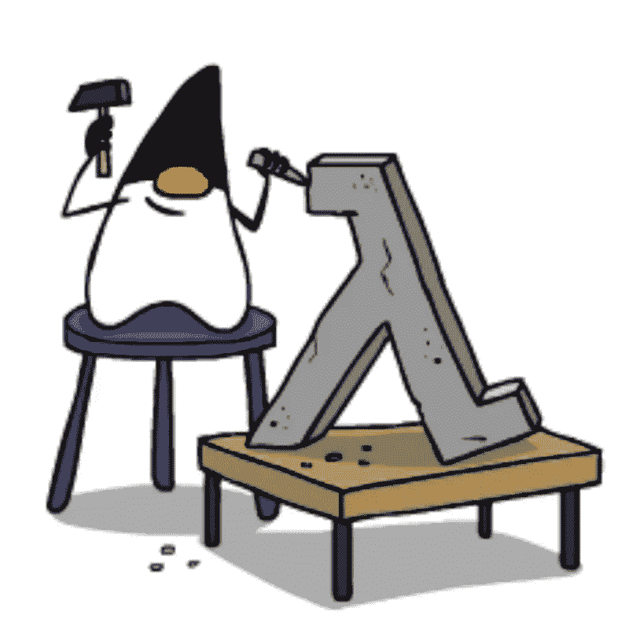
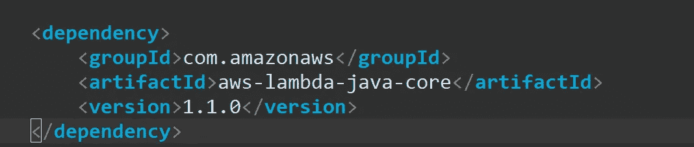
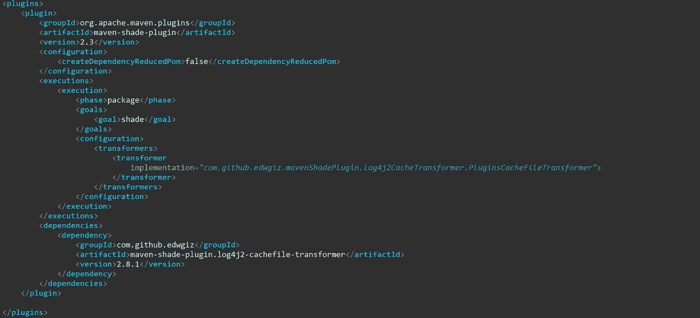
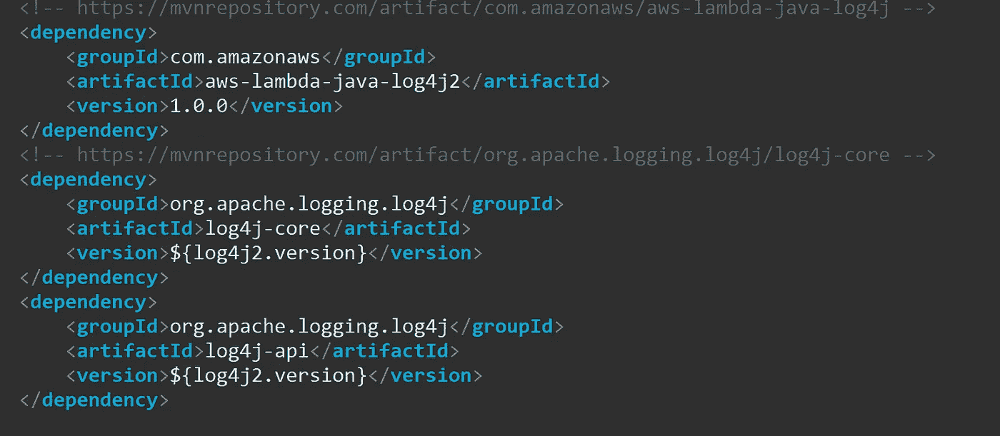
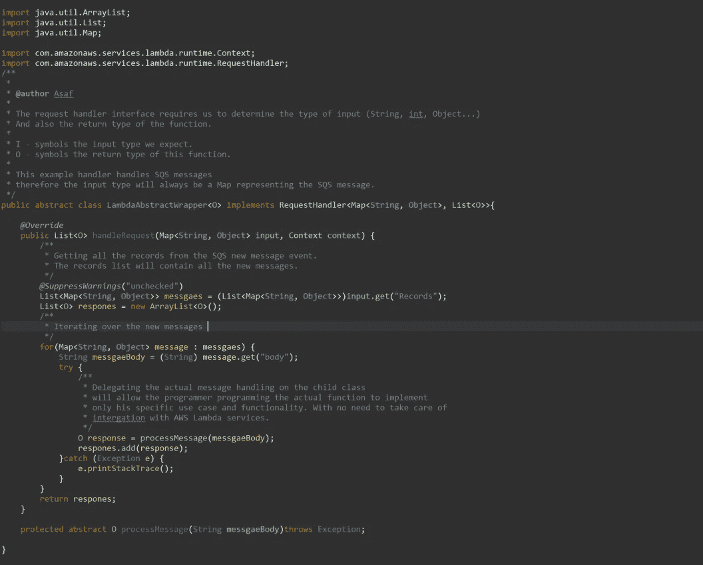
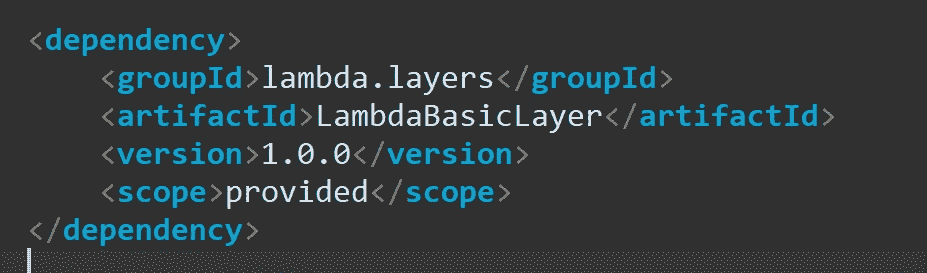

# Java 中的 AWS Lambda 层

> 原文：<https://medium.com/analytics-vidhya/aws-lambda-layer-in-java-ad67ce5d94b4?source=collection_archive---------1----------------------->

AWS 层

# 什么是 lambda 层？

AWS 早在 2018 年就推出了 Lambda 层，作为在不同帐户内部和之间的功能之间共享代码和数据的一种方式。

Lambda 层允许我们在多个 lambda 函数之间共享公共代码和依赖关系。

使用 lambda 层来管理和控制 lambda 功能将为基于 lambda 的架构提供一个灵活、可扩展且坚实的基础。

# 为什么使用 lambda 层？

使用 lambda 层的主要好处是:

*   **小的结果 JAR** —部署的每个函数都很小，只包含与它打算做的动作相关的代码。
*   **共享依赖项的单一打包** —无需将共享依赖项或代码与每个功能打包在一起。
*   **灵活的代码更新** —代码或依赖项的更新只发生在一个地方，而不是每个函数。

简而言之，lambda 层是为了帮助我们使用灵活、可扩展和简单的管理工具开发更高规模和复杂的 lambda 功能。

# 什么时候使用 lambda 层？

lambda 层的使用有时会产生更多的问题，而不是解决方案。尤其是在用 Java 这样的静态语言编码时，在编译过程中需要所有的代码和依赖项。

在我看来，应该在以下情况下使用 lambda 层:

*   频繁更新的大型依赖项。
*   自定义 lambda 运行时。
*   Lambda 函数自定义包装。

λ函数

# Java 中的 Lambda 层:

据我们目前所知，用 Java 编写 lambda 层是一件非常痛苦的事情。我不建议这样做。使用 Python 或 NodeJS 会简单快捷得多。

但是在某些情况下。用不同的语言将现有的用 Java 编写的服务移植到 lambda 函数中的成本，将比用本教程和用 Java 部署 lambda 层更令人痛苦。

# Lambda 基本包装:

我们要做的第一件事是创建函数触发器处理程序，这个触发器处理程序将使用我们作为函数的第一个**和最基本的 lambda 层**。我们将使用 MAVEN 和 openjdk8。

因此，我们的初始 pom.xml 应该包含以下依赖项:

还有阴影插件:

*   注意转换器到 log4j2 日志框架的依赖关系部分。如果您想在应用程序中使用 log4j logger，请添加以下依赖项:

现在我们正在编写我们的第一个功能层，包含一些功能而不仅仅是依赖。我建议尽可能减少这一层。欢迎您的实现所需的任何其他依赖项。只要记住，这一层应该是通用和轻。

除此之外，根据您使用的 aws SDK 的版本，会出现一些版本冲突，应该予以解决。请确保按照 [AWS 文档](https://docs.aws.amazon.com/lambda/latest/dg/java-programming-model-handler-types.html)完成您的 pom.xml

# Lambda 处理程序类:

下一步是创建需要时由 AWS Lambda 触发的处理程序。

这可以通过使用 RequestHandler 接口*来完成，该接口要求我们实现 handleRequest 方法。*

在我的例子中，我选择使用抽象类来实现这个接口，这将允许我在所有 lambda 函数和 AWS Lambda 接口之间创建一个可靠的基础结构。

我的例子描述了一个抽象的 SQS 消息 lambda 触发器。

请注意课堂内的评论以获得进一步的解释

# 本地安装和使用:

现在，为了使用我们的新 lambda 层，我们需要安装并导入它。

1.  **层安装:** 这是一个非常简单的任务，我们将使用 MAVEN 使用 shade 插件创建我们的 fat jar】结果将是一个新的 JAR 安装在我们的本地存储库. m2 中。我们将使用这个 JAR 作为我们的层部署的一部分(稍后将解释)。但也是 lambda 函数的基础层。
2.  **图层导入:** 在进入技术部分之前，我们先了解一下我们到底要做什么，为什么这不是那么微不足道。
    我们希望最终创建一个 JAR，它可以被 MAVEN 使用我们在 pom.xml 中的描述正确地编译，但是我们不想把这个 JAR 的依赖项打包在一起。

    **为什么？好吧，那样做将使层的使用变得毫无意义，我们不想把每个函数和它所有的依赖项打包在一起。我们希望能够只编译我们需要的代码，并在运行时为不同的存储库使用依赖关系。
    **如何？为了让这个奇怪的设置工作起来，我们需要本地. m2 存储库中所有可用的依赖项。我们需要将依赖项物理导入到我们的本地环境中。我们在编译时需要它，这样我们就能访问我们的代码。现在，为了标记 MAVEN 不要将这些依赖项与我们的代码打包在一起，我们将在依赖项定义中使用提供的作用域。****

为运行时要从 lambda 层提取的每个依赖项添加提供的范围。只要确保版本和 JAR 名称匹配即可。

现在留给您的就是创建一个扩展您在基本层中创建的 LambdaAbstractWrapper 类的类，设置函数的返回类型并实现 processMessage 抽象方法。

# 运行时的层打包:

正如我们前面提到的，一旦函数被调用，我们的 lambda 层就被添加到 lambda 函数运行时环境中。那么，我们如何告诉 lambda 运行时我们想要哪些层呢？以及它们的位置，以便我们的应用程序能够使用它们？

首先，让我们创建一个 lambda 层:

1.  将所有需要的 JAR 文件压缩成一个压缩文件— LambdaLayer.zip
2.  将此 ZIP 文件上传到所需的 S3 存储桶中。
    `aws s3 cp LambdaLayer.zip s3://<BUCKET_NAME>`
3.  使用 aws CLI 创建新的 lambda 层并保存响应。
    `aws lambda publish-layer-version --layer-name <LAYER_NAME>\
    --compatible-runtimes java8\
    --content S3Bucker=<BUCKET_NAME>,S3Key=LambdaLayer.zip\
    >> LambdaLayerResult.json`

现在，您应该有一个与 Java lambda 函数兼容的 lambda 层了。你可以通过登录你的 AWS 账户，导航到 lambda 并点击左侧菜单中的“层”来验证它。CLI 调用的结果被保存到一个名为 LambdaLayerResult.json 的文件中。当我们定义 lambda 函数时，我们将需要它来将层附加到函数上。

# 创建和部署 Lambda 函数:

现在，我们将创建我们的 lambda 执行角色，部署我们的 Java lambda 函数，并将其附加到我们在上一部分中创建的 lambda 层。

1.  创建一个 lambda 执行角色[的例子](https://docs.aws.amazon.com/lambda/latest/dg/lambda-intro-execution-role.html)，保存新角色 ARN 以备后用。
2.  使用 MAVEN 构建我们的 lambda 函数 JAR—`mvn clean install`
3.  使用 aws CLI 上传 lambda 函数:

`aws lambda create-fucntion --function-name <FUNCTION_NAME>\
--runtime java8 --role <ROLE_ARN> --handler <PATH_TO_HANDLER_CLASS>\
--memory-size <MEMORY_SIZE_IN_MB> --region <REGION> --layers <LAYER_ARN>\ --zip-file fileb://<PATH_TO_JAR> --publish`

现在，我们已经创建了 lambda 执行角色，lambda 函数，并为其附加了 lambda 层。你可以通过登录你的 aws 账户，导航到 lambda 并在 Functions 下搜索你的新函数来验证它。

就是这样！

一般来说，Lambda 函数是无服务器架构中的一个强大工具。用 Java 管理 lambda 层的能力将允许你维护一个简单、强大和灵活的无服务器环境。

# 从 VPC 内部的 lambda 函数访问互联网有问题吗？我有一个解决方案给你！

阅读我的媒体[关于问题和解决方案的故事](/@asafadar55/vpc-lambda-internet-access-f70a55dc7a39)！

请继续关注更多关于 aws 无服务器基础设施的教程