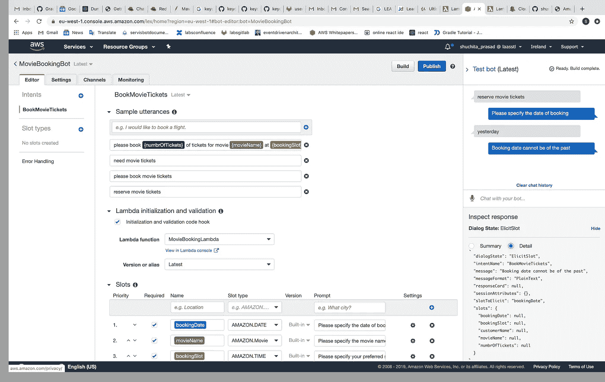
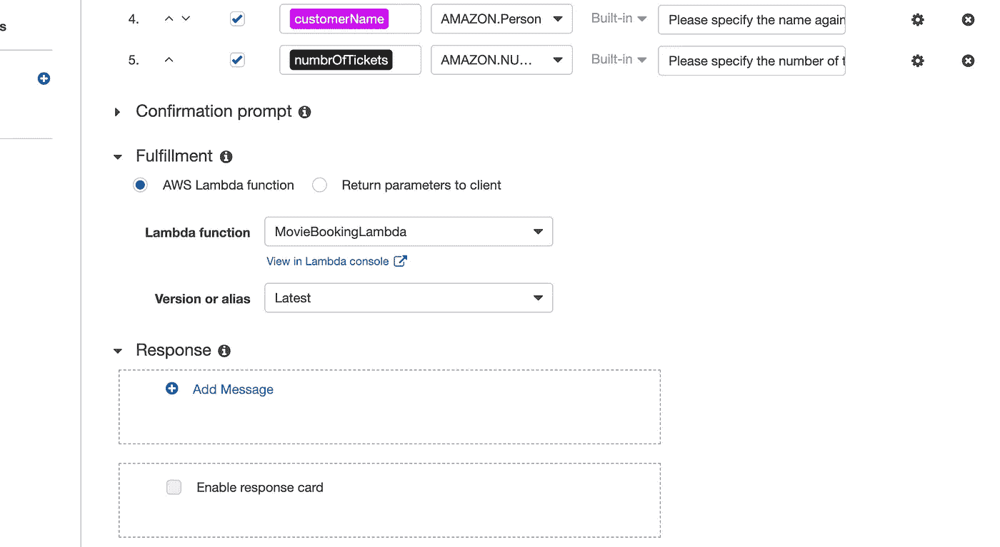

# AWS Lex/聊天机器人 Python Lambda

> 原文：<https://medium.com/analytics-vidhya/aws-lex-chatbot-python-lambda-84a17c2418ac?source=collection_archive---------9----------------------->


萨法尔·萨法罗夫在 [Unsplash](https://unsplash.com?utm_source=medium&utm_medium=referral) 上拍摄的照片

本文的目的是分享我在为 AWS Lex 机器人编写 Lambdas 时的心得。请注意，聊天机器人的对话可以更自然，但本文的重点是在 Lambda 方面。

1.  启用对用户提供的信息的动态验证。根据某些条件，您可以将某个插槽设置为强制/可选。
2.  用复杂的嵌套 JSON 发回复杂的响应。
3.  使用 sessionAttributes 维护用户的上下文。
4.  开发过程中可能遇到的一些常见错误及其根本原因。

请注意，支付流程和 ui 的显示不在本文讨论范围内。api 调用已经被静态 JSON 取代。**请注意，还添加了一个新的插槽客户名称**。

***如果你想更好的理解文章请参考聊天机器人 Lex*** 的基础知识

[https://medium . com/@ shuchitaprasad/AWS-lex-chatbots-basics-static-bot-d6a 1083609 f 7](/@shuchitaprasad/aws-lex-chatbots-basics-static-bot-d6a1083609f7)

我们将继续我们最初的电影订票机器人用例，在上面的链接中，我们刚刚制作了一个静态机器人。现在，我们将使它充满活力。

**λ创建**

进入服务，搜索 Lambda 并点击创建函数，如下所示。请注意，您选择的角色应该附加有[awslambdabasiceexecutionrole](https://console.aws.amazon.com/iam/home#/policies/arn%3Aaws%3Aiam%3A%3Aaws%3Apolicy%2Fservice-role%2FAWSLambdaBasicExecutionRole)策略。

[https://docs . AWS . Amazon . com/lex/latest/DG/ex1-sch-appt-create-lambda-function . html](https://docs.aws.amazon.com/lex/latest/dg/ex1-sch-appt-create-lambda-function.html)

Lambda 基本上是一个 web 挂钩，我们将它与可以附加的 AWS Lex bot 联系在一起

1.在动态填充用于验证的槽时。

2.当所有空位都被填充时/履行阶段

请参考下面显示如何在验证时附加 Lambda 的截图。



履行时附加。



将整个流程分成几个步骤。

1.  验证用户在预订日期中没有输入过去日期的有效数据的时段。此外，在任何槽验证失败的情况下，将使用要正确填充的槽的名称调用 excite _ slot 方法。
2.  在我们的用例中，我们希望显示用户提到的预订日期正在播放的电影列表，理想情况下，这必须是一个 API 调用。(参考 github 库时请注意下面的代码)，为了简单起见，有一个硬编码的 JSON。我们可以使用请求模块进行 api 调用。硬编码的 JSON 存在于 github 的 movielist.py 文件中。

```
[
  {
    'name': 'Mangal Mission',
    'slotDetails': [
      {
        'slots': '9am',
        'price': '500'
      },
      {
        'slots': '1pm',
        'price': '700'
      }
    ]
  },
  {
    'name': 'WAR',
    'slotDetails': [
      {
        'slots': '10pm',
        'price': '400'
      },
      {
        'slots': '12pm',
        'price': '600'
      }
    ]
  }
]
```

1.  如果选择了电影名称，则从会话属性中找到该电影的可用时段，并要求用户选择该时段，一旦完成，要求用户提供其他详细信息，在成功验证后，将达到完成状态，继续进行预订。
2.  使用 Lex 的会话属性，聊天应该在上下文中包含的内容、选定的日期、选定的电影、时段以及他的个人详细信息。

///用于验证的代码段

```
# fetch all the slot values
bookingDate = get_slots(intent_request)["bookingDate"]
movieName = get_slots(intent_request)["movieName"]
bookingSlot = get_slots(intent_request)["bookingSlot"]
numbrOfTickets = get_slots(intent_request)['numbrOfTickets']
customername = get_slots(intent_request)['customerName']

# validation for booking date not null
if bookingDate is None:
    "-- if the user has not selected any movie --"
    return build_validation_result(False, 'bookingDate', 'PlainText', 'Please specify the date of booking', None)

else:
    # validation for invalid booking date
    if not isvalid_date(bookingDate):
        return build_validation_result(False, 'bookingDate', 'PlainText',
                                       'I did not understand that, what date would you like to book the tickets '
                                       'for?', None)
    elif datetime.datetime.strptime(bookingDate, '%Y-%m-%d').date() < datetime.date.today():
        return build_validation_result(False, 'bookingDate', 'PlainText', 'Booking date cannot be of the past',
                                       None)
"-- fetch movie name by api call/ being fetch from hard coded JSON --"
if movieName is None:
    moviedetailslist = movielist.fetchMovieList();

    movie_lookup = createmovielookupmap(moviedetailslist)
    movienamesonly = []
    for moviedetails in moviedetailslist:
        movienamesonly.append(moviedetails['name'])

    return build_validation_result(False, 'movieName', 'PlainText',
                                   'Please choose from the given movies ' + ','.join(movienamesonly),
                                   json.dumps(movie_lookup))

    # return build_validation_result(False, 'movieName', 'CustomPayload', json.dumps(moviedetailslist),
    # json.dumps(movie_lookup))

if bookingSlot is None:
    "-- if the user has  selected  movie, it should be present in the list of movies which the  user was shown to--"
    if sessionAttributes.get('moviedetails_lookup', None) is None:
        return build_validation_result(False, 'movieName', 'PlainText',
                                       'Please enter movie name from the list only',
                                       None)
    # fetch the slot details based on movie selected
    else:
        slotdetails =[]
        time_slots = []
        moviedetails_lookup = sessionAttributes['moviedetails_lookup']
        """---find the booking slot as per the movie selected----"""
        slotdetails = moviedetails_lookup[movieName]
        for slot in slotdetails:
            time_slots.append(slot['slots'])
        return build_validation_result(False, 'bookingSlot', 'PlainText',
                                       'Please find the slots for the movie' + ','.join(time_slots) + 'Select one',
                                       None)

else:
    if len(bookingSlot) != 5:
        # Not a valid time; use a prompt defined on the build-time model.
        return build_validation_result(False, 'bookingSlot', 'PlainText', 'Not a valid time', None)

    hour, minute = bookingSlot.split(':')
    hour = parse_int(hour)
    minute = parse_int(minute)
    if math.isnan(hour) or math.isnan(minute):
        # Not a valid time; use a prompt defined on the build-time model.
        return build_validation_result(False, 'bookingSlot', 'PlainText', 'Not a valid time', None)

if customername is None:
    return build_validation_result(False, 'customerName', 'PlainText', 'Please specify the name against which the '
                                                                       'booking needs to be done', None)

if numbrOfTickets is None:
    return build_validation_result(False, 'numbrOfTickets', 'PlainText', 'Please specify the number of tickets '
                                                                         'required', None)
```

//用于上下文保存的会话变量的代码段

在这里，我们简单地创建一个映射，用 key 作为电影名称，用 value 作为位置细节和它们的价格。

```
# Create a map with movie name as key and slots timing with prices as  values
def createmovielookupmap(movienamesList):
    logger.debug("Creating Category Map {}".format(movienamesList))
    moviesLookup = {}

    for moviename in movienamesList:
        synonyms = moviename['name']
        moviesLookup[synonyms] = moviename['slotDetails']

    logger.debug("Created Category Map:: {}".format(moviesLookup))
    return moviesLookup
```

//根据所选电影找出可用时段的代码段，将会话属性字符串转换为字典，并根据键、电影名称检索时段计时。

```
if bookingSlot is None:
        "-- if the user has  selected  movie, it should be present in the list of movies which the  user was shown to--"

        if sessionAttributes.get('moviedetails_lookup', None) is None:
            return build_validation_result(False, 'movieName', 'PlainText',
                                           'Please enter movie name from the list only',
                                           None)
        # fetch the slot details based on movie selected
        else:

            time_slots = []
            # convert the session attribute string to dictionary/map
            moviedetails_lookup = eval(sessionAttributes['moviedetails_lookup'])

            logger.debug("SELECTED MOVIE :: {}".format(moviedetails_lookup.get(movieName)))

            """---find the booking slot as per the movie selected----"""
            for slot in moviedetails_lookup.get(movieName):

                time_slots.append(slot['slots'])
            return build_validation_result(False, 'bookingSlot', 'PlainText',
                                           'Please select from  the available slots for the movie ' + ','.join(time_slots),
                                           None)
```

**有用的常见例外/提示**

1.  重试机制。如果 Lambda 无法成功地向 LEX bot 发送响应，将会观察到重试。如果您从 AWS sdks 调用 Lex bot，这将在 SDK 级别设置。
2.  如果响应处于错误状态。—请注意，如果你试图像访问字典一样访问字符串，它会给出错误，**【错误】类型错误:字符串索引必须是整数。**这就是为什么，我使用了 **eval** 函数将字符串地图转换成字典。
3.  如果超过响应限制。从 Lambda 发送回 LEX 的响应大小是有限的。当超过此限制时，您将看到重试发生。请参考[https://docs.aws.amazon.com/lambda/latest/dg/limits.html](https://docs.aws.amazon.com/lambda/latest/dg/limits.html)
4.  如果您的 api 需要更多时间，请确保在**基本设置**下增加您的超时值。
5.  使用环境变量来外部化 api urls 和其他值，并使用 python OS 模块来访问它。
6.  如果您使用的是 boto3 不支持的外部包，使用下面的命令将所有依赖项放在一个文件夹中，并与代码一起压缩。 **pip 安装请求-t /path/to/project-dir**
7.  要返回一个复杂的 JSON，其中有一个使用和显示 JSON 的客户端，使用下面的代码。如果消息的内容类型是文本，将返回纯文本，自定义有效负载代表复杂的嵌套 JSON。

```
return build_validation_result(False, 'movieName', 'CustomPayload', json.dumps(moviedetailslist),json.dumps(movie_lookup))

#the build_validation_result

def build_validation_result(is_valid, violated_slot, content, message_content, sessionAttributes):
    if message_content is None:
        return {
            "isValid": is_valid,
            "violatedSlot": violated_slot,
        }

    return {
        'isValid': is_valid,
        'violatedSlot': violated_slot,
        'message': {'contentType': content, 'content': message_content},
        'sessionAttributes': sessionAttributes
    }
```

请找到 lambda 代码的 git hub 存储库。[https://github.com/shuchitaprasad/moviebookinglambda](https://github.com/shuchitaprasad/moviebookinglambda)

*最初发表于*[T5【https://www.linkedin.com】](https://www.linkedin.com/pulse/aws-lexchatbot-python-lambda-shuchita-prasad)*。*