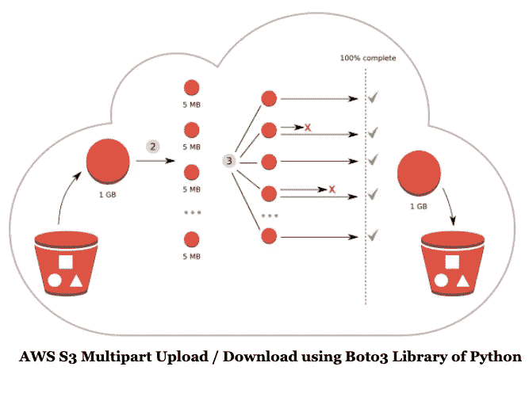

# 使用 Boto3 (Python SDK)进行 AWS S3 多部分上传/下载

> 原文：<https://medium.com/analytics-vidhya/aws-s3-multipart-upload-download-using-boto3-python-sdk-2dedb0945f11?source=collection_archive---------1----------------------->



我们每天都在处理大量的数据集。我们工作描述的一部分是以低延迟传输数据:)。亚马逊简单存储服务(S3)可以存储高达 5TB 的文件，但通过一次上传操作，我们只能上传高达 5 GB 的对象。Amazon 建议，对于大于 100 MB 的对象，客户应该考虑使用*多部分上传*功能。

*AWS SDK、AWS CLI* 和 *AWS S3 REST API* 可用于多部分上传/下载。对于 CLI，请阅读这篇[博文](https://aws.amazon.com/premiumsupport/knowledge-center/s3-multipart-upload-cli/)，这篇博文解释得非常好。

在本指南中，我们将使用 Python SDK。在我们开始之前，您需要准备好使用 **Python** 和 **Boto3** 的环境。如果你还没有做好准备，[请点击这里查看我之前的博文](/@paulankhi89/how-to-access-aws-s3-using-boto3-python-sdk-e5fbd3d276bd)。

首先，我们需要确保导入 boto3 也就是用于 AWS 的 Python SDK。现在用 **boto3** 创建 **S3** 资源，与 **S3:** 交互

```
import boto3s3_resource = boto3.resource(**'s3'**)
```

上传、下载或复制文件或 S3 对象时，用于 Python 的 AWS SDK 会自动管理重试、多部分和非多部分传输。为了实现细粒度控制，可以配置默认设置来满足要求。 **TransferConfig 对象**用于配置这些设置。然后该对象被传递给*配置=参数*中的一个传输方法(上传文件，下载文件)。

```
from **boto3.s3.transfer** import **TransferConfig**config = **TransferConfig**(**multipart_threshold**=1024 * 25, 
                        **max_concurrency**=10,
                        **multipart_chunksize**=1024 * 25,
                        **use_threads**=True)
```

下面是对 **TransferConfig** 的每个元素的解释:

**multipart_threshold** :这用于确保多部分上传/下载仅在传输的大小大于所提到的阈值时发生，例如我使用了 25MB。

**max_concurrency** :这表示将要发生的并发 S3 API 传输操作的最大数量(基本上是线程)。设定此项以增加或减少带宽使用。该属性的默认设置为 10。如果 **use_threads** 设置为 **False** ，所提供的值将被忽略。

**multipart_chunksize** :多部分传输的每个部分的大小。以 25MB 为例。

**使用 _ 螺纹**:如果**为真**，执行 **S3** 转移时将使用平行螺纹。如果**为假**，执行传输时将不使用任何线程。

在配置了 **TransferConfig** 之后，让我们调用 S3 资源来上传一个文件:

```
bucket_name = **'first-aws-bucket-1'**def multipart_upload_boto3():

    file_path = os.path.dirname(__file__) + **'/multipart_upload_example.pdf'**key = **'multipart-test/multipart_upload_example.pdf'** s3_resource.Object(bucket_name, key).upload_file(file_path,
                            ExtraArgs={**'ContentType'**: **'text/pdf'**},
                            Config=config,
                            Callback=ProgressPercentage(file_path)
                            )
```

- **file_path** :我们要上传到 s3 bucket 的源文件的位置。
- **桶名**:上传文件的目的 S3 桶名。
- **key** :你要上传文件的 key (S3 位置)的名称。
- **ExtraArgs** :在 json 字符串的这个 param 中设置额外的参数。您可以参考[此](https://boto3.amazonaws.com/v1/documentation/api/1.9.42/guide/s3.html)链接以获取有效的上传参数。
- **Config** :这是我刚刚在上面创建的 TransferConfig 对象。

同样，对于下载文件:

```
def multipart_download_boto3():

    file_path = os.path.dirname(__file__)+ **'/multipart_download_example.pdf'**file_path1 = os.path.dirname(__file__) key = **'multipart-test/multipart_download_example.pdf'** s3_resource.Object(bucket_name, key).download_file(file_path,
                            Config=config,
                            Callback=ProgressPercentage(file_path1)
                            )
```

**-bucket_name** :下载文件的 S3 桶的名称。
- **key** :你要从哪里下载文件(源)的 key (S3 位置)的名称。
- **file_path** :你要下载文件的位置(目的地)
- **ExtraArgs** :在 json 字符串的这个 param 中设置额外的参数。你可以参考[这个](https://boto3.amazonaws.com/v1/documentation/api/1.9.42/guide/s3.html)链接来获得有效的上传参数。
- **Config** :这是我刚刚在上面创建的 TransferConfig 对象。

请注意，我使用了进度回调，这样我就可以
跟踪传输进度。upload_file 和
download_file 方法都采用可选的回调参数。这个*进度百分比*类在 [Boto3 文档](https://boto3.amazonaws.com/v1/documentation/api/latest/_modules/boto3/s3/transfer.html)中有解释。

**多部分上传的有趣事实(我在练习中学会的):**

1.  为了检查文件的完整性，在上传之前，您可以计算文件的 MD5 校验和值作为参考。假设您想要上传一个 12MB 的文件，而您的部分大小是 5MB。计算每个部分对应的 3 个 MD5 校验和，即第一个 5MB、第二个 5MB 和最后一个 2MB 的校验和。然后取它们连接的校验和。由于 MD5 校验和是二进制数据的十六进制表示，所以请确保您采用解码的二进制串联的 MD5，而不是 ASCII 或 UTF-8 编码的串联。完成后，添加一个连字符和零件的数量，以获得 S3 最终对象的 *ETag* 。
2.  对于传统的 PUT 请求，对象的 *ETag* 是文件的 MD5 校验和。然而，对于多部分上传*来说，Etag* 是基于不同的算法计算的。

继续探索和调整 **TransferConfig 的配置。**快乐学习！

完整代码参考，请访问 [github](https://github.com/ankhipaul/aws_demos) 。