# AWS S3 与 Java 使用 Spring Boot

> 原文：<https://medium.com/analytics-vidhya/aws-s3-with-java-using-spring-boot-7f6fcf734aec?source=collection_archive---------0----------------------->

## 一个功能教程，创建相册项目。


Spring + AWS S3 +创客项目

今天，我将向您展示如何实现这一点，为此您需要:

1.  具有 Spring 框架的中级知识
2.  AWS 帐户
3.  Java 11+和 Maven
4.  MongoDB

## 我喜欢从后端开始

更简单的做法是从后端开始，为此，我们需要在 AWS S3 上创建一个 Bucket。桶是一个简单的抽象概念，我们知道“我的文件在哪里？”。

## 准备 AWS S3

在您的 AWS 控制台中，转到存储会话并单击 S3:

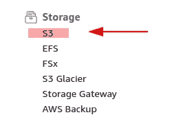

AWS >存储> S3

点击**【创建桶】**:

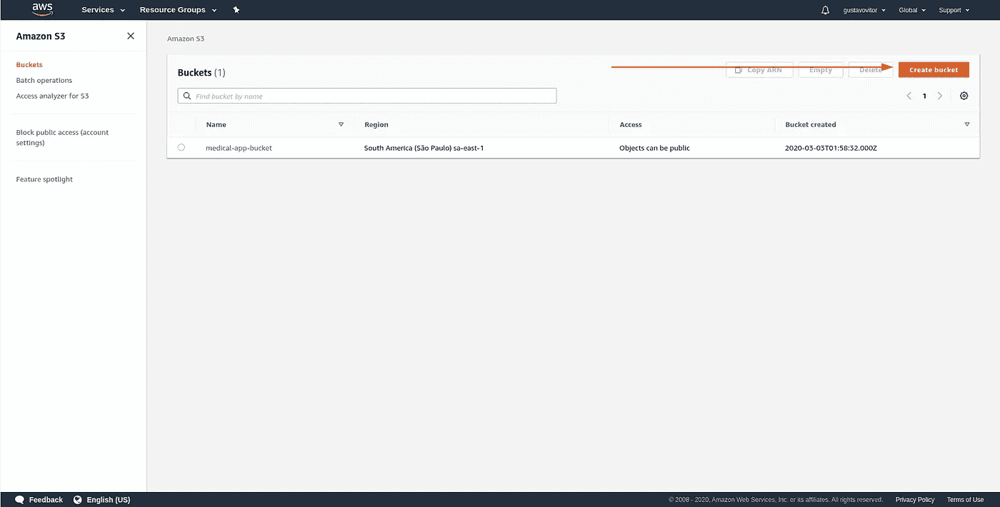

亚马逊 S3 —桶屏幕

现在，您需要告知关于您的存储桶的基本信息，以便您在以后维护时识别它(存储桶名称在所有亚马逊 S3 上是唯一的):

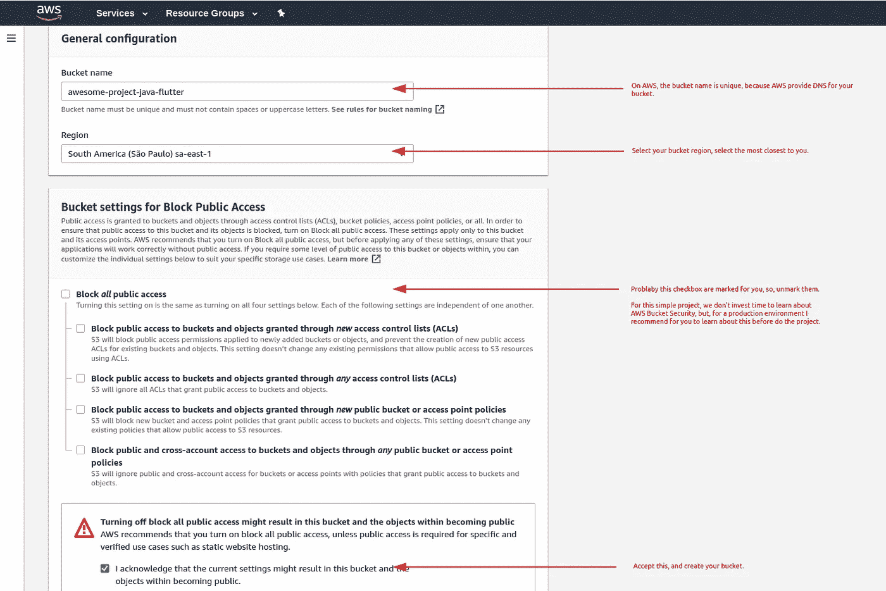

创建存储桶形式

好了，现在你在 AWS S3 上有一个 bucket，现在我们需要创建一个**【访问密钥】**和**【秘密密钥】**来访问你在 **AWS Java SDK 上的 bucket。**返回 AWS 控制台，在**安全、身份、&合规组**上搜索**“IAM**:


AWS >安全性、身份和合规性> IAM

不要害怕这个面板，我们不需要在这里做任何改变，进入**“用户”**菜单，点击**“添加用户”:**

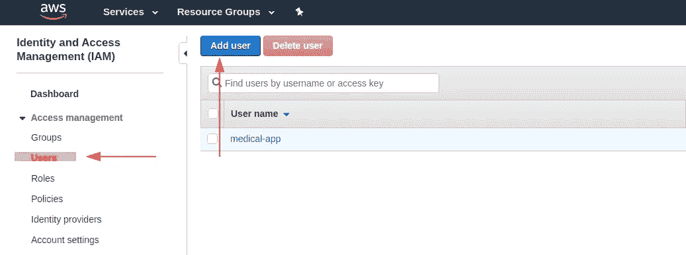

在 AWS 上创建用户

遵循以下步骤:

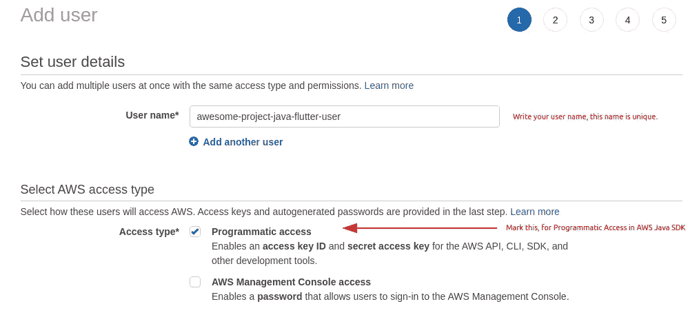

在 AWS 上创建用户—步骤 1 —用户信息

现在，在第二步，您需要选择**“Amazon S3 full access”**，因为该用户将在您的存储桶中添加/删除图像。

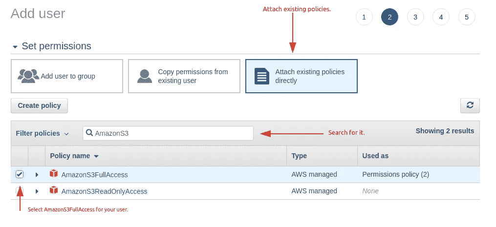

在 AWS 上创建用户—步骤 2 —权限

第 3 步，**“添加标签”**是可选的，所以，转到第 4 步，**“审核”**和**“创建用户”。**

好的，现在，在第 5 步，AWS 向我们显示您的**“访问密钥 ID”**和**“秘密访问密钥”，复制并且不要忘记这一点！**

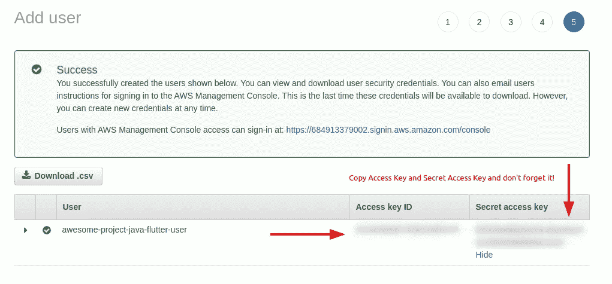

在 AWS 上创建用户—步骤 5 —访问密钥和秘密密钥

## 创建 Spring 项目

考虑到你对 Spring 框架有中级的了解，转到 [Spring Initializr](https://start.spring.io/) 并创建你的项目。

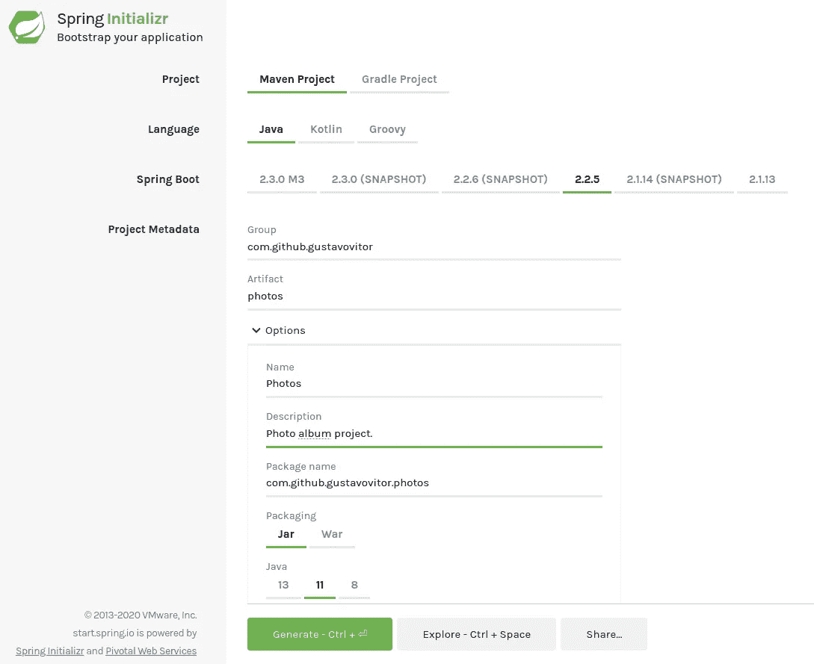

Spring Initializr —步骤 1 —项目信息

有了这些依赖关系:

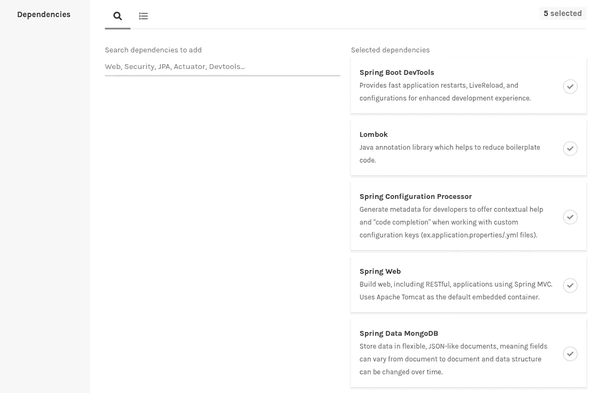

Spring Initializr —步骤 2—依赖性

现在，点击**“生成”。**

解压缩您的项目并在您最喜欢的 IDE 上打开，在我的例子中是 IntelliJ。

首先，我们需要在项目中导入 **AWS Java SDK** ，转到您的 **"pom.xml"** 并添加依赖项:

```
<!-- Maker, to create the API more faster -->
<dependency>
   <groupId>com.github.gustavovitor</groupId>
   <artifactId>maker-mongo</artifactId>
   <version>${maker-mongo.version}</version>
</dependency><!-- Amazon S3 -->
<dependency>
   <groupId>com.amazonaws</groupId>
   <artifactId>aws-java-sdk</artifactId>
   <version>${amazon-sdk.version}</version>
</dependency>

<!-- Apache Commons for FileUtils and misc. -->
<dependency>
   <groupId>commons-io</groupId>
   <artifactId>commons-io</artifactId>
   <version>${commons-io.version}</version>
</dependency>
```

属性:

```
<properties>
    <java.version>11</java.version>
    <maker-mongo.version>0.0.6</maker-mongo.version>
    <amazon-sdk.version>1.11.728</amazon-sdk.version>
    <commons-io.version>2.6</commons-io.version>
</properties>
```

好的，基本上, **AWS Java SDK** 像 API 一样工作，你需要对 AWS API 进行一次调用，然后将你的文件发送到 bucket。

在 **application.properties** 上添加这些属性:

```
amazon.s3.bucket-name=awesome-project-java-flutter
amazon.s3.endpoint=https://awesome-project-java-flutter.s3-sa-east-1.amazonaws.com/
amazon.s3.access-key=${ACCESS_KEY}
amazon.s3.secret-key=${SECRET_KEY}
```

为了更安全，在你的机器中创建两个环境变量， **ACCESS_KEY** 和 **SECRET_KEY** ，并用 IAM 信息填充它。

现在，创建一个 AmazonClientService:

```
package com.github.gustavovitor.photos.service.amazon;import com.amazonaws.auth.AWSStaticCredentialsProvider;
import com.amazonaws.auth.BasicAWSCredentials;
import com.amazonaws.regions.Regions;
import com.amazonaws.services.s3.AmazonS3;
import com.amazonaws.services.s3.AmazonS3ClientBuilder;
import org.springframework.beans.factory.annotation.Value;
import org.springframework.stereotype.Service;

import javax.annotation.PostConstruct;

@Service
public class AmazonClientService {

    // AmazonS3 Client, in this object you have all AWS API calls about S3.
    private AmazonS3 amazonS3;

    // Your bucket URL, this URL is https://{bucket-name}.s3-{region}.amazonaws.com/
    // If you don't know if your URL is ok, send one file to your bucket using AWS and
    // click on them, the file URL contains your bucket URL.
    @Value("${amazon.s3.endpoint}")
    private String url;

    // Your bucket name.
    @Value("${amazon.s3.bucket-name}")
    private String bucketName;

    // The IAM access key.
    @Value("${amazon.s3.access-key}")
    private String accessKey;

    // The IAM secret key.
    @Value("${amazon.s3.secret-key}")
    private String secretKey;

    // Getters for parents.
    protected AmazonS3 getClient() {
        return amazonS3;
    }

    protected String getUrl() {
        return url;
    }

    protected String getBucketName() {
        return bucketName;
    }

    // This method are called after Spring starts AmazonClientService into your container.
    @PostConstruct
    private void init() {

        // Init your AmazonS3 credentials using BasicAWSCredentials.
        BasicAWSCredentials credentials = new BasicAWSCredentials(accessKey, secretKey);

        // Start the client using AmazonS3ClientBuilder, here we goes to make a standard cliente, in the
        // region SA_EAST_1, and the basic credentials.
        this.amazonS3 = AmazonS3ClientBuilder.*standard*()
                .withRegion(Regions.*SA_EAST_1*)
                .withCredentials(new AWSStaticCredentialsProvider(credentials))
                .build();
    }

}
```

好的，有了这个客户端，你可以扩展他们来使用在线客户端。

现在，我们需要保存关于 AWS 图像的基本信息，为此，我们创建一个简单的域/文档:

```
package com.github.gustavovitor.photos.domain.amazon;import lombok.Data;
import org.springframework.data.annotation.Id;
import org.springframework.data.mongodb.core.mapping.Document;

import javax.validation.constraints.NotNull;

@Data
@Document
public class AmazonImage {

    @Id
    private String amazonUserImageId;

    @NotNull
    private String imageUrl;

}
```

在 Spring 之后，为它创建一个存储库:

```
package com.github.gustavovitor.photos.repository.amazon;

import com.github.gustavovitor.photos.domain.amazon.AmazonImage;
import org.springframework.data.mongodb.repository.MongoRepository;

public interface AmazonImageRepository extends MongoRepository<AmazonImage, String> {
}
```

Spring 为我们提供了一个特殊的表单数据，叫做 **MultipartFile** ，但是你不能在你的 bucket 上上传这个类型，bucket 需要一个 **java.io.File** 来代替。因此，为了进行这种转换，我们需要创建一个 Util 类，如下所示:

```
package com.github.gustavovitor.photos.util;

import org.springframework.web.multipart.MultipartFile;

import java.io.File;
import java.io.FileOutputStream;
import java.io.IOException;
import java.util.Date;
import java.util.Objects;

public class FileUtils {

    public static File convertMultipartToFile(MultipartFile file) throws IOException {
        File convertedFile = new File(Objects.*requireNonNull*(file.getOriginalFilename()));
        FileOutputStream fileOutputStream = new FileOutputStream(convertedFile);
        fileOutputStream.write(file.getBytes());
        fileOutputStream.close();
        return convertedFile;
    }

    public static String generateFileName(MultipartFile multipartFile) {
        return new Date().getTime() + "-" + Objects.*requireNonNull*(multipartFile.getOriginalFilename()).replace(" ", "_");
    }

}
```

太棒了，现在我们可以做一个服务来发送图像到 bucket:

```
package com.github.gustavovitor.photos.service.amazon;

import com.amazonaws.services.s3.model.CannedAccessControlList;
import com.amazonaws.services.s3.model.DeleteObjectRequest;
import com.amazonaws.services.s3.model.PutObjectRequest;
import com.github.gustavovitor.photos.domain.amazon.AmazonImage;
import com.github.gustavovitor.photos.repository.amazon.AmazonImageRepository;
import com.github.gustavovitor.photos.service.amazon.except.FileConversionException;
import com.github.gustavovitor.photos.service.amazon.except.InvalidImageExtensionException;
import com.github.gustavovitor.photos.service.amazon.util.AmazonClientService;
import com.github.gustavovitor.photos.util.FileUtils;
import com.github.gustavovitor.util.MessageUtil;
import lombok.extern.log4j.Log4j2;
import org.apache.commons.io.FilenameUtils;
import org.springframework.beans.factory.annotation.Autowired;
import org.springframework.stereotype.Service;
import org.springframework.web.multipart.MultipartFile;

import java.io.File;
import java.io.IOException;
import java.util.ArrayList;
import java.util.Arrays;
import java.util.List;

@Log4j2
@Service
public class AmazonS3ImageService extends AmazonClientService {

    @Autowired
    private AmazonImageRepository amazonImageRepository;

    // Upload a List of Images to AWS S3.
    public List<AmazonImage> insertImages(List<MultipartFile> images) {
        List<AmazonImage> amazonImages = new ArrayList<>();
        images.forEach(image -> amazonImages.add(uploadImageToAmazon(image)));
        return amazonImages;
    }

    // Upload image to AWS S3.
    public AmazonImage uploadImageToAmazon(MultipartFile multipartFile) {

        // Valid extensions array, like jpeg/jpg and png.
        List<String> validExtensions = Arrays.*asList*("jpeg", "jpg", "png");

        // Get extension of MultipartFile
        String extension = FilenameUtils.*getExtension*(multipartFile.getOriginalFilename());
        if (!validExtensions.contains(extension)) {
            // If file have a invalid extension, call an Exception.
            *log*.warn(MessageUtil.*getMessage*("invalid.image.extesion"));
            throw new InvalidImageExtensionException(validExtensions);
        } else {

            // Upload file to Amazon.
            String url = uploadMultipartFile(multipartFile);

            // Save image information on MongoDB and return them.
            AmazonImage amazonImage = new AmazonImage();
            amazonImage.setImageUrl(url);

            return amazonImageRepository.insert(amazonImage);
        }

    }

    public void removeImageFromAmazon(AmazonImage amazonImage) {
        String fileName = amazonImage.getImageUrl().substring(amazonImage.getImageUrl().lastIndexOf("/") + 1);
        getClient().deleteObject(new DeleteObjectRequest(getBucketName(), fileName));
        amazonImageRepository.delete(amazonImage);
    }

    // Make upload to Amazon.
    private String uploadMultipartFile(MultipartFile multipartFile) {
        String fileUrl;

        try {
            // Get the file from MultipartFile.
            File file = FileUtils.*convertMultipartToFile*(multipartFile);

            // Extract the file name.
            String fileName = FileUtils.*generateFileName*(multipartFile);

            // Upload file.
            uploadPublicFile(fileName, file);

            // Delete the file and get the File Url.
            file.delete();
            fileUrl = getUrl().concat(fileName);
        } catch (IOException e) {

            // If IOException on conversion or any file manipulation, call exception.
            *log*.warn(MessageUtil.*getMessage*("multipart.to.file.convert.except"), e);
            throw new FileConversionException();
        }

        return fileUrl;
    }

    // Send image to AmazonS3, if have any problems here, the image fragments are removed from amazon.
    // Font: https://docs.aws.amazon.com/AWSJavaSDK/latest/javadoc/com/amazonaws/services/s3/AmazonS3Client.html#putObject%28com.amazonaws.services.s3.model.PutObjectRequest%29
    private void uploadPublicFile(String fileName, File file) {
        getClient().putObject(new PutObjectRequest(getBucketName(), fileName, file)
                .withCannedAcl(CannedAccessControlList.*PublicRead*));
    }

}
```

这是我现在的项目:

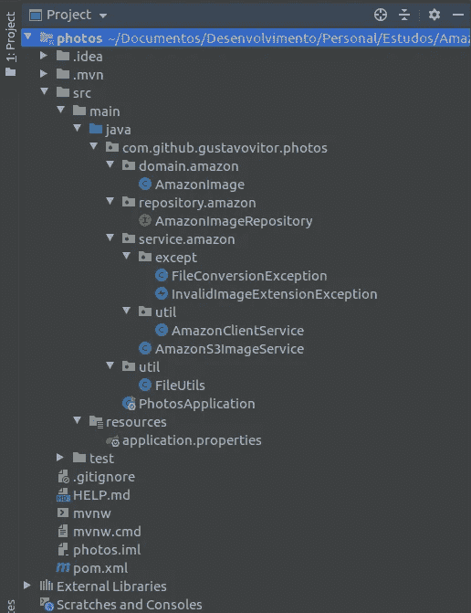

项目设计模式

如果你读了 AWS S3 的这篇文章，这就是你需要知道的一切，在这之后，我将向你展示关于[创客项目](https://github.com/gustavovitor/maker)和 Flutter(在另一篇文章中，这篇文章太长了)的代码。

## 构建一个简单的相册 API

这个 API 非常简单，我们需要一个 API 路径来上传照片，另一个路径来获取关于这些照片的信息，对吗？所以我想用[创客项目](https://github.com/gustavovitor/maker)来为我们做这件事。

[创客项目](https://github.com/gustavovitor/maker)是利用 Spring 框架加快 RestAPI 开发时间的抽象，谁？

每个被赦免的 API 都需要大量的 CRUD(创建读取更新删除)操作，这些 CRUD 会耗费时间，对我来说时间太短了。想到这一点，我为我的个人项目创建了 Maker，有了它，我可以在 10 分钟内构建一个 CRUD API，并应用所有的业务规则。

使用 [Maker Project](https://github.com/gustavovitor/maker) 你可以把所有的时间都集中在商业规则上。

所以，让我们去创建相册实体:

```
package com.github.gustavovitor.photos.domain.album;

import com.github.gustavovitor.photos.domain.amazon.AmazonImage;
import lombok.Data;
import org.springframework.data.annotation.Id;
import org.springframework.data.mongodb.core.mapping.Document;

import javax.validation.constraints.NotBlank;
import javax.validation.constraints.NotNull;
import javax.validation.constraints.Size;
import java.util.List;

@Data
@Document
public class Album {

    @Id
    private String albumId;

    @Size(max = 64)
    @NotNull
    @NotBlank
    private String title;

    // A list of AmazonImage, for this simple project, the AmazonImage is one request
    // and AlgumPhoto is another request.
    private List<AmazonImage> images;

}
```

好了，现在我们需要为相册创建一个 specification object(Maker 需求):

```
package com.github.gustavovitor.photos.repository.album.spec;

import com.github.gustavovitor.maker.repository.MongoSpecificationBase;
import com.github.gustavovitor.photos.domain.album.Album;
import com.github.gustavovitor.photos.domain.album.QAlbum;
import com.querydsl.core.BooleanBuilder;
import com.querydsl.core.types.Predicate;

import javax.management.ReflectionException;

import static java.util.Objects.*nonNull*;

public class AlbumSpecification extends MongoSpecificationBase<Album> {
    public AlbumSpecification(Album object) throws ReflectionException {
        super(object);
    }

    @Override
    public Predicate toPredicate() {
        BooleanBuilder builder = new BooleanBuilder();
        if (*nonNull*(getObject().getTitle())) {
            builder.and(QAlbum.*album*.title.containsIgnoreCase(getObject().getTitle()));
        }
        return builder;
    }
}
```

**QAlbum.class** 在哪里？QAlbum 是使用一个插件来生成的，在 pom.xml 中添加以下插件:

```
<!-- Code Generation QueryDsl -->
<plugin>
   <groupId>com.mysema.maven</groupId>
   <artifactId>apt-maven-plugin</artifactId>
   <version>1.1.3</version>
   <dependencies>
      <dependency>
         <groupId>com.querydsl</groupId>
         <artifactId>querydsl-apt</artifactId>
         <version>4.2.2</version>
      </dependency>
   </dependencies>
   <executions>
      <execution>
         <phase>generate-sources</phase>
         <goals>
            <goal>process</goal>
         </goals>
         <configuration>
            <outputDirectory>target/generated-sources/apt</outputDirectory>
            <processor>
               org.springframework.data.mongodb.repository.support.MongoAnnotationProcessor
            </processor>
            <logOnlyOnError>true</logOnlyOnError>
         </configuration>
      </execution>
   </executions>
</plugin>
```

之后，运行命令"*mvn clean install-DskipTests "*生成代码。

> 注意:您需要在 IDE 中指定生成的源代码根目录，在我的例子中，使用 IntelliJ，我需要右键单击/target/generated-sources 并将目录标记为-> Generated Sources Root。

现在，我们需要创建一个存储库:

```
package com.github.gustavovitor.photos.repository.album;

import com.github.gustavovitor.maker.repository.MongoRepositoryMaker;
import com.github.gustavovitor.photos.domain.album.Album;

public interface AlbumRepository extends MongoRepositoryMaker<Album, String> {
}
```

> 注意:扩展了 MongoRepositoryMaker，使用 Maker 项目为我们做方法。

好，现在，创建一个服务:

```
package com.github.gustavovitor.photos.service.album;

import com.github.gustavovitor.maker.service.MongoServiceMaker;
import com.github.gustavovitor.photos.domain.album.Album;
import com.github.gustavovitor.photos.repository.album.AlbumRepository;
import com.github.gustavovitor.photos.repository.album.spec.AlbumSpecification;
import org.springframework.stereotype.Service;

@Service
public class AlbumService extends MongoServiceMaker<AlbumRepository, Album, String, Album, AlbumSpecification> {
    @Override
    public void beforeInsert(Album object) {
        // Business rules here.
    }

    @Override
    public void beforeUpdate(String objectId, Album object) {
        // Business rules here.
    }

    @Override
    public void beforePatch(Album object) {
        // Business rules here.
    }

    @Override
    public void beforeDelete(String objectId) {
        // Business rules here.
    }
}
```

Maker 项目为我们做了很多方法，在 MongoServiceMaker 里面你可以看到这些方法。

好了，现在，我们需要创建资源/端点:

```
package com.github.gustavovitor.photos.resource.album;

import com.github.gustavovitor.maker.resource.MongoResourceMaker;
import com.github.gustavovitor.photos.domain.album.Album;
import com.github.gustavovitor.photos.service.album.AlbumService;
import org.springframework.web.bind.annotation.RequestMapping;
import org.springframework.web.bind.annotation.RestController;

@RestController
@RequestMapping("/album")
public class AlbumResource extends MongoResourceMaker<AlbumService, Album, String, Album> {

}
```

最后，亚马逊还有一个资源/端点:

```
package com.github.gustavovitor.photos.resource.amazon;

import com.github.gustavovitor.photos.domain.amazon.AmazonImage;
import com.github.gustavovitor.photos.service.amazon.AmazonS3ImageService;
import lombok.Getter;
import org.springframework.beans.factory.annotation.Autowired;
import org.springframework.http.ResponseEntity;
import org.springframework.web.bind.annotation.PostMapping;
import org.springframework.web.bind.annotation.RequestMapping;
import org.springframework.web.bind.annotation.RequestPart;
import org.springframework.web.bind.annotation.RestController;
import org.springframework.web.multipart.MultipartFile;

import java.util.List;

@Getter
@RestController
@RequestMapping("/amazon")
public class AmazonResource {

    @Autowired
    private AmazonS3ImageService amazonS3ImageService;

    @PostMapping("/images")
    public ResponseEntity<List<AmazonImage>> insertImages(@RequestPart(value = "images") List<MultipartFile> images) {
        return ResponseEntity.*ok*(getAmazonS3ImageService().insertImages(images));
    }

}
```

## 我们去测试一下？

首先，在 application.properties 上配置 MongoDB 访问，如下所示:

```
spring.data.mongodb.host=172.17.0.2
spring.data.mongodb.database=photo
```

并启动您的 Spring 应用程序。

> 注意:如果您得到有关 SecurityAutoConfiguration 的错误，请在 SpringBootApplication 中排除该类，这是因为 Maker 项目包含 Spring 安全依赖项。

```
package com.github.gustavovitor.photos;

import org.springframework.boot.SpringApplication;
import org.springframework.boot.autoconfigure.SpringBootApplication;
import org.springframework.boot.autoconfigure.security.servlet.SecurityAutoConfiguration;

@SpringBootApplication(exclude = SecurityAutoConfiguration.class)
public class PhotosApplication {

   public static void main(String[] args) {
      SpringApplication.*run*(PhotosApplication.class, args);
   }

}
```

首先跟我来测试一下 AmazonResource，打开你的 Postman 或者另一个应用调用 API，调用:

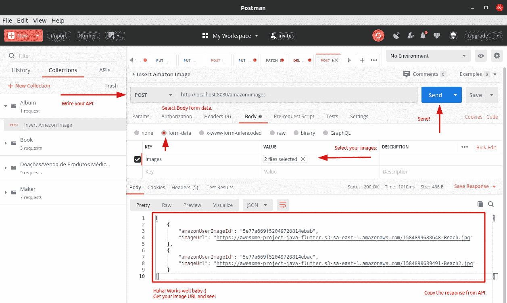

亚马逊资源响应。

**牛逼！**


开心！开心！开心！

现在就结账吧！

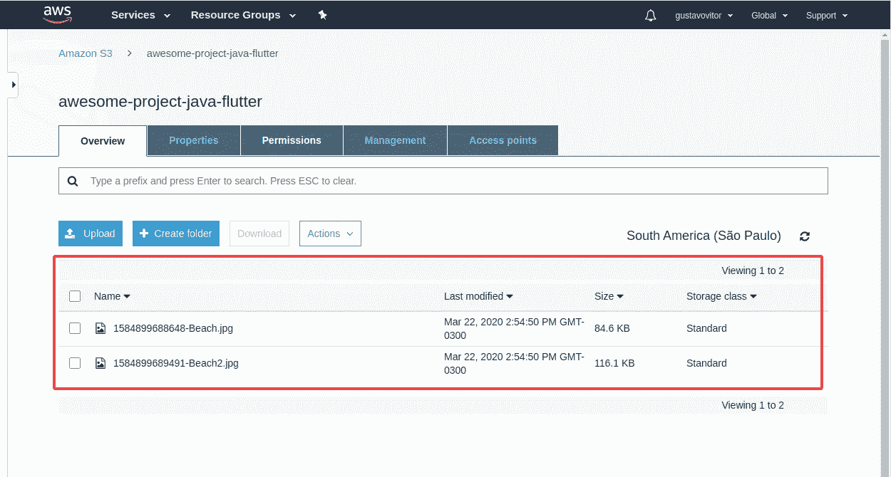

我的天啊。

好吧，好吧，冷静点！现在，您需要获得请求的响应来发出相册请求:

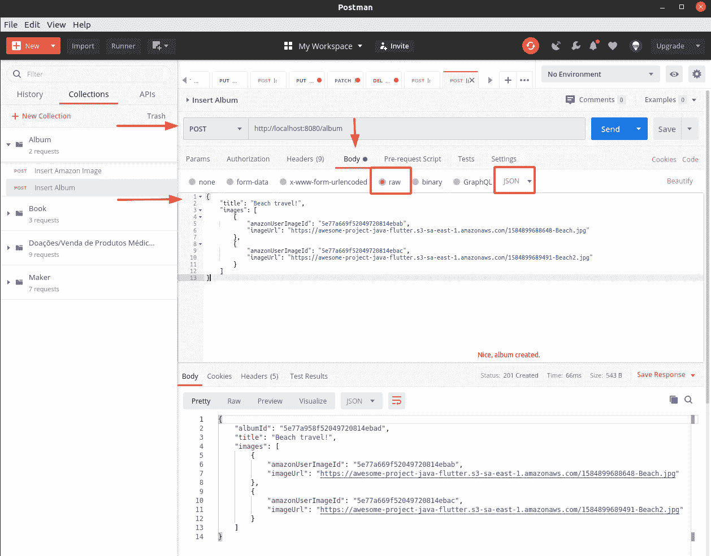

插入相册请求。

**什么？！帖子？201 创建？什么？**耶！制造者为我们做这个，我们需要做这个 CRUD 的一切，制造者项目为我们做。

您可以对您的 API 进行如下请求:

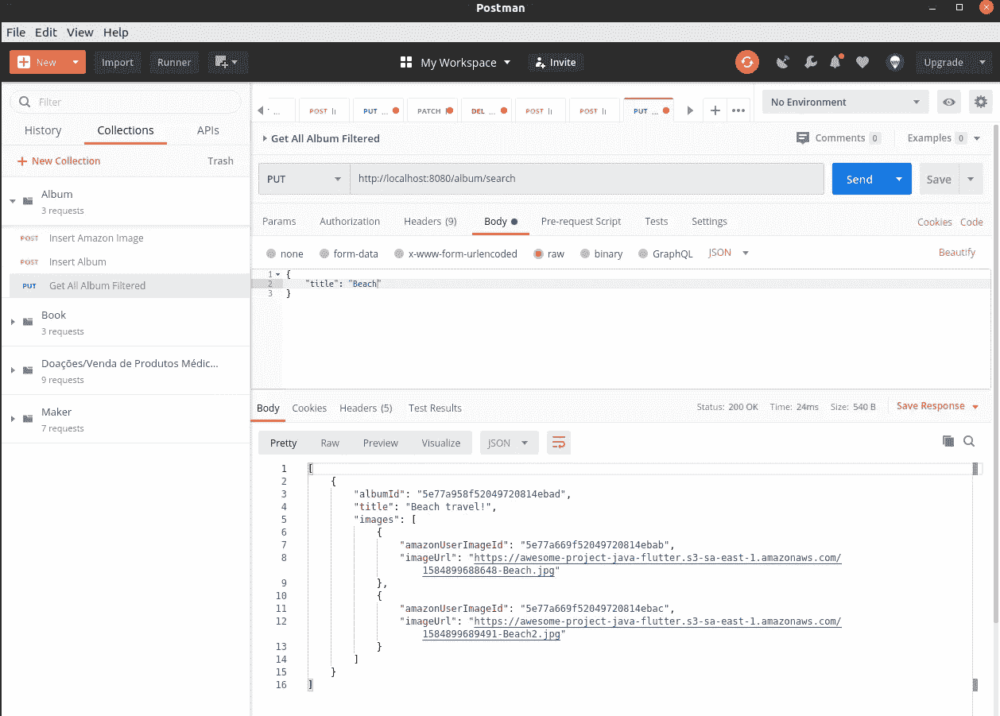

获取所有相册过滤请求。

关于 [Maker 项目](https://github.com/gustavovitor/maker)的更多信息，请阅读 GitHub 上的文档！

**看到了吗？使用 Maker 将图像发送到 AWS S3 既简单又快捷！**

如果您对此有任何疑问，请在我的 [LinkedIn](https://www.linkedin.com/in/gustavo-m-369a3011b/) 上发表评论或发送私信。

**将此 API 与一个 Flutter 项目集成，遵循另一个教训:**[https://medium . com/analytics-vid hya/creating-an-album-photo-application-using-Flutter-Java-and-AWS-S3-1d 421 c 432 b 0d](/analytics-vidhya/creating-an-album-photo-application-using-flutter-java-and-aws-s3-1d421c432b0d)

这个 API 的代码:[https://github.com/gustavovitor/photo-album](https://github.com/gustavovitor/photo-album)