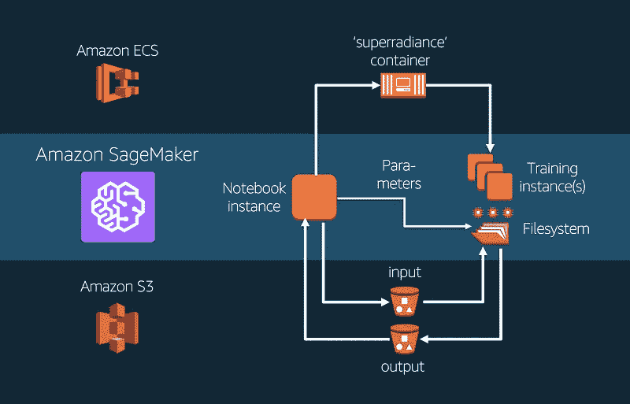
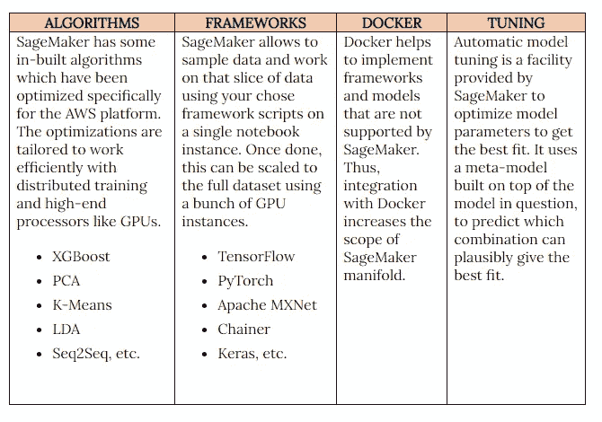

# AWS: SAGEMAKER 服务

> 原文：<https://medium.com/analytics-vidhya/aws-sagemaker-service-1639d778aa2f?source=collection_archive---------33----------------------->

**亚马逊 AI/ML 栈**

亚马逊的 Web 服务有一系列专门为人工智能和机器学习算法量身定制的优化服务。这些分为三个主要层次，如下所示:

应用服务—这些是基于领域的服务，允许我们使用简单的 API 调用，通过预先训练的模型非常快速地生成预测。

平台服务——与应用服务不同，平台服务允许我们通过优化和可扩展的选项来构建我们定制的机器学习和人工智能解决方案。我们将在本文中讨论的 SageMaker 服务就属于这一层。

框架和硬件—上面提到的层运行在框架和硬件层之上。这一层提供了广泛的优化深度学习工具，如 TensorFlow、Keras、Pytorch 和 Apache MXNet。计算选项(GPU、CPU)的选项也是可用的。

**亚马逊 SageMaker**

现在我们知道了亚马逊的 SageMaker 服务在哪里，让我们更深入地研究一下。

通用机器学习流水线具有以下主要模块:

数据提取
数据处理
数据分析
特征工程
模型训练和调整
预测生成
部署到最终用户

SageMaker 将这些模块结合在一起，使用三个主要组件:

*   **构建** —涉及从 S3、Docker 或使用的任何其他存储选项中提取数据。接下来是加工和特征工程。
*   **训练** —该组件结合了模型调整和模型训练
*   **部署** —该组件允许我们部署预测并将它们保存到首选存储位置。

这些组件相互独立，可以单独使用，甚至可以根据需要组合使用。

通过 Amazon SageMaker 控制台，SageMaker 组件的管理非常简单，它有一个非常干净的布局，使不同组件的选项易于访问和配置。

**构建**

构建阶段启动数据与管道的第一次交互。最简单的方法是生成 SageMaker 的 Notebook 实例。这不仅支持所需代码的集成，而且有助于清晰的文档和可视化。

可用于代码集成的其他选项是 Spark SDK，它通过 AWS 的 Elastic Map Reduce 或 EMR 服务实现了 Spark 管道的集成。

**列车**

在 SageMaker 中设置培训模块非常简单可行。SageMaker 培训部分的主要吸引力如下:

*   最低设置要求 —在创建一个简单的培训作业时，SageMaker 负责硬件要求和后端作业，如获取存储和实例。
*   **数据集管理** — SageMaker 负责处理流数据，并帮助管理分布式计算设施，这有助于提高训练速度。
*   **容器化**—sage maker 中的所有模型，无论是 XGBoost 或 K-Means Cluster 这样的内置模型，还是用户集成的自定义模型，都存储在 Docker 容器中。SageMaker 有效地管理和集成容器，无需用户的任何外部帮助。

**部署**

SageMaker 中有几个部署选项。使用 SageMaker 的 UI，这是一个一步到位的部署过程，在质量、可扩展性和高吞吐量设施方面提供了高可靠性。

可以使用同一个端点(部署点)部署几个模型，以便模型可以通过 SageMaker 支持的 A/B 测试。

部署工具的一个主要优势是 SageMaker 允许在零停机时间内进行升级、更新和其他修改，这是由于蓝绿色部署(当两个相似的生产环境处于活动状态时，如果一个发生故障，另一个会保持服务器正常运行)。

批量预测是生产中经常需要的，也可以使用 SageMaker 和特定的实例来执行，这些实例可以将数据从 S3 传入传出，并在 GPU 或 CPU 实例之间分配任务(根据配置)。

**附加功能层**

至此，我们已经到了亚马逊 SageMaker 基本概念的尾声。观看这一部分的演示，了解如何开始使用 SageMaker，它将很快发布。

如有任何问题或建议，您可以发邮件至[ghoshsamadrita3@gmail.com](mailto:ghoshsamadrita3@gmail.com)

或者在 LinkedIn 上 DM 我[https://www.linkedin.com/in/samadritaghosh/](https://www.linkedin.com/in/samadritaghosh/)

期待与您和您的想法建立联系！