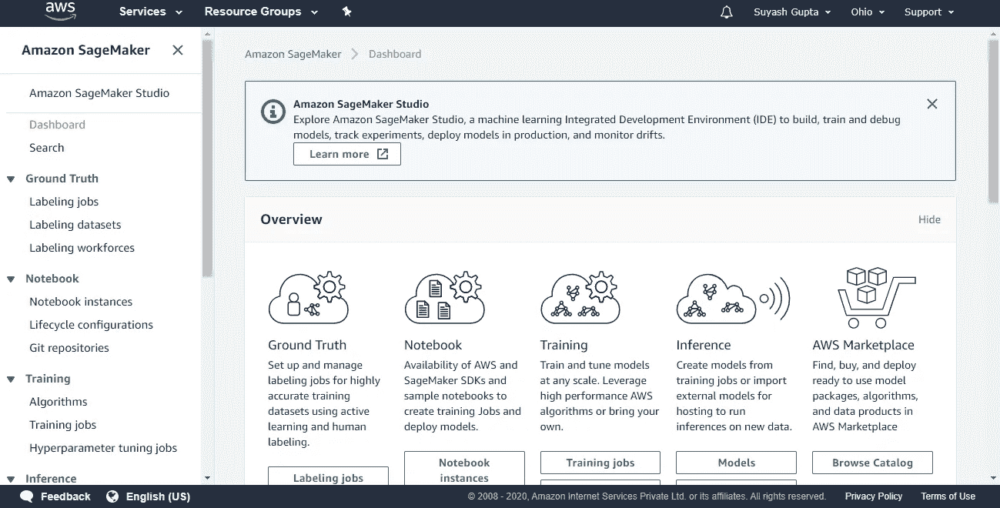
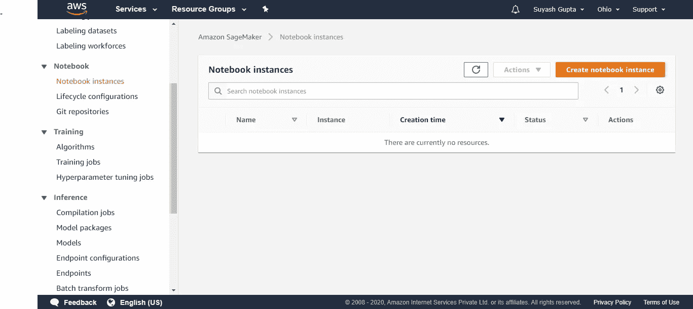
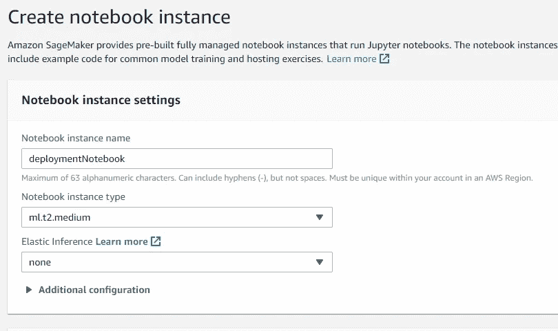
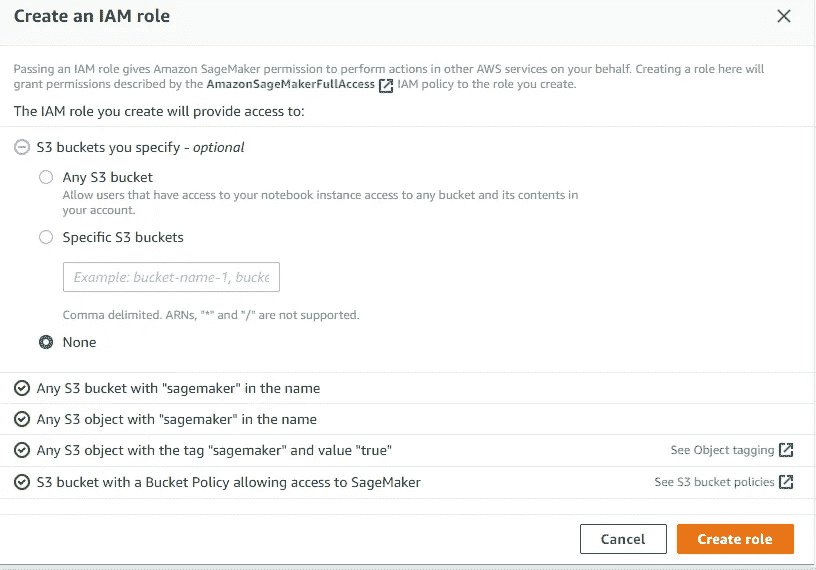
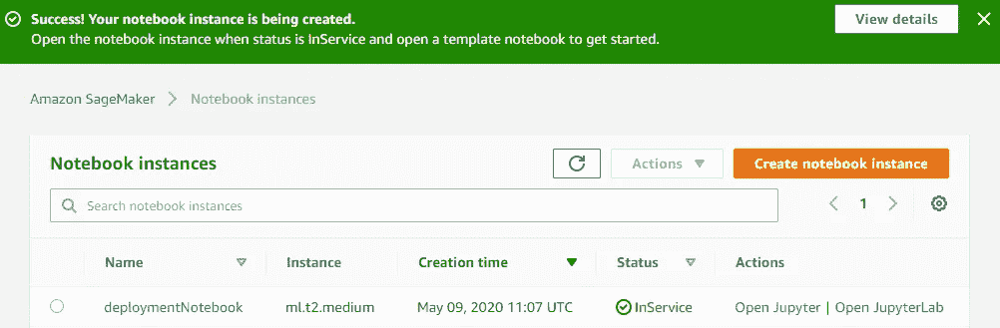

# Aws Sagemaker:培训、测试和部署模型

> 原文：<https://medium.com/analytics-vidhya/aws-sagemaker-train-test-deploy-models-97f1e45e481f?source=collection_archive---------7----------------------->

## 学习在 AWS Sagemaker 上训练、测试和部署模型


马文·迈耶在 [Unsplash](https://unsplash.com?utm_source=medium&utm_medium=referral) 上的照片

# 什么是 AWS SageMaker？

AWS Sagemaker 是一个机器学习端到端服务，解决了训练、调整和部署机器学习模型的问题。

它为我们提供了一个运行在 Amazon 托管的虚拟机上的 Jupyter 笔记本实例。我们可以在笔记本上执行所有的数据分析和预处理，以及模型开发和验证，就像在本地机器上一样。此外，它使我们能够通过创建一个可以通过任何 web 应用程序访问的 API 端点来部署我们的模型，从而获得结果。

现在不要再浪费时间了，*让我们开始吧。*

[***直接给我弄代码***](https://github.com/gitSuyash/Aws-Sagemaker/tree/master/train-test-deploy) ***。***

## 步骤 0:创建笔记本实例

我们的 Aws Sagemaker 主页如下所示:



1.  从侧面菜单栏中选择*笔记本实例*

你会到达这里



2.现在点击*创建笔记本实例*

3.为您的笔记本命名，让其他字段保持原样



4.在权限和加密中创建一个 IAM 角色，该角色告诉 Aws 我们可以访问的各种资源

我们从下拉列表中选择*创建一个新角色*

配置时，我们选择 *None* ，因为我们没有任何 S3 存储桶需要指定



5.点击*创建角色*

将其他选项设置为默认值，并点击*创建笔记本实例*

您将被引导到这里，几秒钟后，您的笔记本实例将显示状态*“正在使用中”*



6.点击*打开 Jupyter* 并开始开发。

现在让我们继续我们的主要目标，即训练和部署一个模型，从而创建一个端点作为模型和应用程序之间的接口。

***要遵循的步骤:***

1.  ***导入必要的库&加载数据到笔记本***
2.  ***准备&预处理数据***
3.  ***将处理后的数据上传到 S3 (S3 是亚马逊的仓储设施)***
4.  ***训练你的模型***
5.  ***测试型号***
6.  ***部署型号***

## 步骤 1:导入必要的库并在笔记本中加载数据

我们从导入我们需要的库以及 Sagemaker 特定的库开始。

```
import os 
import pandas as pd
import numpy as np
import matplotlib.pyplot as plt
from sklearn.datasets import load_boston
from sklearn.model_selection import train_test_split
from sklearn.metrics import mean_squared_error as mse#Sagemaker specific libraries
import sagemaker 
from sagemaker import get_execution_role
from sagemaker.amazon.amazon_estimator import get_image_uri
from sagemaker.predictor import csv_serializer
```

在继续之前，我们将把我们正在操作的当前 sagemaker 会话存储到一个变量中。这个变量将存储一些我们以后需要访问的重要信息。

```
session = sagemaker.Session()
```

传统上，我们可以通过调用 *pd.read_csv* 或 *pd.read_json* 或任何其他方法来加载数据，这取决于数据的来源或类型。

然而，为了简单起见，我们将使用 scikit-learn 中提供的波士顿数据集。

```
boston = load_boston()
```

## 步骤 2:准备和预处理数据

将我们的数据保存在数据帧中

```
X_bos = pd.DataFrame(boston.data, columns = boston.feature_names)
Y_bos = pd.DataFrame(boston.target)
```

由于我们有很多东西要涵盖，因此我们不会在这里做任何预处理，除了将我们的数据分为测试和训练数据集。

```
X_train, X_test, Y_train, Y_test = train_test_split(X_bos, Y_bos, test_size=0.30)X_train, X_val, Y_train, Y_val = train_test_split(X_train, Y_train, test_size=0.30)
```

在上面的步骤中，我们已经进一步分割了我们的训练数据以获得验证数据，从而保持对模型的过度拟合的检查。

## 步骤 3:将数据上传到 S3

下一步包括在本地保存我们的数据文件，然后将它们上传到 S3。

当我们使用 SageMaker 构造一个训练作业时，会执行一个容器来执行训练操作。该容器可以访问存储在 S3 的数据。这意味着我们需要将我们想要用于培训的数据上传到 S3。此外，当我们在测试模型时执行批量转换作业时，SageMaker 希望输入数据存储在 S3 上。我们将使用 SageMaker API 来完成这项工作。

在本地保存数据

```
data_dir = './boston_data'
if not os.path.exists(data_dir):
    os.makedirs(data_dir)X_test.to_csv(os.path.join(data_dir, 'test.csv'), header=False, index=False)pd.concat([Y_val, X_val], axis=1).to_csv(os.path.join(data_dir, 'validation.csv'), header=False, index=False)pd.concat([Y_train, X_train], axis=1).to_csv(os.path.join(data_dir, 'train.csv'), header=False, index=False)
```

请注意，在创建我们的训练和验证数据时，标签被连接为第一列。我们这样做是因为，对于训练和验证数据，假设每行中的第一个条目是目标变量。

现在，我们将使用 sagemaker 的 upload_data 方法将数据上传到 S3。数据将被上传到与当前 Sagemaker 会话相关联的默认 S3 存储桶中。

```
prefix = 'boston-ML'test_location = session.upload_data(os.path.join(data_dir, 'test.csv'), key_prefix=prefix)val_location = session.upload_data(os.path.join(data_dir, 'validation.csv'), key_prefix=prefix)train_location = session.upload_data(os.path.join(data_dir, 'train.csv'), key_prefix=prefix)
```

我们提供了一个自定义前缀，本质上是一个 S3 文件夹，以确保您不会意外干扰从其他笔记本或项目上传的数据。

## 第四步:训练你的模型

为了训练我们的模型，我们必须创建一个估计器对象，并且我们需要提供包含我们的训练代码的容器的位置。由于我们将使用 sagemaker 提供的内置 XGBoost 开源算法，因此，这个容器是由 Amazon 提供的。容器的全名很长，取决于我们所在的地区。幸运的是，Sagemaker 提供了一个有用的名为 get_image_uri 的实用方法，它为我们构造了图像名称。

为了使用 *get_image_uri* 方法，我们需要向它提供我们的当前区域，这可以从我们之前创建的 *session* 对象中获得，以及我们希望使用的算法的名称。

```
container = get_image_uri(session.boto_region_name, 'xgboost')
```

除此之外，我们还必须为我们的 estimator 对象提供 IAM 角色，这是我们在发布 notebook 实例时创建的。

```
role = get_execution_role()
```

既然我们知道了使用哪个容器，我们就可以构造估计器对象了。

```
xgb = sagemaker.estimator.Estimator(container, role,      train_instance_count=1, train_instance_type='ml.m4.xlarge', output_path='s3://{}/{}/output'.format(session.default_bucket(), prefix), sagemaker_session=session)
```

估计器对象中的各种参数定义如下:

*容器*:包含了保存我们训练代码的训练容器的镜像名称。

*角色*:要使用的 IAM 角色(在本例中是我们当前的角色)

*train_instance_count* :用于训练的实例数量或我们希望使用的虚拟机数量

*train_type_instance* :用于训练的实例类型

*output_path* :在哪里保存输出，我们的模型工件或者模型的权重

*sagemaker_session* :当前 sagemaker 会话

接下来，我们将通过在我们的估计器对象上调用 *set_hyperparameters* 方法来为我们的 XGboost 模型设置一些超参数。

```
xgb.set_hyperparameters(max_depth=5,
                        eta=0.2,
                        gamma=4,
                        min_child_weight=6,
                        subsample=0.8,
                        objective='reg:linear',
                        early_stopping_rounds=10,
                        num_round=200)
```

现在，我们将在我们的估计器对象上调用 *fit* 方法，并传递训练和验证数据在 S3 的位置。我们还需要确保 Sagemaker 知道我们的数据是 CSV 格式的。

现在，我们将在我们的估计器对象上调用 *fit* 方法，并传递训练和验证数据在 S3 的位置。我们还需要确保 Sagemaker 知道我们的数据是 CSV 格式的。

```
s3_input_train = sagemaker.s3_input(s3_data=train_location, content_type='csv')s3_input_validation = sagemaker.s3_input(s3_data=val_location, content_type='csv')xgb.fit({'train': s3_input_train, 'validation':s3_input_validation})
```

## 步骤 5:测试模型

为了测试我们的模型，我们将使用 Sagemaker 的 *BatchTransform* 技术。它告诉 sagemaker 如何分割数据、推断输出和组合结果等..

我们需要确保向 SageMaker 提供我们提供给模型的数据类型，在我们的例子中是 text/CSV，以便它知道如何序列化我们的数据。此外，我们需要确保让 SageMaker 知道如果整个数据集太大而不能一次发送到我们的模型，如何将我们的数据分割成块。

创建我们的 transformer 对象，并将其应用到我们在 S3 的测试数据中。

```
xgb_transformer = xgb.transformer(instance_count = 1, instance_type = 'ml.m4.xlarge')xgb_transformer.transform(test_location, content_type='text/csv', split_type='Line')
```

当我们要求 SageMaker 这样做时，它将在后台执行批量转换作业。因为我们需要等待这项工作的结果，然后才能继续。

我们可以使用 wait()方法从我们的批处理转换作业中获得一些输出，这让我们知道是否有什么地方出错了。

```
xgb_transformer.wait()
```

批处理转换作业完成后，生成的输出将存储在 S3 上。如果我们希望分析我们的笔记本内部的输出，我们可以使用一点笔记本的魔力，从它的 S3 位置复制输出文件，并将其保存在本地。

```
!aws s3 cp --recursive $xgb_transformer.output_path $data_dir
```

阅读和评估我们模型的输出。

```
Y_pred = pd.read_csv(os.path.join(data_dir, 'test.csv.out'), header=None)error = np.sqrt(mse(Y_pred,Y_test))
```

## 步骤 6:部署我们的模型

这是我们开发的最后阶段，我们为模型创建一个端点，以便利用 AWS 提供的各种附加服务(如 Lambda Function & AWS API Gateway Proxy)与各种应用程序进行交互。然而，这里我们的主要目标是创建一个端点。

部署模型可以作为批量转换作业的替代方法来测试我们的模型。这里，我们首先创建端点，然后简单地将测试数据传递给它。

为了部署我们的模型，我们只需要在我们的估计器对象上调用 *deploy* 方法。

```
xgb_predictor = xgb.deploy(initial_instance_count = 1, instance_type = 'ml.m4.xlarge')
```

我们需要告诉端点我们发送的数据是什么格式，以便 SageMaker 可以执行序列化。

```
xgb_predictor.content_type = 'text/csv'
xgb_predictor.serializer = csv_serializer
```

在预测器对象上调用*预测*方法来测试我们部署的模型。

```
Y_pred = xgb_predictor.predict(X_test.values).decode('utf-8')
```

存储在 Y_pred 中的预测当前存储为逗号分隔的字符串，因此我们希望将其分解为一个 NumPy 数组。

```
Y_pred = np.fromstring(Y_pred, sep=',')
```

现在，在评估上面的输出时，指标分数应该与我们在批处理转换作业中获得的分数相同。

```
Y_pred = pd.read_csv(os.path.join(data_dir, 'test.csv.out'), header=None)error = np.sqrt(mse(Y_pred,Y_test))
```

***但是端点在哪里..？？***

它在这里

```
xgb_predictor.endpoint
```

访问预测器对象的端点属性为我们提供了模型的端点，我们可以进一步使用它来与模型进行交互。

总是在工作完成后删除端点。

```
xgb_predictor.delete_endpoint()
```

****