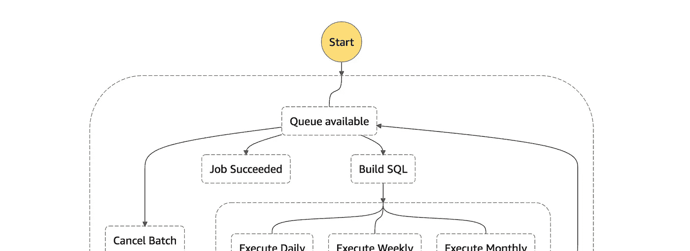
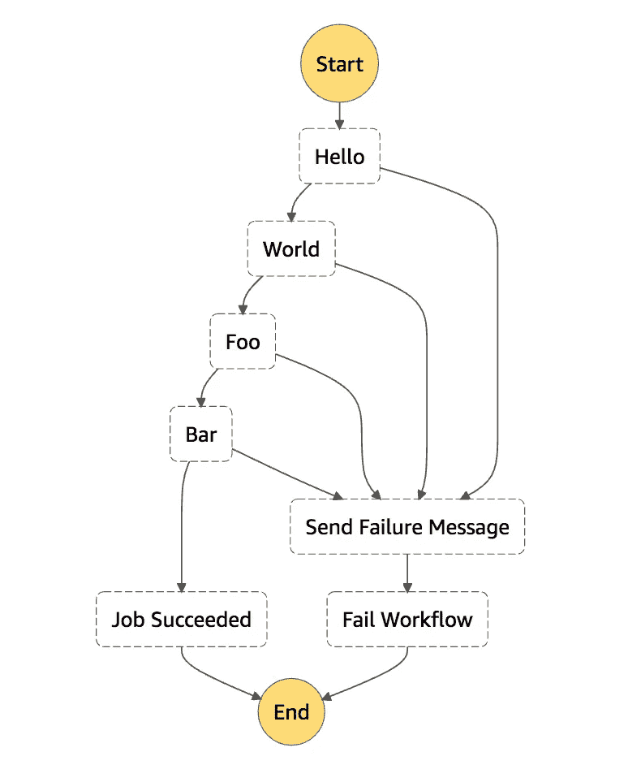
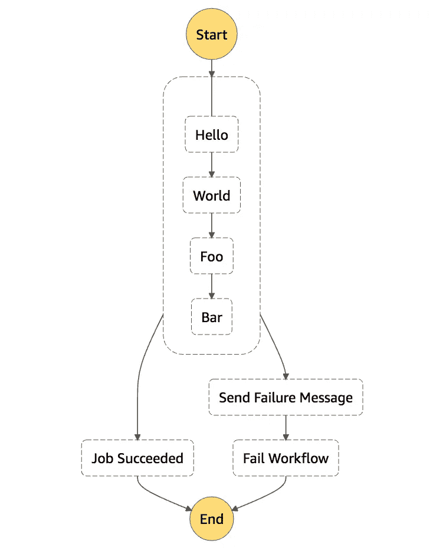
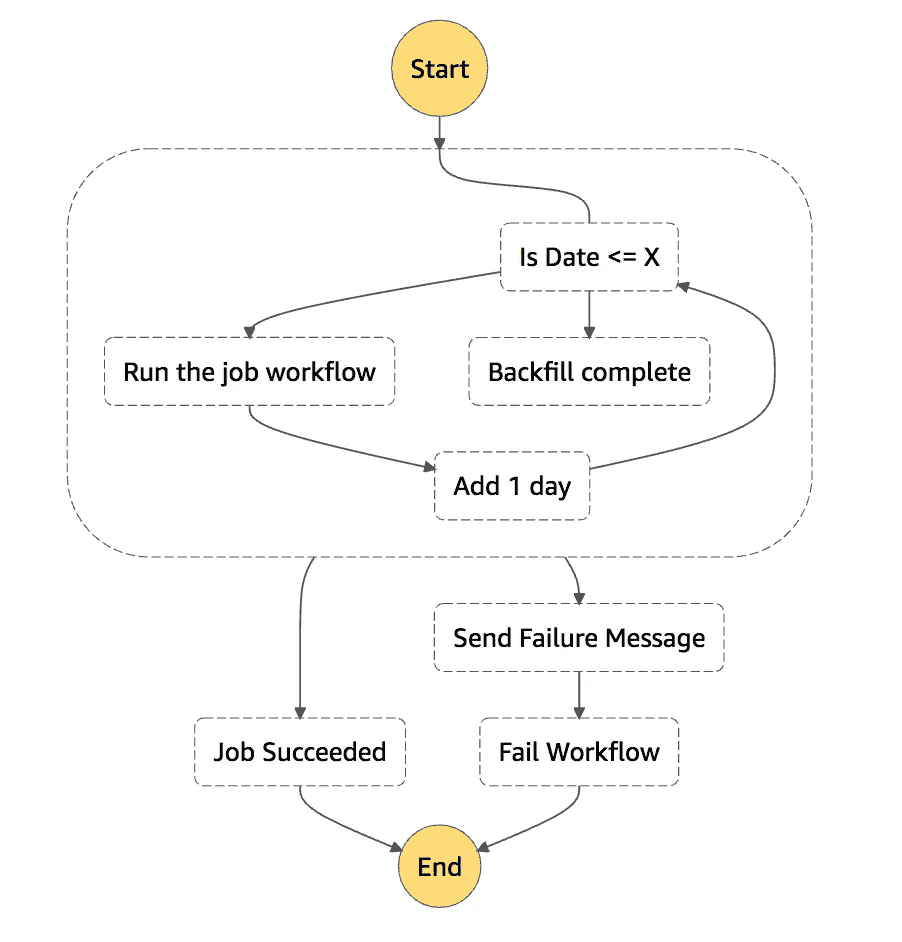

# AWS 阶跃函数技巧(第 2 部分)

> 原文：<https://medium.com/analytics-vidhya/aws-step-function-tricks-part-2-328fa3bc9e50?source=collection_archive---------5----------------------->

## 错误处理和递归工作流



AWS 步骤功能的实际应用

如果你还没有，从最初的 [AWS 步骤功能技巧](/analytics-vidhya/aws-step-function-tricks-ffe7eef81a5e)故事开始你的旅程，开始一些你能做的基本技巧。

在本文中，我们将介绍如何:

*   以更简洁的方式处理错误，保持我们的工作流程整洁
*   为基于日期的连续作业构建递归工作流

# 错误处理

所以在大多数 AWS 步骤函数状态中，您可以指定一个`Catch`部分来允许您处理错误。通常，您希望在工作流程中发生意外情况时通知自己和团队——批处理作业失败、EMR 集群死亡、Docker 容器启动失败、Lambda 错误等。因此，您的工作流可能看起来像这个(琐碎的)例子，其中每一步`Hello, World, Foo, Bar`您都在捕捉错误并在工作流失败之前通知自己。



正如你所看到的，每增加一个步骤，工作流程就会变得更加糟糕。

下面是一个步骤函数声明，它将带我们到达那里(**不要复制这个**):

```
{
  "Comment": "One handler per state",
  "StartAt": "Hello",
  "States": {
    "Hello": {
      "Type": "Task",
      "Resource": "<LAMBDA_FUNCTION_ARN>",
      "Next": "World",
      "Catch": [
        {
          "ErrorEquals": [
            "States.ALL"
          ],
          "ResultPath": "$.error",
          "Next": "Send Failure Message"
        }
      ]
    },
    "World": {
      "Type": "Task",
      "Resource": "<LAMBDA_FUNCTION_ARN>",
      "Next": "Foo",
      "Catch": [
        {
          "ErrorEquals": [
            "States.ALL"
          ],
          "ResultPath": "$.error",
          "Next": "Send Failure Message"
        }
      ]
    },
    "Foo": {
      "Type": "Task",
      "Resource": "<LAMBDA_FUNCTION_ARN>",
      "Next": "Bar",
      "Catch": [
        {
          "ErrorEquals": [
            "States.ALL"
          ],
          "ResultPath": "$.error",
          "Next": "Send Failure Message"
        }
      ]
    },
    "Bar": {
      "Type": "Task",
      "Resource": "<LAMBDA_FUNCTION_ARN>",
      "Next": "Job Succeeded",
      "Catch": [
        {
          "ErrorEquals": [
            "States.ALL"
          ],
          "ResultPath": "$.error",
          "Next": "Send Failure Message"
        }
      ]
    },
    "Job Succeeded": {
      "Type": "Succeed"
    },
    "Send Failure Message": {
      "Type": "Pass",
      "Next": "Fail Workflow"
    },
    "Fail Workflow": {
      "Type": "Fail"
    }
  }
}
```

这很棒，除了我们添加的每一个额外步骤，我们都必须在每个步骤中添加 catch 组件。这给我们看起来已经很糟糕的工作流程增加了很多麻烦。

如果我们重组它，我们可以有一个只需要捕捉一次的工作流。把它想象成一个外部异常处理程序，你通常会在你的代码中创建它，除了我们把同样的原则应用于工作流。很明显，一旦你的工作流程中有了两个以上的状态，这种效率就会提高。我们可以利用`Parallel`州的力量来得到我们想要的东西。我们想要更像这样的东西:



更好的错误处理步骤函数声明。您可以看到里面的状态更加简洁，也更容易管理，图表是。眼睛也好看多了。(**一定要抄这个**)

```
{
  "Comment": "Better error handling",
  "StartAt": "ErrorHandler",
  "States": {
    "ErrorHandler": {
      "Type": "Parallel",
      "Branches": [
        {
          "StartAt": "Hello",
          "States": {
            "Hello": {
              "Type": "Pass",
              "Result": "Hello",
              "Next": "World"
            },
            "World": {
              "Type": "Pass",
              "Result": "World",
              "Next": "Foo"
            },
            "Foo": {
              "Type": "Pass",
              "Result": "World",
              "Next": "Bar"
            },
            "Bar": {
              "Type": "Pass",
              "Result": "World",
              "End": true
            }
          }
        }
      ],
      "Catch": [
        {
          "ErrorEquals": [
            "States.ALL"
          ],
          "ResultPath": "$.error",
          "Next": "Send Failure Message"
        }
      ],
      "Next": "Job Succeeded"
    },
    "Job Succeeded": {
      "Type": "Succeed"
    },
    "Send Failure Message": {
      "Type": "Pass",
      "Next": "Fail Workflow"
    },
    "Fail Workflow": {
      "Type": "Fail"
    }
  }
}
```

无处不在的`Catch`语句🤗；我们可以添加新的步骤，而不必记住将每个步骤绑定到错误处理。

# 递归工作流

所以 AWS 说“不要这样”。就他们而言，你“应该”创建的图是一个有向无环图。这很好，除非你想重复做某件事，直到完成任务。一个很好的例子是从日期 A 到日期 b 回填一些数据。



方便的是，我们已经从本文前面的错误处理示例中提取出来，并在此基础上构建，因此任何失败都会向我们显示它们的错误😉。我们还将利用 AWS step functions(2020 年 8 月发布)的一个新功能，即`TimestampLessThanEqualsPath`比较器，来比较输入中的两个不同变量。在这里，我们可以利用一个`startDate`和`endDate`来限定我们希望递归工作流操作的范围。

```
{
  "Comment": "Better error handling",
  "StartAt": "ErrorHandler",
  "States": {
    "ErrorHandler": {
      "Type": "Parallel",
      "Branches": [
        {
          "StartAt": "Is Date <= X",
          "States": {
            "Is Date <= X": {
              "Type": "Choice",
              "Choices": [
                {
                  "Variable": "$.startDate",
                  "TimestampLessThanEqualsPath": "$.endDate",
                  "Next": "Run the job workflow"
                }
              ],
              "Default": "Backfill complete"
            },
            "Backfill complete": {
              "Type": "Pass",
              "Result": "World",
              "End": true
            },
            "Run the job workflow": {
              "Type": "Task",
              "Resource": "arn:aws:states:::states:startExecution.sync",
              "Parameters": {
                "StateMachineArn": "<STATE_MACHINE_ARN>",
                "Input": {
                  "date": "$.startDate",
                  "AWS_STEP_FUNCTIONS_STARTED_BY_EXECUTION_ID.$": "$$.Execution.Id"
                }
              },
              "Next": "Add 1 day"
            },
            "Add 1 day": {
              "Type": "Task",
              "Resource": "<LAMBDA_FUNCTION_ARN>",
              "Parameters": {
                "date.$": "$.startDate"
              },
              "ResultPath": "$.startDate",
              "Next": "Is Date <= X"
            }
          }
        }
      ],
      "Catch": [
        {
          "ErrorEquals": [
            "States.ALL"
          ],
          "ResultPath": "$.error",
          "Next": "Send Failure Message"
        }
      ],
      "Next": "Job Succeeded"
    },
    "Job Succeeded": {
      "Type": "Succeed"
    },
    "Send Failure Message": {
      "Type": "Pass",
      "Next": "Fail Workflow"
    },
    "Fail Workflow": {
      "Type": "Fail"
    }
  }
}
```

只要用一个`{"startDate": "2020-09-01T00:00:00Z", "endDate": "2020-09-09T00:00:00Z"}`启动这个工作流，你将得到 9 个工作流的迭代，每个迭代的执行时间有 1 天的差异。

这个工作流确实依赖于一个 lambda 从您的日期输入中减去 1 天来覆盖`$.startDate`，但是我将把它留给您来实现。我得给你留些有趣的事做😜

# 结论

有可能有体面的错误处理，不需要太多的努力来实现，并捕捉工作流中的所有错误。现在，您应该能够实现递归工作流，使用一个新的可用选择运算符来执行基于时间的操作。

感谢阅读。