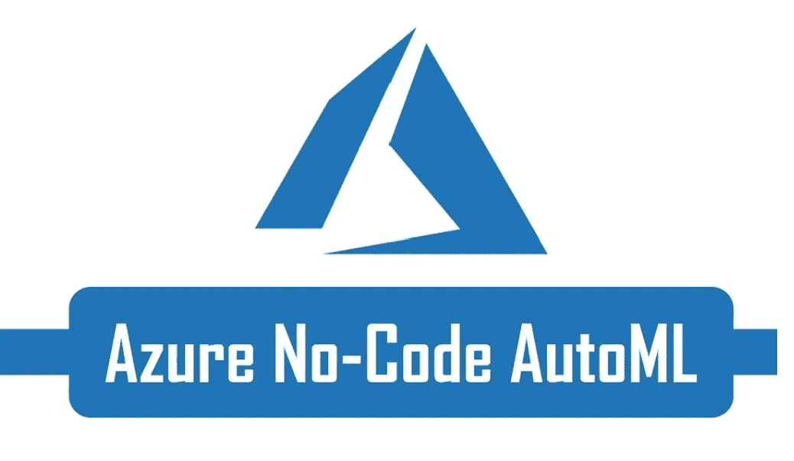

# Azure 的 AutoML:快速浏览

> 原文：<https://medium.com/analytics-vidhya/azure-automl-test-run-437959e86359?source=collection_archive---------6----------------------->

## **Azure 的自动化机器学习演练:**采用传统 Py 笔记本和 API 方法的新可视化构建器。

欢呼 AutoML 和无代码运动…

**AutoML** 是一个相对较新的东西(2-3 年)——所有主要供应商都有产品——对于一些像数据机器人这样的公司来说，这是他们的主要产品。 **Azure** 一直在嘲弄我尝试这个(用它的横幅广告)..所以我回答了…