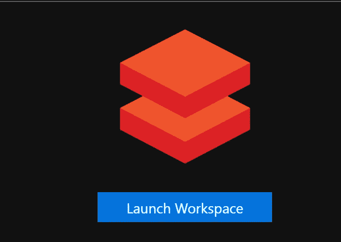

# Azure Databricks for Data Noobs 第 1 部分—基础知识

> 原文：<https://medium.com/analytics-vidhya/azure-databricks-for-data-noobs-part-1-the-basics-c6ce8e0116bc?source=collection_archive---------21----------------------->

# 介绍

我的[以前的帖子](/@farooqamahmud/pyspark-for-data-noobs-part-2-getting-shakespearean-d60dfeb4fe64)解释了如何在 Docker 中启动和运行一个本地 Spark 实例，加载数据和查询数据。我还提到这是一个很好的介绍 Spark 的方式，因为它很容易设置和运行。

当您准备升级到企业级 Spark 实例时，您会希望在 Spark 集群上加载和分析数据，因为它可以轻松处理大量数据集。然而，配置一个 Spark 集群远非小事[。](https://spark.apache.org/docs/latest/running-on-kubernetes.html)

进入 [Azure Databricks](https://azure.microsoft.com/en-us/services/databricks/) 。

阅读完本文后，您将完成以下任务:

1.  了解 Azure Databricks 的优势及其解决的问题。
2.  使用 PowerShell 和 Azure CLI 设置 Azure Databricks 环境。为什么？因为“自动化所有的事情”是好的
3.  创建 Azure Databricks 群集。
4.  创建数据块笔记本。
5.  运行笔记本代码，从 GitHub 存储库中加载数据集，进行一些基本的清理并查看数据。

# GitHub 知识库

本文提到的所有代码都位于 [GitHub](https://github.com/farooq-teqniqly/blog-databricks-for-noobs) 中。

# 数据块和 Azure 数据块

是的，这是两码事。Databricks 由创建 Apache Spark 的人在 2013 年创建。Spark 团队意识到建立一个企业级的 Spark 环境是困难的。Databricks 通过自动化抽象了很多这种复杂性。将此与云提供商相结合，您就拥有了一个 Spark 平台，它可以自动扩展、安全，并且可以连接众多服务。在 [Databricks 文档网站](https://docs.databricks.com/getting-started/overview.html)上有一个关于 AWS 的不错的 Databricks 概述。

Azure Databricks 是一个 Spark 平台，它可以自动扩展，是安全的，并且可以通过利用 *Azure* 平台连接大量服务:

*   Azure 计算资源提供了可扩展性。
*   网络资源和 Azure Active Directory 提供安全性。
*   Azure Databricks 可以与 blob 存储、数据湖、SQL 服务器、物联网中心和许多其他 Azure 服务一起工作。

[这里的](https://azure.microsoft.com/en-us/blog/a-technical-overview-of-azure-databricks/)是 Azure 环境下的一个很好的数据块概述。

# 设置数据块环境

Azure Databricks 环境由一个资源组组成。在这个资源组中，我们创建了一个 Azure data bricks*workspace*资源。Azure Databricks 工作区是您进入 Azure Databricks 环境的入口点。

**注意:**在继续之前，请从您的 PowerShell 会话登录 Azure。运行`az login`，如果您需要更改您的默认订阅，也可以选择`az account set --subscription <<your subscription name>>`。

## 创建 Azure 资源组

```
#Create resource group
$resourceGroupName = “<<name>>”
$resourceGroupLocation = “<<location>>”
az group create `
 — name $resourceGroupName `
 — location $resourceGroupLocation
```

## 创建 Azure Databricks 工作区

遗憾的是，无法使用 Azure CLI 创建 Databricks 工作区。因此，我们使用公开可用的 ARM 模板进行部署。ARM 模板的参数在下面的 PowerShell 脚本中动态创建。现在是喝饮料或吃点心的最佳时机，因为部署需要几分钟时间。

```
#Create Databricks workspace
$workspaceName = ‘<<your workspace name>>’$armTemplateUri = ‘[https://raw.githubusercontent.com/Azure/azure-quickstart-templates/master/101-databricks-workspace/azuredeploy.json'](https://raw.githubusercontent.com/Azure/azure-quickstart-templates/master/101-databricks-workspace/azuredeploy.json')$armTemplateParameters = @{
 pricingTier = @{ value = ‘premium’ }
 location = @{ value = $resourceGroupLocation }
 workspaceName = @{ value = $workspaceName }
 } | ConvertTo-Json

$tempFileName = New-TemporaryFile
[System.IO.File]::WriteAllText($tempFileName, $armTemplateParameters)try {
 az group deployment create `
 — resource-group $resourceGroupName `
 — template-uri $armTemplateUri `
 — parameters “””$tempFileName”””
} finally {
 Remove-Item -Path $tempFileName -Force
}
```

现在 Databricks 工作区正在运行，我们可以在工作区内创建一个集群。Databricks 集群执行您提交的 Spark 作业，即笔记本中的 Python 代码。

1.  在 Azure 门户中，转到 Databricks 资源并单击**启动工作区**按钮。



2.点击**集群**图标。


3.点击**创建集群**按钮。


4.为您的集群命名。将**最小工人**和**最大工人**设置分别更改为 **2** 和 **4、**。点击**创建集群。**


5.您将被重定向到集群列表页面。几秒钟后，您的集群将以*挂起*状态出现在列表中。集群的状态转换到*运行* **需要几分钟时间。**


# 旁白—“自动化所有的事情”

如果您想知道集群创建是否可以自动化，答案是肯定的！有一个基于 Python 的 Databricks CLI 可用。我有意没有在本文中提到它，因为我不想引入额外的复杂性。如果您对设置 Databricks CLI 感兴趣，请查看 Azure Databricks 文档。

# 我们在哪里？

至此，我们有了一个运行 Spark 集群的 Azure Databricks 工作区！现在，我们可以将数据湖中飞行数据文件加载到 Spark 中并对其进行分析。

# 数据基础设施

在对数据做任何事情之前，让我们看看 Azure 为我们创建的基础设施。当我第一次看到 Databricks 集群中涉及的所有资源时，我很庆幸自己不必自己设置(或者找专家来设置)。

创建群集会创建虚拟机、存储帐户和网络资源。这些资源包含在所谓的*托管资源组中。*你可以通过 Azure 门户中的 Databricks workspace 页面访问这个资源组。


注意到上图中的 *URL* 是 Databricks UI 的 URL。您可以将此 URL 加入书签，以便快速访问 UI。

单击该链接可查看托管资源组的资源。请注意，这里有两个虚拟机，因为我们在创建集群时指定了最少两个工作节点。存储帐户资源包含数据块文件系统(DBFS)。请注意，如果您尝试查看存储帐户容器，将会收到一条未经授权的消息。Azure 限制了 DBFS 的访问。


# 创建数据块笔记本

让我们创建一个 Python 笔记本，我们将使用它来进行分析。

1.  浏览至数据块用户界面。
2.  点击**工作区>创建>笔记本。**提供笔记本名称。


3.笔记本以编辑模式打开。现在我们可以编写 Python 代码来加载和探索飞行数据了！

# 运行代码

您在*单元格中编写数据块代码。*一个单元格可以包含一行代码，也可以包含数百行代码——由您决定。在单元格中运行代码时，您有多种选择。键盘爱好者可以按下 **CTRL+ENTER。**有 GUI 思想的人可以点击**运行单元**按钮。


也可以按 **SHIFT+ENTER** 运行代码。不同之处在于，该方法将执行代码并创建一个新的单元格。

# 旁白——魔法命令

您可以从 Databricks 笔记本中浏览驱动程序节点的文件系统。在单元格中运行以下代码，打印当前工作目录及其内容:

```
%sh
pwd
ls
```

您应该会看到类似如下的列表:


`%sh`命令被称为*魔法命令。*`%sh`magic 命令允许你在一个单元中运行 shell 命令。

魔法命令`%fs`允许你查看 DBFS:

```
%fs
ls
```

尽管我们创建了一个 Python 笔记本，但是您可以使用一个神奇的命令来运行 Scala 代码:

```
%scala
println(“Hello, world”)
```

markdown 有一个神奇的命令，对记录笔记本很有用。在单元格中运行以下代码，查看呈现的内容:

```
%md # Exploring the Databricks File System *(DBFS)*
```

# 从 GitHub 存储库中导入数据集

在笔记本单元格中运行下面的代码，从本文的 GitHub 存储库中下载飞行数据集。

```
import requestscsv = requests.get(‘[https://raw.githubusercontent.com/farooq-teqniqly/blog-databricks-for-noobs/master/flight_data.txt').text](https://raw.githubusercontent.com/farooq-teqniqly/blog-databricks-for-noobs/master/flight_data.txt').text)
```

现在我们需要将`csv`变量中的文本保存到 DBFS 中的一个文件中，这样我们就可以将它加载到数据框中。运行下面的代码创建一个名为`demo_data`的文件夹，并将下载的数据保存到该文件夹中一个名为`flight_data.csv`的文件中。

```
dbutils.fs.mkdirs(‘/demo_data/’)
dbutils.fs.put(‘/demo_data/flight_data.csv’, csv)
```

现在将文件加载到数据框中。注意需要`delimiter`选项，因为列分隔符不是逗号。

```
flight_data_df = (spark.read
 .format(‘csv’)
 .options(header=’true’, inferSchema=’true’, delimiter=’|’)
 .load(‘dbfs:/demo_data/flight_data.csv’))
```

# 旁白—加载文件

在企业环境中，数据将从像 blob 存储或数据湖存储这样的 Azure 服务中加载。由于增加了复杂性，我故意不想以这种方式加载文件。然而，我将在以后的文章中讨论这个场景。

# 火花执行模型

在执行了前面的代码之后，注意到输出包含数据帧的模式和关于执行代码的 *Spark 作业*的信息。


数据帧包括两个空列，`_c0`和`c_17`。让我们移除它们。这是一个在分析之前通常需要清理数据集的例子。在单元格中运行下面的代码。

```
flight_data_df = flight_data_df.drop(‘_c0’, ‘_c17’)
```

输出显示了数据框的新方案。栏目都没有了，但是 Spark 工作信息在哪里呢？

在过去的一篇文章中，我提到 Spark 会推迟查询的执行，直到您想看到数据。所以让我们来看看数据(或者无论如何是部分数据):

```
flight_data_df.show()
```

我们看到了最终的工作:


# 清除

请删除资源组以避免产生额外成本。在 PowerShell 会话中运行以下命令:

```
az group delete — name $resourceGroupName — yes
```

# 结论

如果你读到这里，感谢你的阅读！希望你对 Azure Databricks 有了一个有用的概述，并开始你自己的 Azure Databricks 之旅。