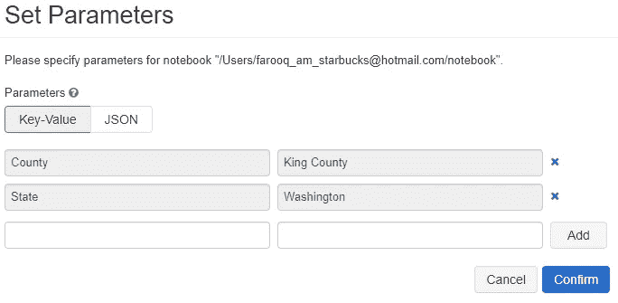

# Azure Databricks for Data Noobs 第 2 部分—将笔记本作为作业运行

> 原文：<https://medium.com/analytics-vidhya/azure-databricks-for-data-noobs-part-2-run-notebooks-as-jobs-b42c962bc02?source=collection_archive---------9----------------------->


将 Databricks 笔记本作为一项工作来运行是一种简单的方法，可以将您创建的所有优秀笔记本投入使用。我认为两个最大的好处是:

1.  作业允许您按计划运行笔记本电脑。
2.  作业在按需集群上运行。这意味着您不必仅仅为了运行作业而拥有一个持续运行的集群。这可以控制成本。

在本文中，我们将执行以下操作:

1.  创建一个笔记本，用于下载数据集、转换数据集并将转换后的数据集保存到 DBFS。
2.  以交互方式运行笔记本，并验证笔记本是否正常工作。
3.  将笔记本作为作业运行，并验证作业是否有效。

请记住，可能需要对笔记本进行更改，以使其作为作业运行。这些变化主要与资源访问有关。

# 环境设置

首先，我们需要提供我们的 Azure Databricks 工作区。和往常一样，我将使用 [Azure CLI。](https://docs.microsoft.com/en-us/cli/azure/install-azure-cli?view=azure-cli-latest)如有必要，安装 CLI，然后启动 Powershell 会话。

# 登录 Azure

运行以下命令登录并设置您的订阅:

# 创建资源组

运行以下命令创建资源组:

# 创建数据块工作空间

运行下面的脚本来创建 Databricks 工作空间。这需要几分钟才能完成。

通过运行以下脚本，验证您的资源组是否包含 Databricks 工作区:

得到这样的回应:

```
[“Microsoft.Databricks/workspaces”]
```

# 打开 Databricks 工作区

打开 Azure 门户，单击 Databricks 工作区资源，然后启动工作区。


至此，环境已经设置完毕。现在让我们创建一个笔记本！

# 创建笔记本

创建一个新笔记本，并添加下面的代码。

上面的代码从 [Azure Open Datasets 下载美国人口普查数据。](https://azure.microsoft.com/en-us/services/open-datasets/catalog/us-decennial-census-county/#AzureDatabricks)第 14 行创建一个起始数据帧。第 16 行通过 SQL 查询转换数据集。产生的数据集被写入第 27 行的 DBFS。

> 如果愿意，您可以在查询中替换您自己的县和州。如果你这样做，一定要在你的县名后面加一个空格。

# 创建集群

我们没有运行笔记本的集群，所以创建一个。这很容易在工作区 UI 中完成，但是我们也可以使用 Databricks REST API。熟悉 REST API 是一个好主意，尤其是当您需要使用笔记本进行 CI/CD 时。

# 创建不记名令牌

使用 REST API 进行身份验证需要一个承载令牌。点击右上角的账户图标，选择**用户设置。**然后点击**生成新令牌**按钮。给它起个名字，然后点击**生成。**保存该值，因为我们稍后会用到它，一旦关闭模式，令牌将无法恢复。


# 使用 API 创建集群

运行下面的 [cURL](https://curl.haxx.se/download.html) 命令创建一个名为 **demo-cluster** 的集群，其规格如下:

*   **火花 6.6 版**
*   30 分钟不活动后终止。
*   产生最少 1 个、最多 2 个工作节点。
*   驱动和工作节点运行**标准 _DS3_v2** 实例。

请确保将 Databricks 工作空间 URI 替换为您工作空间的 URI。此外，用您的不记名令牌替换不记名令牌。

响应包含集群 id。在下一步中，我们需要提供这个值。

# 使用 API 验证集群正在运行

运行以下 cURL 命令，验证输出中的**状态**显示为**运行**。确保用您的值替换不记名令牌、工作空间 URI 和集群 id。

# 运行笔记本

将笔记本电脑连接到集群并运行它。如果一切顺利，您应该会在输出中看到几个 parquet 文件。

# 我们在哪里？

至此，我们有了一个工作笔记本。然而，有一些问题:

1.  县和州是硬编码的。如果这个笔记本只能以交互方式运行，那么在运行时给用户提供指定县和州的选项就好了。如果我们要将笔记本作为一项工作来运行，这是必须的。
2.  拼花文件被写入集群上的 DBFS。您可能不想让多个用户运行这些笔记本电脑来增加负载。如果集群被删除了怎么办？我们可以做得更好。
3.  以前的拼花文件在每次运行时都会被覆盖。更合理的做法是组织文件，以便在需要时可以随时访问。

让我们依次解决每个问题。

# 问题#1:硬编码的县和州

我们可以添加一个 Databricks 小部件，允许用户在运行时指定县和州。小部件的酷之处在于，当笔记本作为作业运行时，可以提供它们的值。

编辑笔记本代码以匹配以下内容:

第 18 行和第 19 行添加了两个 textbox 小部件。第 21 行和第 22 行分别检索州和县的值。该查询在第 25 行和第 26 行使用这些值。

运行笔记本，它会失败，但两个部件会出现在笔记本的顶部。输入州和县:


再次运行笔记本，您应该会看到像以前一样的拼花文件列表。

正如我们将在后面看到的，在设置笔记本作为作业运行时，我们指定了相同的值。

# 问题#2:文件保存到群集

为了最大限度地利用数据，让我们将 parquet 文件写入 Azure blob 存储。

在之前使用的同一个 Powershell 会话中，创建一个存储帐户和一个名为 **data:** 的容器

该脚本在第 18 行输出存储键值。在将拼花文件写入容器时，我们需要提供笔记本中的键。更新笔记本，使其与下面的代码匹配。不要忘记为您的 Azure 存储帐户名和密钥提供值。

我们在第 42 行向数据块提供存储连接信息。第 47 行提供了保存拼花文件的路径。注意，这个路径看起来像一个 DBFS 文件路径。数据帧被写入行 50 上的 blob 存储器。

运行笔记本。当它完成时，您应该会看到在**数据**容器中的**人口统计数据**文件夹中的文件。

现在让我们处理最后一个问题。

# 问题#3:每次运行时文件都会被覆盖

多个用户可能会在不同的县运行这个查询。因此，按州和县组织文件是有意义的。编辑笔记本代码，使文件改为写入**数据/【州】/【县】**。

第 40 和 41 行清除了县和州名。相对路径**【州】/【县】**在第 42 行构建。

运行笔记本，你应该看到按州和县组织的文件！

# 我们在哪里？

现在，我们有了一个足够通用的笔记本电脑，它可以变成一个作业，由多个用户使用按需集群来运行。

# 创建集群池

作业运行时会创建按需集群。可以想象，创建集群需要时间，这会增加作业的执行时间。通过创建一个**集群池**，我们可以让一组集群处于备用状态。这减少了启动时间，从而减少了总的作业执行时间。

让我们使用 cURL 创建一个使用 REST API 的池。确保用您的值替换不记名令牌和工作空间 URI。

上述请求创建了一个具有以下规格的池:

*   至少两个集群将始终处于备用状态。
*   该池将最多创建四个群集。
*   每个集群都将拥有**Spark 6.6 版本。**
*   第三和第四个集群在 60 分钟的空闲后终止。
*   集群运行**标准 DS3 v2**实例。

如果一切顺利，池 id 将出现在响应中。此时，转到 Databricks 工作区 UI，单击**集群，**单击**池，**最后单击**演示池。**几分钟后，您应该看到至少两个集群实例空闲。


# 创建工作

我们终于准备好创建笔记本作业了！这次我们将使用工作区 UI，因为 Jobs API 需要一个非常冗长的主体。

1.  点击**作业。**

2.点击**创建工作。**

3.输入作业名称。

4.点击**选择笔记本。**选择要作为作业运行的笔记本。

5.点击**参数旁边的**编辑**链接。**

6.添加作业的运行时参数，即县和州。



7.点击**添加。**

8.点击**确认。**参数值显示在工作页面上。


8.点击**集群旁边的**编辑**链接。**

9.在**池**下拉菜单中，选择**演示池**。

10.在 **Databricks 运行时版本**下拉列表中，选择**运行时:6.6**

11.把工人减少到一个。

12.点击**确认**返回作业页面。

13.点击**立即运行。**

几秒钟后，作业状态显示为**正在运行。**几分钟后它应该报告**成功了。**


# 清除

请记住删除您的资源组，以避免产生额外成本:

# 总结

那真是一次冒险！您编写了一个笔记本，对其进行了调整，使其可以作为作业运行，并且实际上将其作为作业运行。希望这对您有所帮助。感谢阅读！