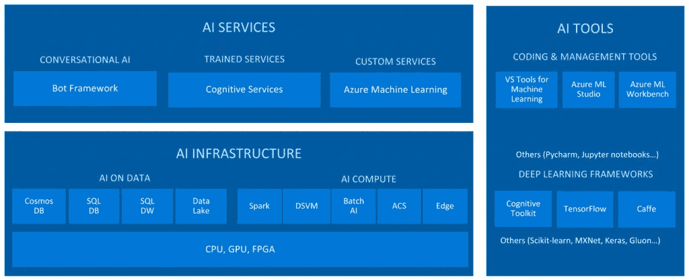
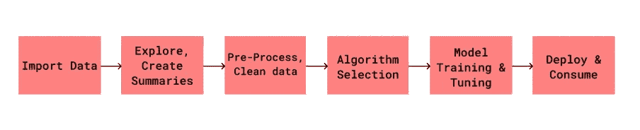
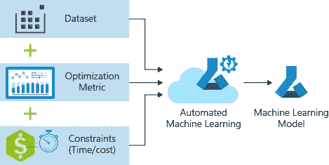

# Azure for AI/ML

> 原文：<https://medium.com/analytics-vidhya/azure-for-ai-ml-76b91274c391?source=collection_archive---------23----------------------->

## 微软人工智能工作室

# 微软人工智能平台

微软人工智能是一个强大的框架，用于开发机器学习、数据科学、机器人、物联网等领域的人工智能解决方案。

## 工作空间

机器学习服务的顶级资源。这是构建和部署模型的中心。它存储了您创建的每个模型所需的实验对象。工作区保存计算目标。

## 数据存储

Azure 存储帐户上的抽象。每个工作区都有一个注册的默认数据存储。

## 管道

这是一个用于创建和管理工作流的工具，通常包括数据操作、模型训练和测试以及部署。

致谢:微软

# Azure ML 服务

带来*集装箱化和自动化*的力量。

**趣闻**:我们都用 **Jupyter** 笔记本。
但是它是怎么得名的呢？
**Ju-Julia、Py-Python、R** 等语言都用在了笔记本上，Jupyter 笔记本就是专门为这些语言打造的。

# ML Studio Classic 的典型工作流程

*   视觉拖放发生在这个平台上。

## 数据源

*Azure Blob 存储、使用 HTTP 的 Web URL、使用 HiveQL 的 Hadoop、Azure 表存储、Azure SQL 数据库、AzureVM 上的 SQL server、通过数据管理器和 OData 的内部 SQL Server 数据库*是微软 Azure 提供的服务。

## **数据格式**

*   **。csv** —带标题的逗号分隔值
*   **.nh.csv** —逗号分隔的值，不带标题
*   **。tsv** —带标题的制表符分隔值
*   **.nh.tsv** —不带标题的制表符分隔值
*   **。txt** —纯文本
*   **。SVM light**—[SVM light](http://svmlight.joachims.org/)
*   **。arff** —属性关系文件格式
*   **。zip**
*   **。RData** — R 对象或工作空间

## 探索，创建摘要

要记住的事情。

*   培养对数据的理解。
*   哪些特征表现出独立自主的行为。
*   这些特征是否包含异常值。
*   如果用于训练模型，是否存在仅增加噪声的特征。
*   有趋势-模式或偏见吗？
*   属性缺少值的原因。
*   哪些价值观是稀有的，为什么？
*   你能看到任何不寻常的图案吗？如何解释它们？
*   每个集群内的观测值如何彼此相似？
*   独立集群内的观测值彼此有何不同？
*   确定缺失的值
*   求最小值和最大值。
*   相关图。
*   箱线图或确定偏斜度或散点图。

**条形图:** *分类变量的分布* 这在绘制*离散值时很有用。*

**直方图** : *连续变量分布*
-负偏斜
-正偏斜

## 准备和清理数据

*   用鼠标代替。
*   使用概率 PCA 替换。
*   自定义替换。
*   替换为平均值、众数、中位数。
*   删除整行、整列。

**小鼠** : *通过链式方程进行多重插补* 在填充缺失值之前，使用数据中的其他变量有条件地对缺失数据的每个变量进行建模。

**PCA** : *主成分分析* 通过使用线性模型替换缺失值，该模型分析列之间的相关性，并估计数据的低维近似值，由此重建完整的数据。

## 预处理

使用标准或高级预处理自动缩放或规范化，以帮助算法顺利进行。

*丢弃高基数或无方差特征，估算缺失值，
生成附加特征，变换&编码，单词嵌入，聚类距离*

## 交叉验证

*   使用更多的测试数据
*   评估数据集和模型。
*   概化为新数据集。

## 模型部署

部署用于消费的模型！

**支持的目标开发环境有:**

*   *码头工人图像*
*   *Azure 容器实例*
*   *Azure Kubernetes 服务*
*   *Azure 物联网边缘*
*   *现场可编程门阵列*

**对于部署，您需要。**

*   环境文件说明符包依赖项。
*   配置文件请求容器所需的资源。
*   告诉自动 ML 调用模型的分数脚本文件。

# 自动化 ML

模型创建通常非常耗时。
每当我们训练一个模特，都会有以下问题。

*   这能解决数据科学的挑战吗？
*   我如何设置完美的 hypermeter 值？
*   这种模式会是解决问题的最佳模式吗？
*   如何加快模型和超参数值选择过程？

## 自动化 ML 技术

致谢:微软

这在并行管道中创建了许多尝试不同算法和参数的模型。一旦达到实验中定义的退出标准，它就会停止。