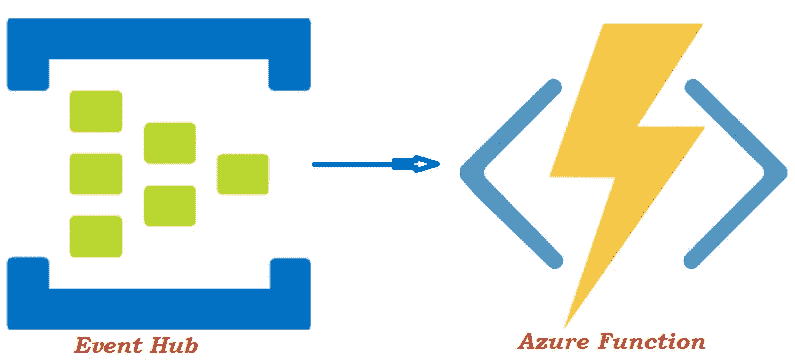

# Azure 功能和活动中心

> 原文：<https://medium.com/analytics-vidhya/azure-functions-event-hub-2603e8804f73?source=collection_archive---------1----------------------->



在我的上一篇文章中，我解释了什么是 Azure Function 及其组件。在本文中，我们将讨论什么是事件中心，以及如何使用 Azure 函数处理来自事件中心的事件。代码将在 Python 中。

要查看我之前关于 Azure 函数的文章，请点击下面的链接:

[](/@maheshwari.mohit/microsoft-azure-functions-e1d8acd246a1) [## 微软 Azure 函数

### 什么是 Azure 函数？

medium.com](/@maheshwari.mohit/microsoft-azure-functions-e1d8acd246a1) 

> **什么是活动中心？**

Azure Event Hub 是一个大数据流平台&事件摄取系统。它基于发布-订阅模型。类似阿帕奇卡夫卡。Event Hub 提供低延迟的分布式流处理平台，并与 Azure 内外的数据和分析服务无缝集成。

> **关键术语&活动中心的组成部分。**

1.  ***事件中心名称空间→*** 这些是包含或存储事件中心的容器。也称为阿帕奇卡夫卡式的话题。单个事件中心命名空间可以存储多个事件中心。
2.  ***Event Hub →*** 这些是记录发布的存储。它类似于卡夫卡中的主题。它由我们可以在 Azure Portal 上创建事件中心时定义的分区组成。
3.  ***事件数据→*** 它包含事件的主体，是一个二进制流。事件以二进制形式存储在分区中。
4.  ***发布者→*** 任何向事件中心发送/发布数据/事件的实体。Publisher 可以使用两种类型的协议来发送/发布数据，即 HTTP 和 AMQP。对于少量数据，使用 HTTP，对于大量数据，使用 AMQP。
5.  ***分区→*** 分区就像事件中心的一个大块，发布者将在这里发布事件。在 Event Hubs 中，即使消费者已经读取了数据，分区也会保留数据。此外，它还维护一个可自定义的保留期，并且不可能手动删除事件。
6.  ***消费群体→*** 消费群体就像是一个事件的观点枢纽。单个消费者群体可以由不同的消费者消费，每个消费者都有单独的事件视图，并且可以相应地以他们自己的速度和偏移量消费。一个活动中心可以有多个消费者群体。
7.  ***捕获数据→*** 创建活动中心时，我们可以启用捕获数据选项。如果我们希望在以后的某个时间点，甚至在保留期结束后，在事件中心保留生产者发送的事件，这个选项是很有帮助的。

在本帖中，我们将看到如何查看代码和部署 azure 函数，只要事件中心的生产者发布任何事件，就会触发该函数。然后，将使用函数中的输出绑定或实际代码将该事件数据存储到 blob 存储中。

**先决条件→**

*   Azure 功能核心工具
*   Azure CLI
*   计算机编程语言
*   一个函数应用程序[在本地系统上][查看我以前的一篇关于如何创建函数应用程序的文章]

> 遵循以下步骤→

1.  **打开您在本地系统创建的功能 app。**
2.  **打开 local.settings.json 文件**

```
{"IsEncrypted": false,"Values": {"FUNCTIONS_WORKER_RUNTIME": "python",**"AzureWebJobsStorage"**: **[Paste the Storage account connection string which is linked with your Azure function that you have Created on Azure Portal]**,"FUNCTIONS_EXTENSION_VERSION": "~2",**"receiverConnectionString":** **[Paste the Endpoint Connection String of the EventHubNamespace here in double quotes and remove these brackets.],****"MyStorageConnectionString": [Paste the Endpoint Connection String of the blob storage account here in double quotes and remove these brackets.]**},"ConnectionStrings": {}}
```

3.**打开 function.json 文件。**

在这个文件中，我们将编写代码将 azure 函数与事件中心绑定，这样它将在生成器发布任何新事件时自动运行，并将为 blob 存储指定输出绑定。

```
{"scriptFile": "__init__.py","bindings": [{**"type": "eventHubTrigger"**,"name": "events","direction": "in",**"eventHubName"**: **[Enter the name of your event hub in double quotes and remove these brackets.]**,**"connection":** **"receiverConnectionString"**,"cardinality": "many","consumerGroup": "$Default","dataType": "binary"},
{
**"name": "outputblob"**,       
"type": "blob",       
**"path": [Enter the path of the folder where you want to store the data in double quotes and remove these brackets.]**,       
**"connection": "MyStorageConnectionString"**,       
"direction": "out"}]}
```

*   在上面的代码中,`"type":"eventHubTrigger"`指定了 azure 函数在事件中心的触发器。
*   `"eventHubName":"Value"`指定事件将被接收到哪个事件中心，以便 azure 函数将被触发。
*   确保 local.setting.json 文件中存在“连接”的值，即`"connection":"receiverConnectionString"`。如果您向上滚动并检查 local.setting.json 的代码，您会看到*“receiver connection string”键出现在其中。*
*   `"name":"outputblob"`是 blob 存储的输出绑定的名称，将在代码中使用它来引用输出 blob。您可以给出任何名称，只要确保在代码中使用相同的名称即可，例如 __init__。py 文件。
*   `"path":"Value"`这将是你想要存储由函数处理的输出数据的文件夹或目录的路径。
*   确保 local.setting.json 文件中存在“connection”的值，即`"connection":"MyStorageConnectionString"`。如果您向上滚动并检查 local.setting.json 的代码，您会看到*“MyStorageConnectionString”键出现在其中。*

4.**打开 __Init__。py 文件**

以下代码将在生产者发布任何新事件后立即触发，并使用输出 blob 绑定变量*“output blob”*将事件数据放入输出 blob 中

> **注意→** 这里我考虑的是，生产者发布到事件中心的事件是 json 格式的。

```
import logging 
import azure.functions as func def main(events: List[func.EventHubEvent],outputblob: func.Out[func.InputStream]):   

    for event in events:
        event_data = event.get_body() logging.info(event_data) my_json = event_data.decode('utf8').replace("'", '"') event_data_json = json.loads(my_json)

        outputblob.set(event_data_json)
```

> **注意→** 上面代码的问题是输出的 blob 与 *function.json* 文件中提到的特定路径相关联。所以每次这个函数触发时，数据都会被重写到同一个文件中。此外，非常少的定制是可能的。如果你需要更多的定制方式，然后检查第 5 步。

5.**从 __init__ 中删除之前的代码。复制文件并粘贴下面的代码。**

```
import logging
import azure.functions as func
from azure.storage.blob import BlobServiceClient
import uuiddef main(events: List[func.EventHubEvent]):

    blob_service_client =BloBlobServiceClient.from_connection_string
       (conn_str=***[Enter the Endpoint connection string for the blob storage account in double quotes and remove these brackets.]***) try:
        container_client = blob_service_client.getContainer_client("myContainer") except:
        container_client = blob_service_client.create_container("myContainer") for event in events:
        event_data = event.get_body()
        logging.info(event_data)
        my_json = event_data.decode('utf8').replace("'", '"')
        event_data_json = json.loads(my_json)    

        container_client.upload_blob(name= uuid.uuid4(), data=event_data_json) 
```

6.**保存所有文件。**

7.**运行命令** `**func start**` **并享受🙂。**

> **感谢您阅读本教程。我希望你喜欢并理解了什么是 event hub，以及如何使用它作为 azure 功能的触发器。**