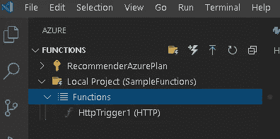

# Azure 虚拟函数—第 1 部分— http 触发器

> 原文：<https://medium.com/analytics-vidhya/azure-functions-for-dummies-part-1-http-trigger-a95cd000bc62?source=collection_archive---------6----------------------->

这是我计划撰写的关于 Azure 函数的系列文章的第 1 部分。从标题来看，这是一本傻瓜指南。不久前，我也是一个拥有 Azure 功能的傀儡。我写这个系列的动机是，当我迈出第一步时，微软文档中的文档严重不足。

我希望通过这个系列分享我的学习。在整个系列中，我将使用 VS 代码作为我的 IDE

顺便说一句，如果你有兴趣阅读关于 Azure 函数与代码超级高效的文章，这是一个很好的工具，请**看看我关于 VS 代码的文章**。相信我 VS 代码真的有很强的冲击力。

 [## Visual Studio 代码是有史以来最酷的 IDE 吗

### 我可能对 VS 代码有点固执己见。这是经过多年的开源和可能鄙视微软…

medium.com](/@rajesh.r6r/is-visual-studio-code-the-coolest-ide-ever-80a59579612f) 

**对“无服务器”上未发起的发起。**

无服务器计算是一种云服务产品，通过它您可以开发和部署代码，而不必担心基础设施需求。坚持主题，Azure Functions 是微软无服务器计算产品的变种。

无服务器计算不应该与 Docker 容器混在一起。如果你仍然有困惑，请阅读这篇文章。

 [## 无服务器 vs . Docker——2019 年选什么？

### 让我们从云计算呈指数级增长这一事实开始。企业不断地从…

medium.com](/techmagic/serverless-vs-docker-what-to-choose-in-2019-80cb80f4b680) 

回到 Azure 函数。让我们看看 Azure 函数是什么意思？

Azure 函数是事件触发器和基于事件触发器执行的后续代码的组合。

**什么是事件触发器？**

事件触发器是被配置为调用 Azure 函数的任何事件。(以下是 Azure 函数中支持的事件类型)

可以触发 Azure 功能的事件类型

**如何配置事件触发器？**

让我们通过 http 事件的事件触发器来理解这一点。

您可以使用一个基于 json 的配置文件来实现这一点，该文件应该与您的函数一起提供。

让我们观察文件并了解配置。

可以看到还有**另一组类型、方向和名称**参数。假设我们必须配置一个 http 响应来回复一个传入的请求。它只是有助于做到这一点。

**好的。我已经配置了事件。当这个事件被触发时，将被触发的函数代码在哪里？**

让我们看一个简单的 http-trigger 例子。

**注意，该文件的命名方式应该与在 function.json 文件中定义的方式相同。如果您还没有观察到 function.json 中的*“script file”*参数，那么现在这样做是一个好主意。**

让我们来理解代码。

**要做的重要观察:**

1.  观察接受 req 对象的 main 方法。这是我们在配置文件中定义的 req 对象。
2.  观察 req 对象绑定到 func 的方法。HttpRequest
3.  观察 func.HttpResponse 的结果。

**功能工作:**

该函数的工作方式与 python 中的 flask 方法相同。它执行以下操作

1.  打印日志记录语句
2.  评估传入的 **GET** 请求是否有一个名为 **name** 的参数
3.  如果 name is 参数不可用，它检查**请求是否包含**一个 **json 有效载荷**。
4.  如果 json 可用，它提取 json 有效负载中可用的**名称**参数。
5.  如果提取了 name 参数，它将返回一个提取了名称的 http 响应
6.  否则，它会返回一个响应，表示在您的请求中找不到 name 参数。

**如何创建和调试该功能？**

虽然你甚至可以在 notepad ++上编写这些代码，并将其推送到 Azure，但这很麻烦。但是如果你使用 Visual Studio 代码，这将是轻而易举的。让我们看看你怎么做。

**创建功能的步骤:**

1.  进入 VS 代码窗口中的 VS 代码扩展市场，搜索 Azure Functions Extension，然后点击 install。

2.一旦这是成功的，你应该能够在你的活动栏看到一个 Azure 图标，点击它可以看到 Azure 功能

3.我创建了一个名为 Sample Functions 的本地 Azure Functions 项目。您可以通过点击工具栏上的文件夹图标来创建一个文件夹

4.创建了 functions 项目后，单击 Functions 图标以获得以下窗口，您可以在其中选择 HTTP 触发器作为您的事件。

5.现在，您将在本地项目中看到一个名为 HttpTrigger1 的新函数。

6.单击 HttpTrigger1 打开内容。现在可以看到 function.json 和 __init__。py 已经为你准备好了。

**调试功能的步骤**

7.现在，您可以开始调试了。单击运行并开始调试。

8.在开始调试时，您将看到 Azure Functions 环境在终端窗口中如下初始化。

9.如果您遵循了所有的步骤，那么在日志的末尾，您应该能够看到以下带有 URL 的消息。

**考验的时候到了:**

为了测试 http 方法，我使用了 Postman。这是一个很好的工具。

 [## postman | API 开发的协作平台

### 进行任何种类的 API 调用——REST、SOAP 或普通 HTTP——并轻松检查最大的响应。邮递员也有…

www.google.com](https://www.google.com/url?sa=t&rct=j&q=&esrc=s&source=web&cd=&cad=rja&uact=8&ved=2ahUKEwi59dugnZjqAhVrzzgGHR8EBnoQFjAAegQIARAC&url=https%3A%2F%2Fwww.postman.com%2F&usg=AOvVaw05sjAjE_hbftSn2Ii8YG6N) 

确保将 name 变量作为 json 传递到这里，并点击 send 按钮

注意:将方法检查为 POST 或 GET。

如果一切顺利，您应该会看到函数的响应。

好的。我测试过这个调试和测试是本地的？接下来呢？

现在，只需点击箭头按钮，就可以将该功能部署到 Azure Cloud。

**注意:在你这样做之前，请注册 Azure Credentials，它提供 30 天 200 美元的信用。**

**后思:**

1.  我们现在已经学会了如何根据请求做出响应。简而言之，网页不就是这样吗？
2.  我们有没有可能像用 Flask 服务一样服务一个简单的网页？
3.  使用一项功能的好处是你只需为你所使用的功能付费。。

我希望在下一篇文章中设计一个通过 Azure 函数提供服务的简单 web 应用程序。

**请关注此空间了解更多信息，并分享您对云解决方案架构空间中您希望看到的任何其他特定主题的想法。**