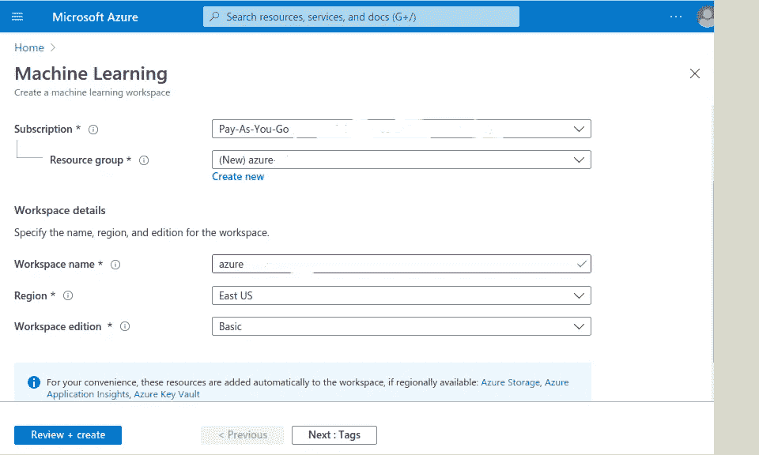

# Azure 机器学习服务第 1 部分:创建工作空间

> 原文：<https://medium.com/analytics-vidhya/azure-machine-learning-service-part-1-80e43e4af71b?source=collection_archive---------13----------------------->

> 在一系列的博客文章中，我计划写下我使用 Azure 机器学习服务培训、部署和管理模型以及运行管道的经历。这是第 1 部分，我将引导您在 Azure ML 服务中创建工作空间

信用:微软 Azure ML

# **关于 Azure 机器学习服务**

Azure 机器学习服务是微软基于云的平台，用于培训、部署、自动化、管理和跟踪 ML 模型。除了传统的基于代码的模型构建之外，它还可以通过使用 [Designer](https://docs.microsoft.com/en-us/azure/machine-learning/tutorial-designer-automobile-price-train-score) 中的拖放组件来构建模型。Azure ML 服务使我们的工作非常容易维护开发的模型，也有助于在较低(QA，Unit)和较高(Prod)环境中轻松部署作为 API 的模型。它与 Azure 中的各种组件集成在一起，如 **Azure Kubernetes Services** 、 **Azure Databricks、Azure Monitor、Azure Storage accounts、Azure Pipelines、MLFlow、Kubeflow** 等，以执行各种活动，这些活动将在以后的帖子中讨论。

# **为什么选择 Azure 机器学习服务**

在建立模型的过程中，人们需要摆弄各种超参数，使用各种技术。如果数据集很大，还需要扩展用于训练模型的资源。将您的模型开发和部署带到云使您的工作变得容易。特别是，Azure 机器学习服务有以下优势。

1.  简化模型管理
2.  自动化机器学习简化了模型构建
3.  通过内置集成，根据需要将培训扩展到 GPU 集群或 CPU 集群或 Azure Databricks
4.  使用 Azure Kubernetes 服务或 Azure IOT edge 将模型部署到生产中非常简单。

# Azure 机器学习服务条款

让我列出您在使用 Azure 机器学习服务时遇到的一些常见术语。

1.  **工作区:**工作区是 Azure ML 的高级资源。它为使用 Azure ML 服务中的各种组件提供了一个集中的工作场所。
2.  **实验:**实验是根据指定的脚本进行的一组运行。
3.  **运行:**模型(脚本)的每次运行都被称为在 Azure ML 工作区中运行。例如，假设您正在尝试构建一个模型来对 MNIST 数据集中的图像进行分类。实验-1 将是 ResNet-18 模型，其中您将使用不同的超参数集进行不同的运行。实验 2 将是一个 VGG-16 模型，根据所选的超参数集有不同的运行方式。
4.  **计算目标:**计算目标是用于训练和推理作业的机器。它可以是 GPU 集群或 CPU 集群或 Azure Kubernetes 服务集群或 Azure Databricks
5.  **数据存储:**数据存储是用 Azure ML 存储数据的存储空间的术语。数据存储可以使用 Azure blob 容器或 Azure 文件共享作为后端存储。每个工作区都有一个默认的数据存储，也可以添加数据存储。

下面是 Azure 机器学习工作区的分类

学分:微软 Azure ML

# 通过 Azure 门户创建 Azure 机器学习工作区的步骤

1.  在 [Azure 门户](https://portal.azure.com/)中登录您的 Azure 帐户
2.  点击**‘创建资源’**按钮，如下图所示

**点击带有“创建资源”文本的“+”按钮**

3.搜索机器学习，如下图所示

**搜索机器学习**

4.点击创建按钮创建 Azure 机器学习工作区

**点击创建按钮**

5.输入如下图所示的详细信息，然后单击“审查和创建”

6.成功部署您对 Azure ML workspace 的请求后，请登录到 [ML 门户](http://ml.azure.com/)并从上面选择详细信息，包括在上面步骤中创建的工作区，如下图所示和“开始”按钮。

7.你应该可以看到下面的 Azure 机器学习服务的所有组件页面。

我将以此结束这个系列的这一部分。

# **下一个:**

在下一部分，我将讨论在 Azure 机器学习服务中训练机器学习模型。

你可以在 [LinkedIn](https://www.linkedin.com/in/kalyankumarpichuka369/) 找到我