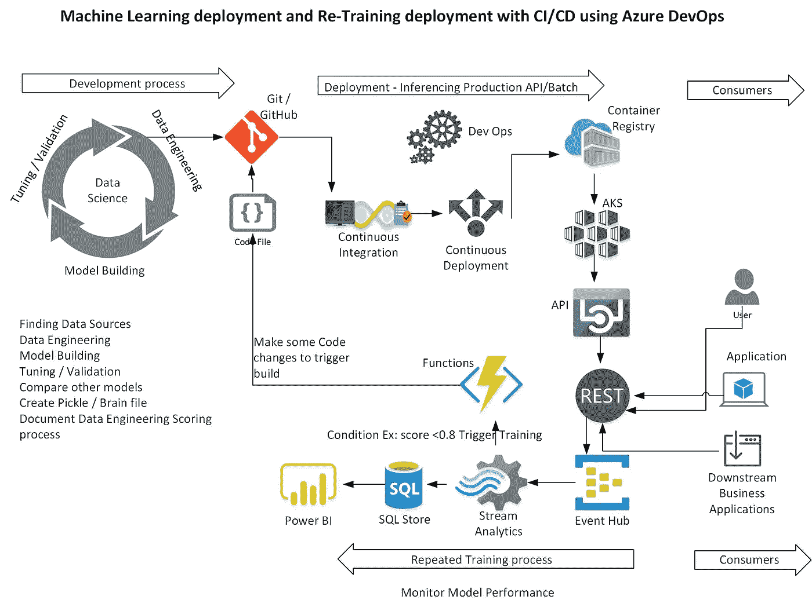

# Azure 机器学习服务——MLOps

> 原文：<https://medium.com/analytics-vidhya/azure-machine-learning-services-mlops-c0fde346a8ff?source=collection_archive---------11----------------------->

Azure 机器学习服务拥有端到端的数据科学生命周期流程。这意味着我们可以开发出模型，然后包装起来投入生产。然后我们可以用 REST API 创建模型文件并部署为 docker 映像。然后，可以将模型映像部署到 Azure kubernetes 容器中，并作为 REST API 部署给其他应用程序使用。

这里是数据科学应用生命周期流程以及数据科学家和机器学习或 AI 工程师的职责。

MlOps 生命周期

从左到右:图的左侧是数据工程师和数据科学家一起工作的地方，或者有时只是做数据工程的数据科学家。通过查看特定用例的不同数据源，然后尝试找到用例所需的适当特性。一旦特征被提取，则数据被标记用于预测。

这个过程是重复循环的过程，直到数据科学家能够找到正确的特征，然后验证不同的机器学习算法，以找到适合用例的算法。通常这个过程会花费很多时间。为了提高尝试不同模型和调整它的效率，请尝试 Azure 机器学习服务-自动化 ML 选项。自动 ML 通过各种滑雪套件算法运行，并为数据集找到最佳模型。

一旦找到最佳模型，现在就该准备生产了。通常最好的模型被存储为 pickle 文件。对于 pickle 文件，我们需要让机器学习或人工智能工程师创建生产部署代码。

要将最佳模型部署到生产中，需要编写评分文件，该文件将执行数据工程自动化任务，以创建用于模型的正确数据集。然后加载 pickle 文件，然后预测结果。现在，分数文件被构建为 Flask REST api，因此任何下游系统都可以使用该 api。

为了进行部署，我们将使用 Azure DevOps。由 ML/AI 工程师和数据科学家创建源代码存储在 Github 存储库中。因此，我们可以实施持续集成和持续部署。

Azure DevOps 代码可从以下网址获得:

[https://github.com/balakreshnan/mlops](https://github.com/balakreshnan/mlops)

首先通过定义管道 yaml 文件来构建构建管道。然后配置构建。现在为 build 选择存储代码的 repo。如果您想进行连续构建或基于手动触发，您可以进行配置。

接下来构建发布管道。按照本教程中的步骤操作:

[https://github . com/balakreshnan/mlops 2020/tree/master/feb 2020/lab-guide](https://github.com/balakreshnan/mlops2020/tree/master/feb2020/lab-guide)

上面的例子有 3 个任务，一个是更新 python 3.6，然后安装 python 的所有依赖库或包。最后一个运行 bash 脚本来运行 deploy rest api 脚本来创建 rest api。

现在，您可以构建和运行发布管道，构建和发布可能需要 30 到 40 分钟。等待整个任务完成。最后，您应该看到 rest api url，然后进行测试。此外，如果你登录 Azure 机器学习服务工作区，你可以看到部署在 AKS 集群的 REST API。

现在，您可以看到构建和部署任务是如何自动化的，如何无缝地部署机器学习模型，以及如何显示其他业务应用程序使用 REST API 的价值。

Rest API 实现还将记录推理的分数，然后将其发送到事件中心保存以备将来使用，并且还基于使用流分析的规则，我们可以使用 Azure 函数启用重新训练过程，以更新带有一些注释的评分代码。此外，流分析可以将数据存储在 Azure SQL 中，用于进一步的 Power BI 报告，以观察性能漂移。