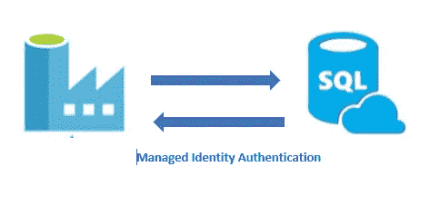
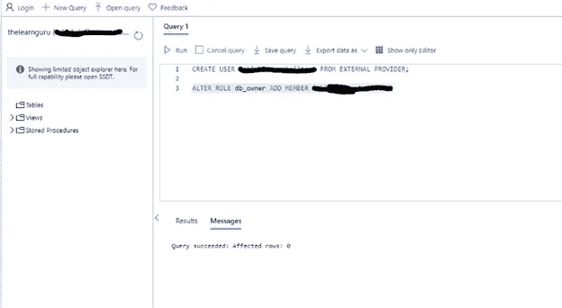
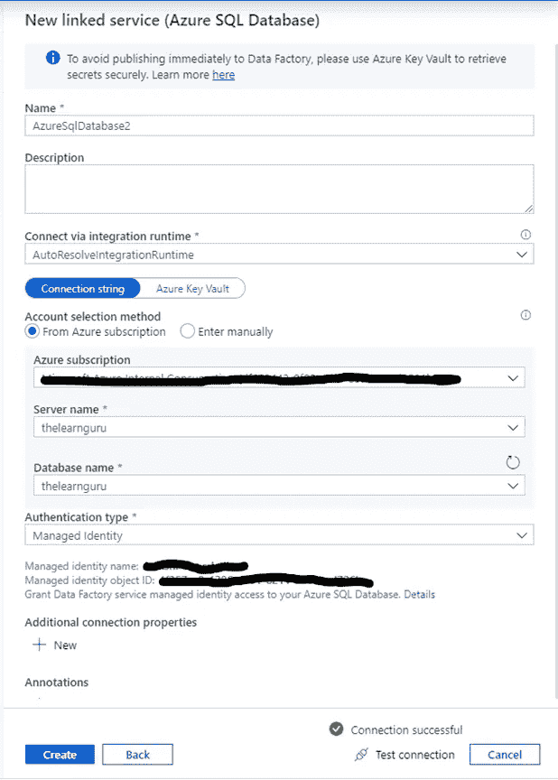

# 使用 Azure 数据工厂对 Azure SQL DB 进行 Azure 托管身份认证

> 原文：<https://medium.com/analytics-vidhya/azure-managed-identity-authentication-for-azure-sql-db-using-azure-data-factory-d8b13afb19e7?source=collection_archive---------3----------------------->

用户在使用云应用程序时面临的一个非常常见的挑战是管理身份验证的凭证。托管身份解决了这个问题，并为每个 azure 服务提供了一个自动托管的身份。该身份可用于认证任何支持 AAD 认证的服务。这是微软提供的免费服务。

有两种类型的受管理身份:

1.系统分配的 MI:这将自动启用 Azure 实例，并为资源分配一个身份。

2.用户分配的 MI:它被创建为独立的 Azure 资源。通过创建过程，Azure 在 Azure AD 租户中创建一个身份，该身份受到正在使用的订阅的信任。创建身份后，可以将身份分配给一个或多个 Azure 服务实例。

Azure 数据工厂还支持连接各种 azure 实例的托管身份认证。在本演示中，提供了使用该身份访问 SQL DB 的步骤。要使用托管身份，请执行以下步骤。请访问[**http://thelearnguru . com/azure-managed-identity-authentic ation-for-azure-SQL-db-using-azure-data-factory/**](http://thelearnguru.com/azure-managed-identity-authentication-for-azure-sql-db-using-azure-data-factory/)了解提供托管身份认证所涉及的端到端步骤。

1.为 SQL DB 设置 AAD 管理员的第一步 id。此 SQL 管理员可以是 Azure AD 用户或组。

2.连接到要从中复制数据的数据库，并执行以下查询:

**从外部提供者创建用户【您的数据工厂名称】；**

您可以使用门户或 SSMS 连接 Azure DB。

3.使用以下命令在 SQL DB 中授予数据工厂管理的身份权限:

**更改角色[角色名称]添加成员[您的数据工厂名称]；**

4.现在配置 Azure 数据工厂链接服务并测试您的连接。

