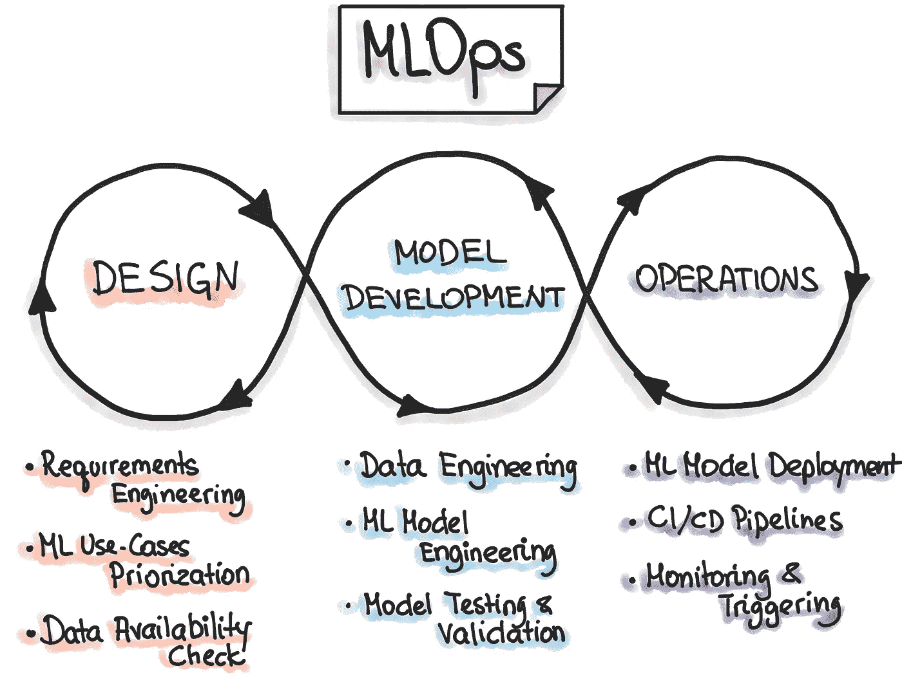
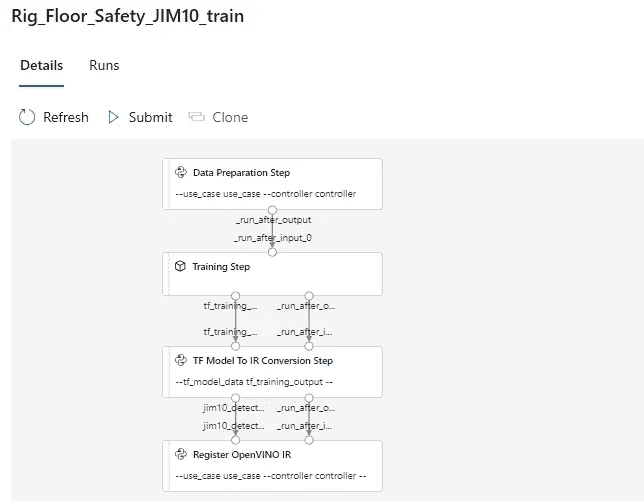
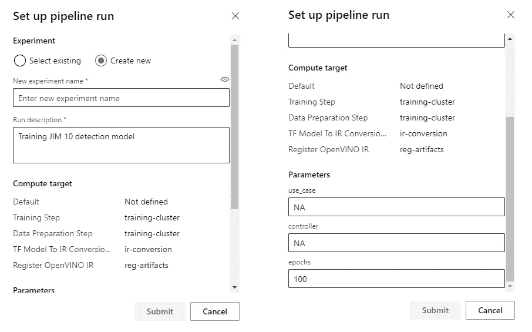
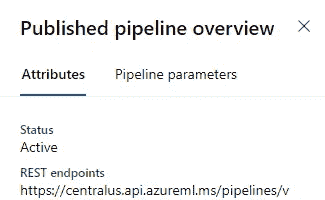

# Azure MLOps:将 DevOps 做得更好

> 原文：<https://medium.com/analytics-vidhya/azure-mlops-doing-devops-one-better-2557a58d20a3?source=collection_archive---------27----------------------->

# **MLOps？那是什么？**

MLOps 是 DevOps 的一切，加上它负责 ML 模型训练以及数据集和模型管理的部分。

不到几周前，我刚刚瞄准并训练了一个我一直在做的项目所需的模型。该模型按照要求和预期工作，是时候部署利用该模型的应用程序了。我像往常一样使用 Azure DevOps，对应用程序的源代码进行版本控制，并对其进行打包和部署。但是像其他时候一样，我想知道，

> 当客户提供新数据并且需要重新培训时，我该怎么办？我是否需要手动重新训练模型，并繁琐地维护其版本和数据集？如果我将模型训练和版本化过程自动化，并将其添加到我当前的 DevOps 过程中，会怎么样？

这一次，根据我的想法，我开始寻找解决办法。由于我已经在 Azure 平台上工作，我很快就发现了他们的 MLOps 解决方案。

# **我想做什么？**

建立一个管道，该管道:

*   为模型训练准备我的数据
*   将准备好的数据保存为版本化数据集
*   训练模型
*   维护模型的版本

# 我是怎么做到的？

我使用了用于 Python 的 Azure 机器学习 SDK，并编写了一个创建 MLOps 管道的脚本。管道处理了我想从这个解决方案中得到的一切，并且可以通过 Azure 的 ML web 门户上的 UI、REST 端点等来触发。

# 脚本配方

创建 MLOps 管道的脚本大致包括以下内容:

## 正在创建工作区对象

我创建了一个 workspace 对象，用于访问与 Azure 订阅中的工作区相关的所有资源。它需要有关您的工作空间和订阅的信息，以及授予访问权限的凭据。

## 分配计算集群

为了运行流水线的步骤，需要有一台机器可以执行这些步骤。该机器以集群的形式获得，可以根据需要从 0 扩展到 n 个节点。

## 管线参数和管线数据

当触发流水线时，可以指定某些参数值。它们被称为管道参数，就像编程语言中的函数参数一样工作。
在管道的 2 个步骤将不同的集群作为其计算目标的情况下，它们之间的数据共享是通过管道数据完成的。这是因为不同的集群无法访问彼此的本地存储，因此需要一个公共存储点来共享数据。

## 属国

为了在计算目标上执行某个步骤，可能需要在该目标上安装某些依赖项。这些依赖关系需要预先定义。

## 数据准备步骤

这一步将在计算目标上运行 makedata.py。
在该脚本中，所有处理后的最终数据可以注册和版本化如下:

## 训练步骤

使用 EstimatorStep 在计算目标上执行 train.py。这不是唯一的方法，脚本可以用不同的方式执行。该文件将包含与模型训练和评估相关的代码，使用先前注册的数据集。您可以将注册数据集的工件下载到计算目标的本地存储中。

在此步骤中，我们还使用了之前定义的管道数据“training_step_output”，它基本上是一个路径，用于存储输出并与不同的管道步骤共享。

## 模型注册步骤

register.py 在不同的计算目标上执行，并且使用存储训练输出的管道数据“training_step_output”。register.py 应该是这样的:

## 管道发布

最后，我们为管道建立先前定义的步骤序列，并对其进行验证(检查管道数据的循环依赖性等。)并发表。

# 大结局

一旦发布，您可以通过访问您在[https://ml.azure.com](https://ml.azure.com/)的工作区来查看您的管道。
作为参考，我的管道最终看起来像这样。

您可以从 UI 提交管道运行。

或者使用 REST 端点。

最后但同样重要的是，通过 Azure Machine Learning SDK for Python 使用 workspace 对象。

# **闭幕词**

Azure MLOps 是一个功能强大的服务，可以用于更多方面。从注册模型时将评估指标添加到模型的元数据中，到封装和部署使用模型的应用程序，使用 Azure MLOps 可以完成许多事情。所需要的就是探索它所提供的一切。
因此，深入研究[文档](https://docs.microsoft.com/en-us/python/api/overview/azure/ml/?view=azure-ml-py)并找到问题的解决方案。