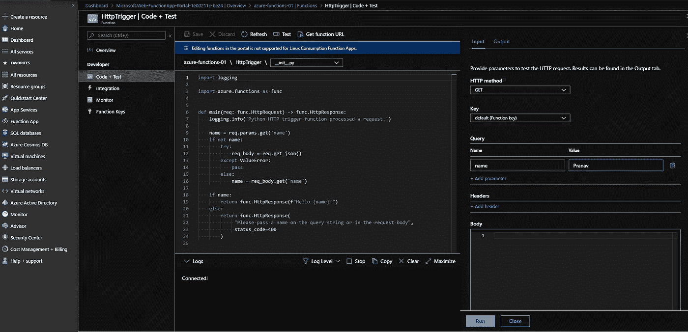

# Azure Python 函数——使用 Azure DevOps 从 GitHub 到函数应用程序的 CI/CD 管道

> 原文：<https://medium.com/analytics-vidhya/azure-python-functions-ci-cd-pipeline-from-github-to-functions-app-using-azure-devops-330eadc2b583?source=collection_archive---------15----------------------->

安德鲁·曼塔罗在 [Unsplash](https://unsplash.com?utm_source=medium&utm_medium=referral) 上拍摄的照片

**TL**； **DR** 本文介绍了如何构建从 GitHub 到 Azure Functions App 的 CI/CD 管道，摘要如下

> 了解 Azure 管道设置和源/目标连接。
> 
> 将 GitHub 存储库与 Azure Pipeline 集成，查看 azure-pipelines.yml。
> 
> 将 Azure Pipeline 与 Azure Functions 应用程序集成。
> 
> 在 Azure Portal 上检查构建并测试 Azure Python 函数代码。

让我们更深入地探讨这个话题。几个月前，我发表了一篇关于用 Travis CI 为自动化测试建立 CI 管道的文章。我一直在 Azure 上开发数据管道，并倾向于寻找一个与 Azure 无缝集成的解决方案。用于 Azure functions 的 VS 代码扩展无缝工作，尽管它没有提供一个完整的带有 CI/CD 的 DevOps 套件，集成不同的存储库，测试，自动化构建和管理发布版本，Azure DevOps 就是为此而专门构建的。

有不同的[计划](https://azure.microsoft.com/en-us/pricing/details/devops/azure-devops-services/)可用于单个服务和基本计划，单个任务和团队的基本+测试计划。

我的 Azure functions 测试库托管在 GitHub 上，有一个选项可以直接设置从 GitHub 到 Azure Functions 应用程序的管道。

登录后，创建一个新项目。设置项目的公共或私人访问权限。

步骤 1:创建一个新的 DevOps 项目，并将存储库设置为 Public/Private。

步骤 2:创建一个新的管道。

步骤 3:将管道连接到源存储库，在我的例子中是 GitHub。

步骤 4:认证 GitHub 以允许访问 Azure DevOps。

步骤 5:授权 Azure 管道。

第 6 步:从 GitHub 中选择作为源的存储库。在这种情况下我选择[*azure-functions-python-http trigger*](https://github.com/prkapur/azure-functions-python-httptrigger)。

步骤 7:批准并安装所选存储库的管道。

步骤 8:为要连接的管道配置目标。在这种情况下，我们将 Python 函数应用程序部署到 Azure 上的 Linux，我已经在 Azure 上配置和设置了它。

步骤 9:选择托管 Azure Functions 应用程序的 Azure 订阅。

步骤 10:选择之前设置的 Azure Functions 应用名称。

步骤 11:检查 azure-pipelines YAML 文件。检查完毕后，单击保存并运行以触发构建。

步骤 12:下面的仪表板显示我正在推进到我的开发分支，并显示不同阶段的状态。

步骤 13:构建和部署已经完成，如下所示。

步骤 14:GitHub 上的开发分支已经用 azure-pipelines.yml 文件更新。

第 15 步:Azure Pipelines 接下来完成将存储库部署到 Azure Functions 应用程序中，该应用程序可以在 Azure 上查看。我正在测试应用程序中代码的结果。

步骤 16:在代码测试窗口中，我在查询参数中输入我的名字。

步骤 17:我可以看到预期的输出被返回。

这就结束了使用 GitHub 上托管的源存储库和 Azure Functions 应用程序上托管的目标应用程序设置 CI/CD 管道的过程。希望这是有帮助的，如果你有任何问题或意见，你可以在下面留下回复。