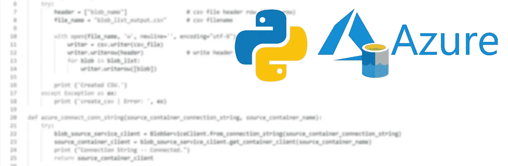

# Azure & Python:列出容器 blobs

> 原文：<https://medium.com/analytics-vidhya/azure-python-listing-container-blobs-e78cedb81935?source=collection_archive---------4----------------------->

使用简单的 Python 脚本连接到 Azure。

封面图像

最近，我遇到了一个项目需求，其中我必须列出存储帐户容器中存在的所有 blob，并将 blob 名称存储在 CSV 文件中。

我想分享我为这个任务创建的 Python 脚本，让这个教程尽可能简单。