# Azure Synapse Analytics(Workspace)中的 Azure Spark ETL，包含样本数据集和机器学习

> 原文：<https://medium.com/analytics-vidhya/azure-spark-etl-in-azure-synapse-analytics-workspace-with-sample-datasets-and-machine-learning-5b95676e3d0a?source=collection_archive---------13----------------------->

能够使用样本数据集处理数据，以学习使用 Azure synapse analytics workspace spark 进行大规模提取、转换和加载。

我可以用 pyspark 做 ETL，然后用 Spark SQL 做聚合，然后用 scala 做建模，所有这些都在一个笔记本里。

本教程只展示了如何使用 spark 进行回归建模的模型训练。

```
note: the data set and use case are just imaginary.
```

*   Azure 帐户
*   创建 Azure Synapse 分析工作区
*   创建火花线轴
*   我使用的是中型实例
*   没有库被上传
*   Spark 版本:2.4.4

```
from azureml.opendatasets import NycTlcYellow

data = NycTlcYellow()
data_df = data.to_spark_dataframe()
# Display 10 rows
display(data_df.limit(10))
```

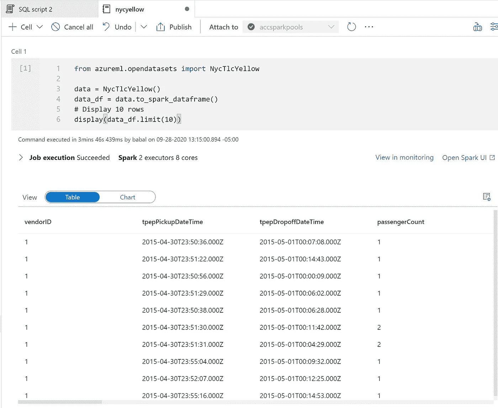

```
display(data_df)
```

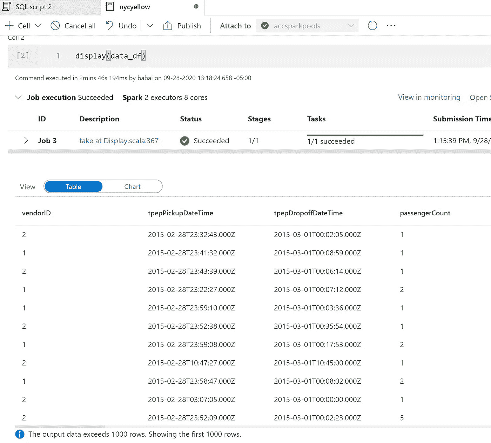

```
from pyspark.sql.functions import * 
from pyspark.sql import *df1 = data_df.withColumn("Date", (col("tpepPickupDateTime").cast("date"))) 
display(df1)
```

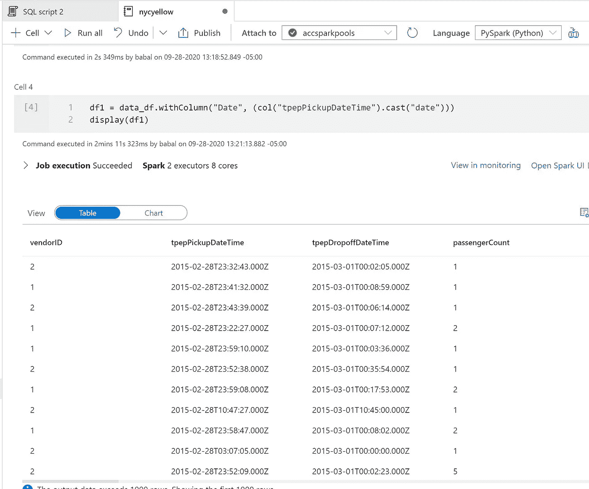

```
df1.dropDuplicates("key","pickup_datetime","pickup_longitude","pickup_latitude","dropoff_longitude","dropoff_latitude")
df1.printSchema
```

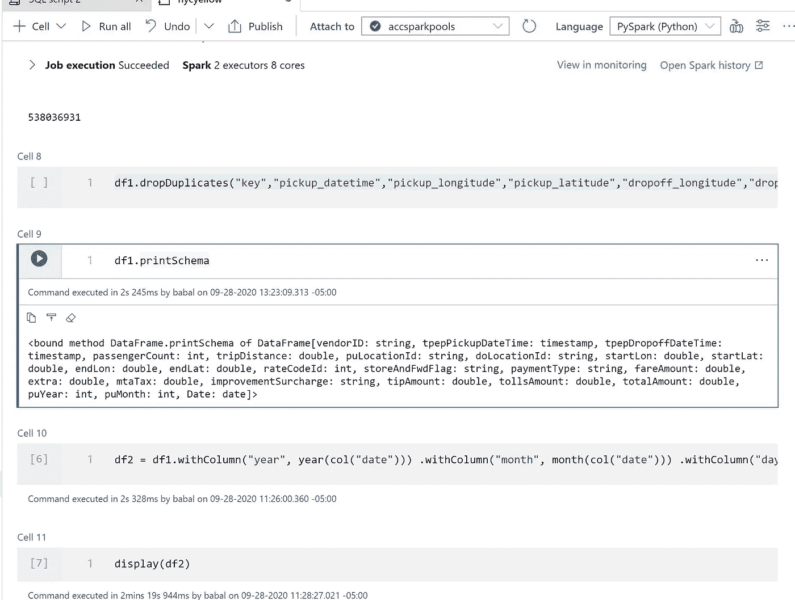

```
df2 = df1.withColumn("year", year(col("date"))) .withColumn("month", month(col("date"))) .withColumn("day", dayofmonth(col("date"))) .withColumn("hour", hour(col("date"))) 
display(df2)
```

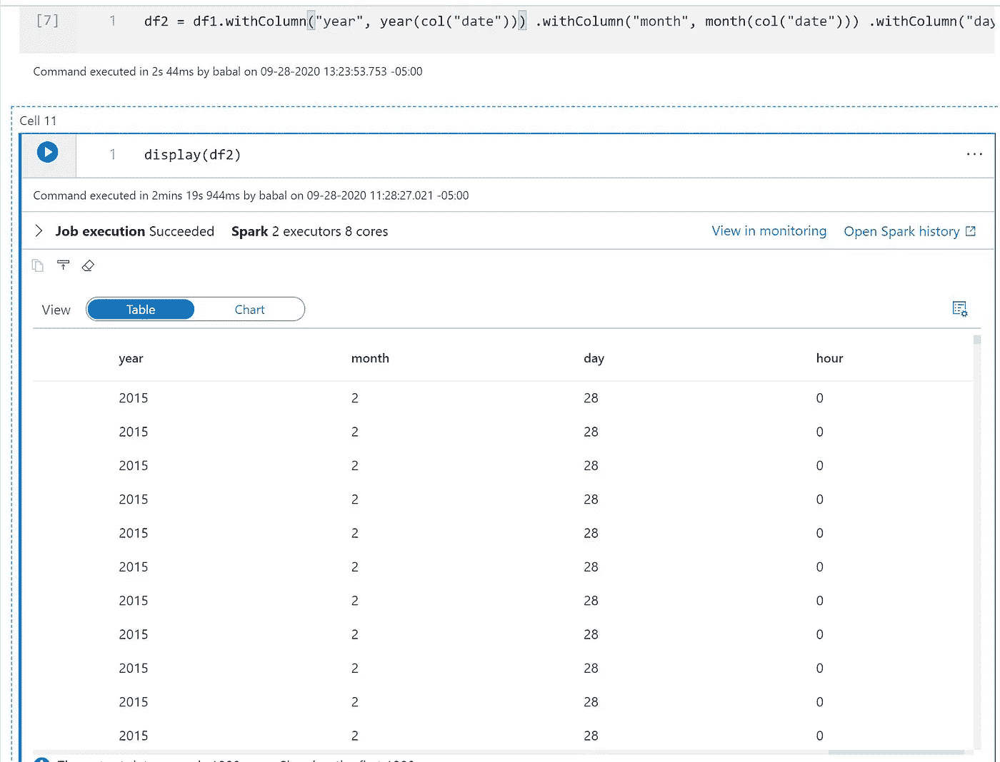

```
df2.groupBy("year","month").agg(sum("fareAmount").alias("Total"),count("vendorID").alias("Count")).sort(asc("year"), asc("month")).show()dfgrouped = df2.groupBy("year","month").agg(sum("fareAmount").alias("Total"),count("vendorID").alias("Count")).sort(asc("year"), asc("month")) display(dfgrouped)
```

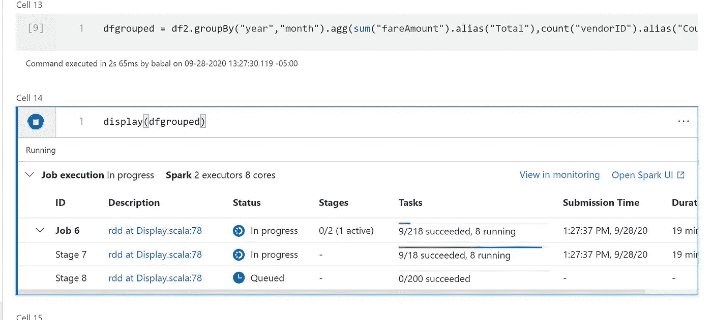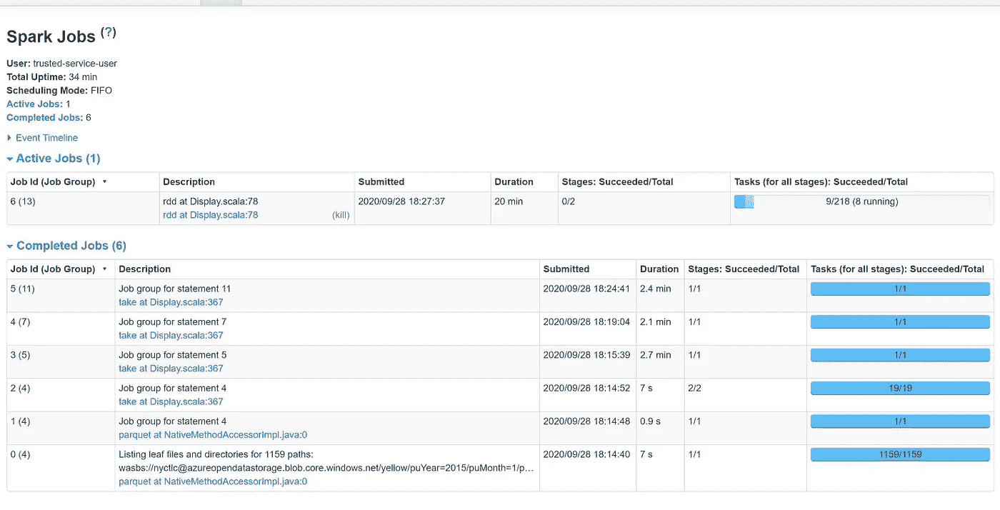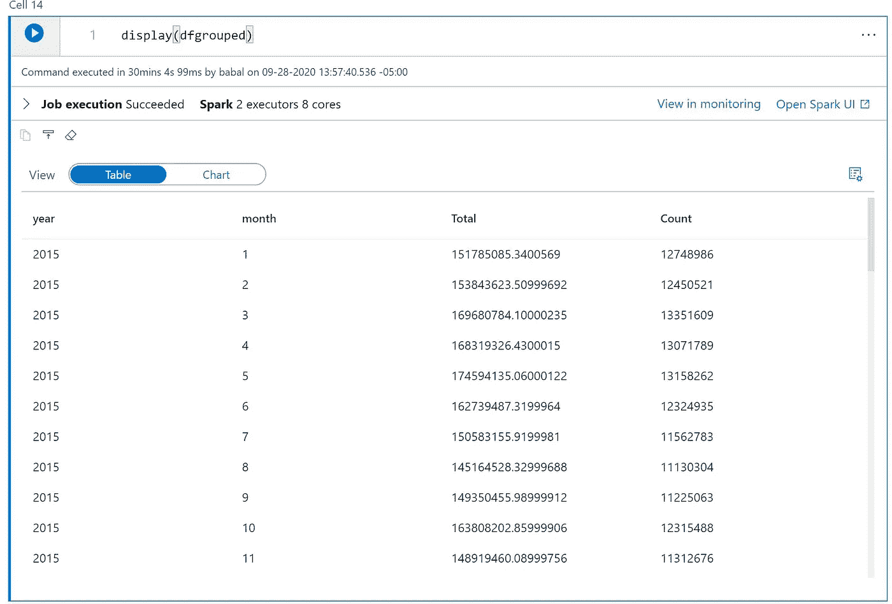

```
df2.createOrReplaceTempView("nycyellow")%%sql
select  year(cast(tpepPickupDateTime  as timestamp)) as tsYear,
        day(cast(tpepPickupDateTime  as timestamp)) as tsDay, 
        hour(cast(tpepPickupDateTime  as timestamp)) as tsHour,
        avg(totalAmount) as avgTotal, avg(fareAmount) as avgFare
from nycyellow
group by  tsYear,tsDay, tsHour
order by  tsYear,tsDay, tsHour
```

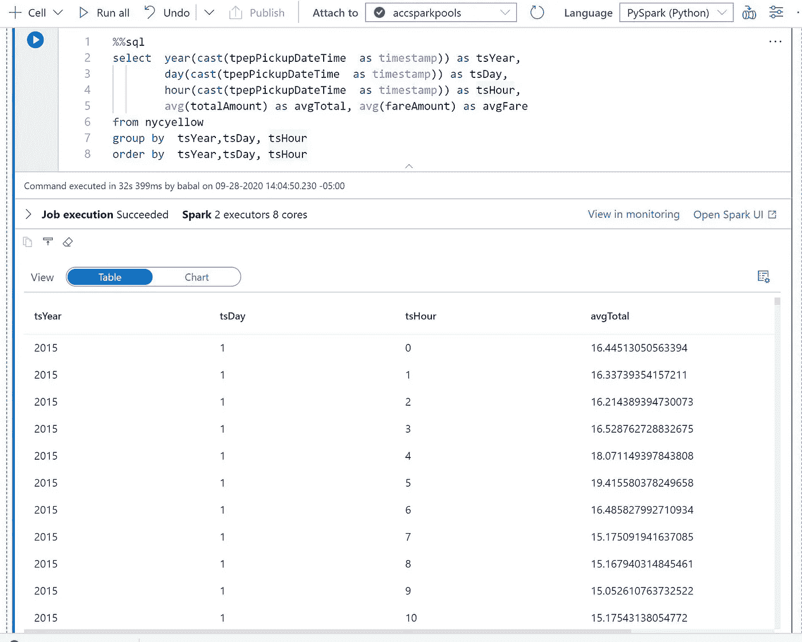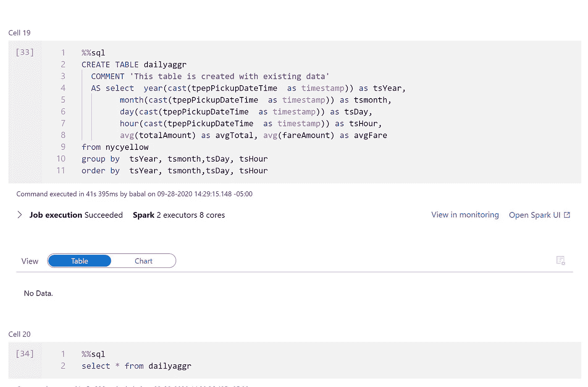

```
%%sql
CREATE TABLE dailyaggr
  COMMENT 'This table is created with existing data'
  AS select  year(cast(tpepPickupDateTime  as timestamp)) as tsYear,
        month(cast(tpepPickupDateTime  as timestamp)) as tsmonth,
        day(cast(tpepPickupDateTime  as timestamp)) as tsDay, 
        hour(cast(tpepPickupDateTime  as timestamp)) as tsHour,
        avg(totalAmount) as avgTotal, avg(fareAmount) as avgFare
from nycyellow
group by  tsYear, tsmonth,tsDay, tsHour
order by  tsYear, tsmonth,tsDay, tsHour
```

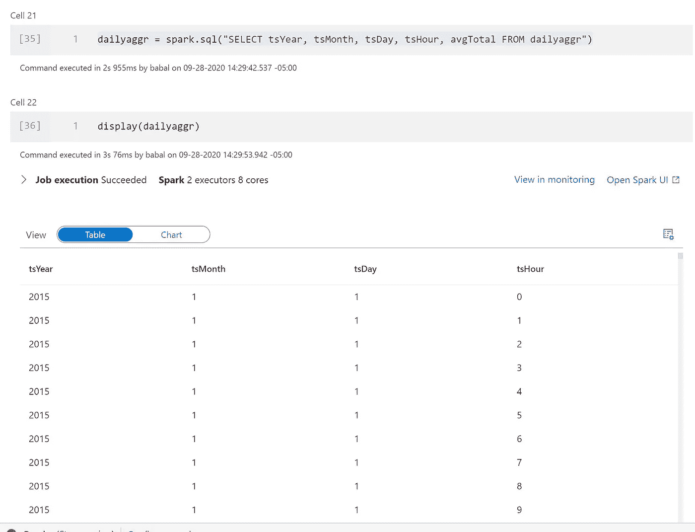

```
from pyspark.ml.regression import LinearRegression
```

*   在这里，我也从 scala 切换到回归建模
*   Majic 命令是%%spark，用于 scala 编程

```
%%spark
import org.apache.spark.ml.feature.VectorAssembler 
import org.apache.spark.ml.linalg.Vectors 
val dailyaggr = spark.sql("SELECT tsYear, tsMonth, tsDay, tsHour, avgTotal FROM dailyaggr")
val featureCols=Array("tsYear","tsMonth","tsDay","tsHour") 
val assembler: org.apache.spark.ml.feature.VectorAssembler= new VectorAssembler().setInputCols(featureCols).setOutputCol("features") 
val assembledDF = assembler.setHandleInvalid("skip").transform(dailyaggr) 
val assembledFinalDF = assembledDF.select("avgTotal","features")
```

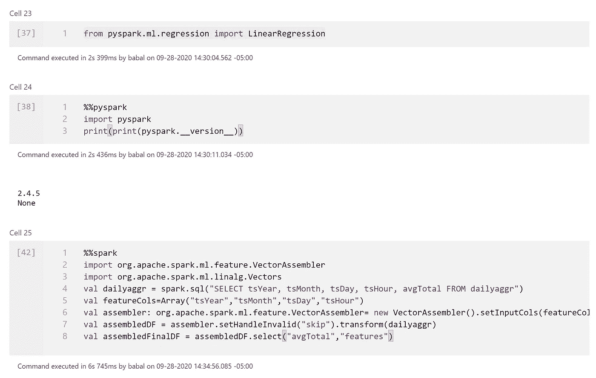

```
%%spark
import org.apache.spark.ml.feature.Normalizer 
val normalizedDF = new Normalizer().setInputCol("features").setOutputCol("normalizedFeatures").transform(assembledFinalDF)%%spark
val normalizedDF1 = normalizedDF.na.drop()%%spark
val Array(trainingDS, testDS) = normalizedDF1.randomSplit(Array(0.7, 0.3))
```

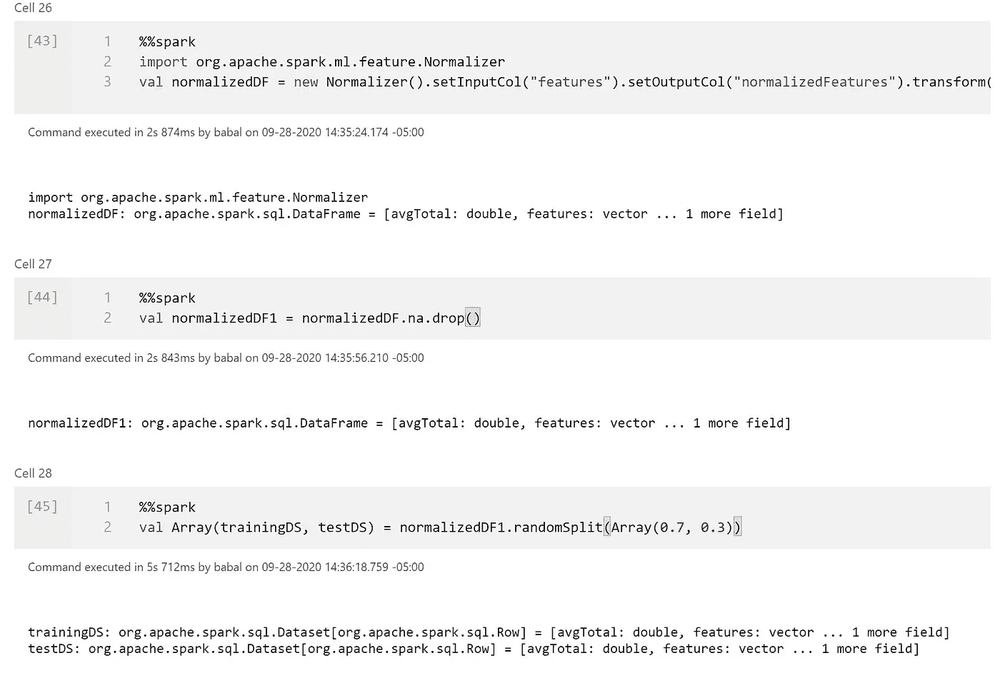

```
%%spark
import org.apache.spark.ml.regression.LinearRegression
// Create a LinearRegression instance. This instance is an Estimator. 
val lr = new LinearRegression().setLabelCol("avgTotal").setMaxIter(100)
// Print out the parameters, documentation, and any default values. println(s"Linear Regression parameters:\n ${lr.explainParams()}\n") 
// Learn a Linear Regression model. This uses the parameters stored in lr.
val lrModel = lr.fit(trainingDS)
// Make predictions on test data using the Transformer.transform() method.
// LinearRegression.transform will only use the 'features' column. 
val lrPredictions = lrModel.transform(testDS)%%spark
import org.apache.spark.sql.functions._ 
import org.apache.spark.sql.types._ 
println("\nPredictions : " ) 
lrPredictions.select($"avgTotal".cast(IntegerType),$"prediction".cast(IntegerType)).orderBy(abs($"prediction"-$"avgTotal")).distinct.show(15)
```

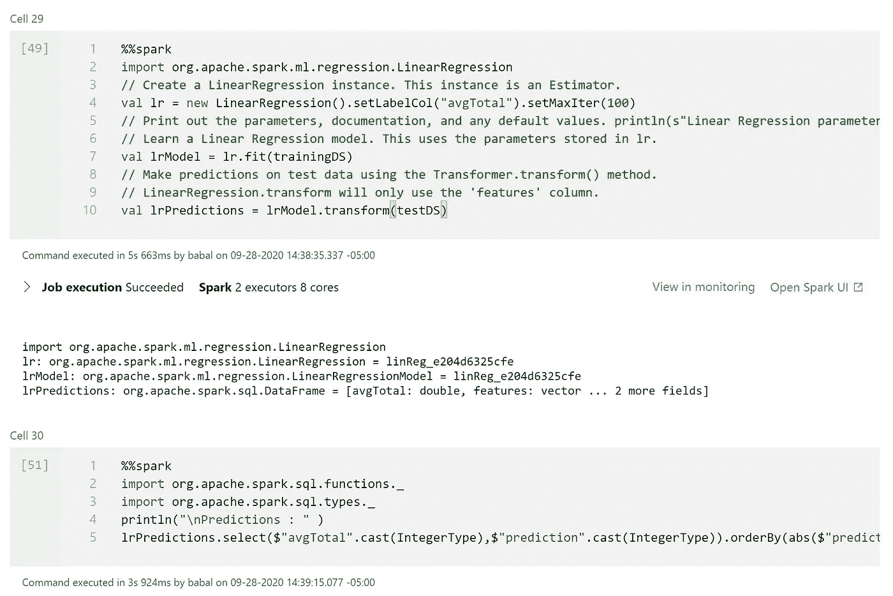

```
%%spark
import org.apache.spark.ml.evaluation.RegressionEvaluator 

val evaluator_r2 = new RegressionEvaluator().setPredictionCol("prediction").setLabelCol("avgTotal").setMetricName("r2") 
//As the name implies, isLargerBetter returns if a larger value is better or smaller for evaluation. 
val isLargerBetter : Boolean = evaluator_r2.isLargerBetter 
println("Coefficient of determination = " + evaluator_r2.evaluate(lrPredictions))
```

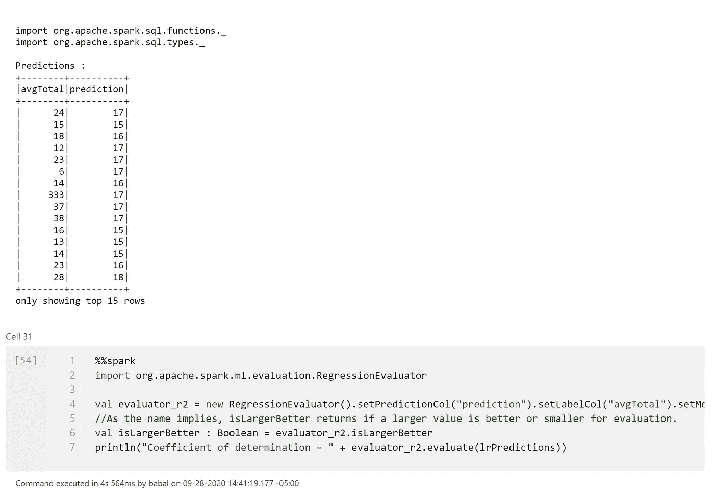

```
%%spark
//Evaluate the results. Calculate Root Mean Square Error 
val evaluator_rmse = new RegressionEvaluator().setPredictionCol("prediction").setLabelCol("avgTotal").setMetricName("rmse") 
//As the name implies, isLargerBetter returns if a larger value is better for evaluation. 
val isLargerBetter1 : Boolean = evaluator_rmse.isLargerBetter 
println("Root Mean Square Error = " + evaluator_rmse.evaluate(lrPredictions))
```

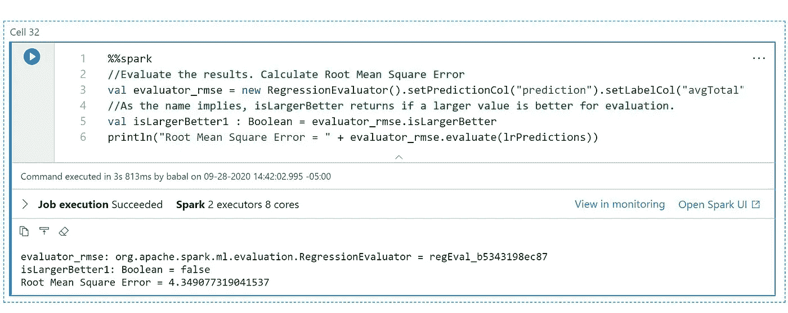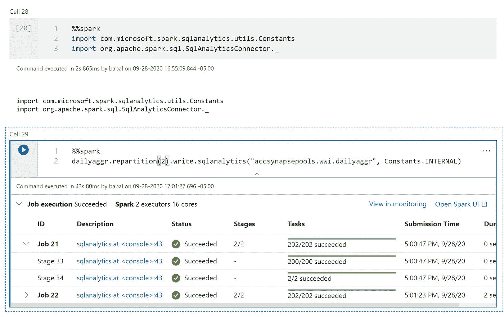

```
%%spark
import com.microsoft.spark.sqlanalytics.utils.Constants
import org.apache.spark.sql.SqlAnalyticsConnector._
```

*   写入 Azure Synapse Analytics (SQL DW)
*   不需要创建表格。

```
%%spark
dailyaggr.repartition(2).write.sqlanalytics("accsynapsepools.wwi.dailyaggr", Constants.INTERNAL)DROP TABLE [wwi].[dailyaggr]
GO

SET ANSI_NULLS ON
GO
SET QUOTED_IDENTIFIER ON
GO

CREATE TABLE [wwi].[dailyaggr]
( 
	[tsYear] [int]  NULL,
	[tsMonth] [int]  NULL,
	[tsDay] [int]  NULL,
	[tsHour] [int]  NULL,
	[avgTotal] [float]  NULL
)
WITH
(
	DISTRIBUTION = ROUND_ROBIN,
	CLUSTERED COLUMNSTORE INDEX
)
GO
```

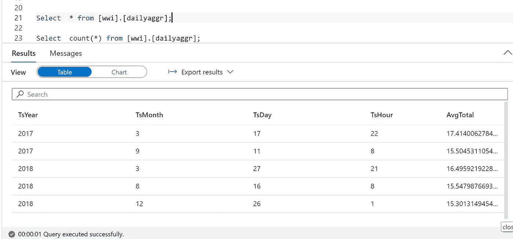

```
%%spark
val dailyaggrdf = spark.read.sqlanalytics("accsynapsepools.wwi.dailyaggr")r")%%spark
display(dailyaggrdf)%%spark
dailyaggrdf.count()
```

了解更多详情。

[https://github . com/balakreshnan/synapse analytics/blob/master/spark ETL . MD](https://github.com/balakreshnan/synapseAnalytics/blob/master/sparketl.md)

*最初发表于*[T5【https://github.com】](https://github.com/balakreshnan/synapseAnalytics/blob/master/sparketl.md)*。*