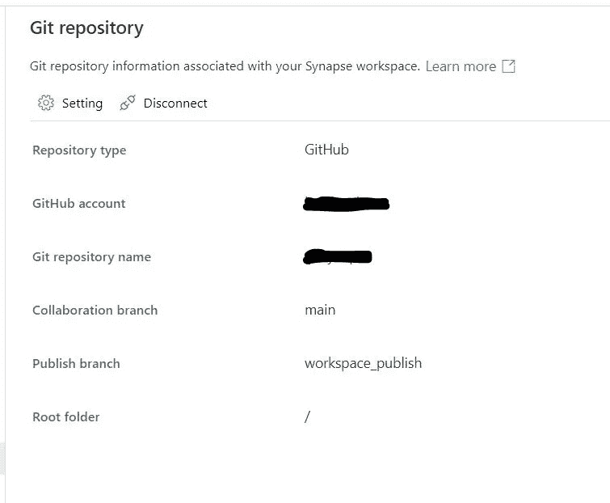
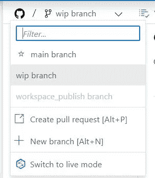
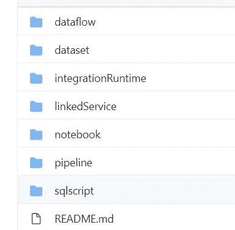

# 使用 GitHub 的 Azure Synapse Analytics CI/CD

> 原文：<https://medium.com/analytics-vidhya/azure-synapse-analytics-ci-cd-using-github-a9b768ca698a?source=collection_archive---------15----------------------->

# 将 Azure Synapse Workspace 连接到 GitHub

*   登录[https://web.azuresynapse.net/](https://web.azuresynapse.net/)
*   选择您的订阅
*   选择工作空间
*   在主页左侧菜单中，单击管理
*   选择 Git 配置
*   选择 GitHub
*   需要认证
*   键入回购 URL github.com/username
*   选择存储库名称
*   创建一个名为 WIP-work in progress 的工作分支
*   将创建发布分支作为 workspace_publish
*   选择根文件夹作为/

GitHub 配置

*   在画布的左上方，单击下拉菜单查看分支

*   从现在开始，任何开发出来的东西都将存储在 GitHub 中
*   如果你想关闭 GitHub，选择实时模式
*   一旦您提交了任何更改，下面是 GitHub repo 的样子

GitHub 文件夹结构

*   对于开发中的集成管道，一切都将提交给 wip 分支
*   将不会发布
*   所以在提交之后，做一个拉请求并合并到 main
*   然后切换到主分支
*   现在将为所有要推送的数据工厂活动创建 publish_branch。

原故事[点击这里](https://github.com/balakreshnan/synapseAnalytics/blob/master/synapseworkspace/Synapsegit.md)