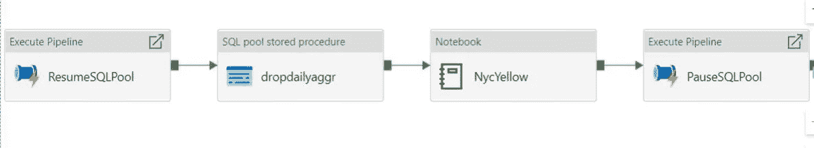

# Azure Synapse 分析端到端机器学习-模型开发

> 原文：<https://medium.com/analytics-vidhya/azure-synapse-analytics-end-to-end-machine-learning-model-development-569bffb4263b?source=collection_archive---------4----------------------->

# 加载、转换、建模、存储数据

# 用例

*   从数据源加载数据，在本例中为样本数据集
*   使用 Pyspark 处理数据(ETL)
*   ETL 工作是结合 pyspark dataframe 和 Spark SQL 完成的
*   将处理后的数据保存到 Synapse 专用 SQLPools 中
*   当我们运行 ETL 时，恢复和暂停专用的 SQL 池
*   为无服务器活动在默认存储中保存一份副本
*   建立和训练机器学习模型
*   我们使用与 pyspark 相同的笔记本，但是使用 scala 代码构建
*   为恢复和暂停专用 SQL 池构建不同的管道

```
Not every use case you have to resume and pause dedicated sql pools. If needed use, other wise please do ignore. The idea for this tutorial is to show all the combination of features working together.
```

# 端到端处理架构



# 先决条件

*   需要 Azure 帐户
*   创建资源组
*   创建 Azure Synapse 分析工作区
*   创建一个专用的 SQL 池(我使用的是 DW100c)
*   创建火花线轴
*   将自动创建无服务器 sql

# 创建代码的步骤

*   首先创建笔记本代码
*   然后为专用 SQL 池创建恢复管道
*   为专用 SQL 池创建暂停管道
*   创建另一个管道来运行 resume，notebook，然后暂停

# 创建简历集成的步骤

*   创建新的管线
*   从常规部分拖动 Web 活动
*   转到设置和 URL

```
https://management.azure.com/subscriptions/subid/resourceGroups/rggroupname/providers/Microsoft.Synapse/workspaces/workspacename/sqlPools/poolname/resume?api-version=2019-06-01-preview
```

*   现在是身体

```
{"sku":{"name":"DW100c"}}
```

*   选择方法作为发布
*   对于资源类型的身份验证部分

```
https://management.azure.com/
```

# 创建暂停集成的步骤

*   创建新的管线
*   从常规部分拖动 Web 活动
*   转到设置和 URL

```
https://management.azure.com/subscriptions/subid/resourceGroups/rggroupname/providers/Microsoft.Synapse/workspaces/workspacename/sqlPools/poolname/pause?api-version=2019-06-01-preview
```

*   现在是身体

```
{"sku":{"name":"DW100c"}}
```

*   选择方法作为发布
*   对于资源类型的身份验证部分

```
https://management.azure.com/
```

# 使用笔记本创建 ETL 和 ML 代码的代码

*   让我们加载数据集

```
from azureml.opendatasets import NycTlcYellow

data = NycTlcYellow()
data_df = data.to_spark_dataframe()
# Display 10 rows
display(data_df.limit(10))from pyspark.sql.functions import *
from pyspark.sql import *
```

*   创建数据列

```
df1 = data_df.withColumn("Date", (col("tpepPickupDateTime").cast("date"))) 
display(df1)
```

*   创建一个供以后使用的视图

```
df1.createOrReplaceTempView("nycyellow")
```

*   查找记录总数

```
#df1.count()
```

*   删除重复项

```
#df1.dropDuplicates("key","pickup_datetime","pickup_longitude","pick#up_latitude","dropoff_longitude","dropoff_latitude")
```

*   打印模式

```
df1.printSchema
```

*   从派生日期列创建新列

```
df2 = df1.withColumn("year", year(col("date"))) .withColumn("month", month(col("date"))) .withColumn("day", dayofmonth(col("date"))) .withColumn("hour", hour(col("date")))
```

*   现在将数据分组

```
dfgrouped = df2.groupBy("year","month").agg(sum("fareAmount").alias("Total"),count("vendorID").alias("Count")).sort(asc("year"), asc("month"))
```

*   显示

```
display(dfgrouped)
```

*   让我们将数据写入底层存储

```
dfgrouped.repartition(1).write.option("header","true").csv("/dailyaggrcsv/csv/dailyaggr.csv")
```

*   现在让我们使用 Spark SQL 尝试相同的聚合

```
df2.createOrReplaceTempView("nycyellow")
```

*   让我们显示数据并验证聚合不存在

```
%%sql
select * from nycyellow limit 100
```

*   基于年、月、日和小时聚合记录

```
%%sql
select  year(cast(tpepPickupDateTime  as timestamp)) as tsYear,
        month(cast(tpepPickupDateTime  as timestamp)) as tsmonth,
        day(cast(tpepPickupDateTime  as timestamp)) as tsDay, 
        hour(cast(tpepPickupDateTime  as timestamp)) as tsHour,
        avg(totalAmount) as avgTotal, avg(fareAmount) as avgFare
from nycyellow
group by  tsYear, tsmonth,tsDay, tsHour
order by  tsYear, tsmonth,tsDay, tsHour
```

*   如果存在属性，则删除

```
%%sql
DROP TABLE dailyaggr
```

*   创建聚集表

```
%%sql
CREATE TABLE dailyaggr
  COMMENT 'This table is created with existing data'
  AS select  year(cast(tpepPickupDateTime  as timestamp)) as tsYear,
        month(cast(tpepPickupDateTime  as timestamp)) as tsmonth,
        day(cast(tpepPickupDateTime  as timestamp)) as tsDay, 
        hour(cast(tpepPickupDateTime  as timestamp)) as tsHour,
        avg(totalAmount) as avgTotal, avg(fareAmount) as avgFare
from nycyellow
group by  tsYear, tsmonth,tsDay, tsHour
order by  tsYear, tsmonth,tsDay, tsHour
```

*   验证记录是否已存储

```
%%sql
select * from dailyaggr
```

# 将聚合数据加载到专用的 sql 池中

*   将 spark sql 表数据加载到 dataframe

```
dailyaggr = spark.sql("SELECT tsYear, tsMonth, tsDay, tsHour, avgTotal FROM dailyaggr")
```

*   显示要确认的数据集

```
display(dailyaggr)
```

# 是时候建立机器学习模型了

# 模型

```
from pyspark.ml.regression import LinearRegression
```

*   让我们加载数据
*   从现在开始，我们使用 Scala 代码

```
%%spark
import org.apache.spark.ml.feature.VectorAssembler 
import org.apache.spark.ml.linalg.Vectors 
val dailyaggr = spark.sql("SELECT tsYear, tsMonth, tsDay, tsHour, avgTotal FROM dailyaggr")
val featureCols=Array("tsYear","tsMonth","tsDay","tsHour") 
val assembler: org.apache.spark.ml.feature.VectorAssembler= new VectorAssembler().setInputCols(featureCols).setOutputCol("features") 
val assembledDF = assembler.setHandleInvalid("skip").transform(dailyaggr) 
val assembledFinalDF = assembledDF.select("avgTotal","features")%%spark
import com.microsoft.spark.sqlanalytics.utils.Constants
import org.apache.spark.sql.SqlAnalyticsConnector._%%spark
dailyaggr.repartition(2).write.synapsesql("accsynapsepools.wwi.dailyaggr", Constants.INTERNAL)%%spark
import org.apache.spark.ml.feature.Normalizer 
val normalizedDF = new Normalizer().setInputCol("features").setOutputCol("normalizedFeatures").transform(assembledFinalDF)
```

*   放弃 NA

```
%%spark
val normalizedDF1 = normalizedDF.na.drop()
```

*   为培训和测试拆分数据
*   我们将 70%的数据用于训练
*   30%数据用于测试

```
%%spark
val Array(trainingDS, testDS) = normalizedDF1.randomSplit(Array(0.7, 0.3))
```

*   训练模型

```
%%spark
import org.apache.spark.ml.regression.LinearRegression
// Create a LinearRegression instance. This instance is an Estimator. 
val lr = new LinearRegression().setLabelCol("avgTotal").setMaxIter(100)
// Print out the parameters, documentation, and any default values. println(s"Linear Regression parameters:\n ${lr.explainParams()}\n") 
// Learn a Linear Regression model. This uses the parameters stored in lr.
val lrModel = lr.fit(trainingDS)
// Make predictions on test data using the Transformer.transform() method.
// LinearRegression.transform will only use the 'features' column. 
val lrPredictions = lrModel.transform(testDS)
```

*   预测数据

```
%%spark
import org.apache.spark.sql.functions._ 
import org.apache.spark.sql.types._ 
println("\nPredictions : " ) 
lrPredictions.select($"avgTotal".cast(IntegerType),$"prediction".cast(IntegerType)).orderBy(abs($"prediction"-$"avgTotal")).distinct.show(15)
```

*   评估模型以确保它是有效的

```
%%spark
import org.apache.spark.ml.evaluation.RegressionEvaluator val evaluator_r2 = new RegressionEvaluator().setPredictionCol("prediction").setLabelCol("avgTotal").setMetricName("r2") 
//As the name implies, isLargerBetter returns if a larger value is better or smaller for evaluation. 
val isLargerBetter : Boolean = evaluator_r2.isLargerBetter 
println("Coefficient of determination = " + evaluator_r2.evaluate(lrPredictions))
```

*   打印指标

```
%%spark
//Evaluate the results. Calculate Root Mean Square Error 
val evaluator_rmse = new RegressionEvaluator().setPredictionCol("prediction").setLabelCol("avgTotal").setMetricName("rmse") 
//As the name implies, isLargerBetter returns if a larger value is better for evaluation. 
val isLargerBetter1 : Boolean = evaluator_rmse.isLargerBetter 
println("Root Mean Square Error = " + evaluator_rmse.evaluate(lrPredictions))
```

*   建模现在完成了。
*   保存笔记本
*   单击全部提交。
*   一个接一个地运行单元并观察输出。

# 创建端到端集成

*   既然我们已经准备好了恢复、暂停集成管道以及 ETL 和 ML 建模代码。
*   让我们创建一个集成管道来将它们组合在一起，如下所示。


*   创建新的集成
*   首先选择执行管道，然后选择恢复专用 SQL 池管道
*   接下来拖动 Synapse 笔记本作业，并选择上面创建的笔记本
*   最后一步拖动执行管道并选择暂停专用 SQL 池管道
*   全部保存并提交
*   保存后，创建一个拉取请求并与主分支合并
*   切换到主分支
*   单击发布
*   单击立即触发
*   等着看管道如何执行。

原文可以在这里找到

分享你的想法和评论。