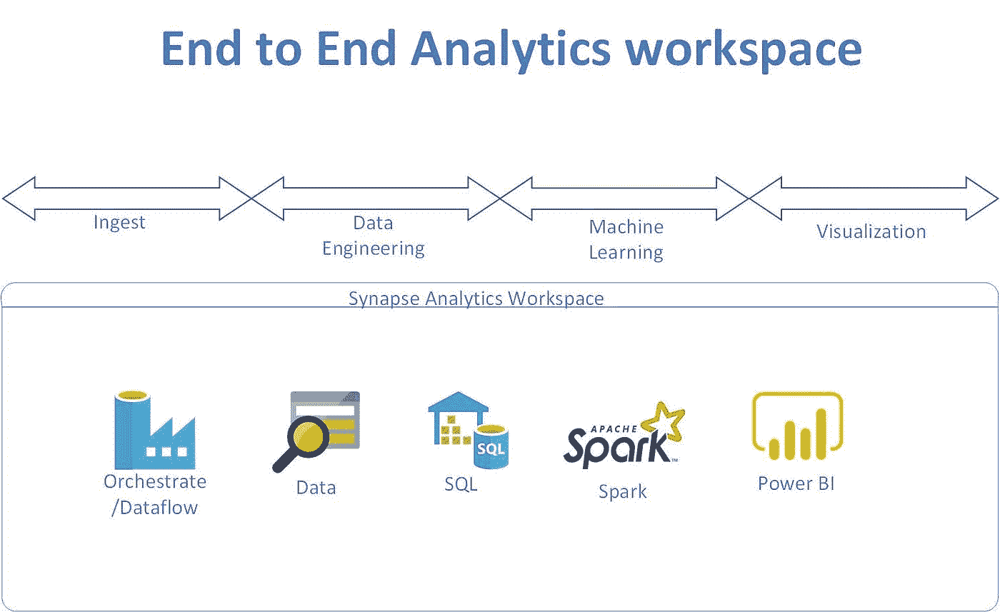

# Azure Synapse 分析运行聚类模型

> 原文：<https://medium.com/analytics-vidhya/azure-synapse-analytics-run-clustering-model-7bcd66e954d8?source=collection_archive---------29----------------------->

用出租车数据集运行 K-means 聚类无监督学习。



Synapse 能够运行基于 spark 的代码，从而实现数据工程或特征工程以及机器学习。本文描述了如何在 synapse 中使用 spark 训练机器学习模型。

将上述培训文件上传到 blob 存储或 ADLS Gen2。或者您可以使用 synapse orchestrate 特性将数据移动到 Blob 中。

```
For my testing i was able to move the blob storage train.csv into ADLS gen2 filesystem. I did that for just to show how to move data inside synapse analytics.import org.apache.spark.mllib.clustering.{KMeans, KMeansModel}
import org.apache.spark.mllib.linalg.Vectors
import org.apache.spark.ml.clustering.KMeans
import org.apache.spark.ml.feature.{IndexToString, StringIndexer, VectorAssembler}
import org.apache.spark.sql.SQLContext
import org.apache.spark.sql.SparkSession
import org.apache.spark.sql.types.IntegerType
import org.apache.spark.sql.functions.udf
import org.apache.spark.sql.functions._
import spark.implicits._
import org.apache.spark.sql.functions._val yellowdf = spark.read.option("header","true").option("inferSchema","true").parquet("abfss://[opendataset@internalsandboxwe.dfs.core.windows.net](mailto:opendataset@internalsandboxwe.dfs.core.windows.net)/nyctlc/yellow/")
```

验证数据集

```
display(yellowdf)
```

查看模式

```
yellowdf.schema
```

(最好是数值)

```
val df = yellowdf.select("passengerCount","tripDistance","fareAmount","tipAmount","totalAmount","puYear","puMonth")
```

验证新数据集

显示(df)

确保新数据集中只有选定的列

df .架构

将数据帧转换成矢量格式，以便 kmeans 可以处理。

```
val assembler = new VectorAssembler().setInputCols(Array("passengerCount","tripDistance","fareAmount","tipAmount","totalAmount","puYear","puMonth")).setOutputCol("features").setOutputCol("features")val training = assembler.transform(df.na.drop())// Cluster the data into two classes using KMeans
val numClusters = 2
val numIterations = 20
// Trains a k-means model.
val kmeans = new KMeans().setK(numClusters).setSeed(1L).setFeaturesCol("features").setPredictionCol("prediction")
val model = kmeans.fit(training)// Evaluate clustering by computing Within Set Sum of Squared Errors.
val WSSSE = model.computeCost(training)
println(s"Within Set Sum of Squared Errors = $WSSSE")
```

运行预测

```
val predicted = model.transform(training)
predicted.show
```

显示结果:

```
// Shows the result
println("Final Centers: ")
model.clusterCenters.foreach(println)
```

*最初发表于*[*【https://github.com】*](https://github.com/balakreshnan/synapseAnalytics/blob/master/SparkClustering.md)*。*