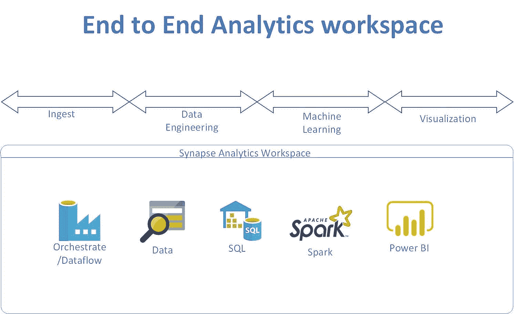

# Azure synapse analytics spark 图形处理

> 原文：<https://medium.com/analytics-vidhya/azure-synapse-analytics-spark-graph-processing-6ccb36403baf?source=collection_archive---------25----------------------->



# 加载数据

```
spark.conf.set( "fs.azure.account.key.waginput.blob.core.windows.net", "xxxxxxxxxxxxxxxxxxxxxxxxxxxxxxxxxxxxxxxxxxxxxxxxxxxxxxxxxxxxxxxxxxxxxxxxxxxxxxxxxx")
```

# 装载站数据

```
val dfstation = spark.read.option("header","true").option("inferSchema","true").csv("wasbs://graphdata@waginput.blob.core.windows.net/station.csv") display(dfstation)
```

# 加载行程数据

```
val dftrip = spark.read.option("header","true").option("inferSchema","true").csv("wasbs://graphdata@waginput.blob.core.windows.net/trip.csv") display(dftrip)
```

# 显示方案以供审阅

```
dfstation.printSchema() 
dftrip.printSchema()
```

# 创建基于图表的数据

# 构建图表

现在您已经导入了数据，接下来需要构建图表。为此，你要做两件事。你将构建顶点(或节点)的结构，你将构建边的结构。GraphFrames 的了不起之处在于，这个过程简单得令人难以置信。您需要做的就是在顶点表中获取不同的 id 值，并将边表的起点和终点桩号分别重命名为 src 和 dst。这些是 GraphFrames 中顶点和边所需的约定。

```
import org.apache.spark.graphx._ 
import org.apache.spark.rdd.RDD 
import org.apache.spark.sql.functions.colval justStations = dfstation.selectExpr("float(id) as station_id", "name").distinct()val stations = dftrip.select("start_station_id").withColumnRenamed("start_station_id", "station_id").union(dftrip.select("end_station_id").withColumnRenamed("end_station_id", "station_id")).distinct().select(col("station_id").cast("long").alias("value"))val stationVertices: RDD[(VertexId, String)] = stations.join(justStations, stations("value") === justStations("station_id")).select(col("station_id").cast("long"), col("name")).rdd.map(row => (row.getLong(0), row.getString(1))) // maintain type informationval stationEdges:RDD[Edge[Long]] = dftrip.select(col("start_station_id").cast("long"), col("end_station_id").cast("long")).rdd.map(row => Edge(row.getLong(0), row.getLong(1), 1))
```

现在你可以建立你的图表。

您还需要将输入数据帧缓存到图表中。

```
val defaultStation = ("Missing Station") val stationGraph = Graph(stationVertices, stationEdges, defaultStation) stationGraph.cache()println("Total Number of Stations: " + stationGraph.numVertices) println("Total Number of Trips: " + stationGraph.numEdges) // sanity check 
println("Total Number of Trips in Original Data: " + dftrip.count)
```

# 从一个车站到另一个车站的旅行

您可能会问的一个问题是，数据集中不同位置最常见的目的地是什么。您可以通过执行分组运算符并将边数相加来实现这一点。这将产生一个新的图形，除了每个边现在将是所有语义相同的边的总和。这样想:你有许多从 A 站到 B 站的完全相同的行程，你只是想把它们加起来！

在下面的查询中，您将看到您将获取最常见的站到站旅行，并打印出前 10 名。

```
val ranks = stationGraph.pageRank(0.0001).vertices ranks.join(stationVertices).sortBy(_._2._1, ascending=false).take(10).foreach(x => println(x._2._2))stationGraph.groupEdges((edge1, edge2) => edge1 + edge2).triplets.sortBy(_.attr, ascending=false).map(triplet => "There were " + triplet.attr.toString + " trips from " + triplet.srcAttr + " to " + triplet.dstAttr + ".").take(10).foreach(println)
```

你可以在上面看到，一个给定的顶点是一个 Caltrain 站似乎是有意义的！这是有意义的，因为这些是天然的连接器，可能是这些自行车共享程序最受欢迎的用途之一，以一种你不需要汽车的方式让你从 A 到 B！

# 进度和出度

记住，在这个例子中，你得到了一个有向图。这意味着你的旅行是有方向的——从一个地方到另一个地方。因此，您可以获得大量可用的分析。您可以找到进入特定车站和离开特定车站的车次。

很自然，你可以对这些信息进行分类，找到有很多进出站的车站！更多信息请查看顶点度数的定义。

现在您已经定义了这个过程，接下来继续查找有大量入站和出站流量的车站。

```
stationGraph.inDegrees.join(stationVertices).sortBy(_._2._1, ascending=false).take(10).foreach(x => println(x._2._2 + " has " + x._2._1 + " in degrees."))stationGraph.outDegrees.join(stationVertices).sortBy(_._2._1, ascending=false).take(10).foreach(x => println(x._2._2 + " has " + x._2._1 + " out degrees."))
```

你可能会问的一个有趣的后续问题是，哪个站的入度比最高，但出度比最低。就像，什么站几乎是一个纯粹的旅行接收器。旅行结束但很少开始的车站

```
stationGraph.inDegrees.join(stationGraph.outDegrees).join(stationVertices).map(x => (x._2._1._1.toDouble/x._2._1._2.toDouble, x._2._2)).sortBy(_._1, ascending=false).take(5).foreach(x => println(x._2 + " has a in/out degree ratio of " + x._1))
```

您可以通过获取入度与出度比率最低的站点来做类似的事情，这意味着行程从该站点开始，但不会经常在该站点结束。这本质上与你上面的相反。

```
stationGraph.inDegrees.join(stationGraph.inDegrees).join(stationVertices).map(x => (x._2._1._1.toDouble/x._2._1._2.toDouble, x._2._2)).sortBy(_._1).take(5).foreach(x => println(x._2 + " has a in/out degree ratio of " + x._1))
```

你从上面的分析中得到的结论应该是相对简单的。如果你有一个较高的值，这意味着更多的车次进入该站比出来，而一个较低的值意味着更多的车次离开该站比进入它！

希望你已经从这本笔记本中获得了一些价值！一旦你开始寻找图形结构，你就会发现它们无处不在，希望 GraphFrames 能使分析它们变得容易！

*最初发表于*[*【https://github.com】*](https://github.com/balakreshnan/synapseAnalytics/blob/master/SparkGraph.md)*。*