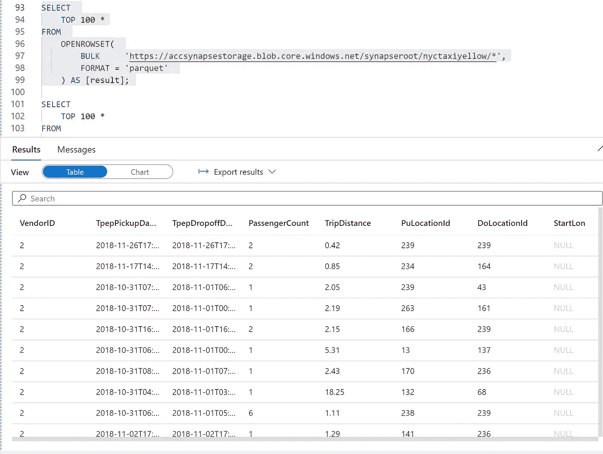
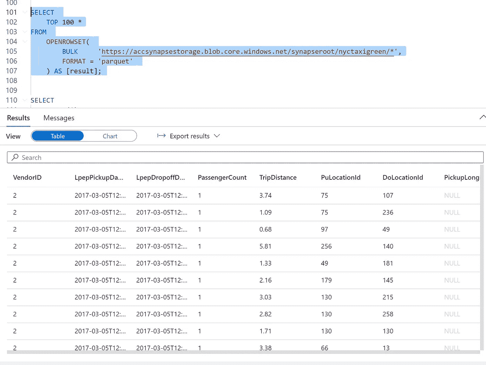
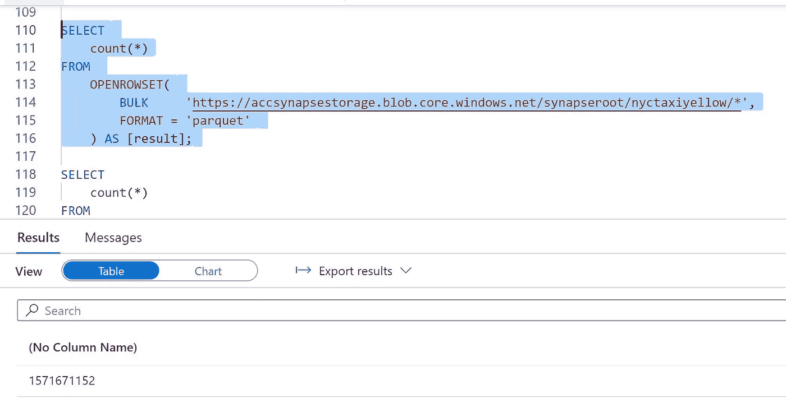
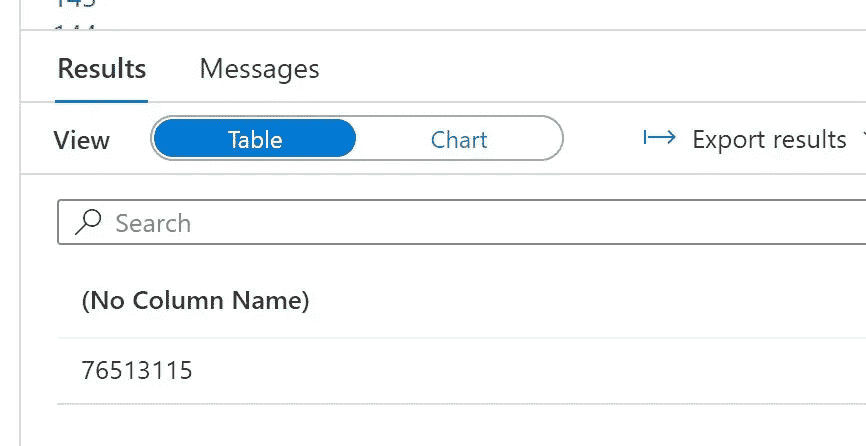
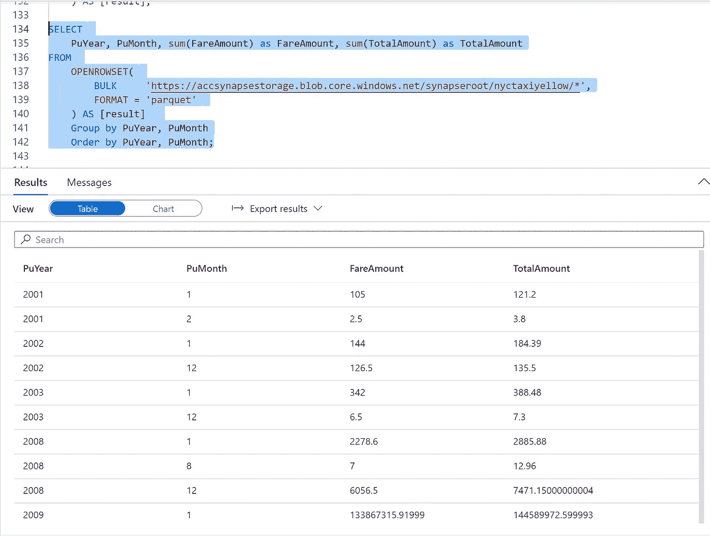

# azure Synapse Analytics SQL on demand 纽约数据集演示

> 原文：<https://medium.com/analytics-vidhya/azure-synapse-analytics-sql-on-demand-nyc-data-set-demo-adaf07e326f8?source=collection_archive---------17----------------------->

# 加载开源的纽约出租车数据集并进行查询处理

# 保存数据的 PySpark 代码

*   需要将开放数据集中的数据复制到本地 synapse 默认存储中
*   读取黄色出租车数据
*   以 pyspark 为语言创建一个笔记本

```
blob_account_name = "azureopendatastorage"
blob_container_name = "nyctlc"
blob_relative_path = "yellow"
blob_sas_token = r""

# Allow Spark to read from Blob remotely
wasbs_path = 'wasbs://%s@%s.blob.core.windows.net/%s' % (blob_container_name, blob_account_name, blob_relative_path)
spark.conf.set('fs.azure.sas.%s.%s.blob.core.windows.net' % (blob_container_name, blob_account_name),blob_sas_token)

# Spark read parquet, note that it won't load any data yet by now
yellowdf = spark.read.parquet(wasbs_path)
```

*   显示和验证数据集

```
display(yellowdf)
```

*   读取绿色出租车详细信息并显示

```
blob_account_name = "azureopendatastorage"
blob_container_name = "nyctlc"
blob_relative_path = "green"
blob_sas_token = r""

# Allow Spark to read from Blob remotely
wasbs_path = 'wasbs://%s@%s.blob.core.windows.net/%s' % (blob_container_name, blob_account_name, blob_relative_path)
spark.conf.set('fs.azure.sas.%s.%s.blob.core.windows.net' % (blob_container_name, blob_account_name),blob_sas_token)

# Spark read parquet, note that it won't load any data yet by now
greendf = spark.read.parquet(wasbs_path)
```

*   显示和验证数据集

```
display(greendf)
```

*   导入 pyspark 必需的库

```
import org.apache.spark.sql
```

*   是时候写黄色数据集了

```
yellowdf.write.mode('overwrite').parquet("/nyctaxiyellow")
```

*   将绿色数据集写入本地存储的时间到了

```
greendf.write.mode('overwrite').parquet("/nyctaxigreen")
```

*   现在数据已经加载完毕，让我们使用 sql 按需编写查询
*   转到开发并打开新的查询窗口
*   首先加载数据

```
SELECT
    TOP 100 *
FROM
    OPENROWSET(
        BULK     'https://storageacctname.blob.core.windows.net/synapseroot/nyctaxiyellow/*',
        FORMAT = 'parquet'
    ) AS [result];
```



```
SELECT
    TOP 100 *
FROM
    OPENROWSET(
        BULK     'https://storageacctname.blob.core.windows.net/synapseroot/nyctaxigreen/*',
        FORMAT = 'parquet'
    ) AS [result];
```



```
SELECT
    count(*)
FROM
    OPENROWSET(
        BULK     'https://storageacctname.blob.core.windows.net/synapseroot/nyctaxiyellow/*',
        FORMAT = 'parquet'
    ) AS [result];
```



```
SELECT
    count(*)
FROM
    OPENROWSET(
        BULK     'https://storageacctname.blob.core.windows.net/synapseroot/nyctaxigreen/*',
        FORMAT = 'parquet'
    ) AS [result];
```



```
SELECT
    PuYear, PuMonth, sum(FareAmount) as FareAmount, sum(TotalAmount) as TotalAmount
FROM
    OPENROWSET(
        BULK     'https://storageacctname.blob.core.windows.net/synapseroot/nyctaxiyellow/*',
        FORMAT = 'parquet'
    ) AS [result] 
    Group by PuYear, PuMonth
    Order by PuYear, PuMonth;
```



原故事来自:[https://github . com/balakreshnan/synapse analytics/blob/master/sqlondemandnyc . MD](https://github.com/balakreshnan/synapseAnalytics/blob/master/sqlondemandnyc.md)