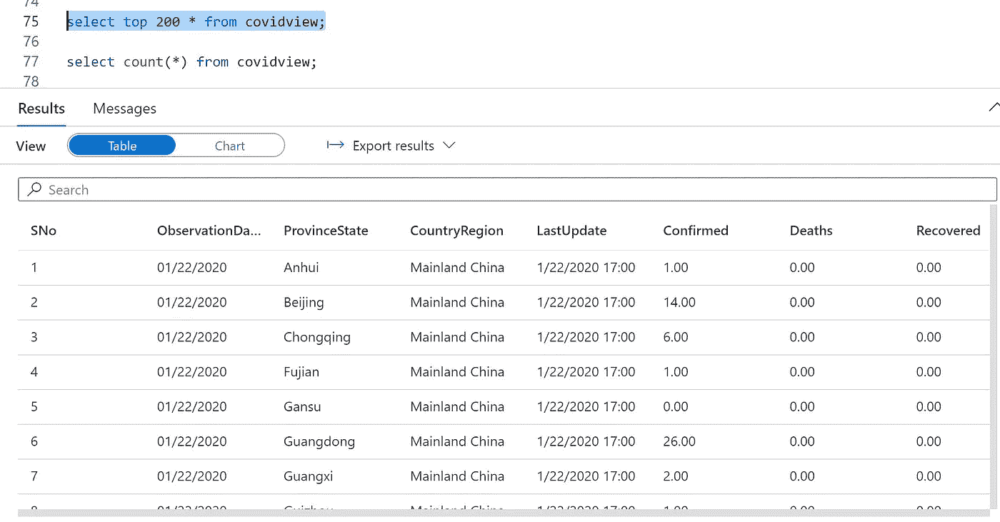
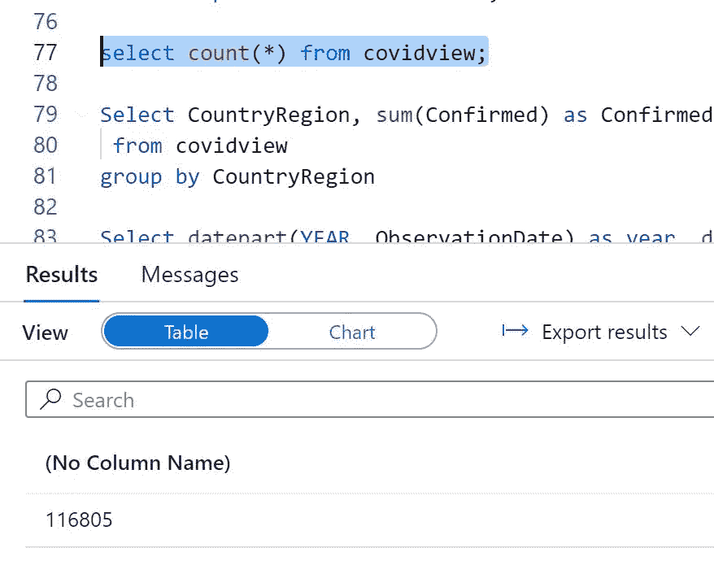
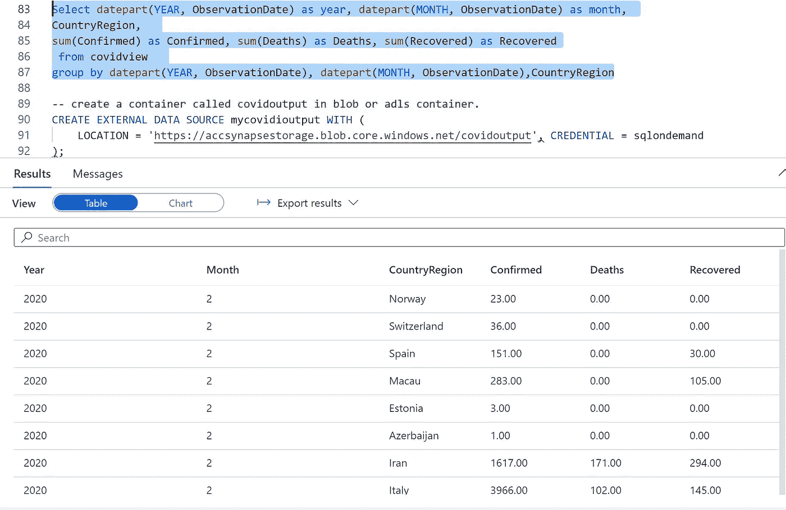
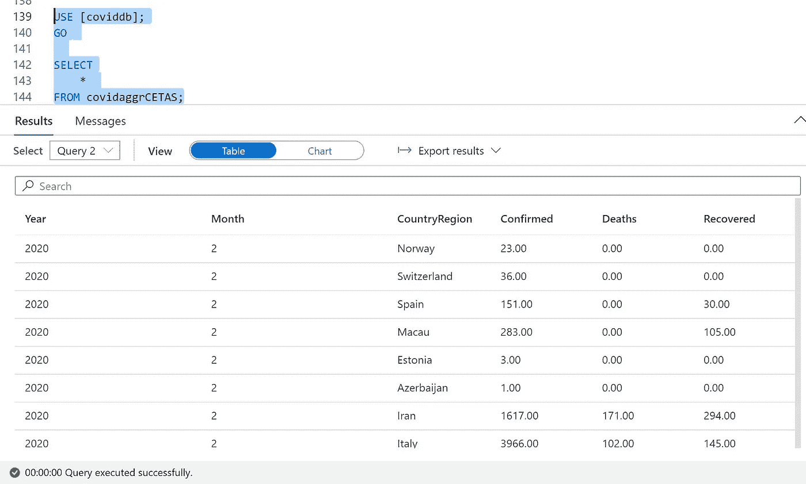

# azure Synapse Analytics SQL-on demand 与 Covid 19 数据集

> 原文：<https://medium.com/analytics-vidhya/azure-synapse-analytics-sql-ondemand-with-covid-19-dataset-bbb3b7173f3a?source=collection_archive---------22----------------------->

# 如何按需使用 Azure Synapse SQL 并做 ETL

# 用例

建立一个加载 covid 19 数据的系统，该数据可在 kaggle 网站上获得。

# 步伐

*   创建 Azure Syanpse 工作区资源
*   请确保存储 blob 容器所有者提供了托管实例的权限
*   去 Kaggal 网站下载 covid 19 数据集
*   样本文件也可在文件名为 covid_19_data 的数据文件夹中获得
*   在默认存储中创建名为 coviddata 的容器
*   使用门户或存储资源管理器上传文件(可在线安装或本地安装)
*   转到工作区
*   在开发部分创建新查询
*   首先，如果数据库不可用，我们需要创建一个数据库

```
CREATE DATABASE coviddb;
```

*   让我们加载样本数据，并确保它是否工作

```
CREATE VIEW covidview AS
SELECT
    *
FROM
    OPENROWSET(
        BULK 'https://<storageaccountname>.dfs.core.windows.net/coviddata/covid_19_data.csv',
        FORMAT = 'CSV',
        PARSER_VERSION='2.0',
        DATA_SOURCE = 'SqlOnDemandDemo',
        FIRSTROW = 2
    ) WITH (
      SNo int,
      ObservationDate varchar(50),
      ProvinceState varchar(200),
      CountryRegion varchar(200),
      LastUpdate varchar(50),
      Confirmed decimal(18,2),
      Deaths decimal(18,2),
      Recovered decimal(18,2)
) AS [result]
```

*   检查数据是否已加载

```
select * from covidview
```

*   现在让我们创建一个表来存储持久性数据
*   必须在 coviddb 中创建主密钥

```
use coviddb
CREATE MASTER KEY ENCRYPTION BY PASSWORD = 'xyxpojklnbgtyughd234!234$%';
```

*   现在在 coviddb 中创建一个凭证
*   要创建凭据，您需要 SAS 令牌密钥。
*   转到 ADLS 第二代集装箱
*   在左侧菜单中，单击 SAS 令牌
*   选择要提供访问权限的资源
*   选择时间范围
*   单击创建 sas 令牌。
*   注意:复制没有斑点 URI 的 SAS URL，如下所示。这只能使用一次，所以在您验证以下步骤之前，请不要关闭页面。

```
-- create credentials for containers in our demo storage account
CREATE DATABASE SCOPED CREDENTIAL sqlondemand
WITH IDENTITY='SHARED ACCESS SIGNATURE',  
SECRET = '?sv=2019-12-12&ss=bfqt&srt=sco&sp=rwdlacupx&se=2021-10-08T20:03:10Z&st=2020-10-08T12:03:10Z&spr=https&sig=73FwbAOqT3VI6SQ%2FjX1E0CQDo0y7Sri8%2FdAdgOnGE8w%3D'
GO
CREATE EXTERNAL DATA SOURCE SqlOnDemandDemo WITH (
    LOCATION = 'https://<storageaccountname>.blob.core.windows.net',
    CREDENTIAL = sqlondemand
);
```

*   我们将删除该视图，因为它已经如上所述存在

```
DROP VIEW IF EXISTS covidview;
GO
```

*   让我们创建一个具有持久存储的新视图

```
CREATE VIEW covidview AS
SELECT
    *
FROM
    OPENROWSET(
        BULK 'coviddata/covid_19_data.csv',
        FORMAT = 'CSV',
        PARSER_VERSION='2.0',
        DATA_SOURCE = 'SqlOnDemandDemo',
        FIRSTROW = 2
    ) WITH (
      SNo int,
      ObservationDate varchar(50),
      ProvinceState varchar(200),
      CountryRegion varchar(200),
      LastUpdate varchar(50),
      Confirmed decimal(18,2),
      Deaths decimal(18,2),
      Recovered decimal(18,2)
) AS [result]
```

*   让我们验证一下，数据是否加载正确

```
select top 200 * from covidview;
```



```
select count(*) from covidview;
```



*   现在让我们做一些 SQL 查询来模拟 ETL 活动

```
Select CountryRegion, sum(Confirmed) as Confirmed, sum(Deaths) as Deaths, sum(Recovered) as Recovered
 from covidview 
group by CountryRegionSelect datepart(YEAR, ObservationDate) as year, datepart(MONTH, ObservationDate) as month, 
CountryRegion, 
sum(Confirmed) as Confirmed, sum(Deaths) as Deaths, sum(Recovered) as Recovered
 from covidview 
group by datepart(YEAR, ObservationDate), datepart(MONTH, ObservationDate),CountryRegion
```



*   现在，我们希望将输出存储到另一个表中，以便进一步处理或可视化
*   为此，我们需要创建一个数据源
*   在门户中创建一个单独的容器作为 covidoutput
*   下面的语法不会创建新的容器，所以如果容器不存在将会出错

```
-- create a container called covidoutput in blob or adls container.
CREATE EXTERNAL DATA SOURCE mycovidioutput WITH (
    LOCATION = 'https://storageaccountname.blob.core.windows.net/covidoutput', CREDENTIAL = sqlondemand
);
GO
```

*   现在我们为拼花地板文件格式，作为更通用的文件格式

```
CREATE EXTERNAL FILE FORMAT [ParquetFF] WITH (
    FORMAT_TYPE = PARQUET,
    DATA_COMPRESSION = 'org.apache.hadoop.io.compress.SnappyCodec'
);
GO
```

*   现在是存储 ETL 输出的时候了

```
CREATE EXTERNAL TABLE [dbo].[covidaggrCETAS] WITH (
        LOCATION = 'covidAggr/',
        DATA_SOURCE = [mycovidioutput],
        FILE_FORMAT = [ParquetFF]
) AS
Select datepart(YEAR, ObservationDate) as year, datepart(MONTH, ObservationDate) as month, 
CountryRegion, 
sum(Confirmed) as Confirmed, sum(Deaths) as Deaths, sum(Recovered) as Recovered
 from covidview 
group by datepart(YEAR, ObservationDate), datepart(MONTH, ObservationDate),CountryRegion;
```

*   让我们验证并查看数据是否被保存(持久化)以供进一步处理

```
USE [coviddb];
GO

SELECT
    *
FROM covidaggrCETAS;
```



原文可在此处找到:

[https://github . com/balakreshnan/synapse analytics/blob/master/sqlondemand . MD](https://github.com/balakreshnan/synapseAnalytics/blob/master/sqlondemand.md)