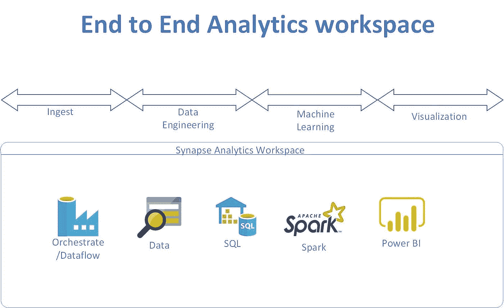

# Azure Synapse Analytics-Workspace-使用 Azure 机器学习运行自动化 ML

> 原文：<https://medium.com/analytics-vidhya/azure-synapse-analytics-workspace-run-automated-ml-using-azure-machine-learning-577b25423c46?source=collection_archive---------28----------------------->

统一的分析工具，可摄取、计算或处理数据、存储数据、高级分析或机器学习，并在一个工具中显示所有内容。端到端数据分析平台专为扩展和易用性而构建。



# Synapse 高级分析

Synapse 能够运行基于 spark 的代码，从而实现数据工程或特征工程以及机器学习。本文描述了如何在 synapse 中使用 spark 训练机器学习模型。

# 先决条件

*   创建 Azure 机器学习服务。选择与 synapse analytics 相同的区域。
*   创建 github repo
*   连接到管理部分中的回购
*   创建 pyspark 笔记本。
*   在笔记本的单独单元格中运行每个批处理语句。

# 设置工作区信息

*   让我们配置要访问的工作区
*   需要订阅 id、工作区名称和资源组名称
*   让我们导入工作空间

```
from azureml.core import Workspaceimport azureml.core 
print(azureml.core.VERSION)
```

*   当我测试时，它是 1.16.0
*   配置工作区

```
ws = Workspace.get(name="wsname", subscription_id='subid', resource_group='rgname')print('Workspace name: ' + ws.name, 'Azure region: ' + ws.location, 'Subscription id: ' + ws.subscription_id, 'Resource group: ' + ws.resource_group, sep = '\n')ws.write_config(path='.azureml')from azureml.core import Workspace
from azureml.core.compute import ComputeTarget, AmlCompute
from azureml.core.compute_target import ComputeTargetExceptionws = Workspace.from_config() # This automatically looks for a directory .azureml
# Choose a name for your CPU cluster
cpu_cluster_name = "cpu-cluster"
# Verify that the cluster does not exist already
try:
cpu_cluster = ComputeTarget(workspace=ws, name=cpu_cluster_name)
print('Found existing cluster, use it.')
except ComputeTargetException:
compute_config = AmlCompute.provisioning_configuration(vm_size='STANDARD_D2_V2',idle_seconds_before_scaledown=2400,min_nodes=0,max_nodes=4)
cpu_cluster = ComputeTarget.create(ws, cpu_cluster_name, compute_config)
cpu_cluster.wait_for_completion(show_output=True)
```

# 获取机器学习模型的数据集

```
from azureml.opendatasets import NycTlcGreen
import pandas as pd
from datetime import datetime
from dateutil.relativedelta import relativedeltagreen_taxi_df = pd.DataFrame([])
start = datetime.strptime("1/1/2015","%m/%d/%Y")
end = datetime.strptime("1/31/2015","%m/%d/%Y")

for sample_month in range(12):
    temp_df_green = NycTlcGreen(start + relativedelta(months=sample_month), end + relativedelta(months=sample_month)) \
        .to_pandas_dataframe()
    green_taxi_df = green_taxi_df.append(temp_df_green.sample(2000))

green_taxi_df.head(10)def build_time_features(vector):
    pickup_datetime = vector[0]
    month_num = pickup_datetime.month
    day_of_month = pickup_datetime.day
    day_of_week = pickup_datetime.weekday()
    hour_of_day = pickup_datetime.hour

    return pd.Series((month_num, day_of_month, day_of_week, hour_of_day))

green_taxi_df[["month_num", "day_of_month","day_of_week", "hour_of_day"]] = green_taxi_df[["lpepPickupDatetime"]].apply(build_time_features, axis=1)
green_taxi_df.head(10)columns_to_remove = ["lpepPickupDatetime", "lpepDropoffDatetime", "puLocationId", "doLocationId", "extra", "mtaTax",
                     "improvementSurcharge", "tollsAmount", "ehailFee", "tripType", "rateCodeID",
                     "storeAndFwdFlag", "paymentType", "fareAmount", "tipAmount"
                    ]
for col in columns_to_remove:
    green_taxi_df.pop(col)

green_taxi_df.head(5)green_taxi_df.describe()final_df = green_taxi_df.query("pickupLatitude>=40.53 and pickupLatitude<=40.88")
final_df = final_df.query("pickupLongitude>=-74.09 and pickupLongitude<=-73.72")
final_df = final_df.query("tripDistance>=0.25 and tripDistance<31")
final_df = final_df.query("passengerCount>0 and totalAmount>0")

columns_to_remove_for_training = ["pickupLongitude", "pickupLatitude", "dropoffLongitude", "dropoffLatitude"]
for col in columns_to_remove_for_training:
    final_df.pop(col)final_df.describe()
```

# 创建机器学习模型

```
from sklearn.model_selection import train_test_split

x_train, x_test = train_test_split(final_df, test_size=0.2, random_state=223)import logging

automl_settings = {
    "iteration_timeout_minutes": 2,
    "experiment_timeout_hours": 0.3,
    "enable_early_stopping": True,
    "primary_metric": 'spearman_correlation',
    "featurization": 'auto',
    "verbosity": logging.INFO,
    "n_cross_validations": 5
}from azureml.train.automl import AutoMLConfig

automl_config = AutoMLConfig(task='regression',
                             debug_log='automated_ml_errors.log',
                             training_data=x_train,
                             label_column_name="totalAmount",
                             **automl_settings)from azureml.core.experiment import Experiment
experiment = Experiment(ws, "taxi-experiment-fromsynapsews")
local_run = experiment.submit(automl_config, show_output=True)best_run, fitted_model = local_run.get_output()
print(best_run)
print(fitted_model)y_test = x_test.pop("totalAmount")

y_predict = fitted_model.predict(x_test)
print(y_predict[:10])from sklearn.metrics import mean_squared_error
from math import sqrt

y_actual = y_test.values.flatten().tolist()
rmse = sqrt(mean_squared_error(y_actual, y_predict))
rmse
```

-计算 MAPE 和精确度

```
from sklearn.metrics import mean_squared_error
from math import sqrt

y_actual = y_test.values.flatten().tolist()
rmse = sqrt(mean_squared_error(y_actual, y_predict))
rmseOutput:
Model MAPE: 0.1393469862795163 Model Accuracy: 0.8606530137204838
```

*最初发表于*[*【https://github.com】*](https://github.com/balakreshnan/synapseAnalytics/blob/master/synapseworkspace/azureMLtest.md)*。*