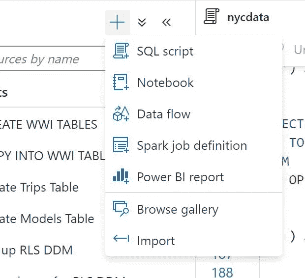
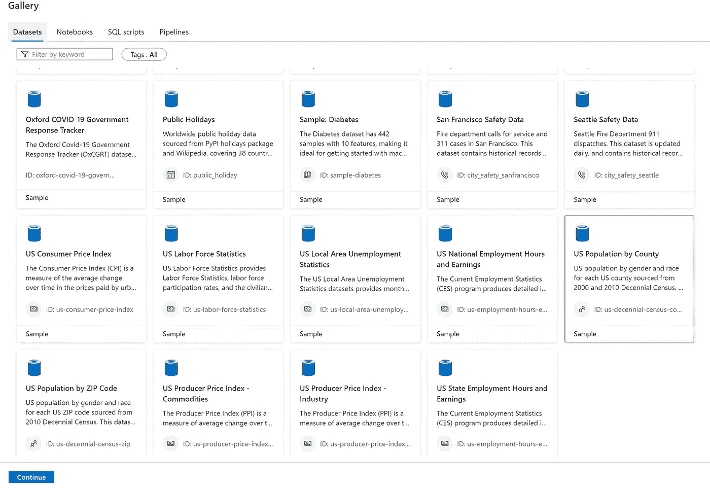
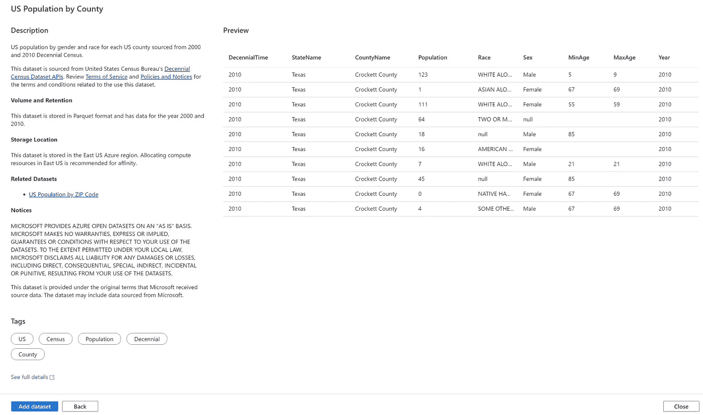
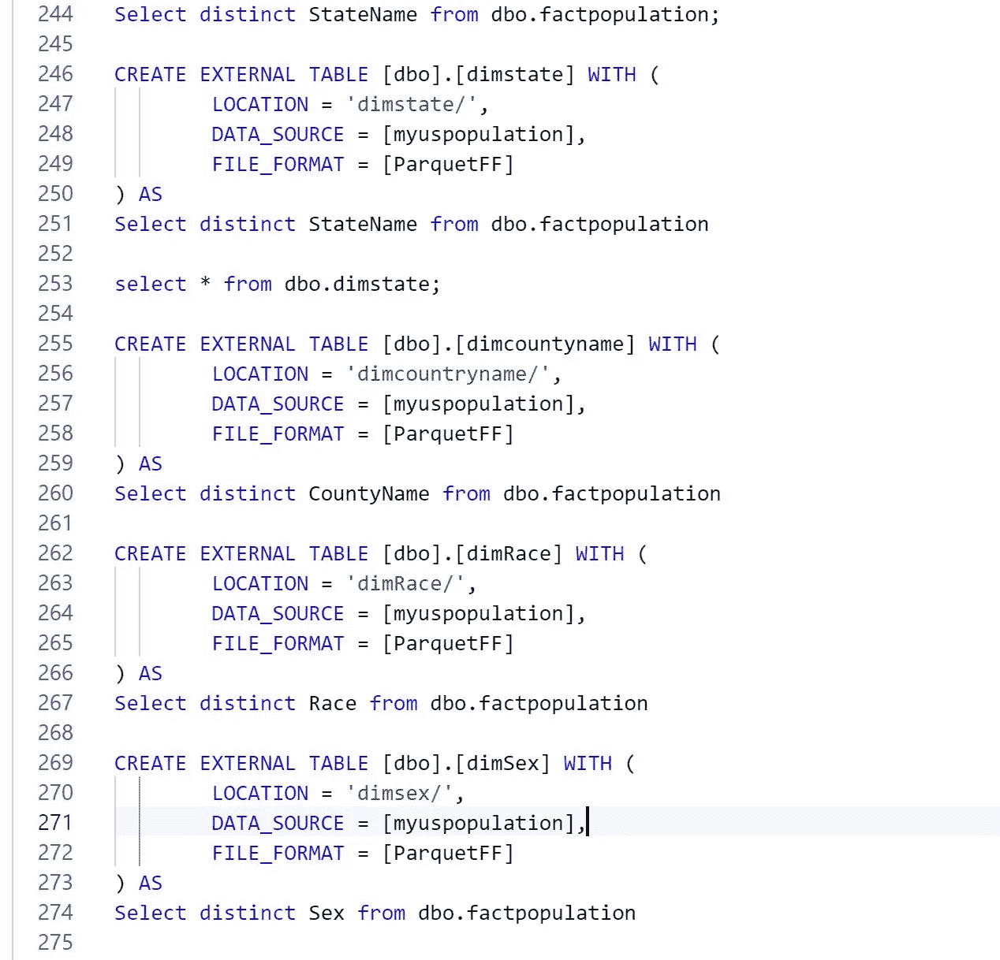

# Azure Synapse SQL Server less 创建事实和维度

> 原文：<https://medium.com/analytics-vidhya/azure-synapse-sql-server-less-create-facts-and-dimensions-e9ea35cd025b?source=collection_archive---------16----------------------->

# 复制公共数据集并创建事实和维度

# 用例



*   转到浏览图库并选择数据集
*   按县选择美国人口



*   要查看开源数据
*   在 synapse 工作区中打开查询

```
SELECT TOP 100 * FROM OPENROWSET( BULK     'https://azureopendatastorage.blob.core.windows.net/censusdatacontainer/release/us_population_county/year=*/*.parquet', FORMAT = 'parquet' ) AS [result];
```

*   现在是时候用拼花储物件创造事实和维度了
*   确保你有万能钥匙。然后创建数据源。
*   我用 nyctaxi 作为数据库。如果需要，创建你自己的
*   创建要写入的数据源
*   我已经根据文档创建了 sqlondemand/无服务器/内置凭据

```
DROP EXTERNAL DATA SOURCE uspopulation; 
use nyctaxi 
CREATE EXTERNAL DATA SOURCE myuspopulation WITH ( LOCATION = 'https://storagename.blob.core.windows.net/uspopulation', CREDENTIAL = sqlondemand ); 
GO
```

*   让我们首先创建事实
*   将创建一个名为 fact/的文件夹

```
use nyctaxi 
CREATE EXTERNAL TABLE [dbo].[factpopulation] WITH 
( 
LOCATION = 'fact/', 
DATA_SOURCE = [myuspopulation], 
FILE_FORMAT = [ParquetFF] ) AS 
SELECT     * FROM OPENROWSET( BULK     'https://azureopendatastorage.blob.core.windows.net/censusdatacontainer/release/us_population_county/year=*/*.parquet', FORMAT = 'parquet' ) AS [result];
```

*   现在是时候从事实中创建其他维度来模拟连接了
*   创建 dimstate

```
CREATE EXTERNAL TABLE [dbo].[dimstate] WITH ( LOCATION = 'dimstate/', DATA_SOURCE = [myuspopulation], FILE_FORMAT = [ParquetFF] ) AS Select distinct StateName from dbo.factpopulationCREATE EXTERNAL TABLE [dbo].[dimcountyname] WITH ( LOCATION = 'dimcountryname/', DATA_SOURCE = [myuspopulation], FILE_FORMAT = [ParquetFF] ) AS Select distinct CountyName from dbo.factpopulationCREATE EXTERNAL TABLE [dbo].[dimRace] WITH ( LOCATION = 'dimRace/', DATA_SOURCE = [myuspopulation], FILE_FORMAT = [ParquetFF] ) AS Select distinct Race from dbo.factpopulationCREATE EXTERNAL TABLE [dbo].[dimSex] WITH ( LOCATION = 'dimsex/', DATA_SOURCE = [myuspopulation], FILE_FORMAT = [ParquetFF] ) AS Select distinct Sex from dbo.factpopulation
```



*最初发表于*[*【https://github.com】*](https://github.com/balakreshnan/Accenture/blob/master/cap/populationdataset.md)*。*