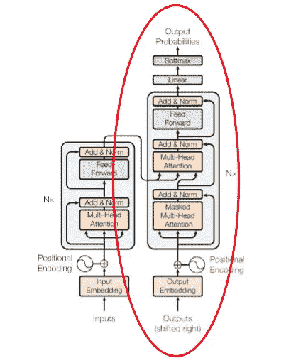
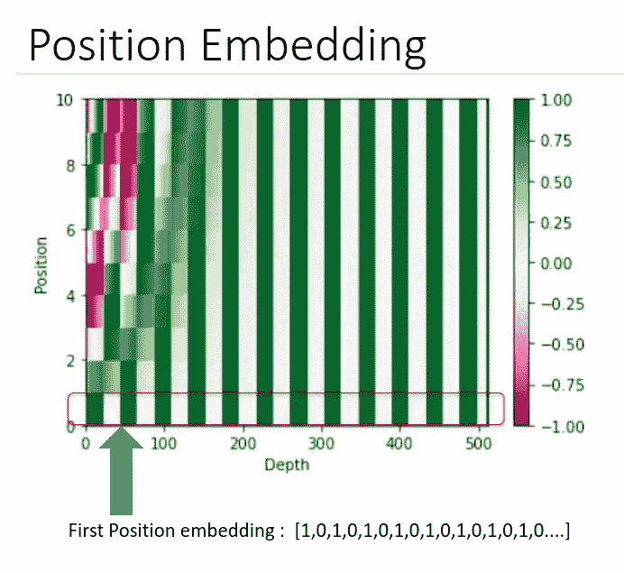
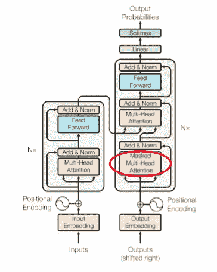
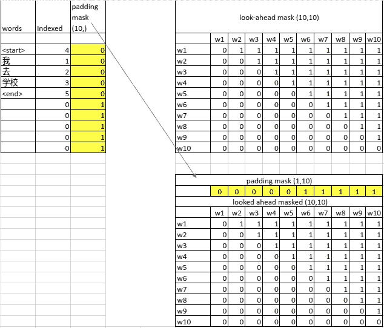
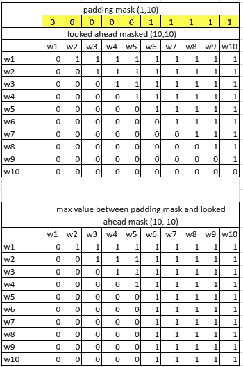
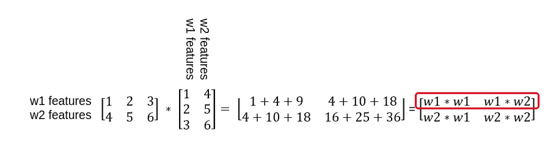
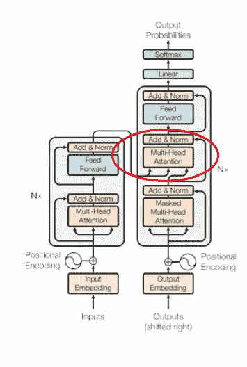
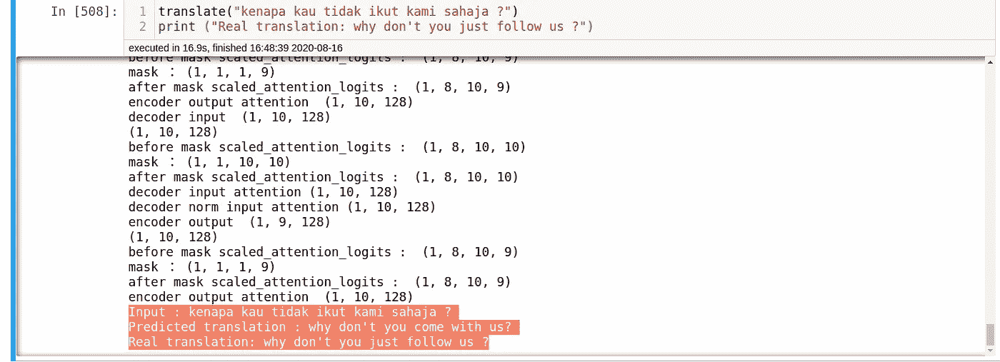
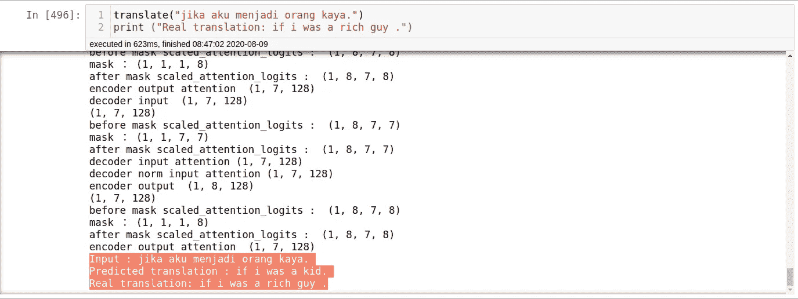

# 神经机器翻译的第二部分(解码器)——人类正在解决上帝赋予的挑战

> 原文：<https://medium.com/analytics-vidhya/baby-steps-in-neural-machine-translation-part-2-decoder-human-is-solving-the-challenge-given-by-4d097c961e67?source=collection_archive---------25----------------------->

*   带你了解机器翻译系统的解码器
*   一步一步，引导你通过代码和简短的解释
*   为你训练定制的机器翻译系统提供代码和数据。

这是从[第 1 部分—机器翻译系统的编码器](/machine-learning-evaluation-metrics-precision/baby-steps-in-neural-machine-translation-part-1-encoder-human-is-solving-the-challenge-given-d3f36b977828)的后续。第 1 部分简要解释了代码和通过编码器的张量流。如果你还没有阅读第 1 部分，我强烈建议你阅读[这篇文章](/machine-learning-evaluation-metrics-precision/baby-steps-in-neural-machine-translation-part-1-encoder-human-is-solving-the-challenge-given-d3f36b977828)，因为你会对编码器有全面的了解。如果你已经看完了这篇文章，让我们继续解码器部分。



机器翻译系统的解码器部分

解码器部分非常有趣，解码器的要点是前瞻掩模。由于这个掩码，我们在预测当前单词时过滤掉了未来单词的使用。这是什么意思？

在训练期间，我们通过将<start>标签附加到目标句子来将整个目标句子传递到解码器的输入，同时我们使用没有<start>标签的目标句子作为解码器的输出来训练解码器。这也意味着我们用当前单词来预测下一个单词。</start></start>

But there is something fishy here… We pass the entire target sentence with label <start> to the decoder during training. The decoder will use the future word information to predict my current word. For example: during training, the decoder input is (<start>, 我, 去, 学校) and the decoder output is (我, 去, 学校, <end>). Since we pass the entire target sentence to train the decoder, the decoder will be trained to use the future words information such as “去”, “学校” to predict “我”. This does not make sense!!! Because during prediction state, we do not know the future words. We could only predict “我” using “<start>” information. This is solved by using look-ahead mask. This mask will remove the future words information during training and this is done elegantly.

所以现在，我们知道了解码器的全貌。从这里开始，我们将更深入地研究张量的流动和变换。为了使流程更清晰，我们在这里假设目标句子被标记化、索引并附加有长度为 26 的标签(<start>、<end>)，并且我们并行处理 64 个目标句子。如果目标句子没有 26 个索引单词，该句子将被附加 0，直到 26 个单词。</end></start>

```
sentence 1 : "我 去 学校" => [1, 2] => [1,2,0,0,0,0,0,0,0,0,0,0,0,0,0,0,0,0,0,0,0,0,0,0,0,0...]
```

所以维数应该是(64，26)。然后，该张量(64，26)将流过嵌入层，并添加类似于编码器部分的位置信息，如在[部分 1](/machine-learning-evaluation-metrics-precision/baby-steps-in-neural-machine-translation-part-1-encoder-human-is-solving-the-challenge-given-d3f36b977828) 中所解释的。



定位嵌入公式

具有位置信息的解码器输入张量现在将具有(64，26，512)的维数。到目前为止，一切都类似于编码器。真正神奇的事情发生在张量流向被掩盖的多头注意力的时候。



掩蔽的多头-注意

前面我们知道，多头注意力只是把(64，26，512)的 512 个特征拆分成 8 组 26 个单词，每组 64 个特征(64，8，26，64)，并行处理。

*   soft max(Q * Transpose(K))= soft max((64，8，26，64) * (64，8，64，26) ) = softmax((64，8，26，26)) = (64，8，26， **26**
*   softmax(Q*Transpose(K)) * v = (64，8，26，26) * (64，8，26，64) = (64，8，26，26)

但是这个过程被修改为包括具有张量维数(64，1，26，26)的前瞻掩码。

*   soft max(Q * Transpose(K))= soft max((64，8，26，64) * (64，8，64，26) ) = softmax((64，8，26，26)) = (64，8，26， **26**
*   **mask**(soft max(Q * Transpose(K)))=(64，8，26， **26** )-(64，1，26， **26** ) = (64，8，26， **26** )
*   softmax(Q*Transpose(K)) * v = (64，8，26，26) * (64，8，26，64) = (64，8，62，26)

让我们来看看前瞻遮罩的细节。



填充掩码和前瞻掩码

前瞻遮罩与填充遮罩一起创建。为简单起见，此处显示的示例填充为长度 10，而不是 26。但想法是一样的。让我们看看填充面具。这个掩码非常简单，当我们给句子添加新单词时，它只分配“1”。这样做的目的是优化损失计算。当我们训练一个模型时，我们不想考虑来自填充单词的损失。而对于 look-head mask 来说，它是一个句子长度的方阵。(10, 10).如果我们的句子长度是 26，那么前瞻掩码将是(26，26)。当我们想要从句子中删除信息时，前瞻分配“1”。让我们看看行“w1”，我们只想保留第一个单词的信息，并删除其他单词的信息。现在，我们注意到我们阻止了解码器查看未来单词信息。此外，我们还想阻止填充词信息。因此，我们比较这两个掩码，并找出这两个掩码之间的最大值。请记住“1”的意思是:删除特定信息。我们稍后会知道如何删除特定的信息。



找出填充遮罩和前瞻遮罩之间的最大值

因为我们知道前瞻遮罩。让我们回顾一下掩蔽的多头注意力步骤

*   soft max(Q * Transpose(K))= soft max((64，8，26，64) * (64，8，64，26) ) = softmax((64，8，26，26)) = (64，8，26， **26** )
*   **mask**(soft max(Q * Transpose(K)))=(64，8，26， **26** )-(64，1，26， **26** ) = (64，8，26， **26**
*   softmax(Q*Transpose(K)) * v = (64，8，26，26) * (64，8，26，64) = (64，8，62，26)

正如我们在编码器部分所讨论的:softmax(Q*Transpose(K))意味着我们试图从其他单词的角度来表示这个单词。在解码器部分，我们试图从其他目标词的角度来表示目标词。



重述:来自其他单词的单词信息表示

But, we don’t want to represent the target word from future words. For example: we don’t want to represent “我” with information from “去”， “学校”. So, we minus the word representation from look-ahead mask. **mask**(softmax(Q*Transpose(K))) minus the target word representation(64, 8, 26, **26**) with “1”s generated in look-ahead mask(64, 1, 26, **26**). Now, we know that the target word representation does not contain future words information. This is superb!!!!!

然后，将目标单词表示乘以语言信息张量 V (64，8，26，64)以重新获得语言信息，之后，我们连接回 8 个组以形成 512 个特征(64，26，512)。这些过程与编码器部分相同。

现在，我们有来自掩蔽的多头注意力的输出，它是没有未来单词信息的目标单词表示(64，26，512)。张量将通过归一化过程。这是将使训练和预测更快的过程。先前的[编码器文章](/machine-learning-evaluation-metrics-precision/baby-steps-in-neural-machine-translation-part-1-encoder-human-is-solving-the-challenge-given-d3f36b977828)中给出了该过程的解释。



到目前为止，我们有来自编码器(64，62，512)的输出和来自掩蔽多头注意力(64，26，512)的输出。我们如何加入这两个输出的张量？

答案显示在红圈里。使用另一个多头注意力模块。现在，Q = (64，26，512)是解码器输出，K = V= (64，62，512)是编码器输出。于是，下面的过程又重复了一遍。

*   soft max(Q * Transpose(K))= soft max((64，8，26，64) * (64，8，64，62) ) = softmax((64，8，26，62)) = (64，8，26， **62**
*   softmax(Q*Transpose(K)) * v = (64，8，26， **62** ) * (64，8， **62 【T7，64) = (64，8，26， **64** )**

As we have gone through so many time, we know that this process softmax(Q*Transpose(K)) is actually represent the word information from other words perspective. This time, we are representing the target word from the perspective of source words. eg. We are representing the “我” from the perspective of “I”, “go”, “to”, “school”. sofmax means that we want to find the most appropriate source word representation to represent “我”. In this example, the best source word representation would be “I”. After finding the best word representation, we need to get the language information for the source words which is performed in softmax(Q*Transpose(K)) * **v** process. Finally, we will get a tensor (64, 8, 26, **64**) of target word with the source words representation and language information. Another superb move!!!

最后，用于训练整个机器翻译的损失函数只是一个交叉熵函数。我们已经到达了解码器的尽头，这也标志着机器翻译系统的终结。如果你一直跟随我到这里，我希望你能从阅读我的博客中获益良多。这是 [tensorflow](https://www.tensorflow.org/tutorials/text/transformer) 提供的[代码](https://www.tensorflow.org/tutorials/text/transformer) s，我发现这个很有用。当您运行代码并发现理解代码有困难时，请随时重温本文。你也可以参考“[注意力是你所需要的全部](https://arxiv.org/pdf/1706.03762.pdf)”一文。我觉得这些人是天才。如果你想训练你自己的模型，你可以使用来自[开放字幕(OPUS)](http://opus.nlpl.eu/) 的数据。我已经训练了一个马来语到英语的翻译模型，我想在这里展示一些结果。虽然我只使用 20 epoch 和 80k 数据集进行训练，但我觉得翻译相当不错。



```
Input : kenapa kau tidak ikut kami sahaja ?
Predicted translation : why don't you come with us?
Real translation: why don't you just follow us ?
```



```
Input : jika aku menjadi orang kaya.
Predicted translation : if i was a kid.
Real translation: if i was a rich guy .
```

希望你能喜欢你的造型。下一篇文章再见。