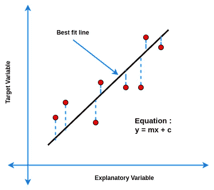
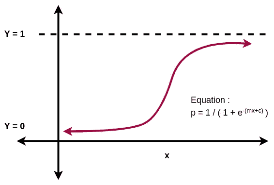
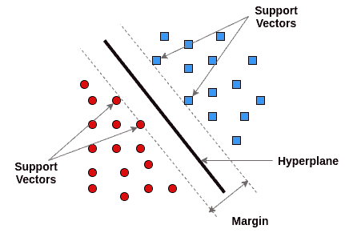
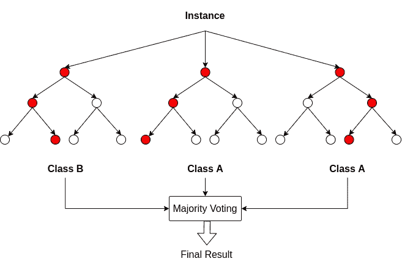

# 数据世界中的一小步…

> 原文：<https://medium.com/analytics-vidhya/baby-steps-in-the-data-world-6417ccb25154?source=collection_archive---------24----------------------->

朋友们好，过去几天我一直在探索数据科学的世界。我写这篇博客是为了表达我到目前为止学到的东西。我希望你会喜欢这个。

我们将在本文中讨论以下算法:

1.  线性回归
2.  逻辑回归
3.  支持向量机
4.  随机森林

# **线性回归:**

*   它是统计学和机器学习中著名的回归算法。
*   线性回归是对目标变量和一个或多个解释变量之间的关系进行建模的方法。
*   当只有一个解释变量时，回归被称为“**简单线性回归**”。
*   如果有一个以上的解释变量，那么，该算法被称为“**多元线性回归**”。

## **涉及的概念:**

*   线性回归包括寻找最佳拟合线。它是最能表达数据点之间关系的线。
*   最佳拟合线称为“**回归线**”。
*   **“最小二乘法”**是寻找最佳拟合线的最常用方法。

这里，m =直线的斜率

c =直线的 Y 轴截距。

## **什么时候用？**

*   对于回归问题。
*   当自变量和因变量之间存在线性关系时。
*   离群值最少的数据。
*   对于分类问题。

## **什么时候不用？**

*   一般来说，当目标变量是二元或分类变量时。
*   具有更多异常值的数据。

## **示例**

*   线性回归用于从汽车测试数据中研究发动机性能。

# **逻辑回归:二元分类器:**

*   逻辑回归算法可以为二元分类问题提供快速、透明的基线模型。
*   回归分析通过分析一个或多个特征变量和目标变量之间的关系来预测目标变量。
*   特征变量可以是数字的，也可以是分类的。

## **涉及概念:**

*   逻辑回归产生逻辑曲线，该曲线是使用目标变量的概率的自然对数构建的。
*   几率被定义为事件发生的概率除以事件不发生的概率。

赔率= ( p ) / ( 1 — p)

逻辑曲线看起来像…

这里，c =可以向左或向右移动曲线的常数

m =曲线的刚度

逻辑曲线限制在 0 和 1 之间。

## **什么时候用？**

*   对于分类问题。
*   当输出变量为二进制格式时，如真/假、通过/失败等格式。
*   当你认为解释变量和目标变量有关系时。
*   具有良好表现的数据，即具有较少异常值和缺失值以及清晰关系的数据。

## **什么时候不用？**

*   当目标变量连续时。
*   当你有大量数据时。
*   当数据难以处理时。

## **举例**

*   使用逻辑回归来检测垃圾邮件。

# **支持向量机(SVM) :**

*   SVM 是一种受监督的机器学习算法，用于查找对数据点进行分类的 n 维空间。
*   支持向量机的基本思想是找到将数据集分成两类的最佳超平面。

## **涉及的概念:**

为了理解 SVM 的工作方式，首先，我们必须了解它的一些基本术语。

*   **超平面:**对 n 维数据点进行分类的平面。在 2D 的情况下，它是一条线，对于 3D 来说，它是一个平面。
*   **边距:**不同类别的最近数据点之间的距离称为边距。
*   **支持向量**:支持向量是离超平面最近的数据点。
*   画无限数量的超平面是可行的，但是 SVM 使用最大边缘超平面来选择最优的一个。
*   具有最大间距的超平面产生最佳输出。

## **什么时候用？**

*   对于分类问题。
*   当目标变量是二进制时。具有高特征行数比的数据(胖数据和短数据)。
*   独立特征与目标变量有复杂关系的数据。

## **什么时候不用？**

*   当特征与行的比率较低时。
*   透明度更重要的时候。
*   当你需要一个快速的基准模型时。

## **示例**

*   SVM 在生物信息学中有许多应用。它被实现来对蛋白质进行分类。

# **随机森林算法:**

*   随机森林是一种监督学习算法，它依次构建多个决策树，并将它们合并在一起，以获得更准确和稳定的预测。
*   名称' **Random** '来源于模型构建过程中的随机数据采样以及分割节点时考虑的随机特征子集。

## **涉及的概念:**

*   随机森林算法在数据样本上创建决策树，然后从每个样本中获得预测，最后通过投票选择最佳解决方案。
*   集成方法优于单个决策树，因为它通过平均结果来减少过拟合。

*   大量相对不相关的树，作为一个委员会运作，将优于任何成分模型。
*   模型之间的低相关性是关键。

## **什么时候用？**

*   用于分类和回归问题。
*   当目标变量是分类变量或连续变量时。
*   当数据有缺失值或异常值时。
*   当数据集较大且维数较高时。

## 什么时候不用？

*   对于非常复杂的问题。
*   透明度更重要。
*   当预测时间很重要时。

## 例子

*   电子商务中使用随机森林算法来预测客户是否喜欢该产品。

所以，博客到此结束。

我希望这篇文章能帮助你更好地理解算法，并在选择能产生最佳结果的算法时节省你的时间。

我很快会带着数据科学世界中的其他令人兴奋的东西回来。

快乐学习！！！