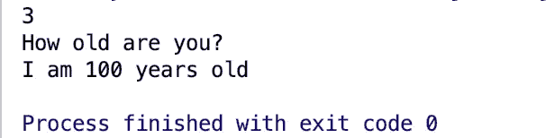
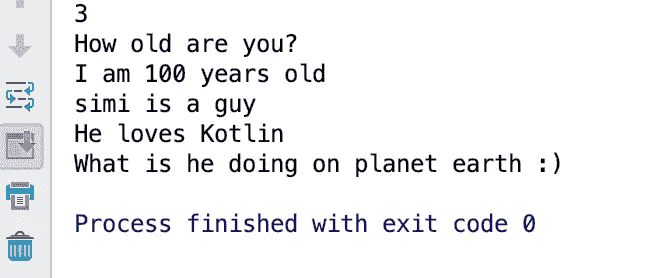

# 用 Kotlin 编程#2 函数的初级步骤

> 原文：<https://medium.com/analytics-vidhya/baby-steps-to-programming-2-functions-daeffe2ccb29?source=collection_archive---------22----------------------->


[卢博米金](https://unsplash.com/@lubomirkin?utm_source=unsplash&utm_medium=referral&utm_content=creditCopyText)在 [Unsplash](https://unsplash.com/s/photos/baby-steps-programming?utm_source=unsplash&utm_medium=referral&utm_content=creditCopyText) 上拍摄的照片

你好，
很高兴你在这里，我希望你过得很好！。欢迎回到我们的编程初级课程。

如果你是 Kotlin 编程的新手，并且想开始学习，请查看[上一篇关于设置环境和编写第一个 Kotlin 程序的文章](/@simi.aluko/starting-kotlin-programming-6cabbcf005e1?sk=8132624f165aad84150fc1d725667971)。

所以今天我们就来看看函数😊

## 功能

一个功能就像一组组合在一起执行一个功能的代码(顾名思义🤷🏼‍♂️)，或者组合在一起为你做一些事情的代码。这么简单，你可以再读一遍。一个例子是我们下面看到的`main`函数；*记住是我们节目的切入点*。

```
**fun** main(){
    *println*(**"Hello, It's simi!"**)
}
```

***外卖***

*   `fun`用来告诉 Kotlin 编译器你正在创建一个函数。
*   `main`是函数的名字。
*   `()`每个功能都有这个。
*   `{}`存放着这套代码。

**NB。** `Println`用于显示代码输出/打印代码结果到控制台。

***再比如***

```
**fun** main(){
    *println*(1 + 2)
    *println*(**"How old are you?"**)
    *println*(**"I am 100 years old"**)
    *simi*()
}
```

在您的 IDE 中编写上面的代码并运行它，您应该会看到`main`函数中的所有内容都打印出来了。这基本上是关于函数的。

## 创建自己的函数

除了`main`函数，你可以创建你自己的函数，并给它起任何名字，任何名字！很酷是吗？没错。

看看下面写的代码，我们添加了另一个名为`simi()` ( *用你的名字代替)*

```
**fun** main(){
    *println*(1 + 2)
    *println*(**"How old are you?"**)
    *println*(**"I am 100 years old"**)
}

**fun** simi(){
    *println*(**"simi is a guy"**)
    *println*(**"He loves Kotlin"**)
    *println*(**"What is he doing on planet earth :)"**)
}
```

我们有两个功能`main()`和`simi()`。您可以运行代码，看看会发生什么。

结果如何呢？你应该看看这个…



以上代码使用两个函数`main()`和 simi()的结果

显然，`simi()`中的内容不会打印到控制台。这是为什么呢？让我们来看看…

## 调用函数

在其他函数中的代码可以被执行之前，它们需要被引用或者你可以说被调用。简单地说，你正在调用*函数*来做一些事情。

编辑`main`函数，如下图所示。仔细一看，`simi()`已经加进去了。

```
**fun** main(){
    *println*(1 + 2)
    *println*(**"How old are you?"**)
    *println*(**"I am 100 years old"**)
    *simi*()
}
```

再次运行你的程序，它应该包含`main`函数和`simi()` 函数。您应该会看到`main()`和`simi()`中的所有内容都被打印出来，如下图所示。



执行 main()和 simi()函数的结果。

如果你坚持到底，你就很棒👍🏽。你已经了解了

*   功能是什么。
*   如何创建函数？
*   如何调用函数？

## 但是等等…为什么是函数？

一些简单的用途包括:

*   模块化:它们可以帮助你将一组代码组合在一起做一件特定的事情。
*   更干净、可读性更强的代码。
*   **代码重用性:**可以随时调用函数。

暂时就这样了。干得好的👏🏽👏🏽

干得好，❤️

**照顾一些行话……
*编译器:*** *它是用来处理你写的代码，转换成计算机理解的。你可以说从 Kotlin 编程语言到机器语言。*

*如果你不知道如何运行程序，或者不知道如何遵循本文，你可能想读一下上一篇文章* [***编程的第一步开始 Kotlin 编程。***](/@simi.aluko/starting-kotlin-programming-6cabbcf005e1?sk=8132624f165aad84150fc1d725667971)

*所有课程的完整源代码可以在这个 repo 中找到:*[*https://github . com/simi-aluko/baby-steps-to-programming-in-kotlin*](https://github.com/simi-aluko/baby-steps-to-programming-in-kotlin)