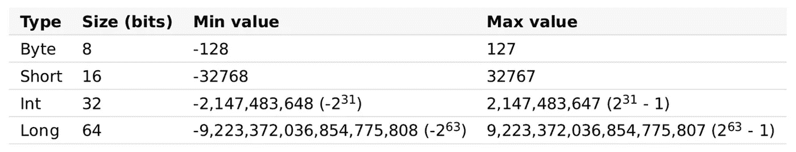
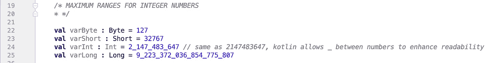
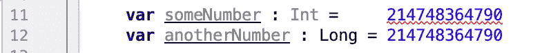
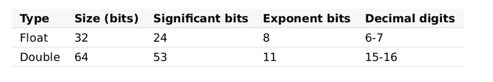
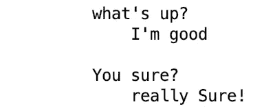

# Kotlin 中编程#4 变量类型的初级步骤

> 原文：<https://medium.com/analytics-vidhya/baby-steps-to-programming-4-variable-types-in-kotlin-21b2acf95193?source=collection_archive---------26----------------------->


[下田由里](https://unsplash.com/@itshoobastank?utm_source=unsplash&utm_medium=referral&utm_content=creditCopyText)在 [Unsplash](https://unsplash.com/s/photos/baby-toys?utm_source=unsplash&utm_medium=referral&utm_content=creditCopyText) 上的照片

你好，

我相信假期过得很愉快，祝你新年快乐也是我的荣幸！欢迎来到 Kotlin 编程入门系列的第四课。今天我们将学习变量类型。这应该是一本有趣且有启发性的读物。我们开始吧。

从[上一篇文章](/@simi.aluko/baby-steps-to-programming-3-variables-and-comments-in-kotlin-98d9c2fbad95?source=friends_link&sk=bd02847a30c3a0e1bc5943cead33f5cb)中，了解了什么是变量，你应该已经注意到这些变量可以存储不同的东西，比如数字和字符串文本。这篇文章主要告诉你变量可以引用什么类型的东西。在我们开始真正的工作之前，让我们记住基本的变量类型:

*   数字
*   特性
*   布尔运算
*   数组
*   用线串

## **指定类型**

Kotlin 中的变量总是有类型的。这意味着变量总是属于一种类型；不管是字符串、数字还是别的什么。变量的类型可以显式编写，或者 kotlin 编译器在创建变量时推断变量的类型。看看下面这两种情况是如何写的:

```
*/*
** ***EXPLICIT DECLARATION OF VARIABLE TYPE SYNTAX*** **
** ***val*** *variableName : variableType = variableValue
* */

/*
** ***DECLARATION OF VARIABLE TYPE WITHOUT SPECIFYING TYPE*** **
** ***val*** *variableName = variableValue
*
* N.B. compiler infers what type variable is.
*
* */*
```

我希望这有意义🤷🏼‍♂️，即使它没有完全，我想你会得到它，因为我们的进展。现在来看实际的变量类型…

## 数字

从我们的小学时代起，每个人都知道数字是什么，不管你喜不喜欢，哈哈，你肯定知道它们是什么。就像数学一样，我们有整数和小数。相应地，在 Kotlin 编程中我们有整数和浮点数。

**整数数字** 在 Kotlin 编程世界中，我们有不同类型的整数，它们如下表所示:



整数类型。来源:Kotlin 文档 pdf。

范姆，不要让桌子的样子吓到你或打扰你。需要注意的一件非常重要的事情是整数类型的`Min`和`Max`值。它只是暗示了你可以分配给一个特定类型变量的最大和最小数值。我希望这有意义。



基于类型保存最大值的整数变量。

根据上表，尝试将大于`max` 值的值赋给某个变量类型，看看会发生什么。

编译器抱怨…



将一个比 Int 的最大值大的值赋给 Int 变量类型。

数字不容易，去喝杯水吧。

**浮点数(小数)** 这里有两种，只是俗称的`Float`和`Double`。就像之前一样，看一下它的表:



浮点数类型。来源:Kotlin 文档 pdf。

我们这里最重要的是区分类型的十进制数字。让我们举一个例子:

```
*/* FLOAT AND DOUBLE NUMBER TYPE
* */* **val** floatVariable : Float = 3.123456789f
**val** doubleVariable : Double = 3.123456789

***println*(**floatVariable**) **  ***// 3.1234567*** *rounded up to fit in a float* ***println*(**doubleVariable**)**  ***// 3.123456789*** 
```

当你用 Kotlin 写一个十进制数时，它默认为一个`Double`。`Double`比`Float`容纳更多的十进制数字。为了表示您想要一个`Float` ，请在小数点后添加一个`F`或`f`

> 试着在你的 IDE 中自己处理数字变量和类型，记得为任何误解或想法留下评论或注释。

## **布尔型**

计算机有它自己的方式说是或不是，虽然不是字面上的，它使用真或假。这是布尔类型。当变量为真或假时，它就是布尔型变量。

```
*/** ***BOOLEAN TYPE*** ** */* **val** isEarthSpherical : Boolean = **true
val** isEarthFlat : Boolean = **false
val** someBoolean = **true**
```

> 可以省略显式指定类型，编译器可以为您推断出来。

## **人物**

变量的字符类型具有用单引号括起来的单个值。它由`Char`关键字表示。

```
**val** aCharacterVariable : Char = **'c'
val** anotherCharacterVariable : Char= **'1'
val** aCharacter = **'+'** *// Char type is inferred.* ***println*(**aCharacter**)**               ***// +******println*(**aCharacterVariable**)**       ***// c******println*(**anotherCharacterVariable**)** ***// 1***
```

## 数组

当您想要将一组值赋给单个变量时，数组就派上了用场。它们可以保存多个值。`Array` 类型由`Array<T>`表示。其中 T 是数组包含的值的类型。下面显示了一个示例:

```
*/*
*
* ARRAY TYPE
*
* */* **val** intArray : Array<Int> = *arrayOf*(1, 2, 3, 4, 5)
**val** booleanArray : Array<Boolean> = *arrayOf*(**true**, **false**, **false**)
**val** fruitArray : Array<String> = *arrayOf*(**"apple"**, **"oranges"**, **"melon"**)
```

**访问数组条目** 获取`Array`中的值同样简单，你可以使用`[ ]`方括号。要放入方括号中的值的索引。

```
*println*(**"The 5th element in the intArray is "** + intArray[4])
*println*(**"The last fruit in the fruit array is "** + fruitArray[2])

*//* ***COMPILATION OUTPUT*** *//
// The 5th element in the intArray is 5
// The last fruit in the fruit array is melon*
```

> `*Arrays*`从 0 开始计数，所以`*intArray[4]*`挑 5，`*fruitArray[2]*`挑瓜。

## **琴弦**

它们是用引号或三引号括起来的文本。你应该从一开始就看到他们。下面显示了一个示例:

```
**val** aString : String = **"what's on your mind? "
*println*(**aString**)    // what's on your mind?*****println*(**aString + **"None of your business!")**
 *// what's on your mind? None of your business!*
```

**Raw Strings** 这是一个很酷的功能。这些是用三重引号括起来的字符串。字符串完全按照键入的内容打印出来，并保留其格式。它也可以包含任意文本。

```
**val** rawString = **"""
    what's up?
        I'm good

    You sure?
        really Sure!

"""**
```

…这是输出结果:



…瞧！！你终于到达终点了🤗🤗

恭喜你！！你成功了！非常感谢您抽出时间阅读这篇文章。请继续关注更多课程。

所有课程的完整源代码可以在这个 repo 中找到:[https://github . com/simi-aluko/baby-steps-to-programming-in-kotlin](https://github.com/simi-aluko/baby-steps-to-programming-in-kotlin)

保佑❤️