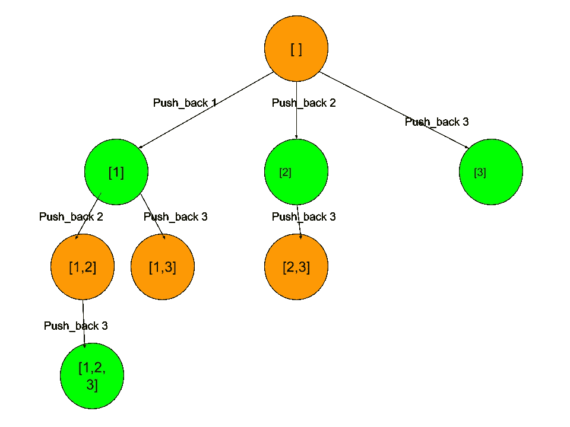

# 追踪

> 原文：<https://medium.com/analytics-vidhya/backtracking-42aee84b5e39?source=collection_archive---------13----------------------->

使用回溯的总结可以在这里找到[。](https://leetcode.com/problems/permutations/discuss/18239/A-general-approach-to-backtracking-questions-in-Java-%28Subsets-Permutations-Combination-Sum-Palindrome-Partioning%29)

我想通过解决几个 leetcode 问题来演示如何使用这个算法。

## [78。子集](https://leetcode.com/problems/subsets/)

递归(32 毫秒)

```
class Solution:
    def subsets(self, nums: List[int]) -> List[List[int]]:
        if len(nums)==0:return [[]]
        if len(nums)==1:return [[], nums]
        res = self.subsets(nums[1:])
        return res+[[nums[0]]+r for r in res]
```

迭代(24 毫秒)

```
class Solution:
    def subsets(self, nums: List[int]) -> List[List[int]]:
        res = [[]]
        for num in nums:
            res += [[num] + r for r in res]
        return res
```

Itertools.product

```
class Solution:
    def subsets(self, nums: List[int]) -> List[List[int]]:
        return [[x for x in l if x is not None] for l in itertools.product(*zip(nums, [None]*len(nums)))]
```

位操作

```
class Solution:
    def subsets(self, nums: List[int]) -> List[List[int]]:
        def f(i):
            return [nums[j] for j in range(len(nums))
                    if i & (1<<j)]
        return [f(i) for i in range(1<<len(nums))]
```

# C++

## 循环

```
class Solution {
public:
    vector<vector<int>> subsets(vector<int>& nums) {
        vector<vector<int>> res = {{}};
        for(auto &num:nums){
            const int n=res.size();
            for(int j=0;j<n;++j){
                res.push_back(res[j]);
                res.back().push_back(num);
            }
        }
        return res;

    }
};
```

## 追踪

```
class Solution {
public:
    vector<vector<int>> subsets(vector<int>& nums) {
        vector<vector<int>> res;
        vector<int> this_res;
        subsets(nums, 0, this_res, res);
        return res;
    }
private:
    void subsets(vector<int>& nums, int i, vector<int>& this_res, vector<vector<int>>& res) {
        res.push_back(this_res);
        for (int j = i; j < nums.size(); j++) {
            this_res.push_back(nums[j]);
            subsets(nums, j + 1, this_res, res);
            this_res.pop_back();
        }
    }
};
```

“[1，2，3]”输入的输出

```
[[],[1],[2],[1,2],[3],[1,3],[2,3],[1,2,3]]
```

回溯过程如下所示:



回溯过程

位操作

```
class Solution {
public:
    vector<vector<int>> subsets(vector<int>& nums) {
        int n=1<<nums.size();
        vector<vector<int>> res(n);
        for(int i=0;i<n;++i){
            for(int j=0;j<nums.size();++j){
                if((1<<j)&i)res[i].push_back(nums[j]);
            }
        }
        return res;
    }
};
```

或者

```
class Solution {
public:
    vector<vector<int>> subsets(vector<int>& nums) {
        int n = nums.size(), p = 1 << n;
        vector<vector<int>> subs(p);
        for (int i = 0; i < p; i++) {
            for (int j = 0; j < n; j++) {
                if ((i >> j) & 1) {
                    subs[i].push_back(nums[j]);
                }
            }
        }
        return subs;
    }
};
```

## [N 皇后区](https://leetcode.com/problems/n-queens/)

Python 代码

```
class Solution:
    def solveNQueens(self, n: int) -> List[List[str]]:
        def dfs(queens, xy_dif, xy_sum):
            p = len(queens)
            if p==n:
                result.append(queens)
                return None
            for q in range(n):
                if q not in queens and p-q not in xy_dif and p+q not in xy_sum: 
                    dfs(queens+[q], xy_dif+[p-q], xy_sum+[p+q])  
        result = []
        dfs([],[],[])
        return [ ["."*i + "Q" + "."*(n-i-1) for i in sol] for sol in result]
```


参考[https://daisyleetcode 2014 . WordPress . com/2014/05/12/n-queens % E8 % A7 % A3 % E6 % B3 % 95-DFS/](https://daisyleetcode2014.wordpress.com/2014/05/12/n-queens%E8%A7%A3%E6%B3%95-dfs/)

我们可以稍微修改一下 python 代码。这是一个非常清晰的回溯解决方案。

```
class Solution:
    def solveNQueens(self, n: int) -> List[List[str]]:
        def dfs(queens, rc_dif, rc_sum):
            r = len(queens)
            if r==n:
                results.append(queens)
                return None
            for c in range(n):
                rc_d, rc_s = r-c+n-1, r+c
                if c not in queens and not rc_dif[rc_d] and not rc_sum[rc_s]: 
                    rc_dif[rc_d], rc_sum[rc_s] = 1, 1
                    dfs(queens+[c], rc_diff, rc_sum) 
                    rc_dif[rc_d], rc_sum[rc_s] = 0, 0
        results = []
        rc_diff, rc_sum = [0]*(2*n), [0]*(2*n)
        dfs([],rc_diff, rc_sum)
        return [ ["."*i + "Q" + "."*(n-i-1) for i in sol] for sol in results]
```

以上图片参考的 C++代码。它相当快。运行时间只有 4 毫秒左右。

按行

```
class Solution {
public:
    vector<vector<string> > solveNQueens(int n) {
        vector<vector<string>> results;
        vector<int> q_pos_row;
        solveNQueens(results, q_pos_row, 0, n);
        return results;
    }

    void solveNQueens(vector<vector<string> > &results, vector<int> &q_pos_row, int row, int n)
    {
        if (row == n)
            convert(results, q_pos_row);//one solution is put into the result vector
        else{
            for(int col=0;col<n;++col){
                if (is_valid(q_pos_row, row, col)){
                    q_pos_row.push_back(col);
                    solveNQueens(results, q_pos_row, row+1,n);
                    q_pos_row.pop_back();
                }
            }
        }

    }

    void convert(vector<vector<string> > &results, vector<int> &q_pos_row){
        int n = q_pos_row.size();
       vector<string>path;
        for(int i=0;i<n;++i){
            string s(n,'.');
            s[q_pos_row[i]] = 'Q';
            path.push_back(s);
        }
        results.push_back(path);
    }

    bool is_valid(vector<int> &q_pos_row, int row, int col){
        for(int i=0;i<q_pos_row.size();++i){
            if(col==q_pos_row[i] || abs(row-i)==abs(col-q_pos_row[i]))return false;
        }
        return true;

    }
};
```

## [22。生成括号](https://leetcode.com/problems/generate-parentheses)

追踪

我们可以选择的每一步

1.  添加”(“如果左> 0，则有效
2.  添加")"如果右>左，则有效

left ==right ==0 表示我们完成了。

```
class Solution:
    def generateParenthesis(self, n: int) -> List[str]:
        res = []
        def generate(parenthesis, left, right):
            if right ==0 and left == 0:  
                res.append(parenthesis)
                return
            if left>0:
                generate(parenthesis + '(', left-1, right)
            if right > left:
                generate(parenthesis + ')', left, right-1)
        generate("", n, n)
        return res
```

## [79。单词搜索](https://leetcode.com/problems/word-search/)

## Python 代码

```
class Solution:
    def exist(self, board: List[List[str]], word: str) -> bool:
        d = []
        if not word or not word[0]:return bool(word)
        if not word:return True
        R, C = len(board), len(board[0])
        for i in range(R):
            for j in range(C):
                if board[i][j] == word[0]:d.append((i,j))
        if not d:return False
        def dfs(seen, i,j, idx):
            if idx == len(word)-1:return True
            for di, dj in [(0,1),(0,-1),(1,0),(-1,0)]:
                r, c =i+di, j+dj
                if 0<=r<R and 0<=c<C and (r,c) not in seen and board[r][c]==word[idx+1] :
                    seen.add((r,c))
                    if dfs(seen, r, c, idx+1):return True
                    seen.remove((r,c))
            return False
        return any(dfs({(i,j)},i,j, 0) for i,j in d)
```

一种更简洁的方法是通过修改纸板值来指示该位置是否可见

```
class Solution:
    def exist(self, board: List[List[str]], word: str) -> bool:
        R, C = len(board), len(board[0])
        def dfs(i, j, k):
            if i<0 or i>=R or j<0 or j>=C:return False
            if board[i][j]!=word[k]:return False
            if k==len(word)-1:return True
            old_val = board[i][j]
            board[i][j] = '#'
            if any(dfs(i+di, j+dj, k+1) 
                   for di, dj in [(1,0),(-1,0),(0,1),(0,-1)]):return True
            board[i][j] = old_val
            return False
        if any(dfs(i,j,0) for i in range(R) 
                          for j in range(C)
                          if board[i][j] == word[0]):return True
        return False
```

## C++代码

```
class Solution {
public:
    bool dfs(vector<vector<char>>& board, string &word, int i, int j, int k)
    {
        if (i<0 || i>=board.size() || j<0 || j>=board[0].size())return false;
        if(board[i][j]!=word[k])return false;
        if (k==word.length()-1)return true;
        auto original_val = board[i][j];
        board[i][j] = '#';
        if(dfs(board, word, i-1, j, k+1) ||
           dfs(board, word, i, j-1, k+1) ||
           dfs(board, word, i+1, j, k+1) ||
           dfs(board, word, i, j+1, k+1)) return true;
        board[i][j] = original_val ;
        return false;
    }
    bool exist(vector<vector<char>>& board, string word) {
        const int R = board.size(), C = board[0].size();
        for(int i = 0;i<R;++i)
            for(int j =0;j<C;++j)
                if(dfs(board, word, i, j, 0))return true;
        return false;
    }
};
```

感谢阅读。