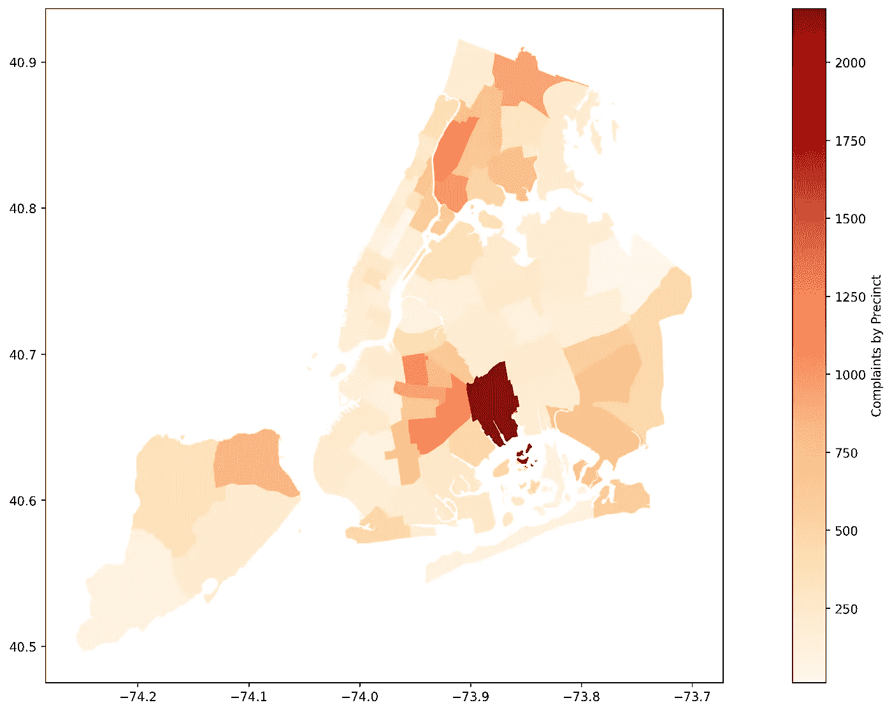

# 坏警察:分析对 NYPD 警官的 33358 项指控

> 原文：<https://medium.com/analytics-vidhya/bad-cops-analyzing-33-358-allegations-against-nypd-officers-280ff0f1645f?source=collection_archive---------12----------------------->

## 深入调查自 1985 年以来对纽约市警察的投诉。

辖区投诉过多。由作者创建。

在抗议解散警察之后，NYPD 获得了十亿美元的预算削减。

我分析了从 1985 年 9 月到 2020 年 1 月所有[市民对纽约市警察的投诉](https://www.propublica.org/datastore/dataset/civilian-complaints-against-new-york-city-police-officers)，以了解…