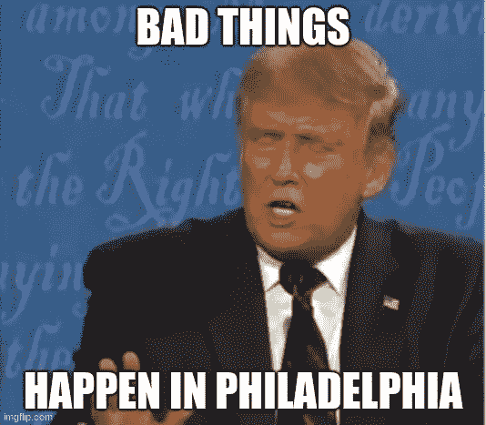
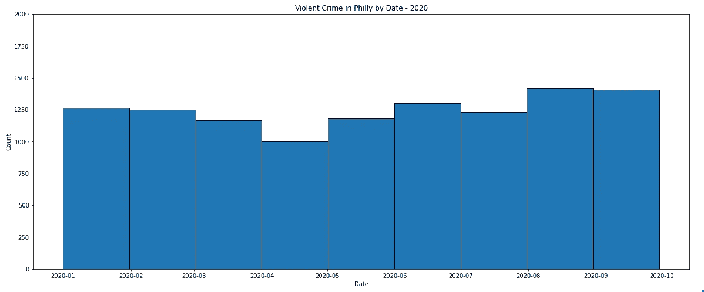
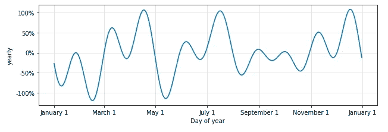
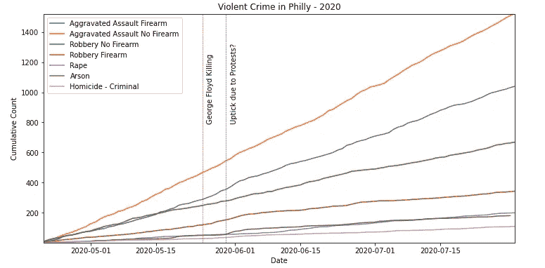
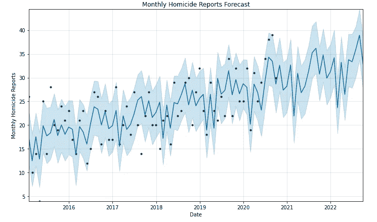

# 费城发生的坏事:费城犯罪的可视化

> 原文：<https://medium.com/analytics-vidhya/bad-things-happen-in-philadelphia-visualizing-crime-in-philly-f56d527c7de7?source=collection_archive---------22----------------------->

他并没有完全错。就在几天前，我女朋友的车窗被一双坐在车里过夜的溜冰鞋砸碎了。因为我知道费城有几个人处理过“砸了就抢”的事情，所以我决定寻找一些数据，看看我是否能获得任何关于如何避免这个问题的见解。我找到了大量的“警察事件”数据(警察被派遣，但不一定有指控或定罪)，并用它来制作这张方便的地图。

正如你所看到的，在某些街区的某些街道上，“车内盗窃”事件似乎更频繁地发生，我会避免将车停在那里。

但是，这个数据集提供了费城所有类型犯罪的信息，所以我决定调查更多发生在费城的“坏事”…

# 暴力犯罪报告细分

这些数字看起来确实很高，但是近年来暴力犯罪报告变得更普遍了吗？社会动荡和对执法部门日益增长的不信任是否让我们美丽的城市陷入了无法无天的混乱？看着这张图表，你可能会说，犯罪率的上升与我们经历的抗议/动乱的夏天相吻合。

从初夏到初秋，犯罪报告不断增加

然而，当我们使用 fbprophet 预测模型来分析费城过去五年的季节性犯罪趋势时，我们看到类似的犯罪报告模式在夏初上升…

暴力犯罪报告在夏初呈上升趋势

这并不是说抗议和巧合的骚乱完全没有反映在数据中。如果我们观察一段时间内暴力犯罪报告的累积数量，我们可以看到大多数类别在 5 月底有小幅上升。然而，这种小波动似乎不会持续到今年年底。

所以，就费城的暴力犯罪而言，今年看起来并不特别。坏消息是，某些暴力犯罪报告正在增加。

# 预测凶杀报告

使用 fbprophet 预测模型，我们可以看到该市凶杀案报告的总体趋势，并预测这些数字未来可能的趋势。

蓝色阴影区域表示预测的不确定性。

这一趋势正在上升，但至少它看起来并没有在最近几年加速。

像其他城市一样，“坏事”确实在这里发生。但是，好东西的数据更难找到；我相信它们可能会超过坏处。

数据来源:[https://www.opendataphilly.org/dataset/crime-incidents](https://www.opendataphilly.org/dataset/crime-incidents)

项目笔记本:[https://colab . research . Google . com/drive/1 R1 plit x4 kyxdl 3d 8d kye 9 VDT ca 5 fkars？usp =共享](https://colab.research.google.com/drive/1R1PliTX4kYXDL3D8DKYE9VDtca5fKARS?usp=sharing)