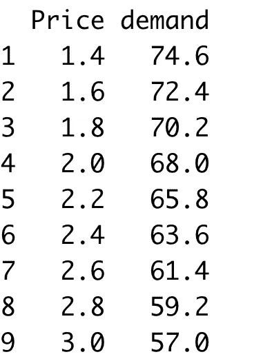
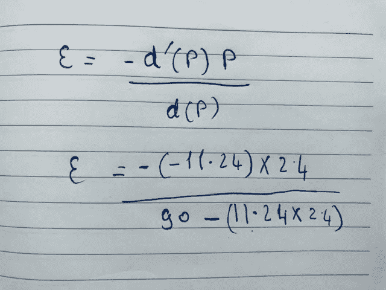
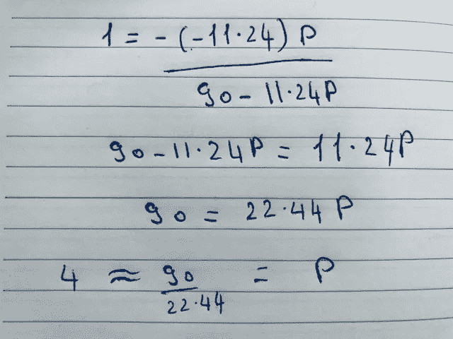
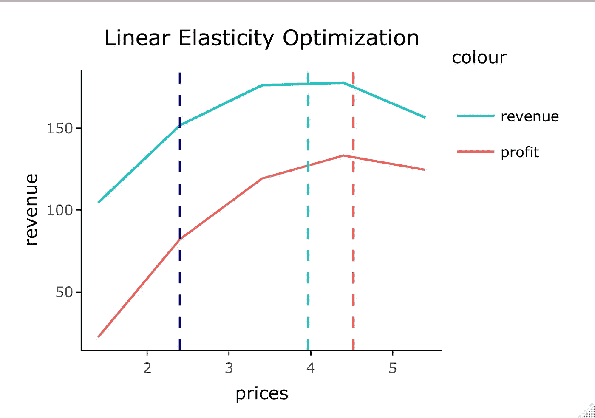

# 被弹性难倒？用它来为你的产品定价。

> 原文：<https://medium.com/analytics-vidhya/baffled-by-elasticity-use-it-to-set-the-right-price-for-your-product-aa904a3e8694?source=collection_archive---------23----------------------->

## 供应链数据科学:第 2 集。

## 在 R 中使用 Inventorize。

弹性是收入管理中一个非常重要的概念，因为它告诉我们客户对价格有多敏感。它会告诉我们，如果我从一个给定的价格改变价格，对一个产品的需求会变化多快。举个例子:如果我卖 2 美元的橙汁，有一天我决定把它变成 2.5 美元。客户对这种变化有多敏感？非常重要的一点是，弹性并不依赖于单位。这是需求和价格之间的百分比变化。


[K8](https://unsplash.com/@k8_iv?utm_source=medium&utm_medium=referral) 在 [Unsplash](https://unsplash.com?utm_source=medium&utm_medium=referral) 上拍照

但是在我们开始计算弹性之前，我们需要先了解价格反应函数，因为它将被用来计算弹性。

## 价格反应函数

价格反应函数顾名思义就是需求对价格变化的反应。最流行的价格响应函数是线性响应函数，它本质上是拟合一个线性模型，其中需求是因变量，价格是自变量。还有其他价格反应函数，如逻辑和泊松，但我们将把它留到后面的文章。

线性响应函数表示为:

> *A-Bp*

其中 A 是人口数量。

其中 B 是需求对价格的变化。

其中 p 是管理层设定的价格。

但在我们深入研究并计算价格反应函数之前，我们必须记住以下假设:

1-每个渠道中每个细分市场的每个产品都有不同的价格反应函数。这意味着我的网上销售的价格反应函数将不同于我的实物销售，如果我向团体销售我的产品，价格反应函数也将不同。

2-我们假设所有的价格都是正数。

3-我们假设需求和价格之间的关系是负的，这意味着函数的斜率将向下。

4-我们假设函数是连续的，而不是跳跃的或不稳定的。

以果汁为例，我每隔一周改变一次价格，以捕捉价格反应函数。我的观察如下:



现在，我们可以用 R 中的线性回归来拟合价格反应函数。

```
observations<- data.frame(price= c(1.4,1.6,1.8,2.0,2.2,2.4,2.6,2.6,3),
                          demand=c(74.6,72.4,70.2,68,65.8,63.6,61.4,59.2,57.0))lm_model<- lm(demand~price, observations)
```

下面是模型的输出:

```
Call:
lm(formula = demand ~ price, data = observations)Residuals:
    Min      1Q  Median      3Q     Max 
-1.7769  0.0000  0.1692  0.3385  0.5923Coefficients:
            Estimate Std. Error t value Pr(>|t|)    
(Intercept)  90.6769     1.1262   80.51 1.20e-11 ***
price       -11.4231     0.5043  -22.65 8.28e-08 ***
---
Signif. codes:  0 ‘***’ 0.001 ‘**’ 0.01 ‘*’ 0.05 ‘.’ 0.1 ‘ ’ 1Residual standard error: 0.7473 on 7 degrees of freedom
Multiple R-squared:  0.9865, Adjusted R-squared:  0.9846 
F-statistic:   513 on 1 and 7 DF,  p-value: 8.28e-08
```

现在，我可以假设截距/总体总规模(A)为 90，价格系数(B)= 11.4231，线性价格响应函数可以表示为:

> *90-11.42 便士*

太好了，现在我们回去计算弹性。

## 弹性特征

需求的价格弹性(通常简称为需求弹性)被定义为需求数量的百分比变化 q 除以价格的百分比变化 p。需求弹性(ε)的公式为:

> *-d`(p)p/d(p)*

其中 d`(p)是价格响应函数的导数。

其中 p 是你的当前价格。

其中 d(p)是价格响应函数。

## 然后我们会有三种情况:

1-对于当前价格，如果你的需求弹性大于 1，这意味着你的产品是有弹性的，价格每变化 1%，需求就会变化 1%以上。在这种情况下，你应该考虑降低价格来增加收入。

2-对于当前价格，如果你的需求弹性小于 1，这意味着你的产品是无弹性的，价格每变化 1%，需求变化不到 1%。在这种情况下，你应该考虑提高你的价格来增加收入。

3-对于当前价格，如果你的需求弹性等于 1，这意味着你的产品是单位弹性的，你处于收入最大化的点上(不是利润-后面会详细说明)。

回到我们的例子，如果今天的价格是 2.4，我们来计算弹性。

在这种情况下，d`(p)将是-11.4231，p 将是 2.4，价格响应函数将是 90- 11.4231*2.4。求解弹性我们得到 0.43，这意味着产品是无弹性的，我们应该考虑提高价格来增加收入。



弹性

在 R 中，我们可以这样做:

```
lm_model <- lm(demand ~ price, data = observations)
intercept <- lm_model$coefficients[1][[1]]
derv_p = lm_model$coefficients[2][[1]]
Elasticity = ((-1 * 2.4)/(intercept + 2.4 * 
                                       derv_p)) * derv_p
print(Elasticity)> Elasticity
[1] 0.4333658
```

## 好吧，我能得到的最大收益的价格是多少？

对此，我们有两种选择，一种是将弹性设为 1，并按如下方式求解 p:

> *1= -d`(p)p/d(p)*



求解 p

二是利用线性响应函数的特性，我们将最优价格计算为:

> *p*= A/2B*

这意味着最佳价格将是 3.94 美元。

好吧，但我的产品不是免费的，对吗？这是我必须付出的代价。

在这种情况下，我们确定我们的成本。最佳利润的计算方法如下:

> p*=(公元前+公元前)/2B

所以如果我们说一杯橙汁的成本是 1.1 美元。获得最佳利润的价格是 4.5 美元。

Inventorize Package 进行计算，并定义收入最大化的最佳价格、利润最大化的最佳价格以及给定价格的弹性。您可以通过将相同的原则应用到您的产品组合中来利用它。

```
install.packages("inventorize")
inventorize::linear_elasticity(observations$price, observations$demand,present_price=2.4,cost= 1.1) Elasticity optimum_price_profit optimum_price_revenue
1  0.4333658             4.519024              3.969024
```

它还生成了一个曲线图，显示了收入、利润和价格的相互作用，如下所示:



感谢您的阅读！

对于相互依赖的产品，请阅读我的第一篇文章“为你的竞争价格找到合适的奶酪”。

我是一名供应链顾问和培训师，为零售商开发算法。我喜欢教书，也喜欢为企业增加价值。

领英:[https://www.linkedin.com/in/haythamomar/](https://www.linkedin.com/in/haythamomar/)

网址:【www.rescaleanalytics.com T3

参考资料:

1-需求的价格弹性/MATH 104/Mark Mac Lean(在陈伟群的协助下)2011W

2-哥伦比亚大学供求分析课程。