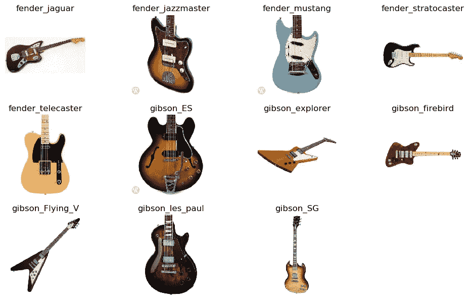
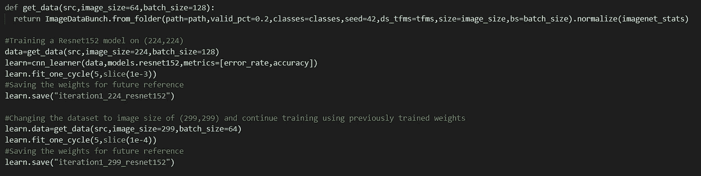
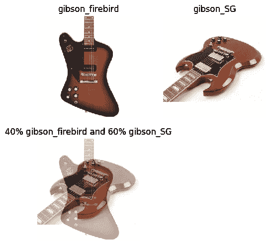
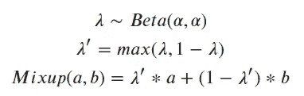
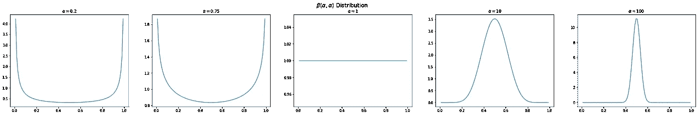
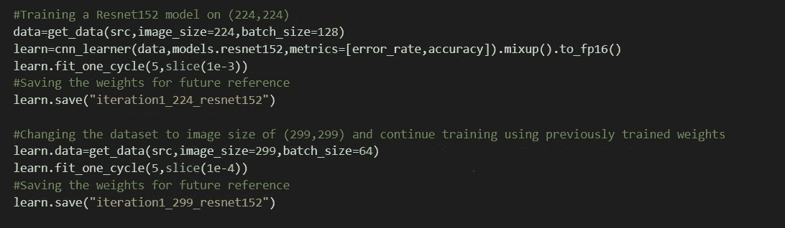
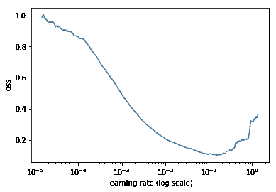
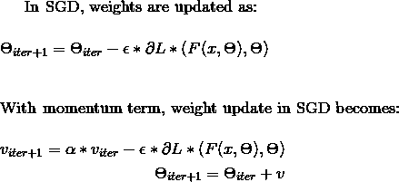
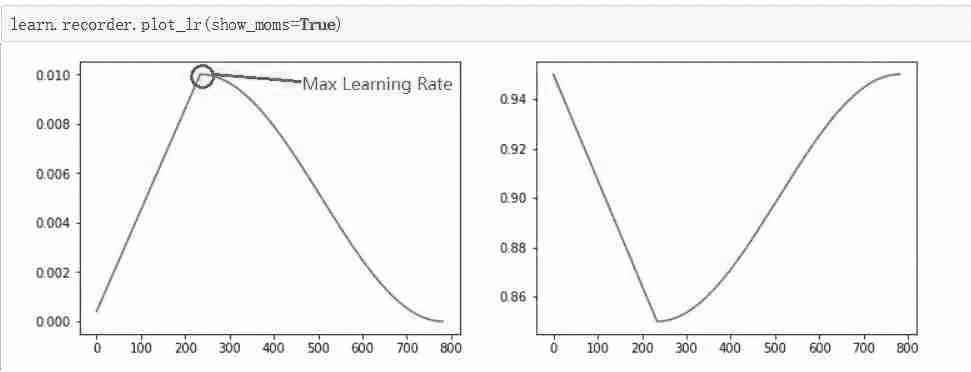

# 深度学习的锦囊妙计—第 1 部分

> 原文：<https://medium.com/analytics-vidhya/bag-of-tricks-for-deep-learning-part1-a832cc0964e3?source=collection_archive---------10----------------------->

由于其在计算机视觉和机器学习方面的最新进展，深度学习是人工智能世界中最时髦和最有趣的词之一。时不时地，新的和新的深度学习技术正在诞生，胜过最先进的(SOTA)机器学习，甚至现有的深度学习技术。由于深度学习正在以巨大的速度发展，很难跟踪有规律的进步。我将简要讨论过去几年深度学习在以下领域的最新进展

1.  视力
2.  文本
3.  声音的

在这篇博客中，我将把重点放在视野上，随后的博文中会有文字和音频。

开始之前，我们需要一组图像。我将使用大约包含以下内容的吉他数据集。来自 11 个不同吉他类别的 8500 张图片(五个芬达模型和六个吉布森)。数据集可以从 [**这里**](https://www.dropbox.com/s/2a9oboj6dcoykt0/guitars.tgz?dl=1) 下载。

**注意:-** 我将使用 [**fastai**](https://docs.fast.ai/) 库版本 1.0.59(因为其用户友好的内置函数)在 [**Tesla K80 GPU**](https://www.nvidia.com/en-gb/data-center/tesla-k80/) 上进行演示

# 问题

问题是给定的图像分类成 11 个不同的吉他类别

吉他课

# 渐进调整大小

这是一种技术，其中我们在训练开始时使用较小尺寸的图像，并随着训练的进行逐渐增加尺寸。这样，当模型在早期非常不准确时，它可以快速看到大量图像并取得快速进展，然后在训练中，它可以看到更大的图像以了解更精细的区别。

我发现最有用的两个主要优势是:-

1.  我们可以在训练时使用较大的批量，与从较小批量获得的梯度相比，这使得梯度更不稳定，并且有助于更快地向最佳方向收敛
2.  这有助于在更长的时间内训练我们的模型，而不用担心随着输入图像的大小逐渐变化而过度拟合，这有助于我们获得更好的性能，特别是在我们只有很少数据点的情况下

使用这种技术的一个很好的方法是使用较小的图像大小(比如 64x64)训练一个模型，然后使用该模型的权重在 128x128 等大小的图像上训练另一个模型。每个较大比例的模型在其架构中结合了先前较小比例的模型层和权重。

**注意:-** 如果您的数据集与 Imagenet 非常相似，并且您正在使用迁移学习，那么您不应该从较小尺寸的图像开始，因为这会破坏预训练的权重，这会影响您的模型的性能

因为我的数据集与 Imagenet 非常相似，所以我开始用 224x224 的图像尺寸训练我的模型，然后是 299x299

渐进调整大小

# 混合增强

[Mixup](https://arxiv.org/abs/1710.09412) 由张、西塞、多芬、洛佩兹-帕兹于 2018 年首次推出。这个想法不是将单个图像传递给模型，而是在两个独立的训练图像(不一定来自同一个类)之间执行线性插值，并将其传递给模型。使用与图像相同的λ系数，图像的一个热编码标签也被内插。

**新图像=λ*图像 1+(1-λ)*图像 2**

**新目标=λ*目标 1+(1-λ)*目标 2**

深度学习领域的主要问题是缺乏数据。在 Mixup 增强的帮助下，我们可以创建许多这样的图像线性组合，这也给了我们更长时间训练模型的灵活性，而不用担心过度拟合。

现在我们的新目标是 40%吉布森 _ 火鸟，60%吉布森 _SG(来自上图)。所以我们希望输出向量理想情况下用 0.4 代替 gibson_firebird，用 0.6 代替 gibson_SG，所有其他类用 0。但是如果我们使用 softmax，它不会给出这样的输出，它会集中在一个类上。于是我们用一种叫做 [**的方法平滑**](https://arxiv.org/abs/1512.00567) 。这是 Szegedy 等人和他的团队在 2015 年首次引入的技术。Geoffrey Hinton 与 Rafael 和 Simon 在 2019 年发表的论文[中解释了这种技术在各种任务中的使用。](https://arxiv.org/abs/1906.02629)

我们要求它预测正确类别的 **1- 𝛆** 和所有其他类别的**𝛆/(n-1**，而不是预测正确类别的 1 和所有其他类别的 0，其中 **𝛆** 为(小)正数，n 为类别数。那么损失函数可以写成

## 损失=(**1-𝛆)*crossentropy(i)+𝛆*∑(交叉熵(j)) / (N-1)**

其中交叉熵(I)是正确类别的交叉熵

在最初的文章中，作者提出了四点建议:

1.  创建两个独立的数据加载器，并在每次迭代中从每个数据加载器中抽取一批数据来混合它们
2.  根据带有参数α(他们的论文中建议 0.4)的贝塔分布为 t 画一个值
3.  将具有相同 t 值的两个批次混合
4.  使用一键编码目标

混合

通常，α需要根据数据集进行调整。当α值较小时，贝塔分布的大部分权重在尾部，接近 0 或 1。随着α的增加，分布变得均匀，然后在 0.5 左右逐渐达到峰值。因此，α可以被视为控制混合的强度；较小的值只会导致少量的混合，而较大的值偏向于最大混合(50/50)。在极端情况下，α=0 导致完全没有混合，当α→∞，β接近以 0.5 为中心的狄拉克δ分布。作者建议从 0.75 开始，如下图所示，大部分重量仍然在尾部。本文对原方法做了一处修改，即把λ设为 max(λ，1-λ)；这使混音偏向原始图像。

不同α值的贝塔分布

**注意:-** 用 mixup 训练时，最终损失(训练或验证)会比不用它训练时高，即使精度远好。这是因为像这样训练的模型会做出不太自信的预测。

混合增强

# 混合精确训练

它允许你的神经网络的向前和向后传递在 fp16 中完成(也称为*半精度*)。如果你有一个带[张量核](https://www.nvidia.com/en-us/data-center/tensorcore/)的 NVIDIA GPU，这一点尤其重要，因为它可以将你的训练速度提高 3 倍或更多。

使用混合精度训练需要两个步骤:

1.  移植模型以在适当的地方使用 FP16 数据类型。
2.  添加损失缩放以保留小的梯度值，使其不会下溢 fp16，从而导致精度损失(在转换回 fp32 后，这对于最终梯度计算是相反的)。

半精度浮点格式(FP16)使用 16 位，而单精度浮点格式(FP32)使用 32 位。降低所需的内存可以训练更大的模型或训练更大的小批量。这是使用混合精确训练的最大优势。利用这一点，我能够在 Tesla K80 GPU 上使用批量大小为 128 的 Resnet152 架构训练大小为 224x224 的图像

混合精确训练

# 学习率调整

学习率是训练神经网络最重要的超参数之一。如果太低，你的神经网络将永远学习，如果太高，你的每一步都将超过最小值，你永远不会达到可接受的损失。所以我们必须选择正确的值，不能太高也不能太低。Leslie Smith 在 2017 年描述了一种设置学习率的新方法，名为**循环学习率，它实际上消除了通过实验寻找全局学习率的最佳值和时间表的需要**

**在一个时期内，以非常低的学习率(如 10–810-8)开始 SGD(随机梯度下降),但在每个小批量中改变它(如乘以某个因子),直到它达到非常高的值(如 1 或 10)。记录每次迭代的损失，一旦你完成了，就把这些损失和学习速度对应起来。你会发现这样的东西:**

****

**我们将选择一个比最小值稍早的值，此时损失仍会增加。在这里，10^-2 将是一个不错的选择**

**动量和学习率密切相关。在 SGD 的权重更新方程中可以看出，动量对权重更新的影响与学习速率相似。**

****

**莱斯利·史密斯在他们的实验中发现，当学习速度增加时，减少动量会产生更好的结果。这支持了直觉，即在训练的那一部分，我们希望 SGD 快速进入新的方向以找到更好的最小值，因此新的梯度需要被赋予更多的权重。**

**接下来，我们将应用 1 周期策略，将选择的学习率作为最大学习率。**

**我们从一个较低的学习率逐渐增加到一个较高的学习率，而不是回到最小值。最大值应该是上面选取的值(10^-2)，较低的值可以低 10 倍，同时我们从最大值到最小值逐渐减小动量。在实践中，本文建议选择两个值，如 0.85 和 0.95**

**我们做的正好相反:我们从较高的学习速率到较低的学习速率逐渐降低，同时随着学习速率的降低，我们又回到较高的动量**

****

**这是一种叫做*带重启的随机梯度下降(SGDR)* 的技术，是*学习速率退火*的变体，随着训练的进行，逐渐降低学习速率。这很有帮助，因为当我们越来越接近最佳重量时，我们希望迈出更小的步伐。
然而，我们可能会发现自己处于一个不太有弹性的重量空间——也就是说，重量的小变化可能会导致损失的大变化。我们希望鼓励我们的模型找到既准确又稳定的权重空间部分。因此，我们不时地增加学习速率(这是“SGDR”中的“重启”)，如果当前区域是“尖峰”，这将迫使模型跳到权重空间的不同部分。**

# **测试时间增加**

**虽然增强技术有助于给我们一个更好的模型，但预测准确性可以通过所谓的测试时间增强(TTA)来进一步提高。在了解它是什么之前，我们首先需要了解我们为什么需要它**

**为了在 GPU 中高效处理，我们需要批处理，并且批处理中的所有图像都应该是相同的大小。Nvidia dali 可能是一个替代方案，因为他们正在构建定制的 Cuda 内核，可以处理不同大小的图像。但它仍处于早期阶段。**

**因此，当我们在测试期间将图像传递给模型以获得预测时，我们通过进行某种转换将它们调整为正方形，中心裁剪是最常用的一种。因此，当模型试图预测图像时，它只看到图像的中心，这很多时候会使模型困惑，因为实际上重要的特征被剪掉了，因此模型最终会对图像进行错误分类**

**为了减少这种错误，我们使用了一种叫做 TTA 的东西。TTA 不仅仅对我们的验证集中的图像进行预测，还对它们的许多随机增强版本进行预测(默认情况下，它使用原始图像和 4 个随机增强版本)。然后它从这些图像中取平均值并使用它。**

**直觉是，图像的至少一个增强版本将捕获用于预测正确类别的重要特征，因此当我们取平均值时，与从原始图像获得的预测相比，它将最终预测正确的类别。这种方法通常可以减少 10-20%的误差**

**使用上面提到的所有技巧和技术，我只用了 8500 张图像就能够实现上述问题 99.4%的准确率(将给定的图像分为 11 个不同的吉他类别)。你可以使用下面的链接找到代码和工作细节**

** [## statsguysam/深度学习

### 此时您不能执行该操作。您已使用另一个标签页或窗口登录。您已在另一个选项卡中注销，或者…

github.com](https://github.com/statsguysam/Deep-Learning/blob/master/Guitar_Multiclass.ipynb) 

# 结论

1.  始终使用渐进式调整大小开始训练您的模型(如果图像与 Imagenet 数据集不相似)
2.  尝试没有通用增强的混合增强(如翻转、扭曲、缩放等)。)反之亦然。评估模型的性能，如果需要，将混合增强与一般增强相结合
3.  混合精度训练是非常有用的，特别是如果你的资源有限，你想使用更大的模型或训练更大的小批量
4.  长期以来，寻找最佳学习速度一直是一个尝试和观察的游戏。有了循环学习率的概念，我们不再需要玩这个游戏，并且可以在更少的迭代中收敛到最佳学习率。
5.  推断过程中的 TTA 总是有助于获得更好的预测，而不是使用原始的中心裁剪图像。

# 参考资料:

1.  [混乱:超越经验风险最小化](https://arxiv.org/abs/1710.09412)
2.  [重新思考计算机视觉的初始架构](https://arxiv.org/abs/1512.00567)
3.  [标签平滑什么时候有帮助？](https://arxiv.org/abs/1906.02629)
4.  [混合精确训练](https://docs.nvidia.com/deeplearning/sdk/mixed-precision-training/index.html)
5.  [训练神经网络的循环学习率](https://arxiv.org/abs/1506.01186)
6.  [Fastai 库](https://github.com/fastai)

*如果你喜欢这篇文章，请一定给我一个掌声，并关注我以获取我未来文章的更新。*

*还有，随时在*[*LinkedIn*](https://www.linkedin.com/in/salim-shaikh-a082a7162/)上联系我**