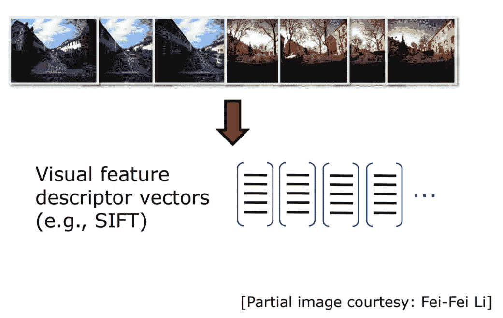
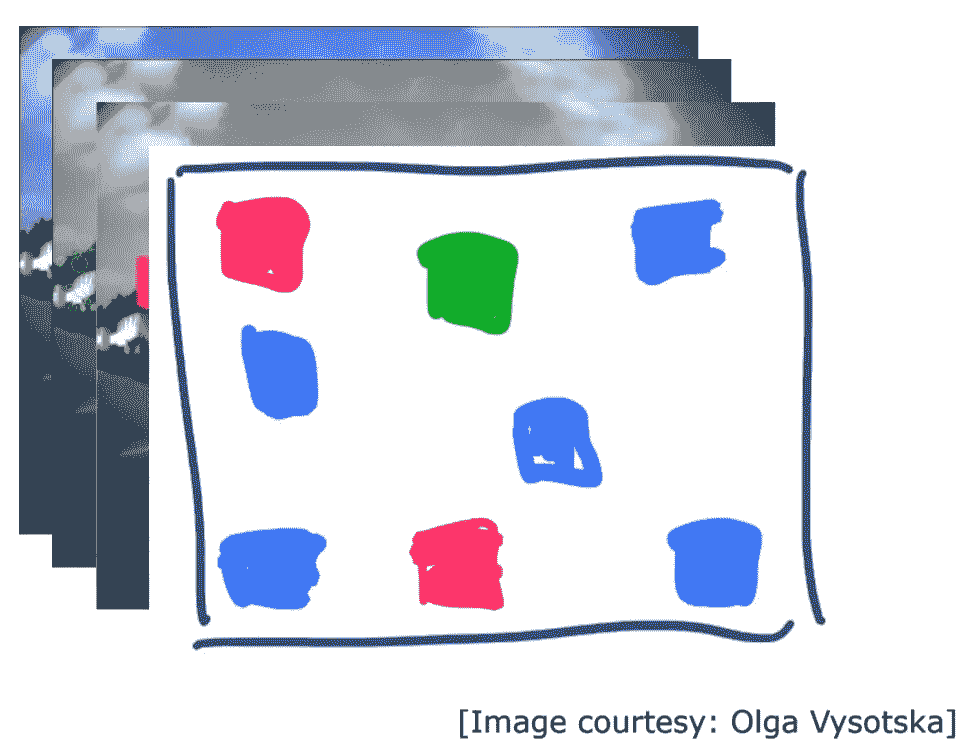

# 视觉单词包

> 原文：<https://medium.com/analytics-vidhya/bag-of-visual-words-bag-of-features-9a2f7aec7866?source=collection_archive---------2----------------------->

视觉单词包(也称为特征包)是一种简洁描述图像并计算图像之间相似性的技术。
用于图像分类。该方法起源于文本检索(信息检索),是 NLP 算法单词包的扩展。在单词包中，我们扫描整个文档并统计文档中出现的每个单词。然后，我们创建一个词频直方图，并使用这个直方图来描述文本文档。在视觉单词包中，我们输入的是图像而不是文本文档，我们使用视觉单词来描述图像。

文本文档的单词包

图像视觉词汇包

视觉单词

在 BoVW 中，我们将图像分解成一组独立的特征。特征由关键点和描述符组成。关键点和兴趣点是一回事。它们是图像中的空间位置或点，定义了图像中什么是有趣的或突出的。它们对于图像的旋转、收缩、平移、扭曲等是不变的。关键点是图像中的特定点，比如图像中的每 10 个像素。描述符是关键点的值(描述)。然后，我们使用聚类算法基于这些描述符创建字典或码本。我们通过我们的图像重复，并检查我们的图像是否有字典中存在的单词。如果是，我们增加这个特定单词的计数。最后，我们为这个图像创建直方图。从这个直方图中，我们可以找到相似的图像，或者预测这个图像的类别。

# **我们如何创建码本？？？…..**

为了创建码本，我们使用 SIFT、BRISK 等特征提取器。如前所述，这些技术检测图像中的关键点，并为输入图像计算它们的值(描述符)。这些特征检测器返回包含描述符的数组。我们对训练数据集中的每个图像都这样做。

现在，我们将有 N(训练数据集中的图像数)个数组。下一步，我们垂直堆叠这些数组。现在我们将使用类似 K-Means 的聚类算法来形成 K 个聚类。K-Means 将数据点分成 K 组，并将返回每组的中心(见下图)。每个聚类中心(质心)充当一个视觉单词。所有这 K 个质心形成了我们的码本。

k 均值聚类

# **创建直方图……..**

检测视觉单词

现在，我们将创建一个形状为(N，K)的 2D 零数组。我们将在接下来的几行中看到如何填充这个数组。接下来，我们再次遍历图像，在字典中查找图像中的单词。一旦我们检测到一个单词同时出现在字典和图像中，我们就增加这个特定单词的计数(即 array[i][w]+=1，其中 I 是当前图像，w 是这个单词)。这就是我们如何为图像创建直方图。

创建直方图

类似地，所有的图像将被转换成直方图。现在，我们可以训练一个模型(随机森林，LinearSVC)来对图像进行分类。测试数据集中的图像以相同的方式进行预处理，然后输入模型以预测图像类别。

BoVW 方法适用于捕捉许多细节的大型显微镜图像

然而，这种方法有一个问题。当视觉单词出现在图像数据库的许多或每幅图像中时，就会出现这种情况。考虑一个文本文档，像 is、are 等这样的词不会有太大帮助，因为它们在所有文档中都存在。这些词使得分类任务更加困难。为了解决这个问题，我们可以应用所谓的 TF-IDF(术语频率-逆文档频率)重新加权方法。它重新加权直方图的每个箱，并降低“无信息”单词(即，在许多图像/任何地方出现的特征)的权重，并增强稀有单词的重要性。

直方图中每个重新加权的单词都可以使用下图中给出的 TF-IDF 公式进行计算。

TF-IDF 加权

如果你用这个公式玩一段时间，你会明白它是如何降低所有图片中出现的单词的重要性的。

在上图中，你可以看到蓝色单词在重新加权的直方图中的权重几乎为零。

朋友们，这就是我要说的一切……..

请通过提供您的宝贵反馈来帮助我。