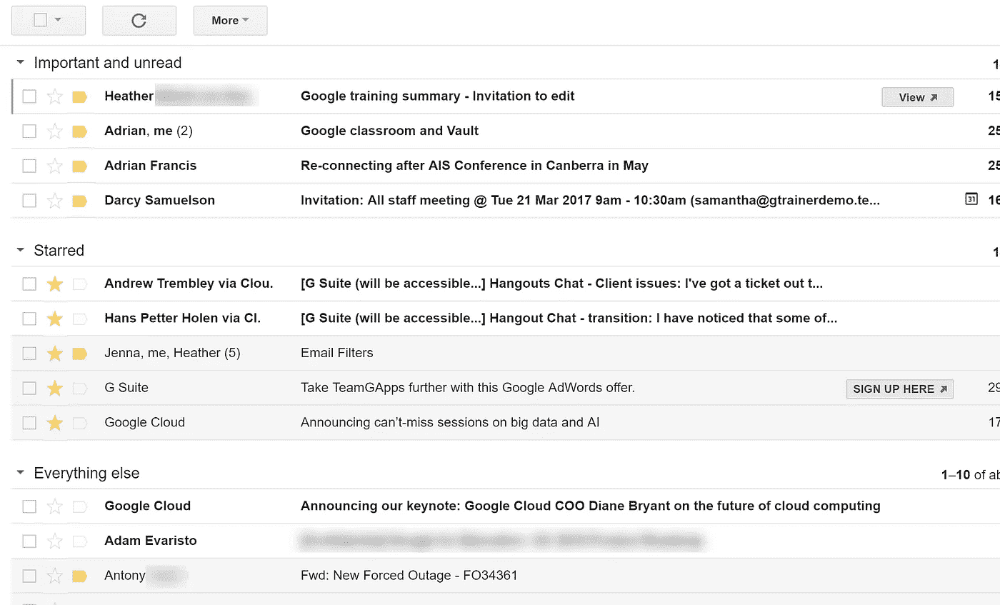

# 单词袋——使用 python 对 NLP 最简单的解释

> 原文：<https://medium.com/analytics-vidhya/bag-of-words-the-easiest-explanation-of-nlp-using-python-19244cf2347e?source=collection_archive---------12----------------------->

今天我将向你解释单词袋技巧。

如果你在这里，你可能知道我们为什么用它，但是如果你不知道，我会用一个例子告诉你。

# 用一个例子解释单词袋？

进入你的 gmail，打开优先收件箱，你会看到谷歌神奇地将你所有的邮件分类为重要邮件、社交邮件、垃圾邮件等等。



现在还记得吗？

谷歌怎么知道有些邮件对你很重要，而其他的却不重要？

虽然有很多因素在起作用，但一个主要因素是机器会阅读你的邮件，然后理解什么对你来说是重要的，然后显示给你看，瞧。

问题是，机器不知道什么是英语，它只理解数字，所以它做的是把你所有的文件分解成单词，就像-

**电子邮件**

> *你好，马丹先生，*
> 
> *祝贺你，我喜欢你的文章，因为它能够以简单的方式向我解释单词袋的作用。*

**机器如何破坏它**

> 你好，马丹先生，祝贺你，我喜欢你的文章……以简单的方式。

**这个词的分裂然后是**

1.  **清理或预处理—** 如果有其他口音的单词，如波兰语、德语、西班牙语等，删除所有不必要的特殊字符。删除或替换它们，或者添加正确的 unicode，使它们对机器可读。
2.  **标准化所有数据**——使用。lower()函数从数据中删除任何大写字母单词。
3.  **悲叹和词干化—** 从数据中删除所有形容词/构建词，即 Baked、baking、baker 都是构建词 over bake。从数据到词根对所有这样的词进行分类。此外，删除所有停用词，即所有对特征没有意义或维度的词，如 a、the 等。

接下来，一旦我们有了所有的单词，我们就对其进行标记，即记录文档中所有单词的重复次数。Ex —这只猫是一只可爱的肥猫>>这只，猫，是，a，胖，猫，那，是，可爱>>>这只— 1，猫— 2，是—2，a— 1，胖— 1，那—1，可爱—1

或者

这— 1

第二类

is -2

a-1

脂肪— 1

那个-1

可爱— 1

## 这个过程叫做标记化。

在我们明白接下来要做什么之前，我会告诉你我们为什么要做这一切。

> *我们的目标是在文档中找到这种情况下的特征或单词，这些特征或单词可以帮助我们提供文档的一些含义，或者在与相似或不相似的文档进行比较时提供一些帮助。*

分解文档 1 的标记化单词有助于我们将其与文档 2 的其他标记化单词进行比较，从而有助于找到相似的文档。

**现在回到单词袋。**

在标记化之后，我们转移到构建词汇表或者从文档中寻找特征。

vocab =清洁、去除停用词等后的所有最终特征。

因此，如果一个文档有 3 个文档，每个文档有 7 个单词，那么 vocab 是从文档中选择单词的最佳选择，在我们的例子中是 21 个单词中的 10 个单词。

Vocab count =所有独特特征或单词的计数，对我们来说是 10(比方说)。

找到 vocab 后，我们将最终确定的单词转换成向量，你怎么问？

说我们的词汇为*“这只猫是只可爱的肥猫”*是

第二类

is — 2

脂肪— 1

可爱— 1

vocab 计数= 4

所以矢之文献*“这只猫是只肥猫，很可爱”*是

## [022010001]

当您比较最终的词汇和文档中的单词时，这个数字只是一个表示，即在比较时

这个— 1，猫— 2，是—2，a— 1，胖— 1，那个—1，可爱—1

还有猫— 2，是— 2，胖— 1，可爱— 1

我们得到**【022010001】**

这个过程叫做**矢量化。**

Tada，这些都是单词袋的概念，所以现在像我承诺的那样，我与你分享我基于 sklearn 的代码，如果你想通过代码了解每个过程是如何工作的， [**检查这个**](https://www.freecodecamp.org/news/an-introduction-to-bag-of-words-and-how-to-code-it-in-python-for-nlp-282e87a9da04/) 。

```
***#Part 1 Declaring all*** document***s and assigning to a document***
document1=”This is my code on bag of words.”
document2=”Bag of words is a NLP technique.”
document3=”I will explain it to you in a simple way”
```

***#第 2 部分—导入库并初始化 CountVectorizer***

```
from sklearn.feature_extraction.text import CountVectorizer#Making a list or Document from all documents
Doc=[document1,document2,document3]#Initializing CountVectorizer from sklearn
vectorizer = CountVectorizer(stop_words=’english’)
```

***#第 3 部分—获取我们将用于标记该文档的最终单词的特征名称***

```
X = vectorizer.fit_transform(Doc)analyze = vectorizer.build_analyzer()analyze(document1)analyze(document2)analyze(document3)vectorizer.transform(document1).toarray()vectorizer.transform(document2).toarray()vectorizer.transform(document3).toarray()print(vectorizer.get_feature_names())*Output*>>>*[‘bag’, ‘code’, ‘explain’, ‘nlp’, ‘simple’, ‘technique’, ‘way’, ‘words’]*
```

***#第 4 部分—矢量化或创建所有三个*** 文档*的矩阵*

*`print(X.toarray())`*

**输出*>>>[[1 1 0 0 0 0 0 1 0 1 0 1 0 1 0 1 0 1 0]]*

*或者*

*点击这里查看我的 Github >[**查看包字代码**](https://github.com/rmadan16/Bag_of_words) 。*

*我希望这很简单，可以帮助你理解这个概念，如果你有可以帮助我改进内容或代码的反馈，给我写信——*rohitmadan16@gmail.com**

*和平。*