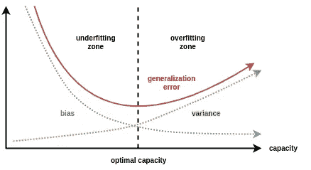

# Bagging v 助推:脉冲星恒星壮举。H2O 一揽子计划

> 原文：<https://medium.com/analytics-vidhya/bagging-v-boosting-the-h2o-package-e288b09ade7e?source=collection_archive---------37----------------------->

图片来源:谷歌

在我们深入研究装袋和增压的复杂性之前，我们需要质疑这种复杂过程的必要性。[在前面的](/analytics-vidhya/a-comparison-of-some-basic-ml-algorithms-by-using-red-wine-quality-data-8318bd6e19e1)中，我们已经看到了决策树算法是如何工作的，以及它是如何容易被解释的。那我们为什么不解决这个问题呢？如果决策树运行良好，为什么还要做额外的工作呢？

**偏差-方差权衡**

而决策树算法简单、高度直观且非常容易解释；事实上，它经常容易被过度拟合，使其无法成为理想的算法。所谓过拟合模型，我们指的是完全符合或预测训练集，但对任何其他数据集都不能这样做的模型。这种特性，即不同数据集拟合的差异，称为方差。因此，决策树模型无法预测除了它接受训练的数据集之外的任何其他数据集，因此它显示出很高的方差。此外，由于它正确地预测了训练集，我们可以说它具有较低的偏差。就偏差而言，我们指的是预测模型值和潜在真实值之间的差异。

图片来源:谷歌

机器学习的主要方面是使用一种算法来建立一个模型，平衡适量的偏差和方差，最好是低偏差和低方差。这种模型将能够准确地预测训练集，并且对于任何其他数据集也表现良好，给出一致的良好预测。虽然偏向性较低，但决策树模型通常具有较高的方差。虽然有许多方法可以减少方差:限制叶子的数量，限制节点层次的数量，修剪等等；将它们与 Bagging 和 Boosting 的概念结合起来是获得相对更准确结果的更好方法。

**装袋**

降低决策树模型的高方差的一种方法是获取它们的集合，其中每个树都是通过从训练集中引导数据集来构建的。通过引导，我们意味着通过从允许重复的训练集中随机选择样本来创建新的数据集，直到两个数据集具有相同的大小。一个新的样本通过在每棵树上运行来分类，并给它一个获得多数投票的类别。这种基于从引导数据集创建的模型集合对结果进行平均的过程称为 Bagging(B-Bootstrapped，Agg- Aggregate)。

方差的减少是中心极限定理的直接结果

> “对于一系列' **n** *'* 独立同分布的随机变量，均值为' **mu** '，方差为' **sigma-squared** '，在一定的一般条件下，它们的和将服从正态分布，均值为' **n*mu** '，方差为'**n * sigma-squared**'*'*为' **n** ' 趋于'【T18

这将意味着它们的平均值将具有平均值'*μ'*和方差'*σ-平方/n'* 。因此，通过对一组决策树的结果进行平均，我们得到了一个显著降低的方差。

自举和聚集是我们之前在随机森林中见过的事情。随机森林是 Bagging 的一个特例，除了引导和聚集，我们还有一个附加条件，即在每次分裂时，只使用一个随机变量子集。有时，我们可能会在变量中有一个很强的预测器。因此，这个变量最终几乎总是成为每棵树的根。因此，这些树最终变得高度相关。通过在每次分裂时获取随机变量的子集，我们确保这种情况不会发生，因此我们在森林中获得了不同的决策树集合。应该注意的是，森林中的树木没有被修剪，因此它们中的每一个都具有较低的偏差。结果，通过使用随机森林，我们得到了一个低偏差和低方差的模型。

**增压**

Boosting 是一种方法，在这种方法中，我们创建了一系列弱学习者——通常具有高偏差和低方差，以便每个后续学习者都强调纠正其前任所犯的错误，从而降低模型整体的偏差。与 Bagging 不同，在 Bagging 中，树可以以任何随机顺序构建，Boosting 要求学习器按顺序进行，因为每个学习器都是通过考虑前一个学习器的错误而得到的。梯度推进机器(GBM)是推进算法的一个例子。

图片来源:谷歌

它通过使用损失函数*L(y，F(x))从结果的初始猜测 *Fo(x)* 开始；*然后考虑 *m =* 1，使用损失函数的梯度从数据集中的样本计算伪残差。然后，基于这些残差继续构建决策树(弱学习器)*h1(x)**，并且再次通过使用损失函数来计算每个终端节点的输出值“*γ-1”*。应该注意的是，与它们以前的用途不同，这里构建树是为了获得残差的值。现在，为了避免过度拟合，树的输出值通常乘以正则化参数，称为学习率，以获得缩放的结果。学习率是一个缩小每棵树对最终预测的贡献的因素。对初始猜测*F0(x)*和树的缩放结果求和，以获得每个样本的新预测 *F1(x)* 。此后，使用这些新的预测 *F1(x)* 和初始猜测 *Fo(x)再次计算新的残差；*然后增加 *m = 2* ，在这些新的残差上建立一个新的树 *h2(x)* 以获得输出值' *gamma-2'* ，该输出值再次由学习率缩放。初始猜测 *Fo(x)* 、第一树的缩放结果和第二树的缩放结果都被求和，以获得每个样本的新预测 *F2(x)* 。以这种方式，新的树被不断地添加到序列中，直到 *m=预定义的 M* 或当额外的树未能改善结果。*

*应该注意的是，在每一步，残差变得比它们先前的值小。而且，每次预测都比前一次好。即使结果证明它们比以前更差，我们继续构建后续树的事实也确保了以后会有所改善。这是 GBM 的主要方面，*即。**

> *朝着正确的方向迈出许多小步，以获得更好、更准确的结果。*

***H2O 套餐***

*H2O 是一个开源平台，使用内存压缩来处理大量数据。除了用于 GBM 和随机森林的函数，R 中的 H2O 包也有用于其他 ML 算法的函数，比如朴素贝叶斯、SVM 等等。由于它使用并行处理，计算是严格执行的，使它比其他软件包快得多。请注意，H2O 要求更新并正确安装 Java JRE。*

*这里，我们将使用来自 Kaggle 数据集库中包含脉冲星候选星的[数据集。](https://www.kaggle.com/pavanraj159/predicting-a-pulsar-star)*

**

*像异常值处理这样的数据清理在之前作为[完成。在这之后，我们通过柱状图检查目标类的分布。我们还绘制了预测变量的相关矩阵和预测变量相对于目标类的分布图。然后，我们以 8:2 的比例将数据分为训练和测试。最后但非常重要的一步是检查训练和测试数据集中目标类的分布，确保它们几乎相同。](/analytics-vidhya/a-comparison-of-some-basic-ml-algorithms-by-using-red-wine-quality-data-8318bd6e19e1)*

**

*接下来，我们通过使用*库()*函数调用 H2O 包。我们将使用 *h2o.init()、*以及初始化 h2o，为 H2O 分配大约 50%的 RAM 大小( *max_mem_size* )，并设置合适的并行进程数量(通过设置 *nthreads = -1，*该数量将自动决定)。 *h20.removeAll()* 在 H2O 集群已经在运行的情况下清除石板。然后，我们使用 *as.h2o()* 将我们的训练和测试数据集作为对象分配给 H2O 集群。*

**

****装袋*** :我们首先使用 *h2o.randomForest()* 函数制作一个简单的随机森林模型。我们检查模型的不同度量和重要变量，然后用这个模型做初步预测。*

**

*接下来，我们将建立另一个模型，但这次我们将调整以下超参数-*

****(一)*** *ntrees:* 森林中的树木数量；***【b】****mtries:*每次分割时使用的随机变量的个数；***【c】****stopping _ rounds*， *stopping_metric，stopping_tolerance:* 如果连续得分事件的' *stopping_metric'* 没有提高(*stopping _ tolerance '** 100)%，则停止生成新树；***(d)****balance _ classes:True*对于不平衡的数据，这里就是这种情况；***(e)****n folds:*k*的*值用于 *k-* 的交叉折叠验证；***(f)****score _ each _ iteration:True*如果我们想要针对每棵树的训练和验证进行预测。*

**

*我们看到超参数的调整带来了更好的召回和 AUC 值，尽管准确度和精确度有所下降。但是，由于 Recall 和 AUC 相对来说比其他的更重要，新模型确实在给定恒星是否是脉冲星的分类上做得更好。*

****助推*** :和之前一样，我们先用 *h2o.gbm()* 函数做一个简单的 GBM 模型。我们检查模型的不同度量和重要变量，然后用这个模型做初步预测。*

**

*同样，我们将构建另一个模型，但这次我们将调整以下超参数-*

****(一)*** *ntrees:* 森林中的树木数量；***(b)****max _ depth:*每棵树的最大深度；***(c)****learn _ rate:*以学习率来缩放从每棵树获得的输出值*；****(d)****sample _ rate:*每棵树的行采样率*；****(e)****col _ sample _ rate:*每棵树的列采样率*；****【f】****stopping _ rounds*， *stopping_metric，stopping_tolerance:* 如果连续得分事件的' *stopping_metric'* '没有提高(*stopping _ tolerance '** 100)%，则停止生成新树；***(g)****balance _ classes:True*对于不平衡的数据，这里就是这种情况；***(h)****n folds:*k 的*值为 *k-* 折叠交叉验证； ***(一)****score _ tree _ iteration:*模型在每一个 *'score_tree_interval'* 树后进行评分。**

**

*在这里，我们看到，通过调整超参数，准确性、召回率和 AUC 的值都有所增加，尽管精确度显示出小幅下降。此外，如果我们将修改的随机森林模型与修改的 GBM 模型进行比较，我们会发现后者在所有四个指标上都具有更好的值。因此，在这种情况下，Boosting 在预测一个给定的恒星是否是脉冲星方面做得更好。*

*值得注意的是，尽管装袋和提升提供了比决策树更好的结果，但它们更难解释。此外，这两种方法都包含大量的超参数，因此调整它们以获得合适的模型所需的运行时间可能会非常长。因此，打包和提升是计算上非常昂贵的方法。*

*完整代码可在[这里](https://github.com/gauravalley/Pulsar-Star-Prediction)获得。*